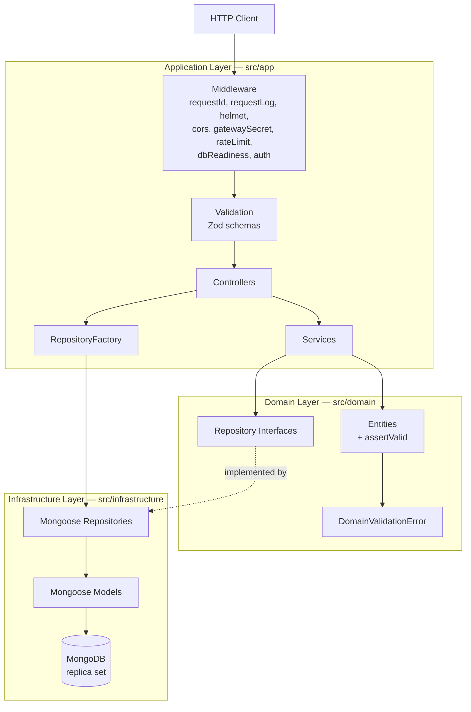

# Agent Context & Working Instructions

> **This is the most critical file in the documentation.**
> Any AI agent working on this project **must read this file completely** before making any changes.

---

## 1. Project Context

**What the project does:**
lag-money-manager is a REST API for personal money management. It allows users to register, authenticate, manage financial accounts (cash, card, savings, etc.), categorize transactions, record income, expenses, transfers and balance adjustments with atomic balance updates, and track spending against budgets.

**Business domain:** Personal finance / money management.

**Key constraints and non-negotiables:**

- All resources are user-scoped — users can only access their own data
- A resource that exists but belongs to another user returns **404, never 403** — ids must not be probeable
- Transaction creation/update/deletion **must** adjust account balances accordingly, inside a MongoDB transaction (`withTransaction` from `src/shared/unitOfWork.ts`)
- Money is stored as **integer cents** and exposed as a decimal amount. Convert only at the persistence boundary with `toCents()` / `fromCents()` from `src/shared/money.ts`; `MAX_AMOUNT` bounds every amount
- `currency` is **stamped by the server** (account from its owner, transaction from the involved account). Clients never set it. The system is mono-currency for now: mixing currencies in one transaction is rejected with code `CURRENCY_MISMATCH`
- Passwords are **never** returned in API responses
- JWT authentication is required for every route except `/`, `/health/db` and `/auth/register|login|refresh|logout`. (`/auth/logout-all` and `/auth/sessions*` sit under the same `/auth` mount but apply `authMiddleware` individually.)
- The only database backend is MongoDB via Mongoose. `DB_TYPE` still exists, but `MONGO` is the only value with a registered provider — anything else throws at startup
- MongoDB **must be a replica set** — multi-document transactions do not run on a standalone `mongod`
- UUIDs (v7) are used for all entity IDs (`_id` is a `String`, not an ObjectId)
- Deletion is soft: accounts, categories and budgets are **archived** (`archivedAt`, with a `restore` endpoint); users and transactions are soft-deleted (`deletedAt`, not exposed)
- Every error carries a stable machine-readable `code` (`ApiError`'s third argument). Clients branch on `code`, never on `message`

**Stack with versions:**

| Technology    | Version    | Purpose                                     |
| ------------- | ---------- | ------------------------------------------- |
| TypeScript    | 6.x        | Language                                    |
| Node.js       | 20+ (CI 22)| Runtime                                     |
| Express       | 5.x        | HTTP framework                              |
| Zod           | 4.x        | Request validation                          |
| Mongoose      | 9.x        | MongoDB ODM                                 |
| MongoDB       | 8.x        | Database — **replica set required**         |
| Luxon         | 3.x        | Timezone-aware budget period math           |
| bcryptjs      | 3.x        | Password hashing                            |
| jsonwebtoken  | 9.x        | JWT auth (access + rotating refresh tokens) |
| Pino          | 10.x       | Structured logging                          |
| Helmet        | 8.x        | Security headers                            |
| Jest          | 30.x       | Testing framework                           |
| swagger-jsdoc | 6.x        | OpenAPI documentation                       |

---

## 2. Project Architecture Summary



**Layer responsibilities:**

| Layer                           | Responsibility                                                                                                   |
| ------------------------------- | ---------------------------------------------------------------------------------------------------------------- |
| **Middleware**                  | Cross-cutting concerns: request ID, request logging, security headers, CORS, gateway secret, rate limiting, DB readiness, JWT authentication |
| **Validation**                  | Request body/params/query validation using Zod schemas. Returns 400 on failure, and the parsed (whitelisted) values replace `req.body`/`req.params` |
| **Controller**                  | Thin HTTP handler. Extracts request data, builds filters, delegates to service, formats HTTP response            |
| **Service**                     | Business logic. Ownership checks, data transformations, cross-entity operations, transaction boundaries (`withTransaction`) |
| **Repository (Interface)**      | Abstract data access contract in `src/domain`. Defines operations without implementation details                 |
| **Repository (Implementation)** | Mongoose CRUD in `src/infrastructure`. Maps documents to domain entities and cents to decimal amounts            |
| **Domain Entity**               | Plain TypeScript classes representing business objects. No framework dependencies; may expose an `assertValid()`  |

**Communication:** All layers communicate via direct synchronous function calls (no event bus or message queues).

---

## 3. Working Standards

### File Naming Convention

- **Rule:** `PascalCase` for classes/entities/models, `camelCase` for utility files, routes, and middleware
- **Examples from the project:**
  - Entity: `Transaction.ts`, `Account.ts`, `User.ts`
  - Controller: `TransactionController.ts`
  - Service: `TransactionService.ts`
  - Repository interface: `ITransactionRepository.ts`
  - Repository implementation: `TransactionRepository.ts` (no `Mongo` suffix — Mongo is the only backend)
  - Mongoose model: `TransactionModel.ts`
  - Route: `transactionRoutes.ts`, `authRoutes.ts`
  - Middleware: `authMiddleware.ts`
  - DTO: `TransactionDTO.ts`
  - Validation: `schemas.ts`, `validate.ts`
  - Shared utility: `pagination.ts`, `logger.ts`, `constants.ts`, `money.ts`, `unitOfWork.ts`

### Class Naming Convention

- **Rule:** `PascalCase`, suffixed with their role
- **Examples:**

  ```typescript
  // Controller
  export class TransactionController { ... }

  // Service
  export class TransactionService { ... }

  // Repository interface
  export interface ITransactionRepository extends IRepository<Transaction> { ... }

  // Repository implementation (Mongoose)
  export class TransactionRepository implements ITransactionRepository { ... }

  // Domain entity
  export class Transaction { ... }

  // Mongoose model (a mongoose.model instance, not a class)
  export const TransactionModel = mongoose.model<ITransactionDocument>(...);

  // Error classes
  export class ApiError extends BaseError { ... }
  export class DomainValidationError extends Error { ... }
  ```

### Function Naming Convention

- **Rule:** `camelCase` for all functions. Controller methods are `static` class properties.
- **Examples:**

  ```typescript
  // Controller — static arrow functions
  static getAllTransactions = async (req: Request, res: Response) => { ... }
  static createTransaction = async (req: Request, res: Response) => { ... }

  // Service — async instance methods
  async getAllTransactions(userId: string, pagination: PaginationParams, filters?: TransactionFilters): Promise<...> { ... }
  async createTransaction(dto: CreateTransactionDTO, idempotency?: IdempotencyMeta): Promise<Transaction> { ... }

  // Repository — async instance methods matching IRepository interface;
  // every write takes an optional TxSession so it can join a Mongo transaction
  async getById(id: string, session?: TxSession): Promise<Transaction | null> { ... }
  async create(transaction: Partial<Transaction>, session?: TxSession): Promise<Transaction> { ... }
  ```

### Folder Placement Rules

| File Type                 | Location                                        | Example                                    |
| ------------------------- | ----------------------------------------------- | ------------------------------------------ |
| Domain entity             | `src/domain/entities/`                          | `Transaction.ts`                           |
| Domain error              | `src/domain/errors.ts`                          | `DomainValidationError`                    |
| Repository interface      | `src/domain/repositories/[entity]/`             | `ITransactionRepository.ts`                |
| Base repository contract  | `src/domain/repositories/IRepository.ts`        | `IRepository<T>`                           |
| Mongoose model            | `src/infrastructure/models/`                    | `TransactionModel.ts`                      |
| Repository implementation | `src/infrastructure/repositories/[entity]/`     | `TransactionRepository.ts`                 |
| Controller                | `src/app/controllers/`                          | `TransactionController.ts`                 |
| Service                   | `src/app/services/`                             | `TransactionService.ts`                    |
| Route                     | `src/app/routes/`                               | `transactionRoutes.ts`                     |
| DTO / view                | `src/app/dtos/`                                 | `TransactionDTO.ts`, `BudgetDTO.ts`        |
| Validation schemas        | `src/app/validation/`                           | `schemas.ts`                               |
| Application middleware    | `src/app/middlewares/`                          | `authMiddleware.ts`                        |
| Factory / provider        | `src/app/factories/`, `.../providers/`          | `RepositoryFactory.ts`, `mongoProvider.ts` |
| Shared utility            | `src/shared/`                                   | `pagination.ts`, `money.ts`, `logger.ts`   |
| Config                    | `src/config/`                                   | `swagger.ts`, `mongoConnection.ts`, `dbHealth.ts` |
| Tests                     | `src/__tests__/[type]/`                         | `TransactionService.test.ts`               |

> There are no migrations. Collections are created on first write; indexes are declared on the
> Mongoose schemas and built with `npm run db:sync-indexes` in production (`autoIndex` in dev).

### Import Order and Rules

Import sorting is enforced by `eslint-plugin-simple-import-sort`. The convention is:

1. External packages (`express`, `zod`, `mongoose`, etc.)
2. Parent-relative imports (`../../`, `../`), sorted alphabetically by path
3. Sibling/current-directory imports (`./`)

Groups are separated by a blank line; within a group the order is alphabetical. Run
`npm run lint:fix` rather than sorting by hand.

```typescript
// Example from src/app/services/TransactionService.ts
import { Transaction } from "../../domain/entities/Transaction";
import { IAccountRepository } from "../../domain/repositories/account/IAccountRepository";
import { ICategoryRepository } from "../../domain/repositories/category/ICategoryRepository";
import { IIdempotencyRepository } from "../../domain/repositories/idempotency/IIdempotencyRepository";
import {
  ITransactionRepository,
  TransactionFilters,
} from "../../domain/repositories/transaction/ITransactionRepository";
import { ApiError } from "../../shared/errors";
import { PaginatedResult, PaginationParams } from "../../shared/pagination";
import { TxSession, withTransaction } from "../../shared/unitOfWork";
import {
  CreateTransactionDTO,
  QuickAddTransactionDTO,
  UpdateTransactionDTO,
} from "../dtos/TransactionDTO";
```

### Required Structure for Each File Type

**Controller:**

```typescript
import { Request, Response } from "express";

import { extractPagination } from "../../shared/pagination";
import repositoryFactory from "../factories/RepositoryFactory";
import { [Entity]Service } from "../services/[Entity]Service";

const [entity]Service = new [Entity]Service(
  repositoryFactory.get[Entity]Repository(),
);

export class [Entity]Controller {
  static getAll[Entities] = async (req: Request, res: Response) => {
    const userId = req.user!.userId;
    const result = await [entity]Service.getAll[Entities](userId, extractPagination(req));
    res.status(200).json(result);
  };

  static get[Entity]ById = async (req: Request, res: Response) => { ... };
  static create[Entity] = async (req: Request, res: Response) => { ... };
  static update[Entity] = async (req: Request, res: Response) => { ... };
  static delete[Entity] = async (req: Request, res: Response) => { ... };
}
```

Query-string filters are translated into a typed `[Entity]Filters` object in the controller
(see `TransactionController.getAllTransactions`) and passed to the service as a third argument.

**Service:**

```typescript
import { [Entity] } from "../../domain/entities/[Entity]";
import { I[Entity]Repository } from "../../domain/repositories/[entity]/I[Entity]Repository";
import { ApiError } from "../../shared/errors";
import { PaginatedResult, PaginationParams } from "../../shared/pagination";
import { withTransaction } from "../../shared/unitOfWork";
import { Create[Entity]DTO, Update[Entity]DTO } from "../dtos/[Entity]DTO";

export class [Entity]Service {
  // Services take one interface per repository they need — never the factory.
  constructor(private repo: I[Entity]Repository) {}

  async getAll[Entities](userId: string, pagination: PaginationParams, filters?: [Entity]Filters): Promise<PaginatedResult<[Entity]>> { ... }
  async get[Entity]ById(id: string, userId: string): Promise<[Entity]> { ... }
  async create[Entity](dto: Create[Entity]DTO): Promise<[Entity]> { ... }
  async update[Entity](id: string, dto: Update[Entity]DTO, userId: string): Promise<[Entity]> { ... }
  async delete[Entity](id: string, userId: string): Promise<void> { ... }
}
```

Any operation that touches more than one document (balance + ledger row, create + idempotency
record) must wrap its repository calls in `withTransaction(async (session) => { ... })` and pass
`session` down to every repository call inside it.

**Route:**

```typescript
import { Router } from "express";

import { [Entity]Controller } from "../controllers/[Entity]Controller";
import { create[Entity]Schema, idParamSchema, paginationQuerySchema, update[Entity]Schema } from "../validation/schemas";
import { validate } from "../validation/validate";

const router = Router();

// OpenAPI annotations (JSDoc @openapi blocks) before each route
router.get("/", validate(paginationQuerySchema), [Entity]Controller.getAll[Entities]);
router.post("/", validate(create[Entity]Schema), [Entity]Controller.create[Entity]);
router.get("/:id", validate(idParamSchema), [Entity]Controller.get[Entity]ById);
router.put("/:id", validate(update[Entity]Schema), [Entity]Controller.update[Entity]);
router.delete("/:id", validate(idParamSchema), [Entity]Controller.delete[Entity]);

export default router;
```

**Repository Interface** (`src/domain/repositories/[entity]/`):

```typescript
import { PaginatedResult, PaginationParams } from "../../../shared/pagination";
import { [Entity] } from "../../entities/[Entity]";
import { IRepository } from "../IRepository";

export interface [Entity]Filters {
  // narrow, typed listing filters — never a raw query object
}

export interface I[Entity]Repository extends IRepository<[Entity]> {
  getAllByUserId(
    userId: string,
    pagination: PaginationParams,
    filters?: [Entity]Filters,
  ): Promise<PaginatedResult<[Entity]>>;
}
```

**Mongoose Model** (`src/infrastructure/models/`):

```typescript
import mongoose, { Schema } from "mongoose";

import { MODEL_NAMES } from "../../shared/constants";

export interface I[Entity]Document {
  _id: string; // UUID v7 string, not an ObjectId
  userId: string;
  // amounts are stored as integer cents
  archivedAt: Date | null; // or deletedAt for hidden soft deletes
  createdAt: Date;
  updatedAt: Date;
}

const [Entity]Schema = new Schema<I[Entity]Document>(
  { _id: { type: String, required: true }, /* ... */ },
  { timestamps: true },
);

// Every listing query needs a userId-prefixed index.
[Entity]Schema.index({ userId: 1, archivedAt: 1 });

export const [Entity]Model = mongoose.model<I[Entity]Document>(
  MODEL_NAMES.[ENTITY],
  [Entity]Schema,
);
```

**Repository Implementation** (`src/infrastructure/repositories/[entity]/`):

```typescript
export class [Entity]Repository implements I[Entity]Repository {
  // Documents never leave this class: map them to domain entities.
  private toEntity(doc: I[Entity]Document): [Entity] { ... }
  // Decimal amounts become integer cents only here.
  private toStorage(entity: Partial<[Entity]>): Record<string, unknown> { ... }

  async getAllByUserId(userId, pagination, filters?) {
    // ... build the filter, then:
    return buildPaginatedResult(docs.map((d) => this.toEntity(d)), total, pagination);
  }
}
```

**Domain Entity:**

```typescript
import { v7 as uuidv7 } from "uuid";

import { DomainValidationError } from "../errors";

export interface [Entity]Props {
  id?: string;
  // ... entity-specific fields
  userId: string;
  archivedAt?: Date | null;
  createdAt?: Date;
  updatedAt?: Date;
}

export class [Entity] {
  id: string;
  // ... entity fields
  userId: string;
  archivedAt: Date | null;

  constructor(props: [Entity]Props) {
    this.id = props.id ?? uuidv7();
    // ... assign fields with ?? for optionals
    this.archivedAt = props.archivedAt ?? null;
  }

  // Optional: invariants that must hold on create AND after an update merge.
  // Throws DomainValidationError, which the error middleware renders as a 400
  // with the same shape as a Zod failure.
  assertValid(): void { ... }
}
```

**DTO:**

```typescript
export interface Create[Entity]DTO {
  // required fields for creation
  userId: string;
}

export interface Update[Entity]DTO {
  id?: string;
  // optional fields for update
}
```

---

## 4. Local Development & Verification

### npm scripts (the real list)

| Script                    | What it does                                                      |
| ------------------------- | ----------------------------------------------------------------- |
| `npm run start:dev`       | Dev server (nodemon + tsx, watches `src/`)                        |
| `npm start`               | `NODE_ENV=production node dist/server.js`                         |
| `npm run build`           | `tsc` → `dist/` (`build:watch` for watch mode)                    |
| `npm run typecheck`       | `tsc --noEmit` over `src`                                         |
| `npm run typecheck:tests` | `tsc -p tsconfig.test.json` (tests are type-checked separately)   |
| `npm run lint`            | ESLint over `src/` (`lint:fix` to autofix, incl. import sorting)  |
| `npm run format`          | Prettier write (`format:check` to verify)                         |
| `npm test`                | Jest (`test:watch`, `test:coverage`)                              |
| **`npm run ci`**          | **The gate:** `typecheck && typecheck:tests && lint && test`      |
| `npm run db:sync-indexes` | Builds Mongo indexes from the schemas (production deploy step)    |
| `npm run docs`            | VitePress dev server for `docs/`                                  |
| `npm run build:lambda` / `deploy:lambda` / `deploy:keepalive` | Lambda packaging and deploy scripts |

**Before you hand work back, `npm run ci` must pass.** It mirrors `.github/workflows/ci.yml`
exactly (Node 22). The suite is currently **374 tests across 20 suites** and runs in a few
seconds — it uses mocked repositories, so no database is needed.

### Database

```bash
docker compose up -d mongo    # single-node replica set (rs0), initialized by the healthcheck
```

The compose service starts `mongod --replSet rs0`; the healthcheck runs `rs.initiate(...)` on the
first pass. A **replica set is mandatory** — `withTransaction` (used for every balance change)
is rejected by a standalone `mongod`. Production runs on MongoDB Atlas, which is already one.

Local connection string (note both query parameters — `directConnection=true` is required to talk
to a one-node replica set):

```
MONGO_URI=mongodb://localhost:27017/lag?replicaSet=rs0&directConnection=true
```

`docker compose up -d` also starts Mongoku, a web UI, on `http://localhost:3100`.

### Environment variables

The schema in `src/shared/constants.ts` is the single source of truth; it is parsed eagerly at
import time, so a missing required variable crashes the process at startup.

- **Required:** `JWT_SECRET`, `CORS_ORIGIN`, `MONGO_URI`
- **With defaults:** `PORT` (3000), `DB_TYPE` (`MONGO`), `NODE_ENV` (`development`),
  `JWT_EXPIRATION` (15m), `REFRESH_TOKEN_EXPIRATION` (30d), `BCRYPT_SALT_ROUNDS` (12),
  `RATE_LIMIT_MAX` (200), `AUTH_RATE_LIMIT_MAX` (10), `REFRESH_RATE_LIMIT_MAX` (60),
  `LOG_LEVEL` (info)
- **Optional:** `REFRESH_SECRET` (falls back to `JWT_SECRET`), `API_SECRET`

> **Gotcha — `API_SECRET`.** When it is set, `gatewaySecretMiddleware` demands the
> `x-api-secret` header on **every** request below it (which is everything except the docs
> route); anything without it gets **403 Access denied**. Leave it unset in local dev. It is
> required in production: when `NODE_ENV=production` and `API_SECRET` is unset, every request
> fails with a 500 "Server misconfiguration".

---

## 5. Current API Surface

All routes below `/auth` require a `Bearer` access token via `authMiddleware`, and every listed
route is also behind `gatewaySecretMiddleware`, `dbReadinessMiddleware` and the rate limiter.

| Area             | Endpoints                                                                                                                       |
| ---------------- | ------------------------------------------------------------------------------------------------------------------------------- |
| Root / health    | `GET /`, `GET /health/db`, `GET /api-docs` (Swagger UI, non-production only)                                                     |
| Auth             | `POST /auth/register`, `/auth/login`, `/auth/refresh`, `/auth/logout`, `/auth/logout-all`; `GET /auth/sessions`; `DELETE /auth/sessions/:id` |
| Users            | `GET`, `PUT`, `DELETE /users/:id`                                                                                               |
| Accounts         | `GET`/`POST /accounts`; `GET`/`PUT`/`DELETE /accounts/:id`; `POST /accounts/:id/restore`; `POST /accounts/:id/default`           |
| Categories       | `GET`/`POST /categories`; `POST /categories/restore-defaults`; `GET`/`PUT`/`DELETE /categories/:id`; `POST /categories/:id/restore` |
| Transactions     | `GET`/`POST /transactions`; `POST /transactions/quick`; `GET /transactions/tags`; `GET`/`PUT`/`DELETE /transactions/:id`         |
| Budgets          | `GET`/`POST /budgets`; `GET`/`PUT`/`DELETE /budgets/:id`; `PUT`/`DELETE /budgets/:id/amount` (per-period override)               |
| Stats            | `GET /stats/spending` (`groupBy` = `category` \| `day` \| `tag`)                                                                 |

**Feature notes an agent needs before touching any of this:**

- **Transaction types:** `INCOME`, `EXPENSE`, `TRANSFER`, `ADJUSTMENT`. `ADJUSTMENT` is balance
  reconciliation — exactly one account side, no category, excluded from stats and budgets.
- **Quick-add** (`POST /transactions/quick`): only `amount` is required; type defaults to
  `EXPENSE`, date to now, the missing side to the user's default account. The result is flagged
  `pendingDetails: true` and `source: QUICK` so clients can list it for later detailing.
  `ADJUSTMENT` is not allowed here.
- **Idempotency:** `POST /transactions` and `POST /transactions/quick` accept an
  `Idempotency-Key` header (`^[A-Za-z0-9_-]{1,200}$`). A replay with the same key and payload
  returns the original transaction; a different payload is a 422 `IDEMPOTENCY_PAYLOAD_MISMATCH`.
- **Sessions:** access token + refresh token with rotation, per-family revocation
  (`RefreshSession`), `logout-all`, and a session listing.
- **Archiving:** accounts, categories and budgets are archived rather than deleted, hidden from
  listings unless `includeArchived=true`, and restorable. The default account cannot be archived
  (`DEFAULT_ACCOUNT_ARCHIVE_BLOCKED`).
- **Tags:** transactions carry a `string[]` of tags, trimmed, lowercased and deduped by the Zod
  schema; `GET /transactions/tags` is the autocomplete source.
- **Budgets:** period types `WEEKLY`, `BIWEEKLY`, `MONTHLY`, `QUARTERLY`, `YEARLY`, `CUSTOM`,
  resolved in the user's timezone (Luxon, `src/shared/budgetPeriod.ts`). Each budget exposes a
  `BudgetView` with the resolved window, `baseAmount`, the per-period `amount` (override ?? base),
  `spent` and `hasOverride`. Budget type is `EXPENSE` or `INCOME` (goal).
- **Mono-currency mode:** one currency per user, stamped onto accounts and transactions by the
  server. Cross-currency movements are rejected (`CURRENCY_MISMATCH`) until multi-currency lands.

---

## 6. Step-by-Step Change Protocol

### BEFORE making changes:

1. Read `docs/agent-context.md` (this file) completely
2. Read the relevant module doc in `docs/modules/`
3. Read `docs/guides/adding-new-features.md` if adding something new
4. Read `docs/architecture/dependency-rules.md` to understand import restrictions
5. Understand the existing pattern before introducing anything new

### WHILE making changes:

1. Follow the exact file structure defined in this document
2. Do not introduce new patterns without explicit instruction
3. Do not add new dependencies without documenting them
4. Match the naming conventions exactly (see Section 3)
5. Add Zod validation schema for any new route endpoint
6. Add OpenAPI JSDoc annotations for any new route
7. Ensure all user-scoped resources check ownership (`userId` match) and answer **404** for
   resources owned by somebody else
8. Use `ApiError` for all expected error states in services, always with a stable `code`
9. Keep controllers thin — no business logic
10. Return domain entities (or explicit view objects) from services, not raw Mongoose documents
11. Handle money as decimal amounts everywhere above the repository; convert with
    `toCents`/`fromCents` only inside the repository
12. Wrap any multi-document write in `withTransaction` and thread the `session` through

### AFTER making changes:

1. Update the relevant module doc if behavior changed (`docs/modules/[module].md`)
2. Update `docs/guides/environment-vars.md` if new env vars were added
3. Update `docs/guides/adding-new-features.md` if a new type of component was created
4. Update `docs/reference/glossary.md` if new domain terms were introduced
5. Update `docs/_index.json` if new doc files were created
6. Update `docs/architecture/design-patterns.md` if a new pattern was introduced
7. Run **`npm run ci`** (typecheck + typecheck:tests + lint + test) — this is the same gate CI runs

---

## 7. Documentation Update Rules

| Change Made                   | Doc to Update                                                     |
| ----------------------------- | ----------------------------------------------------------------- |
| New route added               | `docs/modules/[module].md`, `docs/guides/adding-new-features.md`  |
| New environment variable      | `docs/guides/environment-vars.md`                                 |
| New design pattern introduced | `docs/architecture/design-patterns.md`                            |
| New module created            | `docs/modules/[module].md` (create new), `docs/_index.json`       |
| Error handling changed        | `docs/reference/error-handling.md`                                |
| New dependency added          | `docs/guides/getting-started.md`, `docs/architecture/overview.md` |
| New middleware added          | `docs/architecture/request-lifecycle.md`                          |
| Validation rules changed      | `docs/modules/[module].md`                                        |
| Folder structure changed      | `docs/architecture/folder-structure.md`                           |
| New entity/model added        | `docs/modules/[module].md`, `docs/reference/glossary.md`          |
| Mongoose schema or index changed | `docs/modules/[module].md` (there are no migrations)           |
| API response format changed   | `docs/modules/[module].md`, `docs/reference/error-handling.md`    |

---

## 8. What NOT To Do

### Architectural violations:

- **Do NOT bypass the service layer** by calling repositories from controllers
- **Do NOT add business logic inside route handlers** — routes only wire validation + controller
- **Do NOT add business logic inside controllers** — controllers only extract request data and call services
- **Do NOT create files outside the established folder structure** (see Section 3 table)
- **Do NOT introduce a new pattern** if an existing one already solves the problem
- **Do NOT modify shared utilities** (`src/shared/`) without checking all consumers
- **Do NOT import** services from repositories, or repositories from controllers. Services depend
  on the interfaces in `src/domain/repositories/`, never on a concrete repository or a Mongoose
  model. Outside `src/infrastructure/` the only importers are `mongoProvider.ts` (wiring) and
  `authRateLimitMiddleware.ts` (its own `RateLimitModel`) — do not add more
- **Do NOT access `req.body` or `req.params`** directly in services — pass DTOs

### Code quality violations:

- **Do NOT leave dead code**, commented-out blocks, or TODO comments in production code
- **Do NOT return passwords** or sensitive data in API responses
- **Do NOT skip validation** — every endpoint must have a Zod schema
- **Do NOT skip ownership checks** — all user-scoped resources must verify `userId`
- **Do NOT use `any` type** unless absolutely unavoidable (ESLint warns on this)
- **Do NOT skip error handling** — use `ApiError` for expected errors, let the global middleware handle unexpected ones
- **Do NOT hardcode configuration values** — use environment variables via `ENVIRONMENT` constant
- **Do NOT add new dependencies** without documenting them in `docs/guides/getting-started.md`
- **Do NOT do float arithmetic on money** — amounts are integer cents in storage; use
  `toCents`/`fromCents` and `$inc`-style atomic increments, never read-modify-write on a balance
- **Do NOT let a client set `currency`, `source`, `pendingDetails` on create, or `userId`** —
  these are server-derived
- **Do NOT return 403 for a resource owned by another user** — return 404

### Testing violations:

- **Do NOT skip mocking `shared/constants`** in test files — the module eagerly parses env vars at import time
- **Do NOT test against real databases** in unit tests — mock the repository interface
- **Do NOT import the actual `RepositoryFactory`** in tests — inject mock repositories directly
- **Do NOT let `withTransaction` reach Mongo in unit tests** — mock `shared/unitOfWork` so the
  callback runs inline with a dummy session (see `TransactionService.test.ts`)
