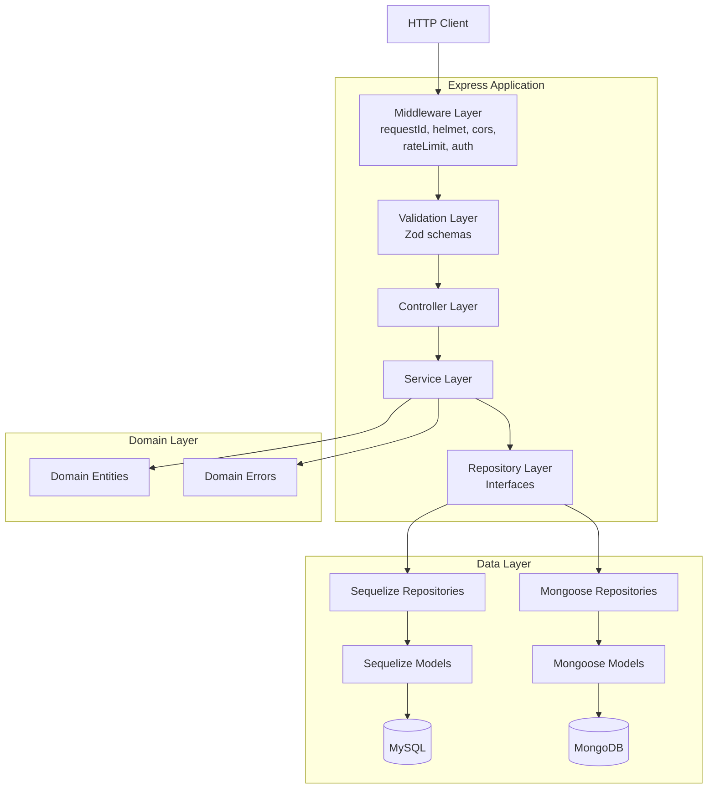

# Agent Context & Working Instructions

> **This is the most critical file in the documentation.**
> Any AI agent working on this project **must read this file completely** before making any changes.

---

## 1. Project Context

**What the project does:**
lag-money-manager is a REST API for personal money management. It allows users to register, authenticate, manage financial accounts (cash, card, savings, etc.), categorize transactions, and record income, expenses, and transfers between accounts with automatic balance adjustments.

**Business domain:** Personal finance / money management.

**Key constraints and non-negotiables:**

- All resources are user-scoped — users can only access their own data
- Transaction creation/update/deletion **must** adjust account balances accordingly
- Passwords are **never** returned in API responses
- JWT authentication is required for all routes except `/auth/register` and `/auth/login`
- The system supports two database backends (MySQL via Sequelize, MongoDB via Mongoose) selected at runtime via `DB_TYPE` environment variable
- UUIDs (v7) are used for all entity IDs

**Stack with versions:**

| Technology    | Version | Purpose               |
| ------------- | ------- | --------------------- |
| TypeScript    | 6.x     | Language              |
| Node.js       | 20+     | Runtime               |
| Express       | 5.x     | HTTP framework        |
| Zod           | 4.x     | Request validation    |
| Sequelize     | 6.x     | MySQL ORM             |
| Mongoose      | 9.x     | MongoDB ODM           |
| bcryptjs      | 3.x     | Password hashing      |
| jsonwebtoken  | 9.x     | JWT auth              |
| Pino          | 10.x    | Structured logging    |
| Helmet        | 8.x     | Security headers      |
| Jest          | 30.x    | Testing framework     |
| swagger-jsdoc | 6.x     | OpenAPI documentation |

---

## 2. Project Architecture Summary



**Layer responsibilities:**

| Layer                           | Responsibility                                                                                |
| ------------------------------- | --------------------------------------------------------------------------------------------- |
| **Middleware**                  | Cross-cutting concerns: request ID, security headers, CORS, rate limiting, JWT authentication |
| **Validation**                  | Request body/params/query validation using Zod schemas. Returns 400 on failure                |
| **Controller**                  | Thin HTTP handler. Extracts request data, delegates to service, formats HTTP response         |
| **Service**                     | Business logic. Ownership checks, data transformations, cross-entity operations               |
| **Repository (Interface)**      | Abstract data access contract. Defines operations without implementation details              |
| **Repository (Implementation)** | Database-specific CRUD. Sequelize for MySQL, Mongoose for MongoDB                             |
| **Domain Entity**               | Plain TypeScript classes representing business objects. No framework dependencies             |

**Communication:** All layers communicate via direct synchronous function calls (no event bus or message queues).

---

## 3. Working Standards

### File Naming Convention

- **Rule:** `PascalCase` for classes/entities/models, `camelCase` for utility files, routes, and middleware
- **Examples from the project:**
  - Entity: `Transaction.ts`, `Account.ts`, `User.ts`
  - Controller: `TransactionController.ts`
  - Service: `TransactionService.ts`
  - Repository: `TransactionSeqRepository.ts`, `TransactionMongoRepository.ts`
  - Route: `transactionRoutes.ts`, `authRoutes.ts`
  - Middleware: `authMiddleware.ts`
  - DTO: `TransactionDTO.ts`
  - Validation: `schemas.ts`, `validate.ts`
  - Shared utility: `pagination.ts`, `logger.ts`, `constants.ts`

### Class Naming Convention

- **Rule:** `PascalCase`, suffixed with their role
- **Examples:**

  ```typescript
  // Controller
  export class TransactionController { ... }

  // Service
  export class TransactionService { ... }

  // Repository interface
  export interface ITransactionRepository extends IRepository<Transaction> { ... }

  // Sequelize repository
  export class TransactionSeqRepository implements ITransactionRepository { ... }

  // Mongoose repository
  export class TransactionMongoRepository implements ITransactionRepository { ... }

  // Domain entity
  export class Transaction { ... }

  // Sequelize model
  export class TransactionModel extends Model { ... }

  // Error class
  export class ApiError extends BaseError { ... }
  ```

### Function Naming Convention

- **Rule:** `camelCase` for all functions. Controller methods are `static` class properties.
- **Examples:**

  ```typescript
  // Controller — static arrow functions
  static getAllTransactions = async (req: Request, res: Response) => { ... }
  static createTransaction = async (req: Request, res: Response) => { ... }

  // Service — async instance methods
  async getAllTransactions(userId: string, pagination: PaginationParams): Promise<...> { ... }
  async createTransaction(dto: CreateTransactionDTO): Promise<Transaction> { ... }

  // Repository — async instance methods matching IRepository interface
  async getById(id: string): Promise<Transaction | null> { ... }
  async create(transaction: Partial<Transaction>): Promise<Transaction> { ... }
  ```

### Folder Placement Rules

| File Type                 | Location                            | Example                                |
| ------------------------- | ----------------------------------- | -------------------------------------- |
| Domain entity             | `src/domain/entities/`              | `Transaction.ts`                       |
| Domain error              | `src/domain/errors.ts`              | `DomainValidationError`                |
| Sequelize model           | `src/domain/models/sequelize/`      | `TransactionModel.ts`                  |
| Mongoose model            | `src/domain/models/mongoose/`       | `TransactionMongoModel.ts`             |
| Repository interface      | `src/domain/repositories/[entity]/` | `ITransactionRepository.ts`            |
| Repository implementation | `src/domain/repositories/[entity]/` | `TransactionSeqRepository.ts`          |
| Controller                | `src/app/controllers/`              | `TransactionController.ts`             |
| Service                   | `src/app/services/`                 | `TransactionService.ts`                |
| Route                     | `src/app/routes/`                   | `transactionRoutes.ts`                 |
| DTO                       | `src/app/dtos/`                     | `TransactionDTO.ts`                    |
| Validation schemas        | `src/app/validation/`               | `schemas.ts`                           |
| Application middleware    | `src/app/middlewares/`              | `authMiddleware.ts`                    |
| Factory / provider        | `src/app/factories/`                | `RepositoryFactory.ts`                 |
| Shared utility            | `src/shared/`                       | `pagination.ts`, `logger.ts`           |
| Config                    | `src/config/`                       | `swagger.ts`, `sequelizeConnection.ts` |
| Migrations                | `src/database/migrations/`          | `20260328000001-create-users.js`       |
| Tests                     | `src/__tests__/[type]/`             | `TransactionService.test.ts`           |

### Import Order and Rules

Import sorting is enforced by `eslint-plugin-simple-import-sort`. The convention is:

1. External packages (`express`, `zod`, `bcryptjs`, etc.)
2. Internal absolute imports (domain, shared, config)
3. Relative imports (same module/directory)

```typescript
// Example from TransactionService.ts
import { Transaction } from "../../domain/entities/Transaction";
import { ITransactionRepository } from "../../domain/repositories/transaction/ITransactionRepository";
import { IAccountRepository } from "../../domain/repositories/account/IAccountRepository";
import { PaginatedResult, PaginationParams } from "../../shared/pagination";
import { ApiError } from "../../shared/errors";
import {
  CreateTransactionDTO,
  UpdateTransactionDTO,
} from "../dtos/TransactionDTO";
```

### Required Structure for Each File Type

**Controller:**

```typescript
import { Request, Response } from "express";
import { [Entity]Service } from "../services/[Entity]Service";
import repositoryFactory from "../factories/RepositoryFactory";
import { extractPagination } from "../../shared/pagination";

const [entity]Service = new [Entity]Service(
  repositoryFactory.get[Entity]Repository(),
);

export class [Entity]Controller {
  static getAll[Entities] = async (req: Request, res: Response) => {
    const userId = req.user!.userId;
    const result = await [entity]Service.getAll[Entities](userId, extractPagination(req));
    res.status(200).json(result);
  };

  static get[Entity]ById = async (req: Request, res: Response) => { ... };
  static create[Entity] = async (req: Request, res: Response) => { ... };
  static update[Entity] = async (req: Request, res: Response) => { ... };
  static delete[Entity] = async (req: Request, res: Response) => { ... };
}
```

**Service:**

```typescript
import { [Entity] } from "../../domain/entities/[Entity]";
import { I[Entity]Repository } from "../../domain/repositories/[entity]/I[Entity]Repository";
import { PaginatedResult, PaginationParams } from "../../shared/pagination";
import { ApiError } from "../../shared/errors";
import { Create[Entity]DTO, Update[Entity]DTO } from "../dtos/[Entity]DTO";

export class [Entity]Service {
  constructor(private repo: I[Entity]Repository) {}

  async getAll[Entities](userId: string, pagination: PaginationParams): Promise<PaginatedResult<[Entity]>> { ... }
  async get[Entity]ById(id: string, userId: string): Promise<[Entity]> { ... }
  async create[Entity](dto: Create[Entity]DTO): Promise<[Entity]> { ... }
  async update[Entity](id: string, dto: Update[Entity]DTO, userId: string): Promise<[Entity]> { ... }
  async delete[Entity](id: string, userId: string): Promise<void> { ... }
}
```

**Route:**

```typescript
import { Router } from "express";
import { [Entity]Controller } from "../controllers/[Entity]Controller";
import { validate } from "../validation/validate";
import { create[Entity]Schema, update[Entity]Schema, idParamSchema, paginationQuerySchema } from "../validation/schemas";

const router = Router();

// OpenAPI annotations (JSDoc @openapi blocks) before each route
router.get("/", validate(paginationQuerySchema), [Entity]Controller.getAll[Entities]);
router.post("/", validate(create[Entity]Schema), [Entity]Controller.create[Entity]);
router.get("/:id", validate(idParamSchema), [Entity]Controller.get[Entity]ById);
router.put("/:id", validate(update[Entity]Schema), [Entity]Controller.update[Entity]);
router.delete("/:id", validate(idParamSchema), [Entity]Controller.delete[Entity]);

export default router;
```

**Repository Interface:**

```typescript
import { PaginatedResult, PaginationParams } from "../../../shared/pagination";
import { [Entity] } from "../../entities/[Entity]";
import { IRepository } from "../IRepository";

export interface I[Entity]Repository extends IRepository<[Entity]> {
  getAllByUserId(userId: string, pagination: PaginationParams): Promise<PaginatedResult<[Entity]>>;
}
```

**Domain Entity:**

```typescript
export interface [Entity]Props {
  id?: string;
  // ... entity-specific fields
  userId: string;
  createdAt?: Date;
  updatedAt?: Date;
}

export class [Entity] {
  id: string;
  // ... entity fields
  userId: string;

  constructor(props: [Entity]Props) {
    this.id = props.id!;
    // ... assign fields with null-coalescing for optionals
  }
}
```

**DTO:**

```typescript
export interface Create[Entity]DTO {
  // required fields for creation
  userId: string;
}

export interface Update[Entity]DTO {
  id?: string;
  // optional fields for update
}
```

---

## 4. Step-by-Step Change Protocol

### BEFORE making changes:

1. Read `docs/agent-context.md` (this file) completely
2. Read the relevant module doc in `docs/modules/`
3. Read `docs/guides/adding-new-features.md` if adding something new
4. Read `docs/architecture/dependency-rules.md` to understand import restrictions
5. Understand the existing pattern before introducing anything new

### WHILE making changes:

1. Follow the exact file structure defined in this document
2. Do not introduce new patterns without explicit instruction
3. Do not add new dependencies without documenting them
4. Match the naming conventions exactly (see Section 3)
5. Add Zod validation schema for any new route endpoint
6. Add OpenAPI JSDoc annotations for any new route
7. Ensure all user-scoped resources check ownership (`userId` match)
8. Use `ApiError` for all expected error states in services
9. Keep controllers thin — no business logic
10. Return domain entities from services, not raw database objects

### AFTER making changes:

1. Update the relevant module doc if behavior changed (`docs/modules/[module].md`)
2. Update `docs/guides/environment-vars.md` if new env vars were added
3. Update `docs/guides/adding-new-features.md` if a new type of component was created
4. Update `docs/reference/glossary.md` if new domain terms were introduced
5. Update `docs/_index.json` if new doc files were created
6. Update `docs/architecture/design-patterns.md` if a new pattern was introduced
7. Run `npm test` to verify no regressions
8. Run `npm run lint` to verify code style compliance

---

## 5. Documentation Update Rules

| Change Made                   | Doc to Update                                                     |
| ----------------------------- | ----------------------------------------------------------------- |
| New route added               | `docs/modules/[module].md`, `docs/guides/adding-new-features.md`  |
| New environment variable      | `docs/guides/environment-vars.md`                                 |
| New design pattern introduced | `docs/architecture/design-patterns.md`                            |
| New module created            | `docs/modules/[module].md` (create new), `docs/_index.json`       |
| Error handling changed        | `docs/reference/error-handling.md`                                |
| New dependency added          | `docs/guides/getting-started.md`, `docs/architecture/overview.md` |
| New middleware added          | `docs/architecture/request-lifecycle.md`                          |
| Validation rules changed      | `docs/modules/[module].md`                                        |
| Folder structure changed      | `docs/architecture/folder-structure.md`                           |
| New entity/model added        | `docs/modules/[module].md`, `docs/reference/glossary.md`          |
| Database schema changed       | `docs/modules/[module].md`, migration file                        |
| API response format changed   | `docs/modules/[module].md`, `docs/reference/error-handling.md`    |

---

## 6. What NOT To Do

### Architectural violations:

- **Do NOT bypass the service layer** by calling repositories from controllers
- **Do NOT add business logic inside route handlers** — routes only wire validation + controller
- **Do NOT add business logic inside controllers** — controllers only extract request data and call services
- **Do NOT create files outside the established folder structure** (see Section 3 table)
- **Do NOT introduce a new pattern** if an existing one already solves the problem
- **Do NOT modify shared utilities** (`src/shared/`) without checking all consumers
- **Do NOT import** services from repositories or repositories from controllers
- **Do NOT access `req.body` or `req.params`** directly in services — pass DTOs

### Code quality violations:

- **Do NOT leave dead code**, commented-out blocks, or TODO comments in production code
- **Do NOT return passwords** or sensitive data in API responses
- **Do NOT skip validation** — every endpoint must have a Zod schema
- **Do NOT skip ownership checks** — all user-scoped resources must verify `userId`
- **Do NOT use `any` type** unless absolutely unavoidable (ESLint warns on this)
- **Do NOT skip error handling** — use `ApiError` for expected errors, let the global middleware handle unexpected ones
- **Do NOT hardcode configuration values** — use environment variables via `ENVIRONMENT` constant
- **Do NOT add new dependencies** without documenting them in `docs/guides/getting-started.md`

### Testing violations:

- **Do NOT skip mocking `shared/constants`** in test files — the module eagerly parses env vars at import time
- **Do NOT test against real databases** in unit tests — mock the repository interface
- **Do NOT import the actual `RepositoryFactory`** in tests — inject mock repositories directly
