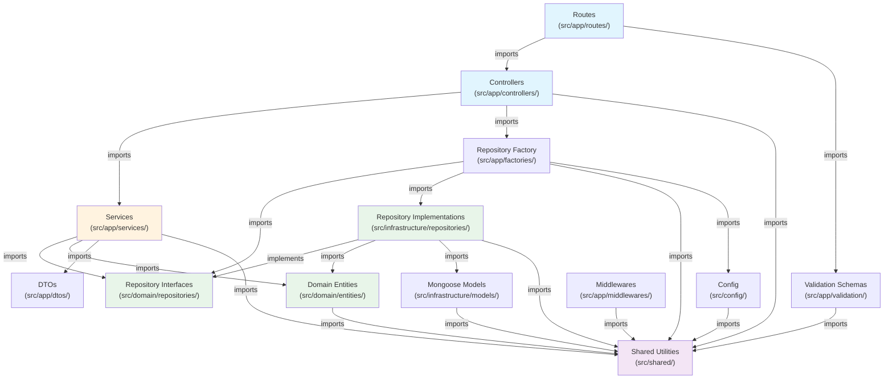

# Dependency Rules

## Layer Dependency Diagram



## Allowed Imports

| Source Layer                   | Can Import From                                                                                                                      |
| ------------------------------ | ------------------------------------------------------------------------------------------------------------------------------------ |
| **Routes**                     | Controllers, Validation schemas                                                                                                      |
| **Controllers**                | Services (via factory), Shared utilities (`extractPagination`)                                                                       |
| **Services**                   | Repository interfaces, Domain entities, DTOs, Shared utilities (`ApiError`, `PaginationParams`, `withTransaction`)                   |
| **Repository interfaces**      | Domain entities, Shared types only (`PaginationParams`, `PaginatedResult`, `TxSession`)                                              |
| **Repository implementations** | Repository interfaces (implements), Domain entities, Mongoose models, Shared utilities                                               |
| **Domain entities**            | Shared constants and value helpers (`MAX_AMOUNT`, `DEFAULT_CURRENCY`), Domain errors                                                 |
| **DTOs**                       | Shared constants (type definitions only)                                                                                             |
| **Validation schemas**         | Shared constants (for enum values)                                                                                                   |
| **Factory**                    | Repository interfaces, Config, Shared utilities                                                                                      |
| **Providers**                  | Repository implementations, Config, Shared constants                                                                                 |
| **Shared utilities**           | External packages, other `shared/` modules, and `src/domain/errors.ts` (the error middleware must recognize `DomainValidationError`) |

## Forbidden Dependencies

These imports are **strictly forbidden** and violate the architecture:

| Forbidden Import                                     | Why                                                                    |
| ---------------------------------------------------- | ---------------------------------------------------------------------- |
| Controller → Repository                              | Controllers must go through the service layer                          |
| Route → Service                                      | Routes wire controllers; services are not called directly from routes  |
| Service → Mongoose Model                             | Services depend on repository interfaces, not on the persistence layer |
| `src/domain/` → `src/infrastructure/` or `mongoose`  | The domain layer must not know how anything is stored                  |
| Repository → Service                                 | Repository is a lower layer; it cannot call back up to the service     |
| Domain Entity → Express                              | Entities must be framework-agnostic                                    |
| Shared → Application layer                           | Shared is a lower layer; it cannot import from `src/app/`              |
| Domain Entity → Repository                           | Entities are pure data; they don't access data stores                  |
| Any layer → `RepositoryFactory` (except controllers) | Only controllers instantiate services with factory-provided repos      |

### Documented exception

`src/app/middlewares/authRateLimitMiddleware.ts` imports `RateLimitModel` from `src/infrastructure/models/` directly. The rate-limit counter is infrastructure state with no domain entity, no service and no repository interface; routing it through the repository layer would add a contract nobody else consumes. Any new middleware that needs _domain_ data must still go through a service.

## Dependency Direction Rule

Dependencies flow **inward and downward**:

```
Routes → Controllers → Services → Repository Interfaces ← Repository Implementations
                                 → Domain Entities
                                 → DTOs
```

- Outer layers depend on inner layers, never the reverse
- The domain layer (entities, repository interfaces) has **zero** dependencies on the application or infrastructure layers
- `src/infrastructure/` is the only place that imports `mongoose`, outside `src/config/` (connection and health ping) and `src/shared/unitOfWork.ts` (session handling)
- Shared utilities are at the bottom — the only internal module they reach for is `src/domain/errors.ts`
