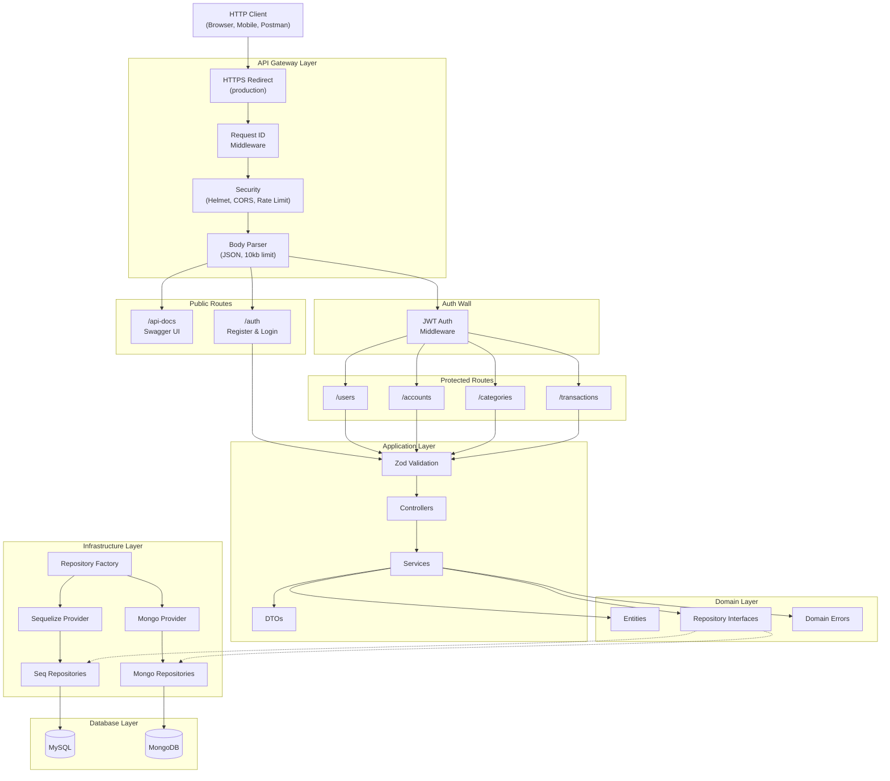

# Architecture Overview

## What the System Does

lag-money-manager is a REST API for personal money management. Users register and authenticate via JWT, then manage financial accounts (cash, cards, savings, etc.), organize transaction categories, and record income, expenses, and transfers — with automatic balance adjustments on affected accounts.

## High-Level Architecture

## Layer Descriptions

### Middleware Layer

Cross-cutting concerns applied to every request before routing. Includes request correlation ID, security headers (Helmet), CORS policy, rate limiting (100 req/15min), and JSON body parsing with a 10kb size limit.

### Validation Layer

Zod schemas validate request body, params, and query parameters. Validation middleware returns structured 400 errors with field-level details before the request reaches the controller.

### Controller Layer

Thin HTTP handlers. Extract `userId` from the authenticated request, extract pagination from query params, delegate to the service layer, and format the HTTP response with appropriate status codes.

### Service Layer

Business logic. Performs ownership verification (`userId` checks), data transformations via domain entities and DTOs, cross-entity operations (e.g., adjusting account balances on transaction CRUD), and throws `ApiError` for expected error conditions.

### Domain Layer

Framework-agnostic. Contains entity classes (plain TypeScript), repository interfaces (contracts), and domain-specific validation errors. No dependency on Express, Sequelize, or Mongoose.

### Infrastructure Layer

Database-specific implementations. The `RepositoryFactory` uses a provider pattern to select Sequelize or Mongoose implementations at runtime based on the `DB_TYPE` environment variable. Repositories map between database records and domain entities.

## Key Technical Decisions

| Decision                                     | Rationale                                                                   |
| -------------------------------------------- | --------------------------------------------------------------------------- |
| Dual database support (MySQL + MongoDB)      | Allows deployment flexibility; provider pattern encapsulates the difference |
| Repository pattern with interfaces           | Decouples business logic from data access; enables swapping DB backends     |
| Factory + Provider for repository creation   | Centralizes repository instantiation; lazy caching for performance          |
| UUID v7 for all IDs                          | Time-ordered, globally unique, no DB-generated auto-increment dependency    |
| Zod for validation (not Joi/class-validator) | Type-safe, lightweight, first-class TypeScript support                      |
| Express 5                                    | Latest stable release with native async error handling improvements         |
| Pino for logging                             | High-performance structured JSON logging, pretty-print in dev               |
| Global error middleware                      | Single place to handle all error types; consistent error response format    |

## External Dependencies and Integrations

| Dependency     | Purpose                                                           |
| -------------- | ----------------------------------------------------------------- |
| MySQL          | Primary relational database (via Sequelize ORM)                   |
| MongoDB        | Alternative document database (via Mongoose ODM)                  |
| Docker Compose | Local development: MySQL, phpMyAdmin, MongoDB, Mongoku containers |
| Swagger UI     | Interactive API documentation at `/api-docs`                      |

No external third-party API integrations. The system is self-contained.
