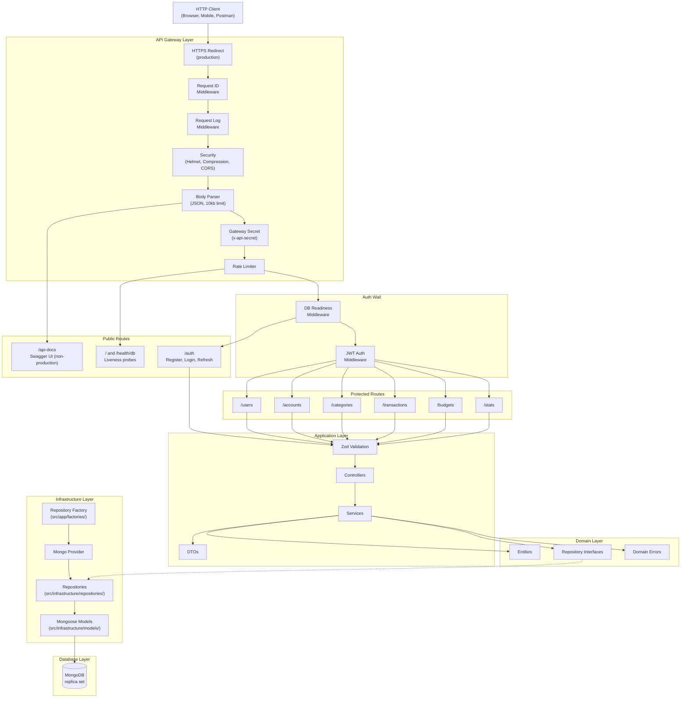

# Architecture Overview

## What the System Does

lag-money-manager is a REST API for personal money management. Users register and authenticate via JWT, then manage financial accounts (cash, cards, savings, etc.), organize transaction categories, budgets and statistics, and record income, expenses, transfers and balance adjustments — with automatic balance updates on affected accounts, applied inside a MongoDB transaction so the ledger and the stored balance can never drift apart.

## High-Level Architecture

## Layer Descriptions

### Middleware Layer

Cross-cutting concerns applied to every request before routing. Includes request correlation ID, a per-request completion log line, security headers (Helmet), response compression, CORS policy, JSON body parsing with a 10kb size limit, the shared-secret gateway check (`x-api-secret`), rate limiting (`RATE_LIMIT_MAX`, default 200 per 15-minute window), and a database-readiness check. See `request-lifecycle.md` for the exact order.

### Validation Layer

Zod schemas validate request body, params, and query parameters. Validation middleware returns structured 400 errors with field-level details before the request reaches the controller.

### Controller Layer

Thin HTTP handlers. Extract `userId` from the authenticated request, extract pagination from query params, delegate to the service layer, and format the HTTP response with appropriate status codes.

### Service Layer

Business logic. Performs ownership verification (`userId` checks), data transformations via domain entities and DTOs, and cross-entity operations (e.g., adjusting account balances on transaction CRUD, wrapped in `withTransaction()` from `src/shared/unitOfWork.ts`). Throws `ApiError` — with a stable machine-readable `code` where the client needs to branch — for expected error conditions.

### Domain Layer

Framework-agnostic (`src/domain/`). Contains entity classes (plain TypeScript), repository interfaces (contracts), and domain-specific validation errors. No dependency on Express or Mongoose.

### Infrastructure Layer

Persistence implementations (`src/infrastructure/`): Mongoose models in `models/` and the concrete repositories in `repositories/`, one directory per entity. Repositories map between MongoDB documents and domain entities — including the cents-to-decimal conversion for money. The `RepositoryFactory` (`src/app/factories/`) still resolves repositories through a provider registered under `DB_TYPE`, but MongoDB is the only registered provider; the seam is kept for test doubles, not for a second backend.

## Key Technical Decisions

| Decision                                     | Rationale                                                                                     |
| -------------------------------------------- | --------------------------------------------------------------------------------------------- |
| MongoDB only (Mongoose)                      | Single backend; multi-document transactions make the atomic balance update possible (ADR-001) |
| Repository pattern with interfaces           | Decouples business logic from data access; keeps services testable with fakes                 |
| Factory + Provider for repository creation   | Centralizes repository instantiation; lazy caching for performance                            |
| Money stored as integer cents                | Exact arithmetic; `$inc` balance updates never accumulate float error                         |
| UUID v7 for all IDs                          | Time-ordered, globally unique, generated in the app before the insert                         |
| Zod for validation (not Joi/class-validator) | Type-safe, lightweight, first-class TypeScript support                                        |
| Express 5                                    | Latest stable release with native async error handling improvements                           |
| Pino for logging                             | High-performance structured JSON logging, pretty-print in dev                                 |
| Global error middleware                      | Single place to handle all error types; consistent error response format with stable `code`   |

## External Dependencies and Integrations

| Dependency     | Purpose                                                                                     |
| -------------- | ------------------------------------------------------------------------------------------- |
| MongoDB        | The database (via Mongoose ODM). Must be a replica set — transactions require one           |
| Docker Compose | Local development: a single-node `rs0` replica set plus Mongoku (web UI)                    |
| Swagger UI     | Interactive API documentation at `/api-docs`, mounted only when `NODE_ENV !== "production"` |

No external third-party API integrations. The system is self-contained.
