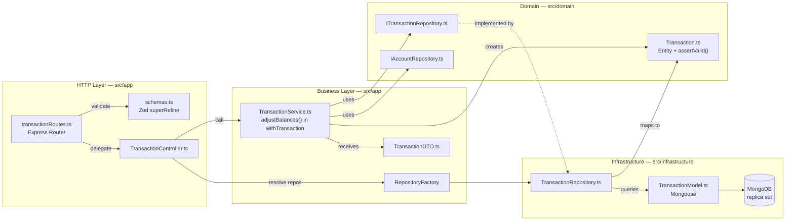

# Full Module Walkthrough: Transactions

## 1. What This Module Does and Why It Was Chosen

The Transactions module is the most representative module in the project. It was chosen because it demonstrates:

- Full vertical CRUD (entity → Mongoose model → repository → service → controller → route)
- Cross-module dependencies (`TransactionService` uses the account, category, and idempotency repositories)
- Two-stage validation: Zod at the HTTP boundary, `assertValid()` invariants on the entity
- Atomic balance adjustment inside a MongoDB transaction, with reversal on update/delete
- Money handled as integer cents at the storage boundary
- Pagination (offset + keyset cursor) through `buildPaginatedResult`
- Ownership enforcement that answers **404**, never 403
- Idempotent creation via the `Idempotency-Key` header
- Soft delete (`deletedAt`) plus an internal revision audit trail
- A comprehensive unit test suite built on mock repositories

This walkthrough shows how each file is built and how they connect. Follow the same shape for any new module.

---

## 2. File Creation Walkthrough

### Step 1: Domain Entity

**File:** `src/domain/entities/Transaction.ts`

**Why:** The entity is the foundation — a plain TypeScript class representing a financial transaction, plus the invariants that must hold for it to be valid. No framework dependencies.

**Where:** `src/domain/entities/` — all domain entities live here, isolated from HTTP and database concerns.

```typescript
import { v7 as uuidv7 } from "uuid";

import { TransactionSource, TransactionType } from "../../shared/constants";
import { MAX_AMOUNT } from "../../shared/money";
import { DomainValidationError } from "../errors";

export interface TransactionProps {
  id?: string;
  type: TransactionType;
  amount: number;
  date: Date | string;
  categoryId?: string | null;
  description?: string | null;
  fromAccountId?: string | null;
  toAccountId?: string | null;
  userId: string;
  tags?: string[];
  note?: string | null;
  pendingDetails?: boolean;
  source?: TransactionSource;
  // ISO 4217; stamped from the involved account when balances are applied.
  currency?: string;
  createdAt?: Date;
  updatedAt?: Date;
}

export class Transaction {
  id: string;
  type: TransactionType;
  amount: number;
  date: Date;
  // ... remaining fields

  constructor(props: TransactionProps) {
    this.id = props.id ?? uuidv7();
    this.type = props.type;
    this.amount = props.amount;
    this.date = props.date instanceof Date ? props.date : new Date(props.date);
    this.tags = props.tags ?? [];
    this.pendingDetails = props.pendingDetails ?? false;
    this.source = props.source ?? "MANUAL";
    this.currency = props.currency;
    this.createdAt = props.createdAt ?? new Date();
    this.updatedAt = props.updatedAt ?? new Date();
    // ... optional fields assigned with ?? null
  }

  // Called on create AND on the update merge, so a partial update can't leave
  // an inconsistent shape.
  assertValid(): void {
    if (!(this.amount > 0)) {
      throw new DomainValidationError("Amount must be greater than 0", "amount");
    }
    if (this.date.getTime() > Date.now() + 24 * 60 * 60 * 1000) {
      throw new DomainValidationError(
        "date cannot be more than 24 hours in the future",
        "date",
        "FUTURE_DATE",
      );
    }
    // ... per-type rules: EXPENSE needs fromAccountId only, INCOME needs
    // toAccountId only, TRANSFER needs both and they must differ, ADJUSTMENT
    // needs exactly one side and no categoryId.
  }
}
```

**Key decisions:**

- The entity generates its own `id` (UUID v7) when one isn't supplied — ids are not a database concern
- `amount` is a **decimal amount** everywhere above the repository; cents exist only in storage
- `date` accepts both `Date` and `string` (the API sends ISO strings, the DB returns `Date`)
- `tags` is a `string[]` (default `[]`), not a delimited string
- `currency`, `source` and `pendingDetails` are server-derived; clients never set them
- `assertValid()` is the single place where per-type invariants live, so the service, the update
  merge, and the tests all enforce exactly the same rules. It throws `DomainValidationError`,
  which the error middleware renders as a 400 with the same body shape as a Zod failure
- The entity only imports `shared/constants`, `shared/money` and `domain/errors` — no framework

---

### Step 2: DTOs

**File:** `src/app/dtos/TransactionDTO.ts`

**Why:** DTOs define the contract for data flowing into the service layer. Separate from the entity to avoid leaking internal fields.

**Where:** `src/app/dtos/` — DTOs live in the application layer because they are HTTP-boundary concerns.

```typescript
import { TransactionSource, TransactionType } from "../../shared/constants";

export interface CreateTransactionDTO {
  type: TransactionType;
  amount: number;
  date: Date;
  categoryId?: string | null;
  description?: string | null;
  fromAccountId?: string | null;
  toAccountId?: string | null;
  userId: string;
  tags?: string[];
  note?: string | null;
  pendingDetails?: boolean;
  // Server-derived (quick-add sets QUICK); the schema never accepts it.
  source?: TransactionSource;
}

export interface UpdateTransactionDTO {
  id?: string;
  // every other field optional — partial updates are supported
}

export interface QuickAddTransactionDTO {
  amount: number;
  type?: TransactionType;
  date?: Date;
  categoryId?: string | null;
  fromAccountId?: string | null;
  toAccountId?: string | null;
  userId: string;
}
```

**Key decisions:**

- `userId` is required on create — the controller injects it from `req.user`, never from the body
- `UpdateTransactionDTO` carries `id?` so the service can verify the URL param matches the body
- A third DTO models the low-friction quick-add flow, where only `amount` is required
- When a service returns something richer than an entity (budgets do), the shaped result is a
  `...View` interface declared next to its DTOs — see `BudgetView` in `src/app/dtos/BudgetDTO.ts`

---

### Step 3: Mongoose Model

**File:** `src/infrastructure/models/TransactionModel.ts`

**Why:** Defines the MongoDB schema and the indexes for the Transaction collection. This is the only file in the module that knows about Mongoose. MongoDB is the only backend; there is no ORM abstraction beyond the repository interface.

```typescript
import mongoose, { Schema } from "mongoose";

import {
  MODEL_NAMES,
  TRANSACTION_SOURCES,
  TRANSACTION_TYPES,
  TransactionType,
} from "../../shared/constants";
import { DEFAULT_CURRENCY } from "../../shared/currency";

export interface ITransactionDocument {
  _id: string;
  type: TransactionType;
  amount: number; // integer cents
  date: Date;
  // ... categoryId, description, fromAccountId, toAccountId, userId, note
  tags: string[];
  pendingDetails: boolean;
  source?: string;
  currency: string;
  revisions?: { at: Date; amount: number; /* ... */ }[];
  deletedAt: Date | null;
  createdAt: Date;
  updatedAt: Date;
}

const TransactionSchema = new Schema<ITransactionDocument>(
  {
    _id: { type: String, required: true },
    type: { type: String, required: true, enum: Object.keys(TRANSACTION_TYPES) },
    amount: { type: Number, required: true },
    date: { type: Date, required: true },
    tags: { type: [String], default: [] },
    pendingDetails: { type: Boolean, required: true, default: false },
    source: {
      type: String,
      required: true,
      enum: Object.keys(TRANSACTION_SOURCES),
      default: "MANUAL",
    },
    currency: {
      type: String,
      required: true,
      default: DEFAULT_CURRENCY,
      uppercase: true,
      trim: true,
    },
    // Audit trail of monetary edits (amount in cents); capped, internal-only.
    revisions: { type: [/* sub-schema, _id: false */], default: [] },
    deletedAt: { type: Date, default: null },
  },
  { timestamps: true },
);

// Primary listing sort; deletedAt included so the per-page count is
// resolved from the index instead of fetching every document.
TransactionSchema.index({ userId: 1, deletedAt: 1, date: -1, _id: -1 });
TransactionSchema.index({ userId: 1, categoryId: 1, date: -1 });
TransactionSchema.index({ userId: 1, tags: 1, date: -1 });
// Each $or branch of the accountId filter needs its own userId-prefixed index.
TransactionSchema.index({ userId: 1, fromAccountId: 1, date: -1 });
TransactionSchema.index({ userId: 1, toAccountId: 1, date: -1 });

export const TransactionModel = mongoose.model<ITransactionDocument>(
  MODEL_NAMES.TRANSACTION,
  TransactionSchema,
);
```

**Key decisions:**

- `_id` is a `String` (UUID v7) — not the default MongoDB ObjectId
- `amount` is stored as **integer cents**. Never store money as a float
- `timestamps: true` auto-manages `createdAt`/`updatedAt`, which are returned to clients
- `deletedAt` implements the soft delete; every query filters on `deletedAt: null`
- Every index is prefixed with `userId`, because every query is user-scoped
- There are no migrations. Collections appear on first write; indexes are built by
  `npm run db:sync-indexes` in production (`autoIndex` handles development)

---

### Step 4: Repository Interface

**File:** `src/domain/repositories/transaction/ITransactionRepository.ts`

**Why:** Defines the data access contract. The service depends on this interface, never on Mongoose.

```typescript
import { TransactionType } from "../../../shared/constants";
import { PaginatedResult, PaginationParams } from "../../../shared/pagination";
import { Transaction } from "../../entities/Transaction";
import { IRepository } from "../IRepository";

export interface TransactionFilters {
  ids?: string[];
  accountId?: string;
  categoryId?: string;
  type?: TransactionType;
  pendingDetails?: boolean;
  // Half-open date range [from, to).
  from?: Date;
  to?: Date;
  tag?: string;
  uncategorized?: boolean;
}

export interface ITransactionRepository extends IRepository<Transaction> {
  update(
    id: string,
    entity: Partial<Transaction>,
    session?: unknown,
    revision?: TransactionRevision,
  ): Promise<Transaction>;

  getAllByUserId(
    userId: string,
    pagination: PaginationParams,
    filters?: TransactionFilters,
  ): Promise<PaginatedResult<Transaction>>;

  aggregateSpending(userId: string, query: SpendingQuery): Promise<SpendingResult>;
  listTags(userId: string): Promise<string[]>;
  countByCategory(userId: string, categoryId: string): Promise<number>;
  sumAmountsByCategory(/* ... */): Promise<Record<string, number>>;
  sumAmounts(/* ... */): Promise<number>;
}
```

The base contract it extends (`src/domain/repositories/IRepository.ts`) threads an optional
transaction session through every operation:

```typescript
export interface IRepository<T> {
  getById(id: string, session?: TxSession): Promise<T | null>;
  getAll(pagination: PaginationParams): Promise<PaginatedResult<T>>;
  create(entity: Partial<T>, session?: TxSession): Promise<T>;
  update(id: string, entity: Partial<T>, session?: TxSession): Promise<T>;
  delete(id: string, session?: TxSession): Promise<void>;
}
```

**Key decisions:**

- Filters are a **typed** interface, never a raw Mongo query object leaking upward
- Returns domain `Transaction` entities — never raw documents
- Aggregations that return cents say so in their type (`totalCents`), so callers can't confuse units
- `TransactionRevision` is internal (audit trail) and is never exposed through the API

---

### Step 5: Repository Implementation

**File:** `src/infrastructure/repositories/transaction/TransactionRepository.ts`

**Why:** The only place that translates between Mongoose documents and domain entities, and between integer cents and decimal amounts. Note the name: no `Mongo` suffix — MongoDB is the only backend.

```typescript
export class TransactionRepository implements ITransactionRepository {
  private toEntity(doc: ITransactionDocument): Transaction {
    return new Transaction({
      id: doc._id,
      type: doc.type,
      amount: fromCents(doc.amount),
      // ... remaining fields
      currency: doc.currency,
      createdAt: doc.createdAt,
      updatedAt: doc.updatedAt,
    });
  }

  private toStorage(transaction: Partial<Transaction>): Record<string, unknown> {
    const doc: Record<string, unknown> = { ...transaction };
    if (transaction.amount !== undefined) {
      doc.amount = toCents(transaction.amount);
    }
    return doc;
  }

  async getById(id: string, session?: TxSession): Promise<Transaction | null> {
    const doc = await TransactionModel.findOne({ _id: id, deletedAt: null })
      .session(session ?? null)
      .lean();
    return doc ? this.toEntity(doc) : null;
  }

  async delete(id: string, session?: TxSession): Promise<void> {
    // Soft delete: the row stays for the ledger, hidden from every read.
    const doc = await TransactionModel.findOneAndUpdate(
      { _id: id, deletedAt: null },
      { deletedAt: new Date() },
      { new: true, session: session ?? undefined },
    ).lean();
    if (!doc) {
      throw new ApiError("NotFound", "Transaction not found");
    }
  }
}
```

Listing goes through a private `paginatedFind()` that supports both offset and keyset cursor
pagination and always returns through the shared helper:

```typescript
const [docs, total] = await Promise.all([
  TransactionModel.find(filter)
    .sort({ date: -1, _id: -1 })
    .skip(cursor ? 0 : offset)
    .limit(limit)
    .lean(),
  TransactionModel.countDocuments(baseFilter),
]);

return buildPaginatedResult(docs.map((doc) => this.toEntity(doc)), total, pagination);
```

`buildPaginatedResult` (`src/shared/pagination.ts`) produces the response envelope every listing
endpoint returns:

```json
{
  "data": [ ... ],
  "pagination": { "limit": 20, "offset": 0, "total": 128, "hasMore": true, "nextCursor": "0195..." }
}
```

**Key decisions:**

- The cursor is keyset over `(date DESC, _id DESC)` — an id alone is not enough because transactions
  can be backdated, so the cursor document's `date` is fetched first
- The cursor lookup is scoped to the owner, so a foreign id can't act as a pivot (id oracle), and an
  unknown cursor is a 400 `INVALID_CURSOR` rather than a silent page 1 (which duplicated items in
  infinite scroll)
- `.lean()` everywhere: documents never escape this class
- Updates can push a capped `revisions` entry in the same `findOneAndUpdate`

---

### Step 6: Register in the Factory

**Files modified:**

`src/app/factories/providers/mongoProvider.ts`:

```typescript
factory.register("transaction", () => new TransactionRepository());
```

`src/app/factories/RepositoryFactory.ts` — add the key and the typed getter:

```typescript
export const REPO_KEYS = { /* ... */ TRANSACTION: "transaction" } as const;

getTransactionRepository(): ITransactionRepository {
  return this.getRepository<ITransactionRepository>(REPO_KEYS.TRANSACTION);
}
```

The factory selects a provider by `ENVIRONMENT.DB_TYPE` and caches one instance per key. `MONGO` is
the only registered provider, so an unknown `DB_TYPE` fails fast at startup with
`No database provider registered for DB_TYPE: ...`.

---

### Step 7: Service

**File:** `src/app/services/TransactionService.ts`

**Why:** Contains the core business logic — balance adjustments, ownership checks, category rules, idempotency, CRUD orchestration.

```typescript
export class TransactionService {
  constructor(
    private transactionRepo: ITransactionRepository,
    private accountRepo: IAccountRepository,
    private idempotencyRepo: IIdempotencyRepository,
    private categoryRepo: ICategoryRepository,
  ) {}

  async createTransaction(
    dto: CreateTransactionDTO,
    idempotency?: IdempotencyMeta,
  ): Promise<Transaction> {
    if (idempotency) {
      const existing = await this.replayIdempotent(dto.userId, idempotency);
      if (existing) return existing;
    }

    const transaction = new Transaction(dto);
    transaction.assertValid();
    await this.assertCategoryUsable(transaction);

    return await withTransaction(async (session) => {
      await this.adjustBalances(transaction, 1, session);
      const created = await this.transactionRepo.create(transaction, session);
      if (idempotency) {
        await this.idempotencyRepo.record(/* ..., session */);
      }
      return created;
    });
  }
}
```

The heart of the module is `adjustBalances()`:

```typescript
private async adjustBalances(
  transaction: Transaction,
  direction: 1 | -1,
  session: TxSession,
): Promise<void> {
  const { type, amount, fromAccountId, toAccountId } = transaction;

  const adjustAccount = async (accountId: string, sign: number): Promise<void> => {
    // Only check existence/ownership on apply; reversals must work even if the
    // account was archived meanwhile.
    if (direction === 1) {
      const account = await this.accountRepo.getById(accountId, session);
      // 404 for foreign accounts too: ids must not be probeable.
      if (!account || account.userId !== transaction.userId) {
        throw new ApiError("NotFound",
          sign < 0 ? "Source account not found" : "Destination account not found");
      }
      // Mono-currency mode: the transaction carries its account's currency.
      if (account.currency && transaction.currency &&
          transaction.currency !== account.currency) {
        throw new ApiError("BadRequest",
          "Transfers between accounts with different currencies are not supported yet",
          "CURRENCY_MISMATCH");
      }
      transaction.currency = transaction.currency ?? account.currency;
    }

    const applied = await this.accountRepo.incrementBalance(
      accountId, amount * sign * direction, session,
    );
    if (!applied) {
      // Aborts the Mongo transaction: a silently skipped increment would
      // desync the stored balance from the ledger.
      throw new ApiError("InternalServerError", "Account missing during balance adjustment");
    }
  };

  if (type === "EXPENSE" && fromAccountId) await adjustAccount(fromAccountId, -1);
  if (type === "INCOME" && toAccountId) await adjustAccount(toAccountId, 1);
  if (type === "TRANSFER" || type === "ADJUSTMENT") {
    if (fromAccountId) await adjustAccount(fromAccountId, -1);
    if (toAccountId) await adjustAccount(toAccountId, 1);
  }
}
```

**Key decisions:**

- `direction`: `1` applies (create), `-1` reverses (update/delete)
- The balance is moved with an **atomic `$inc`** (`incrementBalance`, which converts the delta to
  cents), never read-modify-write — two concurrent transactions would otherwise lose an update
- Everything runs inside `withTransaction`, so the ledger row and both balances commit together or
  not at all. **This is why MongoDB must be a replica set**
- A failed increment throws rather than being skipped: aborting the transaction is the only safe
  outcome when the stored balance would drift from the ledger
- `currency` is stamped from the involved account here; the client-sent value is ignored
- Ownership failures return **404**, matching the "no id oracle" rule used across the project
- `ADJUSTMENT` shares the transfer branch: with exactly one side set, it becomes a signed
  single-account increment

**Update and delete:**

- `updateTransaction` re-merges into a fresh `Transaction`, calls `assertValid()` again, and
  reverses + reapplies balances **only when the money movement changed** (type, amount, or
  accounts). Non-monetary edits therefore still work on transactions of archived accounts
- A monetary or date change also pushes a pre-update snapshot into the capped `revisions` array
- `deleteTransaction` reverses the balances and soft-deletes, both in one transaction

**Category rules** (`assertCategoryUsable`): a missing or foreign category is a 404; assigning an
archived category is `CATEGORY_ARCHIVED` (keeping one it already had is allowed); a category whose
type doesn't match the transaction type is `CATEGORY_TYPE_MISMATCH`.

**Idempotency** (`replayIdempotent`): the stored key maps to the created transaction id. Same key +
same payload hash replays the original; a different payload is a 422
`IDEMPOTENCY_PAYLOAD_MISMATCH`; a replay whose original was deleted is a 409
`IDEMPOTENCY_ORIGINAL_DELETED`. A duplicate-key error from a concurrent retry is caught and
resolved into a replay.

**Quick-add** (`quickAddTransaction`): defaults `type` to `EXPENSE`, `date` to now, and the missing
side to the user's default account (`NO_DEFAULT_ACCOUNT` if there isn't one), then delegates to
`createTransaction` with `pendingDetails: true` and `source: "QUICK"`.

---

### Step 8: Controller

**File:** `src/app/controllers/TransactionController.ts`

```typescript
import { Request, Response } from "express";

import { TransactionFilters } from "../../domain/repositories/transaction/ITransactionRepository";
import { ApiError } from "../../shared/errors";
import { extractPagination } from "../../shared/pagination";
import { hashPayload } from "../../shared/requestHash";
import repositoryFactory from "../factories/RepositoryFactory";
import { IdempotencyMeta, TransactionService } from "../services/TransactionService";

const transactionService = new TransactionService(
  repositoryFactory.getTransactionRepository(),
  repositoryFactory.getAccountRepository(),
  repositoryFactory.getIdempotencyRepository(),
  repositoryFactory.getCategoryRepository(),
);

export class TransactionController {
  static getAllTransactions = async (req: Request, res: Response) => {
    const userId = req.user!.userId;
    const filters: TransactionFilters = {};
    if (req.query.accountId) filters.accountId = req.query.accountId as string;
    if (req.query.type) filters.type = req.query.type as TransactionType;
    // ... one narrow assignment per supported query parameter
    const result = await transactionService.getAllTransactions(
      userId,
      extractPagination(req),
      filters,
    );
    res.status(200).json(result);
  };

  static createTransaction = async (req: Request, res: Response) => {
    const userId = req.user!.userId;
    const newTransaction = await transactionService.createTransaction(
      { ...req.body, userId },
      idempotencyMeta(req),
    );
    res.status(201).json(newTransaction);
  };

  static deleteTransaction = async (req: Request, res: Response) => {
    const userId = req.user!.userId;
    await transactionService.deleteTransaction(req.params.id as string, userId);
    res.status(200).json({ message: "Transaction deleted successfully" });
  };

  // getTransactionById, quickAddTransaction, updateTransaction, getTags follow
  // the same shape.
}
```

The `Idempotency-Key` header is parsed and hashed at this level, because it is an HTTP concern:

```typescript
// Bounded charset/length: the key becomes part of a stored _id.
const IDEMPOTENCY_KEY_PATTERN = /^[A-Za-z0-9_-]{1,200}$/;

function idempotencyMeta(req: Request): IdempotencyMeta | undefined {
  const key = req.get("Idempotency-Key");
  if (!key) return undefined;
  if (!IDEMPOTENCY_KEY_PATTERN.test(key)) {
    throw new ApiError("BadRequest", "...", "IDEMPOTENCY_KEY_INVALID");
  }
  return { key, requestHash: hashPayload(req.body) };
}
```

**Key decisions:**

- The service is instantiated once at module level with factory-provided repositories
- `userId` **always** comes from `req.user!.userId`, never from the request body
- The controller never adjusts balances or checks ownership — that is the service's job
- Query parameters become a typed `TransactionFilters`; `req.query` never reaches the service
- Responses are the entity serialized as-is, so they include `id`, `currency`, `source`,
  `pendingDetails`, `tags`, `createdAt` and `updatedAt`
- Delete answers **200 with a message body**, not 204

---

### Step 9: Validation Schemas

**File:** `src/app/validation/schemas.ts` (additions)

Amounts and dates go through shared building blocks so every module agrees on them:

```typescript
// Money is decimal in the API but stored as integer cents, so amounts must
// have at most 2 decimals and stay within a sane bound (rejects 10.555 and 1e300).
const moneyAmount = z
  .number()
  .positive("Amount must be greater than 0")
  .multipleOf(0.01, "Amount must have at most 2 decimal places")
  .max(MAX_AMOUNT, `Amount must be at most ${MAX_AMOUNT}`);

// Trim + casefold + dedupe: "Café", "café" and "café " must be ONE tag,
// or the per-tag spending stats fragment into ghost buckets.
const normalizedTags = z
  .array(z.string().min(1).max(50))
  .max(30)
  .transform((tags) => [...new Set(tags.map((t) => t.trim().toLowerCase()).filter(Boolean))])
  .optional();
```

The create schema uses `superRefine` for type-dependent validation:

```typescript
export const createTransactionSchema = z.object({
  body: z
    .object({
      type: z.enum(transactionTypeValues, { error: `Invalid transaction type. Available: ...` }),
      amount: moneyAmount,
      date: z.string().datetime({ offset: true, message: "Date must be a valid ISO 8601 date" }),
      categoryId: z.string().uuid("categoryId must be a valid UUID").optional().nullable(),
      description: z.string().max(255).optional().nullable(),
      fromAccountId: z.string().uuid(/* ... */).optional().nullable(),
      toAccountId: z.string().uuid(/* ... */).optional().nullable(),
      tags: normalizedTags,
      note: z.string().max(1000).optional().nullable(),
    })
    .superRefine((data, ctx) => {
      if (data.type === "EXPENSE" && !data.fromAccountId) { ctx.addIssue({ /* ... */ }); }
      if (data.type === "INCOME" && !data.toAccountId) { ctx.addIssue({ /* ... */ }); }
      if (data.type === "ADJUSTMENT") {
        // exactly one side, and no categoryId
      }
      if (data.type === "TRANSFER") {
        // both sides required, and they must differ
      }
    }),
});
```

`updateTransactionSchema` makes every field optional and adds
`.refine((data) => Object.values(data).some((v) => v !== undefined))` so an empty body is a 400.
`quickAddTransactionSchema` requires only `amount` and excludes `ADJUSTMENT` from its type enum
(a quick-add adjustment would be an un-detailable `pendingDetails` entry, since it can take no
category). Listing uses `getTransactionsSchema` — a `query` schema — rather than the generic
`paginationQuerySchema`.

**Key decisions:**

- `superRefine` enables cross-field validation that depends on the `type` value
- Note the deliberate overlap with `Transaction.assertValid()`: Zod guards the HTTP shape, the
  entity guards the invariant. The entity's copy is what protects partial updates and internal
  callers such as quick-add
- The schema accepts **no** `currency`, `source` or `userId` field. `validate()` replaces
  `req.body` with the parsed result, so unknown fields are stripped (mass-assignment guard)
- Dates require an explicit offset (`datetime({ offset: true })`)

---

### Step 10: Routes (with OpenAPI)

**File:** `src/app/routes/transactionRoutes.ts`

Each route carries a JSDoc `@openapi` block for Swagger, then the validation middleware, then the controller method.

```typescript
const router = Router();

router.get("/", validate(getTransactionsSchema), TransactionController.getAllTransactions);
router.post("/", validate(createTransactionSchema), TransactionController.createTransaction);
router.post("/quick", validate(quickAddTransactionSchema), TransactionController.quickAddTransaction);
router.get("/tags", TransactionController.getTags);
router.get("/:id", validate(idParamSchema), TransactionController.getTransactionById);
router.put("/:id", validate(updateTransactionSchema), TransactionController.updateTransaction);
router.delete("/:id", validate(idParamSchema), TransactionController.deleteTransaction);

export default router;
```

Literal paths (`/quick`, `/tags`) must be declared **before** `/:id`, or the parameterized route
swallows them.

**Registration in `src/app.ts`:**

```typescript
app.use(authMiddleware); // JWT required for everything below
app.use("/transactions", apiLimiter, transactionRoutes);
```

---

## 3. How the Pieces Connect



---

## 4. Validation

Validation happens in three places, each with a distinct job:

1. **Request-level** (Zod in `schemas.ts`): shape, types, and cross-field constraints, **before** the
   request reaches the controller. Returns 400 with `code: "VALIDATION"` and a
   `details: [{ field, message }]` array. It also whitelists the body.
2. **Domain-level** (`Transaction.assertValid()`): invariants that must hold no matter who builds the
   entity — including the merged result of a partial update and internally constructed quick-adds.
   Throws `DomainValidationError`, rendered as a 400 in the same shape as the Zod path.
3. **Business-level** (Service): rules that need the database — ownership, account and category
   existence, currency agreement, idempotency conflicts. Throws `ApiError`.

---

## 5. Error Handling

Every error body carries a stable `code`. Clients branch on `code`, never on `message`.

| Scenario                                      | Where                    | Status | `code`                          |
| --------------------------------------------- | ------------------------ | ------ | ------------------------------- |
| Invalid request data                          | Validation middleware    | 400    | `VALIDATION`                    |
| Date more than 24h in the future              | Entity `assertValid()`   | 400    | `FUTURE_DATE`                   |
| Unknown or foreign pagination cursor          | Repository               | 400    | `INVALID_CURSOR`                |
| Assigning an archived category                | Service                  | 400    | `CATEGORY_ARCHIVED`             |
| Category type ≠ transaction type              | Service                  | 400    | `CATEGORY_TYPE_MISMATCH`        |
| Accounts with different currencies            | Service (adjustBalances) | 400    | `CURRENCY_MISMATCH`             |
| Quick-add with no account and no default      | Service                  | 400    | `NO_DEFAULT_ACCOUNT`            |
| Malformed `Idempotency-Key` header            | Controller               | 400    | `IDEMPOTENCY_KEY_INVALID`       |
| ID mismatch (URL vs body)                     | Service                  | 400    | —                               |
| Missing/invalid JWT                           | `authMiddleware`         | 401    | —                               |
| `API_SECRET` set and `x-api-secret` missing   | `gatewaySecretMiddleware`| 403    | —                               |
| Transaction not found **or owned by another user** | Service             | 404    | —                               |
| Source/destination account not found or foreign | Service (adjustBalances) | 404  | —                               |
| Idempotent replay whose original was deleted  | Service                  | 409    | `IDEMPOTENCY_ORIGINAL_DELETED`  |
| Duplicate key (Mongo 11000)                   | Error middleware         | 409    | `DUPLICATE`                     |
| Same `Idempotency-Key`, different payload     | Service                  | 422    | `IDEMPOTENCY_PAYLOAD_MISMATCH`  |
| MongoDB unreachable                           | Error middleware         | 503    | `DB_UNAVAILABLE`                |

---

## 6. Testing

**File:** `src/__tests__/services/TransactionService.test.ts`

The test file demonstrates the project's unit-test conventions:

1. **Mock `shared/constants` first** — the module parses env vars eagerly at import time:

```typescript
jest.mock("../../shared/constants", () => ({
  ENVIRONMENT: { PORT: 3000, DB_TYPE: "MONGO", JWT_SECRET: "test", NODE_ENV: "test", /* ... */ },
  DB_TYPES: { MONGO: "MONGO" },
  TRANSACTION_TYPES: { INCOME: "INCOME", EXPENSE: "EXPENSE", TRANSFER: "TRANSFER", ADJUSTMENT: "ADJUSTMENT" },
  // ... CATEGORY_TYPES, MODEL_NAMES
}));
```

2. **Mock `shared/unitOfWork`** so the transactional callback runs inline against mock repositories,
   with no real MongoDB session:

```typescript
jest.mock("../../shared/unitOfWork", () => ({
  withTransaction: jest.fn((fn: (session: unknown) => unknown) => fn("test-session")),
}));
```

3. **Create mock repositories** covering the full interface:

```typescript
const createMockTransactionRepo = (): jest.Mocked<ITransactionRepository> => ({
  getAll: jest.fn(),
  getAllByUserId: jest.fn(),
  getById: jest.fn(),
  create: jest.fn(),
  update: jest.fn(),
  delete: jest.fn(),
  aggregateSpending: jest.fn(),
  listTags: jest.fn().mockResolvedValue([]),
  countByCategory: jest.fn().mockResolvedValue(0),
  sumAmountsByCategory: jest.fn(),
  sumAmounts: jest.fn().mockResolvedValue(0),
});
```

4. **Assert on the atomic increment and the session**, not on a recomputed balance:

```typescript
it("debits the source account for an EXPENSE (atomic increment)", async () => {
  acctRepo.getById.mockResolvedValue(account());
  const dto: CreateTransactionDTO = {
    type: "EXPENSE", amount: 100, date: new Date("2026-03-28"),
    fromAccountId: ACC_A, userId: USER,
  };
  txRepo.create.mockResolvedValue(new Transaction({ id: TX_ID, ...dto }));

  await service.createTransaction(dto);

  expect(acctRepo.incrementBalance).toHaveBeenCalledTimes(1);
  expect(acctRepo.incrementBalance).toHaveBeenCalledWith(ACC_A, -100, "test-session");
  expect(txRepo.create).toHaveBeenCalledWith(expect.any(Transaction), "test-session");
});
```

5. **Test error conditions** — including that a foreign resource looks missing:

```typescript
it("throws when the source account is not found", async () => {
  acctRepo.getById.mockResolvedValue(null);
  await expect(service.createTransaction(validExpense)).rejects.toThrow(
    "Source account not found",
  );
});
```

Ids in tests are real UUID v7 strings, because the Zod schemas and entity checks validate the format.
The whole suite (374 tests, 20 suites) runs without a database in a few seconds; `npm run ci` is the
gate that must pass before handing work back.

---

## 7. What NOT to Do

- **Do NOT adjust account balances in the controller** — all balance logic is in `TransactionService.adjustBalances()`
- **Do NOT read a balance, add to it, and write it back** — use `incrementBalance` (`$inc`), or concurrent transactions will lose updates
- **Do NOT write a balance change outside `withTransaction`** — the ledger row and the balances must commit together
- **Do NOT skip balance reversal on update/delete** — this causes balance drift
- **Do NOT do float math on money** — amounts are decimal above the repository and integer cents below it; convert only with `toCents`/`fromCents`
- **Do NOT let the client set `currency`, `source`, `pendingDetails` on create, or `userId`** — all four are server-derived
- **Do NOT return 403 for a transaction or account owned by another user** — return 404, so ids can't be probed
- **Do NOT hard-delete** — transactions are soft-deleted (`deletedAt`); accounts and categories are archived (`archivedAt`)
- **Do NOT allow TRANSFER with the same source and destination** — Zod and `assertValid()` both prevent it; never bypass either
- **Do NOT add a validation rule to Zod only** — if it is an invariant of the entity, it belongs in `assertValid()` too, or partial updates will slip past it
- **Do NOT throw an `ApiError` without a `code`** when clients need to branch on the outcome
- **Do NOT call `TransactionService` from other services** — if balance logic needs reuse, extract it

---

## 8. Checklist for Replication

When building a new module following this pattern:

- [ ] Domain entity in `src/domain/entities/`, with `assertValid()` if it has invariants
- [ ] DTOs (and a `...View` interface if the service returns a shaped result) in `src/app/dtos/`
- [ ] Mongoose model in `src/infrastructure/models/`, `_id` as a UUID string, money as integer cents, `timestamps: true`, and a soft-delete field (`archivedAt` or `deletedAt`)
- [ ] `userId`-prefixed indexes for every listing and filter query
- [ ] Model name added to `MODEL_NAMES` in `src/shared/constants.ts`
- [ ] Model added to `scripts/sync-indexes.ts` so production builds its indexes
- [ ] Repository interface (plus a typed `...Filters`) in `src/domain/repositories/[entity]/`
- [ ] Repository implementation in `src/infrastructure/repositories/[entity]/`, with `toEntity`/`toStorage` and `buildPaginatedResult`
- [ ] Registered in `src/app/factories/providers/mongoProvider.ts`
- [ ] Key added to `REPO_KEYS` and a typed getter added to `RepositoryFactory`
- [ ] Service in `src/app/services/`, taking repository **interfaces**, and wrapping multi-document writes in `withTransaction`
- [ ] Ownership checks that answer 404 for foreign resources
- [ ] Controller in `src/app/controllers/`, thin, injecting `userId` from `req.user`
- [ ] Validation schemas in `src/app/validation/schemas.ts`, reusing `moneyAmount` / `isoDate` / `normalizedTags`
- [ ] Routes in `src/app/routes/` with OpenAPI annotations, literal paths before `/:id`
- [ ] Routes registered in `src/app.ts` behind `authMiddleware` and `apiLimiter`
- [ ] Unit tests in `src/__tests__/services/` (mock `shared/constants` and `shared/unitOfWork`)
- [ ] Entity tests in `src/__tests__/entities/`
- [ ] Module documentation in `docs/modules/`
- [ ] `docs/_index.json` updated if new doc files were created
- [ ] `npm run ci` passes
