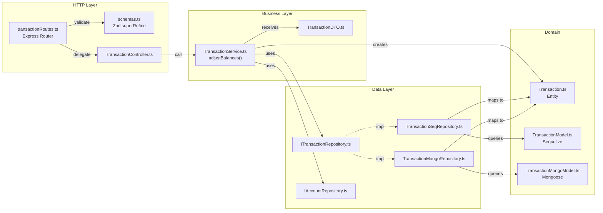

# Full Module Walkthrough: Transactions

## 1. What This Module Does and Why It Was Chosen

The Transactions module is the most representative module in the project. It was chosen because it demonstrates:

- Full vertical CRUD (entity → model → repository → service → controller → route)
- Cross-module dependency (TransactionService uses AccountRepository for balance adjustments)
- Complex validation with Zod `superRefine` (type-dependent required fields)
- Balance adjustment business logic with reversal on update/delete
- Dual database implementation (Sequelize + Mongoose)
- Pagination (offset + cursor)
- Ownership enforcement
- Comprehensive test suite with mock repositories

This walkthrough shows how each file was built and how they connect.

---

## 2. File Creation Walkthrough

### Step 1: Domain Entity

**File:** `src/domain/entities/Transaction.ts`

**Why:** The entity is the foundation — a plain TypeScript class representing a financial transaction. No framework dependencies.

**Where:** `src/domain/entities/` — all domain entities live here, isolated from HTTP and database concerns.

```typescript
import { TransactionType } from "../../shared/constants";

export interface TransactionProps {
  id?: string;
  type: TransactionType;
  amount: number;
  date: Date | string;
  categoryId?: string | null;
  description?: string | null;
  fromAccountId?: string | null;
  toAccountId?: string | null;
  userId: string;
  tags?: string | null;
  note?: string | null;
  createdAt?: Date;
  updatedAt?: Date;
}

export class Transaction {
  id: string;
  type: TransactionType;
  amount: number;
  date: Date;
  categoryId: string | null;
  description: string | null;
  fromAccountId: string | null;
  toAccountId: string | null;
  userId: string;
  tags: string | null;
  note: string | null;
  createdAt: Date;
  updatedAt: Date;

  constructor(props: TransactionProps) {
    this.id = props.id!;
    this.type = props.type;
    this.amount = props.amount;
    this.date = props.date instanceof Date ? props.date : new Date(props.date);
    this.categoryId = props.categoryId ?? null;
    this.description = props.description ?? null;
    this.fromAccountId = props.fromAccountId ?? null;
    this.toAccountId = props.toAccountId ?? null;
    this.userId = props.userId;
    this.tags = props.tags ?? null;
    this.note = props.note ?? null;
    this.createdAt = props.createdAt!;
    this.updatedAt = props.updatedAt!;
  }
}
```

**Key decisions:**

- `TransactionProps` interface defines constructor input — `id`, `createdAt`, `updatedAt` are optional because they're assigned by the database
- `date` accepts both `Date` and `string` for flexibility (API sends ISO strings, DB may return Date objects)
- Optional fields use `?? null` pattern for consistent null handling
- The entity only imports from `shared/constants` (type definitions) — no framework dependencies

---

### Step 2: DTOs

**File:** `src/app/dtos/TransactionDTO.ts`

**Why:** DTOs define the contract for data flowing into the service layer. Separate from the entity to avoid leaking internal fields.

**Where:** `src/app/dtos/` — all DTOs live in the application layer because they're HTTP-boundary concerns.

```typescript
import { TransactionType } from "../../shared/constants";

export interface CreateTransactionDTO {
  type: TransactionType;
  amount: number;
  date: Date;
  categoryId?: string | null;
  description?: string | null;
  fromAccountId?: string | null;
  toAccountId?: string | null;
  userId: string;
  tags?: string | null;
  note?: string | null;
}

export interface UpdateTransactionDTO {
  id?: string;
  type?: TransactionType;
  amount?: number;
  date?: Date;
  categoryId?: string | null;
  description?: string | null;
  fromAccountId?: string | null;
  toAccountId?: string | null;
  tags?: string | null;
  note?: string | null;
}
```

**Key decisions:**

- `CreateTransactionDTO` has `userId` as required — it's injected by the controller from `req.user`
- `UpdateTransactionDTO` has `id?` for the service to verify URL param matches body
- All fields in Update are optional — partial updates are supported

---

### Step 3: Sequelize Model

**File:** `src/domain/models/sequelize/TransactionModel.ts`

**Why:** Defines the MySQL table schema and relationships for the Transaction entity.

```typescript
import { DataTypes, Model, Sequelize } from "sequelize";
import { MODEL_NAMES, TRANSACTION_TYPES } from "../../../shared/constants";
import { CategoryModel } from "./CategoryModel";
import { AccountModel } from "./AccountModel";
import { UserModel } from "./UserModel";
import { v7 as uuidv7 } from "uuid";

export class TransactionModel extends Model {
  id!: string;
  type!: keyof typeof TRANSACTION_TYPES;
  amount!: number;
  date!: Date;
  categoryId?: string;
  description?: string;
  fromAccountId?: string;
  toAccountId?: string;
  userId!: string;
  tags?: string;
  note?: string;

  static associate() {
    TransactionModel.belongsTo(CategoryModel, {
      foreignKey: "categoryId",
      as: "category",
    });
    TransactionModel.belongsTo(AccountModel, {
      foreignKey: "fromAccountId",
      as: "fromAccount",
    });
    TransactionModel.belongsTo(AccountModel, {
      foreignKey: "toAccountId",
      as: "toAccount",
    });
    TransactionModel.belongsTo(UserModel, { foreignKey: "userId", as: "user" });
  }
}

export default (sequelize: Sequelize) => {
  TransactionModel.init(
    {
      id: {
        type: DataTypes.CHAR(36),
        defaultValue: () => uuidv7(),
        primaryKey: true,
      },
      type: { type: DataTypes.STRING, allowNull: false },
      amount: { type: DataTypes.DECIMAL(15, 2), allowNull: false },
      date: { type: DataTypes.DATE, allowNull: false },
      categoryId: { type: DataTypes.CHAR(36) },
      description: { type: DataTypes.STRING },
      fromAccountId: { type: DataTypes.CHAR(36) },
      toAccountId: { type: DataTypes.CHAR(36) },
      userId: { type: DataTypes.CHAR(36), allowNull: false },
      tags: { type: DataTypes.STRING(500) },
      note: { type: DataTypes.STRING(1000) },
    },
    { sequelize, modelName: MODEL_NAMES.TRANSACTION },
  );
  return TransactionModel;
};
```

**Key decisions:**

- UUID v7 default value via function (not a static value)
- `DECIMAL(15, 2)` for financial amounts — never use `FLOAT` for money
- `associate()` defines foreign keys to Category, Account (×2), and User
- The model file exports a default function that receives the Sequelize instance — this is the Sequelize pattern used in `src/domain/models/sequelize/index.ts`

---

### Step 4: Mongoose Model

**File:** `src/domain/models/mongoose/TransactionMongoModel.ts`

**Why:** Defines the MongoDB schema for the Transaction entity.

```typescript
import mongoose, { Schema } from "mongoose";
import {
  MODEL_NAMES,
  TRANSACTION_TYPES,
  TransactionType,
} from "../../../shared/constants";

export interface ITransactionDocument {
  _id: string;
  type: TransactionType;
  amount: number;
  date: Date;
  categoryId: string | null;
  description: string | null;
  fromAccountId: string | null;
  toAccountId: string | null;
  userId: string;
  tags: string | null;
  note: string | null;
  createdAt: Date;
  updatedAt: Date;
}

const TransactionSchema = new Schema<ITransactionDocument>(
  {
    _id: { type: String, required: true },
    type: {
      type: String,
      required: true,
      enum: Object.keys(TRANSACTION_TYPES),
    },
    amount: { type: Number, required: true },
    date: { type: Date, required: true },
    categoryId: { type: String, default: null },
    description: { type: String, default: null },
    fromAccountId: { type: String, default: null },
    toAccountId: { type: String, default: null },
    userId: { type: String, required: true },
    tags: { type: String, default: null },
    note: { type: String, default: null },
  },
  { timestamps: true },
);

export const TransactionMongoModel = mongoose.model<ITransactionDocument>(
  MODEL_NAMES.TRANSACTION,
  TransactionSchema,
);
```

**Key decisions:**

- `_id` is a `String` (UUID v7) — not the default MongoDB ObjectId
- `timestamps: true` auto-manages `createdAt`/`updatedAt`
- `ITransactionDocument` interface matches the entity structure for consistent mapping
- `enum` validates `type` at the database level

---

### Step 5: Repository Interface

**File:** `src/domain/repositories/transaction/ITransactionRepository.ts`

**Why:** Defines the data access contract. The service depends on this interface, not on Sequelize or Mongoose.

```typescript
import { PaginatedResult, PaginationParams } from "../../../shared/pagination";
import { Transaction } from "../../entities/Transaction";
import { IRepository } from "../IRepository";

export interface ITransactionRepository extends IRepository<Transaction> {
  getAllByUserId(
    userId: string,
    pagination: PaginationParams,
  ): Promise<PaginatedResult<Transaction>>;
}
```

**Key decisions:**

- Extends `IRepository<Transaction>` for standard CRUD
- Adds `getAllByUserId()` for user-scoped queries
- Returns domain `Transaction` entities — never raw DB objects

---

### Step 6: Repository Implementations

Both implementations follow the same contract. The key pattern: map raw DB records to domain entities.

**Sequelize** (`src/domain/repositories/transaction/TransactionSeqRepository.ts`) — uses `result.toJSON()` → `new Transaction(...)`.

**Mongoose** (`src/domain/repositories/transaction/TransactionMongoRepository.ts`) — uses `.lean()` queries → private `toEntity()` mapper → `new Transaction(...)`. Generates UUID v7 for `_id` on `create()`.

Both include `paginatedFindAll()`/`paginatedFind()` private methods supporting cursor and offset pagination.

---

### Step 7: Register in Factory

**Files modified:**

`src/app/factories/providers/sequelizeProvider.ts`:

```typescript
factory.register("transaction", () => new TransactionSeqRepository());
```

`src/app/factories/providers/mongoProvider.ts`:

```typescript
factory.register("transaction", () => new TransactionMongoRepository());
```

`src/app/factories/RepositoryFactory.ts`:

```typescript
getTransactionRepository(): ITransactionRepository {
  return this.getRepository<ITransactionRepository>(REPO_KEYS.TRANSACTION);
}
```

---

### Step 8: Service

**File:** `src/app/services/TransactionService.ts`

**Why:** Contains the core business logic — balance adjustments, ownership checks, CRUD orchestration.

The unique aspect of this service is the `adjustBalances()` private method:

```typescript
private async adjustBalances(
  transaction: Transaction,
  direction: 1 | -1,
): Promise<void> {
  const { type, amount, fromAccountId, toAccountId } = transaction;

  const adjustAccount = async (accountId: string, sign: number): Promise<void> => {
    const account = await this.accountRepo.getById(accountId);
    if (!account) {
      if (direction === 1) {
        throw new ApiError("NotFound",
          sign < 0 ? "Source account not found" : "Destination account not found");
      }
      return; // On reversal (-1), missing accounts are silently skipped
    }
    await this.accountRepo.update(accountId, {
      balance: Number(account.balance) + Number(amount) * sign * direction,
    });
  };

  if (type === "EXPENSE" && fromAccountId) await adjustAccount(fromAccountId, -1);
  if (type === "INCOME" && toAccountId) await adjustAccount(toAccountId, 1);
  if (type === "TRANSFER") {
    if (fromAccountId) await adjustAccount(fromAccountId, -1);
    if (toAccountId) await adjustAccount(toAccountId, 1);
  }
}
```

**Key decisions:**

- `direction` parameter: `1` for apply (create), `-1` for reverse (update/delete)
- On reversal, missing accounts are silently skipped (the account may have been deleted)
- On apply, missing accounts throw NotFound
- The service takes **two** repository interfaces: `ITransactionRepository` and `IAccountRepository`

---

### Step 9: Controller

**File:** `src/app/controllers/TransactionController.ts`

```typescript
import { Request, Response } from "express";
import { TransactionService } from "../services/TransactionService";
import repositoryFactory from "../factories/RepositoryFactory";
import { extractPagination } from "../../shared/pagination";

const transactionService = new TransactionService(
  repositoryFactory.getTransactionRepository(),
  repositoryFactory.getAccountRepository(),
);

export class TransactionController {
  static getAllTransactions = async (req: Request, res: Response) => {
    const userId = req.user!.userId;
    const result = await transactionService.getAllTransactions(
      userId,
      extractPagination(req),
    );
    res.status(200).json(result);
  };

  static getTransactionById = async (req: Request, res: Response) => {
    const userId = req.user!.userId;
    const transaction = await transactionService.getTransactionById(
      req.params.id as string,
      userId,
    );
    res.status(200).json(transaction);
  };

  static createTransaction = async (req: Request, res: Response) => {
    const userId = req.user!.userId;
    const newTransaction = await transactionService.createTransaction({
      ...req.body,
      userId,
    });
    res.status(201).json(newTransaction);
  };

  static updateTransaction = async (req: Request, res: Response) => {
    const userId = req.user!.userId;
    const id = req.params.id as string;
    const updatedTransaction = await transactionService.updateTransaction(
      id,
      req.body,
      userId,
    );
    res.status(200).json(updatedTransaction);
  };

  static deleteTransaction = async (req: Request, res: Response) => {
    const userId = req.user!.userId;
    await transactionService.deleteTransaction(req.params.id as string, userId);
    res.status(204).send();
  };
}
```

**Key decisions:**

- Service is instantiated at module level with factory-provided repositories
- `userId` is **always** extracted from `req.user!.userId`, never from the request body
- Controller never adjusts balances or checks ownership — that's the service's job
- `{ ...req.body, userId }` merges the authenticated user's ID into the request body

---

### Step 10: Validation Schemas

**File:** `src/app/validation/schemas.ts` (additions)

The transaction create schema uses Zod's `superRefine` for type-dependent validation:

```typescript
export const createTransactionSchema = z.object({
  body: z.object({
    type: z.enum(transactionTypeValues, { ... }),
    amount: z.number().positive("Amount must be greater than 0"),
    date: z.string().datetime({ message: "Date must be a valid ISO 8601 date" }),
    categoryId: z.string().uuid("categoryId must be a valid UUID").optional().nullable(),
    description: z.string().max(255).optional().nullable(),
    fromAccountId: z.string().uuid("fromAccountId must be a valid UUID").optional().nullable(),
    toAccountId: z.string().uuid("toAccountId must be a valid UUID").optional().nullable(),
    tags: z.string().max(500).optional().nullable(),
    note: z.string().max(1000).optional().nullable(),
  }).superRefine((data, ctx) => {
    if (data.type === "EXPENSE" && !data.fromAccountId) {
      ctx.addIssue({ code: z.ZodIssueCode.custom, message: "fromAccountId is required for expense transactions", path: ["fromAccountId"] });
    }
    if (data.type === "INCOME" && !data.toAccountId) {
      ctx.addIssue({ code: z.ZodIssueCode.custom, message: "toAccountId is required for income transactions", path: ["toAccountId"] });
    }
    if (data.type === "TRANSFER") {
      if (!data.fromAccountId) { ctx.addIssue({ ... }); }
      if (!data.toAccountId) { ctx.addIssue({ ... }); }
      if (data.fromAccountId && data.toAccountId && data.fromAccountId === data.toAccountId) {
        ctx.addIssue({ ..., message: "fromAccountId and toAccountId must be different" });
      }
    }
  }),
});
```

**Key decisions:**

- `superRefine` enables cross-field validation that depends on the `type` value
- All IDs are validated as UUIDs
- `amount` must be positive (not zero or negative)
- TRANSFER validates that source and destination are different accounts

---

### Step 11: Routes (with OpenAPI)

**File:** `src/app/routes/transactionRoutes.ts`

Each route has a JSDoc `@openapi` block for Swagger documentation, followed by the validation middleware and controller method.

```typescript
const router = Router();

router.get(
  "/",
  validate(paginationQuerySchema),
  TransactionController.getAllTransactions,
);
router.post(
  "/",
  validate(createTransactionSchema),
  TransactionController.createTransaction,
);
router.get(
  "/:id",
  validate(idParamSchema),
  TransactionController.getTransactionById,
);
router.put(
  "/:id",
  validate(updateTransactionSchema),
  TransactionController.updateTransaction,
);
router.delete(
  "/:id",
  validate(idParamSchema),
  TransactionController.deleteTransaction,
);

export default router;
```

**Registration in `src/app.ts`:**

```typescript
app.use(authMiddleware); // JWT required for everything below
app.use("/transactions", transactionRoutes);
```

---

## 3. How the Pieces Connect



---

## 4. Validation

Validation happens in two places:

1. **Request-level validation** (Zod in `schemas.ts`): Validates data shape, types, and cross-field constraints **before** the request reaches the controller. Returns 400 on failure.

2. **Business-level validation** (Service): Validates business rules like ownership, account existence, and ID mismatches. Throws `ApiError` caught by the error middleware.

---

## 5. Error Handling

| Scenario                     | Where                    | Error Thrown                   |
| ---------------------------- | ------------------------ | ------------------------------ |
| Invalid request data         | Validation middleware    | 400 ValidationError (Zod)      |
| Transaction not found        | Service                  | 404 NotFoundError (ApiError)   |
| User doesn't own transaction | Service                  | 403 ForbiddenError (ApiError)  |
| Source account not found     | Service (adjustBalances) | 404 NotFoundError (ApiError)   |
| ID mismatch (URL vs body)    | Service                  | 400 BadRequestError (ApiError) |
| Duplicate key (DB)           | Error middleware         | 409 ConflictError              |

---

## 6. Testing

**File:** `src/__tests__/services/TransactionService.test.ts`

The test file demonstrates:

1. **Mocking constants** (must be first):

```typescript
jest.mock("../../shared/constants", () => ({ ENVIRONMENT: { ... }, ... }));
```

2. **Creating mock repositories:**

```typescript
const createMockTransactionRepo = (): jest.Mocked<ITransactionRepository> => ({
  getAll: jest.fn(),
  getAllByUserId: jest.fn(),
  getById: jest.fn(),
  create: jest.fn(),
  update: jest.fn(),
  delete: jest.fn(),
});
```

3. **Testing balance adjustments:**

```typescript
it("should create an expense and subtract from source account", async () => {
  const account = makeAccount({ id: "acct-1", balance: 1000 });
  acctRepo.getById.mockResolvedValue(account);
  txRepo.create.mockResolvedValue(storedExpense);

  await service.createTransaction(validExpense);

  expect(acctRepo.update).toHaveBeenCalledWith("acct-1", { balance: 900 });
});
```

4. **Testing error conditions:**

```typescript
it("should throw when source account not found", async () => {
  acctRepo.getById.mockResolvedValue(null);
  await expect(service.createTransaction(validExpense)).rejects.toThrow(
    "Source account not found",
  );
});
```

---

## 7. What NOT to Do

- **Do NOT adjust account balances in the controller** — all balance logic is in `TransactionService.adjustBalances()`
- **Do NOT skip balance reversal on update/delete** — this will cause balance drift
- **Do NOT allow TRANSFER with same source and destination** — Zod validation prevents this, but never bypass it
- **Do NOT use FLOAT for monetary amounts** — Sequelize model uses `DECIMAL(15, 2)`
- **Do NOT create transactions without validating account existence** — the service checks this
- **Do NOT call `TransactionService` from other services** — if balance logic needs reuse, extract it

---

## 8. Checklist for Replication

When building a new module following this pattern:

- [ ] Domain entity in `src/domain/entities/`
- [ ] DTOs in `src/app/dtos/`
- [ ] Sequelize model in `src/domain/models/sequelize/`
- [ ] Mongoose model in `src/domain/models/mongoose/`
- [ ] Model added to `MODEL_NAMES` in `src/shared/constants.ts`
- [ ] Sequelize model re-exported from `src/domain/models/sequelize/models.ts`
- [ ] Repository interface in `src/domain/repositories/[entity]/`
- [ ] Sequelize repository implementation
- [ ] Mongoose repository implementation
- [ ] Registered in both providers (`sequelizeProvider.ts`, `mongoProvider.ts`)
- [ ] Typed getter added to `RepositoryFactory`
- [ ] Key added to `REPO_KEYS`
- [ ] Service in `src/app/services/`
- [ ] Controller in `src/app/controllers/`
- [ ] Validation schemas in `src/app/validation/schemas.ts`
- [ ] Routes in `src/app/routes/` with OpenAPI annotations
- [ ] Routes registered in `src/app.ts`
- [ ] Migration file in `src/database/migrations/`
- [ ] Unit tests in `src/__tests__/services/`
- [ ] Entity tests in `src/__tests__/entities/`
- [ ] Module documentation in `docs/modules/`
- [ ] `docs/_index.json` updated if new doc files created
