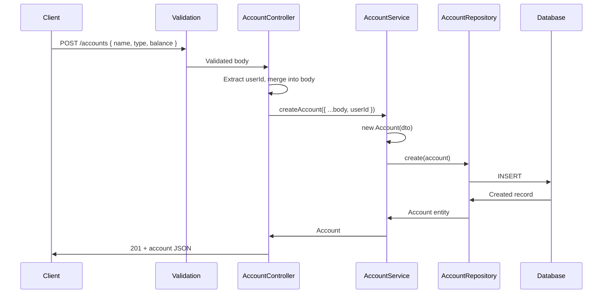

# Accounts Module

## What This Module Does

Manages financial accounts for a user. Each account has a name, type (CASH, ACCOUNT, CARD, DEBIT_CARD, SAVINGS, INVESTMENT, OVERDRAFT, LOAN, OTHER), and a balance. Balances are adjusted automatically by the Transactions module when transactions are created, updated, or deleted. Users can only access their own accounts.

## Files and Responsibilities

| File                                                        | Role                                                           |
| ----------------------------------------------------------- | -------------------------------------------------------------- |
| `src/app/routes/accountRoutes.ts`                           | Route definitions with OpenAPI docs (full CRUD at `/accounts`) |
| `src/app/controllers/AccountController.ts`                  | Thin HTTP handler, delegates to AccountService                 |
| `src/app/services/AccountService.ts`                        | Business logic: ownership checks, CRUD operations              |
| `src/app/dtos/AccountDTO.ts`                                | `CreateAccountDTO`, `UpdateAccountDTO`                         |
| `src/app/validation/schemas.ts`                             | `createAccountSchema`, `updateAccountSchema`                   |
| `src/domain/entities/Account.ts`                            | Account domain entity                                          |
| `src/domain/repositories/account/IAccountRepository.ts`     | Repository interface                                           |
| `src/domain/repositories/account/AccountSeqRepository.ts`   | Sequelize implementation                                       |
| `src/domain/repositories/account/AccountMongoRepository.ts` | Mongoose implementation                                        |
| `src/domain/models/sequelize/AccountModel.ts`               | Sequelize model                                                |
| `src/domain/models/mongoose/AccountMongoModel.ts`           | Mongoose model                                                 |

## Public API

### `GET /accounts`

Get all accounts for the authenticated user (paginated).

### `POST /accounts`

Create a new account. Requires: `name`, `type`. Optional: `balance` (defaults to 0).

### `GET /accounts/:id`

Get a single account by ID. Ownership enforced.

### `PUT /accounts/:id`

Update an account. Partial updates supported (name, type). Balance cannot be modified directly — it is adjusted automatically through transactions.

### `DELETE /accounts/:id`

Delete an account. Ownership enforced.

## Internal Flow

## Dependencies

**Imports:** `shared/errors`, `shared/pagination`, `domain/entities/Account`, `domain/repositories/account/IAccountRepository`, DTOs

**Imported by:**

- Account routes registered in `src/app.ts`
- `TransactionService` imports `IAccountRepository` for balance adjustments

## Environment Variables

None specific to this module.

## Error States

| Error             | Status | Condition                                        |
| ----------------- | ------ | ------------------------------------------------ |
| `NotFoundError`   | 404    | Account ID does not exist                        |
| `ForbiddenError`  | 403    | Account belongs to another user                  |
| `BadRequestError` | 400    | ID mismatch between URL param and body           |
| `ValidationError` | 400    | Invalid input (bad type, missing name, etc.)     |
| `ConflictError`   | 409    | Duplicate account name (if DB constraint exists) |

## Account Types

Defined in `src/shared/constants.ts` → `ACCOUNT_TYPES`:

| Type         | Description        |
| ------------ | ------------------ |
| `CASH`       | Physical cash      |
| `ACCOUNT`    | Bank account       |
| `CARD`       | Credit card        |
| `DEBIT_CARD` | Debit card         |
| `SAVINGS`    | Savings account    |
| `INVESTMENT` | Investment account |
| `OVERDRAFT`  | Overdraft facility |
| `LOAN`       | Loan account       |
| `OTHER`      | Other account type |

## How to Extend

- To add a new account type: add it to `ACCOUNT_TYPES` in `src/shared/constants.ts`, update validation schema `accountTypeValues`, add migration if needed
- To add account-level limits: add fields to entity/model, add validation in `AccountService`
- Balance is modified by `TransactionService` — do not add balance modification logic to this module
