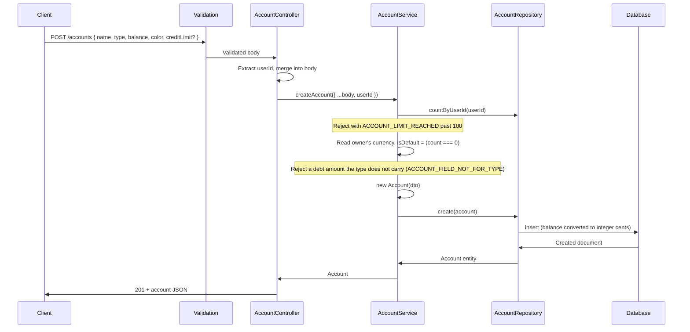

# Accounts Module

## What This Module Does

Manages financial accounts for a user. Each account has a name, type (CASH, ACCOUNT, CARD, DEBIT_CARD, SAVINGS, INVESTMENT, OVERDRAFT, LOAN, OTHER), an optional color, and a balance. Balances are adjusted automatically by the Transactions module when transactions are created, updated, or deleted. Users can only access their own accounts.

Two server-managed properties matter to clients:

- **`currency`** — ISO 4217, stamped from the owner's currency at creation. Never accepted from the client (mono-currency mode).
- **`isDefault`** — the first account a user creates becomes the default; quick-add transactions fall back to it. Exactly one active account per user can be default.

Two optional amounts belong to the account types that have them, and to no other:

- **`creditLimit`** — CARD and OVERDRAFT.
- **`borrowedAmount`** — LOAN. It exists because `openingBalance` is the balance the day the account was created, not what was borrowed: a loan tracked from halfway through cannot otherwise say what its progress is a fraction of.

Both are absent until someone sets them, both are decimals like every other amount, and both follow the owner's currency precision. Sending one on a type that has no such field is **400 `ACCOUNT_FIELD_NOT_FOR_TYPE`**, and so is a type change that would leave one behind — the same write has to clear it with `null`. Nothing is dropped silently.

Accounts are **archived**, not deleted: `DELETE` sets `archivedAt` and `POST /accounts/:id/restore` brings them back. There are no hard deletes.

## Files and Responsibilities

| File                                                          | Role                                                                           |
| ------------------------------------------------------------- | ------------------------------------------------------------------------------ |
| `src/app/routes/accountRoutes.ts`                             | Route definitions with OpenAPI docs (CRUD at `/accounts` + restore and default) |
| `src/app/controllers/AccountController.ts`                    | Thin HTTP handler, delegates to AccountService                                  |
| `src/app/services/AccountService.ts`                          | Business logic: ownership checks, archive/restore, default handling, per-user cap |
| `src/app/dtos/AccountDTO.ts`                                  | `CreateAccountDTO`, `UpdateAccountDTO`                                          |
| `src/app/validation/schemas.ts`                               | `createAccountSchema`, `updateAccountSchema`, `paginationQuerySchema`           |
| `src/domain/entities/Account.ts`                              | Account domain entity                                                           |
| `src/domain/repositories/account/IAccountRepository.ts`       | Repository interface                                                            |
| `src/infrastructure/repositories/account/AccountRepository.ts` | Mongoose implementation (cents ↔ decimal, atomic `incrementBalance`)            |
| `src/infrastructure/models/AccountModel.ts`                   | Mongoose model and indexes                                                      |

## Public API

### `GET /accounts`

Get all accounts for the authenticated user (paginated, offset + cursor).

| Parameter         | Type   | Description                                                      |
| ----------------- | ------ | ---------------------------------------------------------------- |
| `limit`           | number | 1–100, default 20                                                |
| `offset`          | number | Items to skip (offset pagination)                                |
| `cursor`          | string | Last ID of the previous page (overrides `offset`)                |
| `ids`             | string | Comma-separated list of account UUIDs (1–100)                    |
| `includeArchived` | enum   | `"true"` also returns archived accounts (hidden by default)      |

> A `cursor` has to name a row the caller owns. One that names none is `400 INVALID_CURSOR`, never a silent page one — that fallback used to restart the list from the top and make an infinite scroll repeat itself. `hasMore` is read from one row past the page, so a last page that is exactly `limit` long says `hasMore: false` and `nextCursor: null`.

### `POST /accounts`

Create a new account. Requires: `name`, `type`. Optional: `balance` (defaults to 0, becomes the immutable `openingBalance`), `color`, and the debt amount of its type — `creditLimit` (CARD, OVERDRAFT) or `borrowedAmount` (LOAN), both greater than zero.

The server sets `currency` from the owner's currency and marks the **first** account as default. A user is capped at 100 accounts (`ACCOUNT_LIMIT_REACHED`).

**Client-minted `id` (optional).** An offline client can mint the UUID itself and send it as `id`; the server never replaces it. An id the user already owns replays with **200** and the stored account **whatever the payload says now** — the row may have been edited from another device between a lost response and the retry, and a 409 there would make the client mint a second id and duplicate it. An id that belongs to **another user** is rejected with **409 `ID_TAKEN`**, worded so the caller cannot tell it exists; the foreign document is never read. Without `id` the behaviour is unchanged: the server mints one and answers `201`.

Active account names are **unique per user**, enforced by a partial unique index on `(userId, name)` with collation `es` strength 2: `"Efectivo"` and `"efectivo"` collide (accents stay distinct), names are trimmed before storing, and the user's capitalisation is preserved. Archiving an account **frees its name**, so the same one can be used again. A collision — on create, on rename, or on restoring an account whose name was taken meanwhile — answers **409 `DUPLICATE`**.

### `GET /accounts/:id`

Get a single account by ID. Archived accounts stay readable here (`archivedAt` tells them apart); only the listing hides them.

### `PUT /accounts/:id`

Update an account. Partial updates supported (`name`, `type`, `color`, `creditLimit`, `borrowedAmount`). At least one field must be present. Balance cannot be modified directly — it is adjusted automatically through transactions. Archived accounts are not writable (`RESOURCE_ARCHIVED`).

`color`, `creditLimit` and `borrowedAmount` accept `null` to clear them. The debt amounts are judged on the state the write leaves behind, not on what it sends: turning a CARD that carries a `creditLimit` into a CASH account is **400 `ACCOUNT_FIELD_NOT_FOR_TYPE`** unless the same request sends `creditLimit: null`.

### `DELETE /accounts/:id`

Archive the account (soft delete, sets `archivedAt`). Allowed even when transactions reference it; those transactions keep pointing at it. Idempotent — archiving an already-archived account is a no-op success. **Answers the archived account** (the same `Account` view as `GET`), so a client that queued a restore or a rename right behind the archive has the new `updatedAt` for its `If-Match` without a read in between (F-22).

The **default account cannot be archived** (`DEFAULT_ACCOUNT_ARCHIVE_BLOCKED`); promote another account first.

### `POST /accounts/:id/restore`

Un-archive an account. Idempotent: restoring an already-active account returns it unchanged.

### `POST /accounts/:id/default`

Mark the account as the user's default. Runs in a MongoDB transaction that demotes the previous default, backed by a unique partial index on `{ userId }` restricted to `{ isDefault: true, archivedAt: null }` — at most one active default per user.

## Internal Flow

## Dependencies

**Imports:** `shared/errors`, `shared/pagination`, `shared/currency`, `domain/entities/Account`, `domain/repositories/account/IAccountRepository`, `domain/repositories/user/IUserRepository` (to read the owner's currency), DTOs

**Imported by:**

- Account routes registered in `src/app.ts` at `/accounts`, after `authMiddleware`
- `TransactionService` imports `IAccountRepository` for balance adjustments
- `UserService` imports `IAccountRepository` to decide whether the currency is still changeable

## Environment Variables

None specific to this module.

## Error States

| Error / code                       | Status | Condition                                                       |
| ---------------------------------- | ------ | --------------------------------------------------------------- |
| `ValidationError`                  | 400    | Invalid input (bad type, missing name, unknown color, …)         |
| `BadRequest`                       | 400    | ID mismatch between URL param and body                           |
| `ACCOUNT_LIMIT_REACHED`            | 400    | The user already has 100 accounts                                |
| `RESOURCE_ARCHIVED`                | 400    | Updating an archived account                                     |
| `ACCOUNT_FIELD_NOT_FOR_TYPE`       | 400    | A debt amount on a type that has no such field, or a type change that would orphan one |
| `AMOUNT_PRECISION`                 | 400    | `balance`, `creditLimit` or `borrowedAmount` with more decimals than the currency has |
| `DEFAULT_ACCOUNT_ARCHIVE_BLOCKED`  | 400    | Archiving the default account                                    |
| `Unauthorized`                     | 401    | Missing, invalid or expired access token                         |
| `NotFound`                         | 404    | Account missing **or owned by another user**                     |
| `DUPLICATE`                        | 409    | An active account already uses this name (case-insensitive)      |
| `ID_TAKEN`                         | 409    | The client-minted `id` belongs to another user (the user's own id always replays with 200) |
| `STALE_UPDATE`                     | 409    | `If-Match` no longer matches the stored version (`current` carries the server's copy) |

> Foreign accounts return **404, not 403** — the response is uniform for "missing" and "not yours" so account ids cannot be probed.

## Optimistic concurrency (`If-Match`)

Every write below accepts an optional `If-Match` header carrying the `updatedAt`
this client last read, verbatim as the API prints it
(`2026-09-03T18:00:00.000Z`; an ISO 8601 datetime with an offset is also
accepted, a bare date is not — that is `400 VALIDATION`).

`PUT /accounts/:id` · `DELETE /accounts/:id` · `POST /accounts/:id/restore` · `POST /accounts/:id/default`

The write only lands if the server still holds that version. Otherwise the answer
is **409 `STALE_UPDATE`**, and its body carries `current`: the account as the server
has it now, in the same shape a `GET` would return — so a client can show
"Server / This device" without a second request.

Two rules worth knowing:

- **The condition travels inside the write's own filter**, not only in a check
  before it. Two clients holding the same version cannot both win.
- **`STALE_UPDATE` outranks `RESOURCE_ARCHIVED` and the other write guards.** A
  caller writing against an old version cannot know about a state it has not
  read yet; re-reading tells it everything at once.

Without the header nothing changes: the write is unconditional, exactly as before.

## Account Types

Defined in `src/shared/constants.ts` → `ACCOUNT_TYPES`:

| Type         | Description        |
| ------------ | ------------------ |
| `CASH`       | Physical cash      |
| `ACCOUNT`    | Bank account       |
| `CARD`       | Credit card        |
| `DEBIT_CARD` | Debit card         |
| `SAVINGS`    | Savings account    |
| `INVESTMENT` | Investment account |
| `OVERDRAFT`  | Overdraft facility |
| `LOAN`       | Loan account       |
| `OTHER`      | Other account type |

## Money Representation

The API speaks **decimals** (max 2 decimal places); MongoDB stores **integer cents**. `AccountRepository` converts `balance` and `openingBalance` at the persistence boundary, and balance updates go through an atomic `$inc` (`incrementBalance()`) rather than read-modify-write, so concurrent transactions cannot lose an update.

`creditLimit` and `borrowedAmount` convert the same way and are stored as integer cents too; a cleared one reads back as **absent**, never as `null` or `0`.

`openingBalance` is the balance at creation and is fixed thereafter — it exists so a future integrity check can compare the stored balance against `openingBalance` plus the aggregated transaction effects.

## Cards carried in positive (repaired on 2026-09-17)

The owner kept his credit cards with the balance set to the credit limit, so the balance read as
money he did not have and a card payment had been recorded as an `INCOME`. A single-use script
(`scripts/fix-card-baseline/`, T-90) repaired his user on **2026-09-17** and was deleted with the
same commit, as agreed: it is not something to run twice.

What it left in the data, for anyone reading those rows later: the income onto the card became a
one-sided `ADJUSTMENT` — the balance stayed where it was and it stopped counting as money earned,
which is the same shape the pay sheet writes when the money came from outside — and the credit limit
came off the balance as a second `ADJUSTMENT` described **"Credit limit removed from balance"**.
Both are ordinary ledger rows, not balance writes, so `openingBalance` plus the transaction effects
still adds up and undoing either one is deleting it.

## How to Extend

- To add a new account type: add it to `ACCOUNT_TYPES` in `src/shared/constants.ts` — the validation schema derives `accountTypeValues` from it automatically
- To move a debt field between types: `DEBT_ACCOUNT_FIELDS` in `src/shared/constants.ts` maps each field to the types that carry it, and the service guard, the OpenAPI description and the repository conversion all read it from there. Taking a type out of that map makes every stored amount on that type unwritable until it is cleared, so it needs a migration, not just an edit
- To add a debt field of its own: the map is only the pairing — the name itself is written in the Zod schemas, the DTOs, the entity, the Mongoose model, `AccountWrite` and the service guard, and all of them have to gain it
- Balance is modified by `TransactionService` via `incrementBalance()` — do not add balance modification logic to this module, and never write `balance` through `update()`
- Multi-currency: `currency` is already stored per account and asserted on every balance adjustment (`CURRENCY_MISMATCH`); the missing pieces are a minor-units table and FX at transfer time

### Restoring under a different name

`POST /accounts/:id/restore` accepts an optional `{ name }`. Archiving frees a
name, so by the time you restore, another account may hold it — and then restore
answers **409 `DUPLICATE`** while `PUT` refuses the archived row with
**400 `RESOURCE_ARCHIVED`**. Without a way to rename on the way out, the only
escape was to go and rename the *other* account first.

The rename happens in the same write that clears `archivedAt`, so the unique
index judges the final state and nobody can take the name in between.
