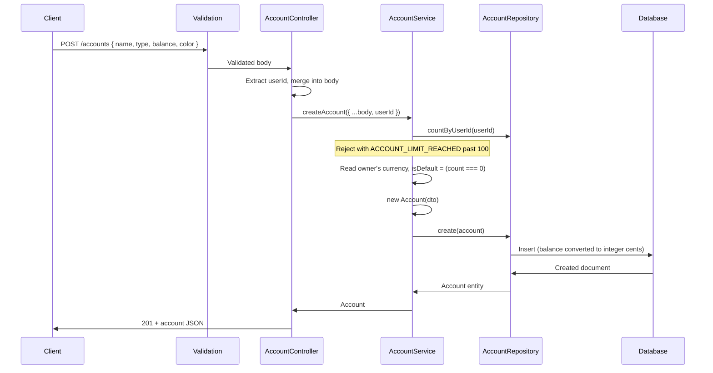

# Accounts Module

## What This Module Does

Manages financial accounts for a user. Each account has a name, type (CASH, ACCOUNT, CARD, DEBIT_CARD, SAVINGS, INVESTMENT, OVERDRAFT, LOAN, OTHER), an optional color, and a balance. Balances are adjusted automatically by the Transactions module when transactions are created, updated, or deleted. Users can only access their own accounts.

Two server-managed properties matter to clients:

- **`currency`** — ISO 4217, stamped from the owner's currency at creation. Never accepted from the client (mono-currency mode).
- **`isDefault`** — the first account a user creates becomes the default; quick-add transactions fall back to it. Exactly one active account per user can be default.

Accounts are **archived**, not deleted: `DELETE` sets `archivedAt` and `POST /accounts/:id/restore` brings them back. There are no hard deletes.

## Files and Responsibilities

| File                                                          | Role                                                                           |
| ------------------------------------------------------------- | ------------------------------------------------------------------------------ |
| `src/app/routes/accountRoutes.ts`                             | Route definitions with OpenAPI docs (CRUD at `/accounts` + restore and default) |
| `src/app/controllers/AccountController.ts`                    | Thin HTTP handler, delegates to AccountService                                  |
| `src/app/services/AccountService.ts`                          | Business logic: ownership checks, archive/restore, default handling, per-user cap |
| `src/app/dtos/AccountDTO.ts`                                  | `CreateAccountDTO`, `UpdateAccountDTO`                                          |
| `src/app/validation/schemas.ts`                               | `createAccountSchema`, `updateAccountSchema`, `paginationQuerySchema`           |
| `src/domain/entities/Account.ts`                              | Account domain entity                                                           |
| `src/domain/repositories/account/IAccountRepository.ts`       | Repository interface                                                            |
| `src/infrastructure/repositories/account/AccountRepository.ts` | Mongoose implementation (cents ↔ decimal, atomic `incrementBalance`)            |
| `src/infrastructure/models/AccountModel.ts`                   | Mongoose model and indexes                                                      |

## Public API

### `GET /accounts`

Get all accounts for the authenticated user (paginated, offset + cursor).

| Parameter         | Type   | Description                                                      |
| ----------------- | ------ | ---------------------------------------------------------------- |
| `limit`           | number | 1–100, default 20                                                |
| `offset`          | number | Items to skip (offset pagination)                                |
| `cursor`          | string | Last ID of the previous page (overrides `offset`)                |
| `ids`             | string | Comma-separated list of account UUIDs (1–100)                    |
| `includeArchived` | enum   | `"true"` also returns archived accounts (hidden by default)      |

### `POST /accounts`

Create a new account. Requires: `name`, `type`. Optional: `balance` (defaults to 0, becomes the immutable `openingBalance`) and `color`.

The server sets `currency` from the owner's currency and marks the **first** account as default. A user is capped at 100 accounts (`ACCOUNT_LIMIT_REACHED`).

Active account names are **unique per user**, enforced by a partial unique index on `(userId, name)` with collation `es` strength 2: `"Efectivo"` and `"efectivo"` collide (accents stay distinct), names are trimmed before storing, and the user's capitalisation is preserved. Archiving an account **frees its name**, so the same one can be used again. A collision — on create, on rename, or on restoring an account whose name was taken meanwhile — answers **409 `DUPLICATE`**.

### `GET /accounts/:id`

Get a single account by ID. Archived accounts stay readable here (`archivedAt` tells them apart); only the listing hides them.

### `PUT /accounts/:id`

Update an account. Partial updates supported (`name`, `type`, `color`). At least one field must be present. Balance cannot be modified directly — it is adjusted automatically through transactions. Archived accounts are not writable (`RESOURCE_ARCHIVED`).

### `DELETE /accounts/:id`

Archive the account (soft delete, sets `archivedAt`). Allowed even when transactions reference it; those transactions keep pointing at it. Idempotent — archiving an already-archived account is a no-op success.

The **default account cannot be archived** (`DEFAULT_ACCOUNT_ARCHIVE_BLOCKED`); promote another account first.

### `POST /accounts/:id/restore`

Un-archive an account. Idempotent: restoring an already-active account returns it unchanged.

### `POST /accounts/:id/default`

Mark the account as the user's default. Runs in a MongoDB transaction that demotes the previous default, backed by a unique partial index on `{ userId }` restricted to `{ isDefault: true, archivedAt: null }` — at most one active default per user.

## Internal Flow

## Dependencies

**Imports:** `shared/errors`, `shared/pagination`, `shared/currency`, `domain/entities/Account`, `domain/repositories/account/IAccountRepository`, `domain/repositories/user/IUserRepository` (to read the owner's currency), DTOs

**Imported by:**

- Account routes registered in `src/app.ts` at `/accounts`, after `authMiddleware`
- `TransactionService` imports `IAccountRepository` for balance adjustments
- `UserService` imports `IAccountRepository` to decide whether the currency is still changeable

## Environment Variables

None specific to this module.

## Error States

| Error / code                       | Status | Condition                                                       |
| ---------------------------------- | ------ | --------------------------------------------------------------- |
| `ValidationError`                  | 400    | Invalid input (bad type, missing name, unknown color, …)         |
| `BadRequest`                       | 400    | ID mismatch between URL param and body                           |
| `ACCOUNT_LIMIT_REACHED`            | 400    | The user already has 100 accounts                                |
| `RESOURCE_ARCHIVED`                | 400    | Updating an archived account                                     |
| `DEFAULT_ACCOUNT_ARCHIVE_BLOCKED`  | 400    | Archiving the default account                                    |
| `Unauthorized`                     | 401    | Missing, invalid or expired access token                         |
| `NotFound`                         | 404    | Account missing **or owned by another user**                     |
| `DUPLICATE`                        | 409    | An active account already uses this name (case-insensitive)      |

> Foreign accounts return **404, not 403** — the response is uniform for "missing" and "not yours" so account ids cannot be probed.

## Account Types

Defined in `src/shared/constants.ts` → `ACCOUNT_TYPES`:

| Type         | Description        |
| ------------ | ------------------ |
| `CASH`       | Physical cash      |
| `ACCOUNT`    | Bank account       |
| `CARD`       | Credit card        |
| `DEBIT_CARD` | Debit card         |
| `SAVINGS`    | Savings account    |
| `INVESTMENT` | Investment account |
| `OVERDRAFT`  | Overdraft facility |
| `LOAN`       | Loan account       |
| `OTHER`      | Other account type |

## Money Representation

The API speaks **decimals** (max 2 decimal places); MongoDB stores **integer cents**. `AccountRepository` converts `balance` and `openingBalance` at the persistence boundary, and balance updates go through an atomic `$inc` (`incrementBalance()`) rather than read-modify-write, so concurrent transactions cannot lose an update.

`openingBalance` is the balance at creation and is fixed thereafter — it exists so a future integrity check can compare the stored balance against `openingBalance` plus the aggregated transaction effects.

## How to Extend

- To add a new account type: add it to `ACCOUNT_TYPES` in `src/shared/constants.ts` — the validation schema derives `accountTypeValues` from it automatically
- To add account-level limits: add fields to entity/model, add validation in `AccountService`
- Balance is modified by `TransactionService` via `incrementBalance()` — do not add balance modification logic to this module, and never write `balance` through `update()`
- Multi-currency: `currency` is already stored per account and asserted on every balance adjustment (`CURRENCY_MISMATCH`); the missing pieces are a minor-units table and FX at transfer time
