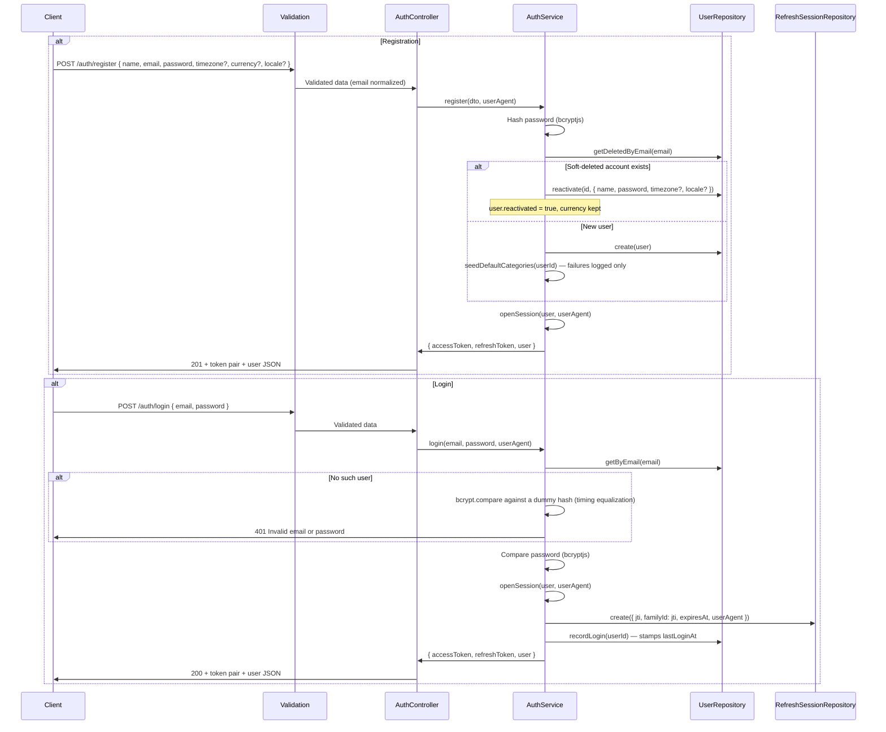
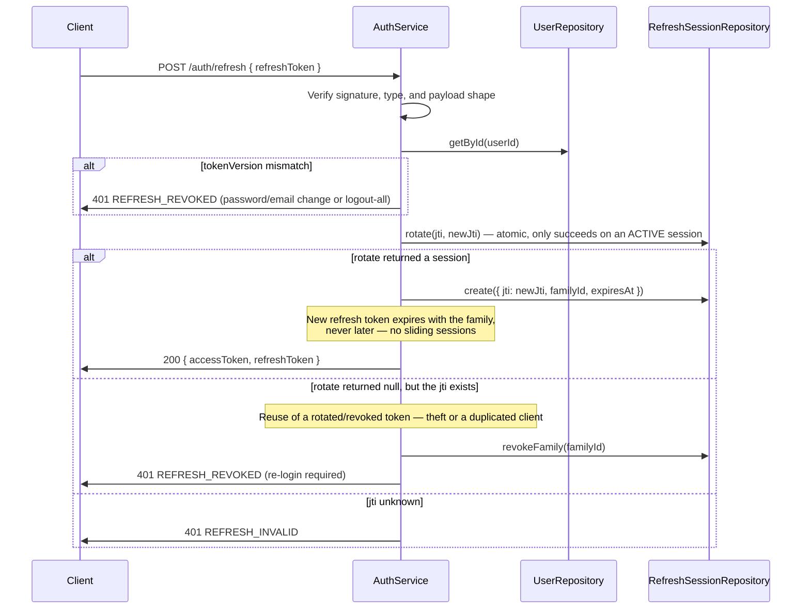

# Auth Module

## What This Module Does

Handles registration, login, and the full refresh-token session lifecycle. Registration and login are public; session management requires an access token.

Every successful register or login issues a **token pair**:

- **Access token** — short-lived (`JWT_EXPIRATION`, default 15m), carries `{ userId, email, timezone }`, sent as `Authorization: Bearer <token>`.
- **Refresh token** — long-lived (`REFRESH_TOKEN_EXPIRATION`, default 30d), signed with `REFRESH_SECRET` (falling back to `JWT_SECRET`), carries a `jti` that identifies one row in the sessions collection.

Refresh tokens are **truly rotated**: every `POST /auth/refresh` invalidates the presented token and issues a new pair. Replaying an already-rotated token is treated as theft and revokes the entire device session family.

## Files and Responsibilities

| File                                                                  | Role                                                                     |
| --------------------------------------------------------------------- | ------------------------------------------------------------------------ |
| `src/app/routes/authRoutes.ts`                                        | Route definitions with OpenAPI docs and the per-route rate limiters       |
| `src/app/controllers/AuthController.ts`                               | Thin HTTP handler, delegates to AuthService                               |
| `src/app/services/AuthService.ts`                                     | Hashing, credential verification, token signing, rotation, session revocation |
| `src/app/dtos/UserDTO.ts`                                             | `CreateUserDTO`, `UserResponseDTO` (shared with Users module)             |
| `src/app/validation/schemas.ts`                                       | `registerSchema`, `loginSchema`, `refreshSchema`                          |
| `src/app/middlewares/authMiddleware.ts`                               | Access-token verification; populates `req.user` (`AuthPayload`)           |
| `src/app/middlewares/authRateLimitMiddleware.ts`                      | Per-IP and per-email rate limiting for the auth endpoints                 |
| `src/domain/repositories/refreshSession/IRefreshSessionRepository.ts`  | Session store contract (`RefreshSession`, `SessionSummary`)               |
| `src/infrastructure/repositories/refreshSession/RefreshSessionRepository.ts` | Mongoose implementation (atomic `rotate`, family revocation)        |
| `src/infrastructure/models/RefreshSessionModel.ts`                    | Mongoose model for refresh sessions                                       |
| `src/infrastructure/models/RateLimitModel.ts`                         | Persisted rate-limit counters                                             |

## Public API

### `POST /auth/register`

Register a new user. **Register also logs in** — the response already carries the token pair, so no follow-up login call is needed.

**Request body:**

```json
{
  "name": "John Doe",
  "email": "john@example.com",
  "password": "password123",
  "timezone": "America/Bogota",
  "currency": "COP",
  "locale": "en"
}
```

- `password` — 8–128 characters.
- `email` — normalized (trimmed + lowercased), so `John@X.com` and `john@x.com` are the same account.
- `timezone` — optional IANA zone; drives day and period boundaries for stats and budgets. Defaults to `America/Bogota`.
- `currency` — optional ISO 4217 alpha code; defaults to `COP`. It is the user's single money currency and locks once they have accounts.
- `locale` — optional UI language, `en` (default) or `es`.

**Response (201):**

```json
{
  "accessToken": "eyJhbGciOiJIUzI1NiIs...",
  "refreshToken": "eyJhbGciOiJIUzI1NiIs...",
  "user": {
    "id": "019576a0-d7b6-...",
    "name": "John Doe",
    "email": "john@example.com",
    "timezone": "America/Bogota",
    "currency": "COP",
    "locale": "en",
    "lastLoginAt": "2026-08-31T...",
    "createdAt": "2026-08-31T...",
    "updatedAt": "2026-08-31T..."
  }
}
```

Registration also seeds the user's default categories (failures are logged, never fail the request).

**Reactivation:** registering with the email of a **soft-deleted** account revives it with its full financial history. The response carries `user.reactivated: true`, and the original currency is kept — the `currency` sent in that register is ignored.

Note: the password is never returned.

### `POST /auth/login`

Authenticate and receive a token pair. Response shape is identical to register (without `reactivated`), and `lastLoginAt` is stamped.

**Request body:**

```json
{
  "email": "john@example.com",
  "password": "password123"
}
```

Failed logins pay the same bcrypt cost whether the email exists or not, so timing cannot be used to enumerate users.

### `POST /auth/refresh`

Exchange a refresh token for a **new** access + refresh pair. Public (no access token needed); the body is `{ "refreshToken": "..." }`. The response carries no `user`.

Always store the new refresh token — the old one is dead the moment it is used. Rotation never extends the family past its original absolute expiry.

### `POST /auth/logout`

Per-device logout. Authenticated by the refresh token in the body (no access token needed); revokes that token's whole rotation family. Idempotent for an already-revoked session of an otherwise valid token.

### `POST /auth/logout-all`

Global logout for the authenticated user. Bumps the user's `tokenVersion`, so every outstanding refresh token stops working, and marks the session rows revoked. Requires an access token.

### `GET /auth/sessions`

List the user's active device sessions — one entry per rotation family. Responds `{ "data": [...] }` where each `SessionSummary` is:

| Field        | Meaning                                                 |
| ------------ | ------------------------------------------------------- |
| `id`         | The family id (use it to revoke the session)            |
| `createdAt`  | When that device logged in (the family root)            |
| `lastUsedAt` | Last refresh, or the login when it never refreshed      |
| `expiresAt`  | Absolute expiry of the family                           |
| `userAgent`  | User-Agent captured at login, when sent                 |

### `DELETE /auth/sessions/:id`

Revoke one device session by its family id. Idempotent for an own, already-revoked session; `404` when the family is not the user's.

## Internal Flow

### Register and Login



### Refresh Rotation and Reuse Detection



## Dependencies

**Imports:**

- `bcryptjs` — Password hashing and comparison
- `jsonwebtoken` — Token signing and verification
- `uuid` (v7) — `jti` / family ids
- `shared/constants` — `ENVIRONMENT` (secrets, expirations, salt rounds, rate-limit caps)
- `shared/errors` — `ApiError`
- `domain/entities/User` — User entity
- `domain/repositories/user/IUserRepository` — user data access
- `domain/repositories/refreshSession/IRefreshSessionRepository` — session store
- `app/services/CategoryService` — seeds default categories on registration

**Imported by:**

- Auth routes are registered in `src/app.ts` at `/auth`, **before** the global `authMiddleware`
- `authMiddleware` is applied globally to every route registered after it (`/users`, `/accounts`, `/categories`, `/transactions`, `/budgets`, `/stats`)
- Inside `authRoutes.ts`, `/auth/logout-all` and the `/auth/sessions` routes attach `authMiddleware` explicitly

## Environment Variables

| Variable                    | Used for                                                              |
| --------------------------- | --------------------------------------------------------------------- |
| `JWT_SECRET`                | Signing and verifying access tokens                                   |
| `REFRESH_SECRET`            | Signing refresh tokens; falls back to `JWT_SECRET` when unset         |
| `JWT_EXPIRATION`            | Access-token lifetime (default: `15m`)                                |
| `REFRESH_TOKEN_EXPIRATION`  | Refresh-token / session-family lifetime (default: `30d`)              |
| `BCRYPT_SALT_ROUNDS`        | Password hashing complexity (default: `12`)                           |
| `AUTH_RATE_LIMIT_MAX`       | Login and register attempts per 15-minute window (default: `10`)      |
| `REFRESH_RATE_LIMIT_MAX`    | Refresh and logout attempts per 15-minute window (default: `60`)      |

## Rate Limiting

`authRateLimit` applies a 15-minute window per endpoint:

| Endpoint                       | Key                | Cap                        |
| ------------------------------ | ------------------ | -------------------------- |
| `POST /auth/register`          | IP                 | `AUTH_RATE_LIMIT_MAX`      |
| `POST /auth/login`             | IP **and** email   | `AUTH_RATE_LIMIT_MAX` each |
| `POST /auth/refresh`, `/logout` | IP                | `REFRESH_RATE_LIMIT_MAX`   |

Login is limited on two dimensions because a distributed attack on one account rotates IPs. Only **failed** logins burn the per-email budget (`refundOnSuccess`), so a third party cannot lock a victim out by spamming their address.

## Error States

| Error / code                 | Status | Condition                                                                       |
| ---------------------------- | ------ | ------------------------------------------------------------------------------- |
| `VALIDATION`                 | 400    | Invalid email format, password shorter than 8 chars, invalid timezone/currency/locale   |
| `Unauthorized`               | 401    | Invalid email or password on login (uniform for unknown email and wrong password) |
| `REFRESH_INVALID`            | 401    | Refresh token malformed, expired, or its `jti` is unknown                        |
| `REFRESH_REVOKED`            | 401    | Reuse of a rotated token, or the token predates a logout-all / credential change  |
| `Unauthorized`               | 401    | Missing or malformed `Authorization` header, or an invalid/expired access token   |
| `NotFound`                   | 404    | `DELETE /auth/sessions/:id` for a family that is not the user's                   |
| `EMAIL_TAKEN`                | 409    | A concurrent register reactivated the same soft-deleted account                   |
| `DUPLICATE`                  | 409    | Email already registered (unique index on `email`)                               |
| `RATE_LIMITED`               | 429    | Too many attempts in the window                                                  |

> On a `500` during register the user may still have been created — clients should try login before retrying register.

## Token Revocation Model

Two independent mechanisms invalidate refresh tokens:

1. **`tokenVersion`** on the user document. `logout-all`, a password change, and an email change all bump it; every outstanding refresh token then fails with `REFRESH_REVOKED`. Access tokens already issued stay valid until they expire (≤ 15 min).
2. **Session families.** Each login opens a family (`familyId` = the first `jti`); each rotation adds a row pointing at the same family. Revoking a family kills that device only.

Access tokens are stateless and are **not** checked against the session store — that is the deliberate trade-off for the short lifetime.

## How to Extend

- To add OAuth/social login: add methods to `AuthService` that end in `openSession()`, so the session/rotation model stays uniform
- To add password reset: issue a separate single-use token type (never reuse the refresh type), and bump `tokenVersion` on success
- To make access tokens revocable immediately: check the session store in `authMiddleware` — accept the per-request read it costs
- Always keep auth routes **before** the global `authMiddleware` in `src/app.ts`
- Any new claim added to the access token (like `timezone`) is stale for up to `JWT_EXPIRATION`; consumers need a DB fallback, as `StatsController` and `BudgetController` do
