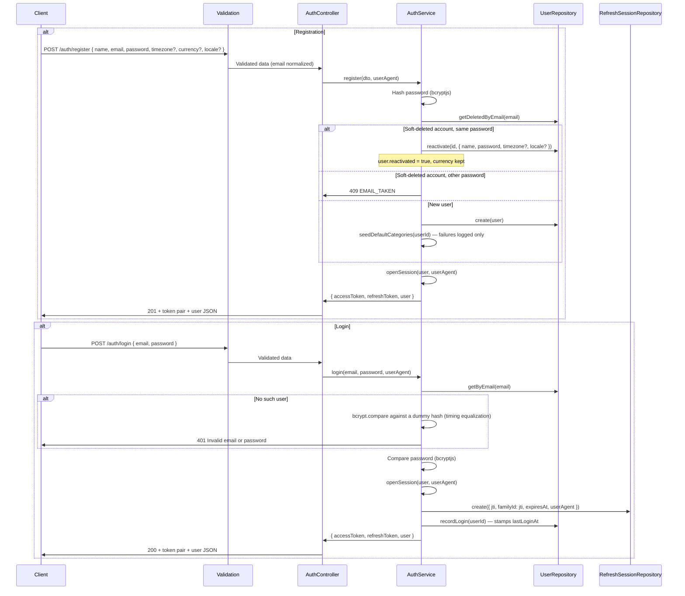
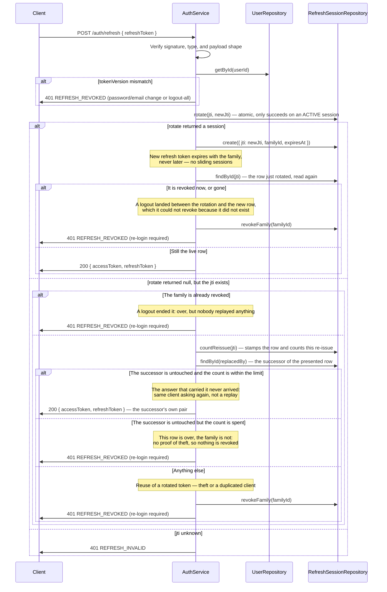

# Auth Module

## What This Module Does

Handles registration, login, and the full refresh-token session lifecycle. Registration and login are public; session management requires an access token.

Every successful register or login issues a **token pair**:

- **Access token** — short-lived (`JWT_EXPIRATION`, default 15m), carries `{ userId, email, timezone, sid }`, sent as `Authorization: Bearer <token>`. `sid` is the refresh family the token was issued for; refreshing keeps it, so it identifies the device across rotations.
- **Refresh token** — long-lived (`REFRESH_TOKEN_EXPIRATION`, default 30d), signed with `REFRESH_SECRET` (falling back to `JWT_SECRET`), carries a `jti` that identifies one row in the sessions collection.

Refresh tokens are **truly rotated**: every `POST /auth/refresh` invalidates the presented token and issues a new pair. Replaying an already-rotated token is treated as theft and revokes the entire device session family — with one exception, the **untouched successor** below, which is what tells a replay apart from an answer that never arrived.

## Files and Responsibilities

| File                                                                         | Role                                                                          |
| ---------------------------------------------------------------------------- | ----------------------------------------------------------------------------- |
| `src/app/routes/authRoutes.ts`                                               | Route definitions with OpenAPI docs and the per-route rate limiters           |
| `src/app/controllers/AuthController.ts`                                      | Thin HTTP handler, delegates to AuthService                                   |
| `src/app/services/AuthService.ts`                                            | Hashing, credential verification, token signing, rotation, session revocation |
| `src/app/dtos/UserDTO.ts`                                                    | `CreateUserDTO`, `UserResponseDTO` (shared with Users module)                 |
| `src/app/validation/schemas.ts`                                              | `registerSchema`, `loginSchema`, `refreshSchema`                              |
| `src/app/middlewares/authMiddleware.ts`                                      | Access-token verification; populates `req.user` (`AuthPayload`)               |
| `src/app/services/deviceToken.ts`                                            | Signing and reading the device token that login and register answer           |
| `src/app/middlewares/loginAttempt.ts`                                        | The email an attempt is for, and the device recognized for it                 |
| `src/app/middlewares/authRateLimitMiddleware.ts`                             | The persisted counter behind every auth rate limit                            |
| `src/app/middlewares/clientIp.ts`                                            | The client address the limiters count against                                 |
| `src/domain/repositories/refreshSession/IRefreshSessionRepository.ts`        | Session store contract (`RefreshSession`, `SessionSummary`)                   |
| `src/infrastructure/repositories/refreshSession/RefreshSessionRepository.ts` | Mongoose implementation (atomic `rotate`, family revocation)                  |
| `src/infrastructure/models/RefreshSessionModel.ts`                           | Mongoose model for refresh sessions                                           |
| `src/infrastructure/models/RateLimitModel.ts`                                | Persisted rate-limit counters                                                 |

## Public API

### `POST /auth/register`

Register a new user. **Register also logs in** — the response already carries the token pair, so no follow-up login call is needed.

**Request body:**

```json
{
  "name": "John Doe",
  "email": "john@example.com",
  "password": "password123",
  "timezone": "America/Bogota",
  "currency": "COP",
  "locale": "en"
}
```

- `password` — 8–128 characters.
- `email` — normalized (trimmed + lowercased), so `John@X.com` and `john@x.com` are the same account.
- `timezone` — optional IANA zone; drives day and period boundaries for stats and budgets. Defaults to `America/Bogota`.
- `currency` — optional ISO 4217 alpha code; defaults to `COP`. It is the user's single money currency and locks once they have accounts.
- `locale` — optional UI language, `en` (default) or `es`.

**Response (201):**

```json
{
  "accessToken": "eyJhbGciOiJIUzI1NiIs...",
  "refreshToken": "eyJhbGciOiJIUzI1NiIs...",
  "user": {
    "id": "019576a0-d7b6-...",
    "name": "John Doe",
    "email": "john@example.com",
    "timezone": "America/Bogota",
    "currency": "COP",
    "locale": "en",
    "lastLoginAt": "2026-08-31T...",
    "createdAt": "2026-08-31T...",
    "updatedAt": "2026-08-31T..."
  }
}
```

Registration also seeds the user's default categories (failures are logged, never fail the request).

**Reactivation:** registering with the email **and the password** of a **soft-deleted** account revives it with its full financial history. The response carries `user.reactivated: true`, and the original currency is kept — the `currency` sent in that register is ignored. With any other password the answer is `409 EMAIL_TAKEN`, the same as for a live account: the history goes back only to whoever still knows its password (T-153). That makes register a way to test a deleted account's password, so it spends the same per-email budget as a failed login (see Rate Limiting).

Note: the password is never returned.

### `POST /auth/login`

Authenticate and receive a token pair. Response shape is identical to register (without `reactivated`), and `lastLoginAt` is stamped.

**Request body:**

```json
{
  "email": "john@example.com",
  "password": "password123"
}
```

Failed logins pay the same bcrypt cost whether the email exists or not, so timing cannot be used to enumerate users.

### `POST /auth/refresh`

Exchange a refresh token for a **new** access + refresh pair. Public (no access token needed); the body is `{ "refreshToken": "..." }`. The response carries no `user`.

Always store the new refresh token: the old one stops rotating the moment it is used, and all it can still do is repeat the answer that never arrived (below). Rotation never extends the family past its original absolute expiry.

#### A lost answer is not a replay

Rotation is written before the answer is sent, so a client that never receives it keeps a token the server has already
rotated, and its next attempt looks exactly like a replay: same `jti`, already spent. It happens for real — the tab
reloads mid-request when a deployment changes the build id, or a phone drops the connection — and paying for it with the
whole 30-day family means a password prompt for a lost packet.

What tells the two apart is the **successor**: nobody can have used the token that never arrived. So when the presented
row is already rotated, the request is answered with the successor's own pair — no new row, no new rotation — as long as
all of this holds:

- the presented row is rotated and its family is alive (a revoked family is answered below, and is not a replay),
- the successor still exists, is not revoked, and has not itself been rotated,
- the family has not expired, and this row has been presented at most **10** times since it was rotated.

**There is no time limit, and that is deliberate.** Until 2026-09-13 the re-issue also required the rotation to be less
than 60 seconds old. That clock added nothing the untouched successor did not already prove, and it killed real
sessions: the client that loses the answer is usually the client that has just died, and it comes back when its user
does, not within the minute. The two families killed on 2026-09-11 and 2026-09-12 presented their token **3 h 41 min**
and **2 h 52 min** after the rotation, and in both the successor had never been touched.

**What replaces the clock is a counter, because without one the rotated row becomes a permanent alias.** While the
successor stays untouched, the old token answers again as often as it is presented — which is what the legitimate
client needs, since the deploy that loses one answer loses the next one too, and a browser with six tabs asks six
times at once. `countReissue` stamps `reissuedAt` and increments `reissueCount` on the rotated row in **one atomic
update**, which is also how the row is read: counting afterwards would let two simultaneous requests see the same
number and the budget would mean nothing. It counts **presentations, not successes** — an attempt that turns out to be
a replay is counted too, and then revokes the family anyway.

Past the tenth, the row is **retired, not treated as theft**: `401 REFRESH_REVOKED`, its own warning
(`Refresh re-issue limit reached; rotated token retired`), and **the family is left alone**. The successor being
untouched is still proof that nobody replayed anything; all the counter knows is that this client is not keeping the
answer. Revoking there would kill the live device for the same blind reason the clock did. The stamp is also what
`GET /auth/sessions` reports as `lastUsedAt`, so a family that lives on re-issues is not shown to its owner as idle.

Anything else is still a replay and still revokes the family. A stolen token buys nothing once the legitimate client
rotates again, which is the case replay detection exists for: while the successor is untouched the thief gets exactly
the pair that client already holds, so any use by either of them brings the collision closer. The case that has no
collision is a client that never comes back — it died, or its user logged in again and opened another family — and there
the counter, not the clock, is what bounds a leaked token.

Each re-issue logs `Refresh answer was lost; successor re-issued` at **warn** with the user, the family and the count:
`warn` because `LOG_LEVEL` may be `warn` in production and this path no longer has a clock around it, and the count
because one lost answer and forty are not the same event.

The three reads — `rotate`, then the presented row, then its successor — are not one transaction. Two requests carrying
the same rotated token are harmless: both are answered with the same pair and neither writes a row. What the gap allows
is a successor rotated by the live client in between, which re-issues a pair whose `jti` is already spent; the theft
detection then fires one attempt later instead of at once.

#### A revoked family is over, not stolen

A logout, a `DELETE /auth/sessions/:id` or an earlier replay leaves every row of the family with `revokedAt`. A client
that presents one of those rows is answered `401 REFRESH_REVOKED` without revoking anything again and **without the
theft warning**: it is a client that had not noticed, not a token being replayed. Only a rotated row in a live family
whose successor is spent, missing or revoked writes `Refresh token reuse detected; family revoked`.

### `POST /auth/logout`

Per-device logout. Authenticated by the refresh token in the body (no access token needed); revokes that token's whole rotation family. Idempotent for an already-revoked session of an otherwise valid token.

A family whose absolute expiry has passed is closed by the rotation that finds it: the row is already
spent by then, and leaving it alive would make the next presentation read as theft instead of as the
`REFRESH_INVALID` it is.

A rotation in flight does not survive it (H-62). `rotate` and the `create` of the new row are two operations, so a logout that lands between them revokes a family whose newest row does not exist yet and would leave that device signed in. The refresh re-reads the row it rotated after writing the new one: if the logout got there first, it revokes the family again — this time with the new row in it — and answers `401 REFRESH_REVOKED`.

### `POST /auth/logout-all`

Global logout for the authenticated user. Bumps the user's `tokenVersion`, so every outstanding refresh token stops working, and marks the session rows revoked. Requires an access token.

### `GET /auth/sessions`

List the user's active device sessions — one entry per rotation family. Responds `{ "data": [...] }` where each `SessionSummary` is:

| Field        | Meaning                                                                                  |
| ------------ | ---------------------------------------------------------------------------------------- |
| `id`         | The family id (use it to revoke the session)                                             |
| `createdAt`  | When that device logged in (the family root)                                             |
| `lastUsedAt` | Last refresh, re-issue or attempt, or the login when it never refreshed                  |
| `expiresAt`  | Absolute expiry of the family                                                            |
| `userAgent`  | User-Agent captured at login, when sent                                                  |
| `current`    | `true` for the family the requesting access token belongs to (its `sid`); always present |

Access tokens issued before `sid` existed mark no row as current until they are renewed (at most one `JWT_EXPIRATION`). Revoking the current session through `DELETE /auth/sessions/:id` is allowed: it is the same as `POST /auth/logout` for that device.

### `DELETE /auth/sessions/:id`

Revoke one device session by its family id. Idempotent for an own, already-revoked session; `404` when the family is not the user's.

## Internal Flow

### Register and Login



### Refresh Rotation and Reuse Detection



## Dependencies

**Imports:**

- `bcryptjs` — Password hashing and comparison
- `jsonwebtoken` — Token signing and verification
- `uuid` (v7) — `jti` / family ids
- `shared/constants` — `ENVIRONMENT` (secrets, expirations, salt rounds, rate-limit caps)
- `shared/errors` — `ApiError`
- `domain/entities/User` — User entity
- `domain/repositories/user/IUserRepository` — user data access
- `domain/repositories/refreshSession/IRefreshSessionRepository` — session store
- `app/services/CategoryService` — seeds default categories on registration

**Imported by:**

- Auth routes are registered in `src/app.ts` at `/auth`, **before** the global `authMiddleware`
- `authMiddleware` is applied globally to every route registered after it (`/users`, `/accounts`, `/categories`, `/transactions`, `/budgets`, `/stats`)
- Inside `authRoutes.ts`, `/auth/logout-all` and the `/auth/sessions` routes attach `authMiddleware` explicitly

## Environment Variables

| Variable                   | Used for                                                                       |
| -------------------------- | ------------------------------------------------------------------------------ |
| `JWT_SECRET`               | Signing and verifying access tokens                                            |
| `REFRESH_SECRET`           | Signing refresh tokens; falls back to `JWT_SECRET` when unset                  |
| `JWT_EXPIRATION`           | Access-token lifetime (default: `15m`)                                         |
| `REFRESH_TOKEN_EXPIRATION` | Refresh-token / session-family lifetime (default: `30d`)                       |
| `BCRYPT_SALT_ROUNDS`       | Password hashing complexity (default: `12`)                                    |
| `AUTH_RATE_LIMIT_MAX`      | Failed login attempts per recognized device, or per email and client IP, per 15-minute window (default: `10`) |
| `AUTH_EMAIL_RATE_LIMIT_MAX` | Failed login attempts per email per hour from unrecognized devices (default: `50`) |
| `AUTH_IP_RATE_LIMIT_MAX`   | Login and register attempts per client IP per 15-minute window (default: `60`) |
| `REFRESH_RATE_LIMIT_MAX`   | Refresh and logout attempts per 15-minute window (default: `60`)               |

## Rate Limiting

`authRateLimit` keeps one fixed window per key:

| Endpoint                        | Key                                                   | Cap and window                            |
| ------------------------------- | ----------------------------------------------------- | ----------------------------------------- |
| `POST /auth/login`, `/register` | Client IP                                             | `AUTH_IP_RATE_LIMIT_MAX` per 15 min       |
| `POST /auth/login`, `/register` | Recognized device (`login-device:<device id>`)        | `AUTH_RATE_LIMIT_MAX` per 15 min          |
| `POST /auth/login`, `/register` | Otherwise email and client IP (`login-email-ip:<email>:<ip>`) | `AUTH_RATE_LIMIT_MAX` per 15 min  |
| `POST /auth/login`, `/register` | Otherwise email (`login-email:<email>`)               | `AUTH_EMAIL_RATE_LIMIT_MAX` per hour      |
| `POST /auth/refresh`, `/logout` | Client IP                                             | `REFRESH_RATE_LIMIT_MAX` per 15 min       |

Only **failed** attempts burn the account budgets (`refundOnSuccess`), so real logins cost nothing. Register spends the same ones, because registering with a deleted account's email tests its password: a failed register and a failed login spend one budget between them.

**Nobody can lock another person out of a device they already use** (T-176, owner's decision of 2026-09-24). Until then the only account budget was one counter per email: ten wrong passwords from anyone locked the owner out for the window, and repeating it every fifteen minutes locked them out for good. The fix is a device token, the "device cookie" OWASP recommends against lockout attacks:

- Every login and register answers a `deviceToken`: an HS256 JWT signed with `REFRESH_SECRET ?? JWT_SECRET`, audience `device`, a random `jti` (the device id), the user's `tokenVersion`, a `sub` that is the SHA-256 of the normalized email, and a one-year lifetime (`src/app/services/deviceToken.ts`). It proves only that this device once signed in to that email; it opens nothing, so it is not a session and survives logout. The web client keeps it in an httpOnly cookie and sends it back as `deviceToken` on the next login or register. Each success answers a new one, which the client keeps instead; the old one stays valid until it expires or is revoked.
- **Recognizing** a device (`AuthService.recognizedDevice`, run once per request by `AuthController.recognizeDevice` before the limiters) takes a valid signature, the email the attempt is for, and a `tokenVersion` equal to the account's, which costs one indexed read. A password or email change and **Log out everywhere** bump `tokenVersion`, so they revoke every device token issued before; a deleted account recognizes none.
- An attempt from a recognized device counts only against that device (`AUTH_RATE_LIMIT_MAX` per 15 minutes). Someone else's failures never touch that budget. A stolen token, or one kept by somebody who once knew the password, is worth that budget of guesses, outside the per-email cap, until the owner changes the password or logs out everywhere.
- Every other attempt counts twice: per email and client IP, so an attacker behind one address runs out of guesses without affecting anybody else; and per email across all addresses, so an attack that rotates addresses is capped at `AUTH_EMAIL_RATE_LIMIT_MAX` guesses an hour. Only that last one can still stop the real owner, and only on a device the account does not recognize, while the attack lasts.

A token for another email, a forged one, an expired one or a revoked one counts as no token. The limiters run in a chain, and one that refuses does not give back what the earlier ones counted: an owner who keeps retrying from an unrecognized device while the per-email cap is full also spends their own email-and-IP budget, and may wait up to fifteen minutes more after the attack stops. `PUT` and `DELETE /users/:id` with `currentPassword` spend a counter per user (`current-password:<id>`) with `AUTH_RATE_LIMIT_MAX`: reaching them takes that user's own session, so no stranger can lock them.

The per-IP cap is shared by everyone behind that address — a carrier NAT holds thousands of unrelated users — so it is a volume brake, not a per-person allowance, and it defaults to `60`.

"Client IP" is `clientIp` (`src/app/middlewares/clientIp.ts`), not `req.ip`. Behind the Lambda Function URL `req.ip` is the caller of the API, which for the web client is the frontend's server, one address for every user of the app: keying on it gave all logins a single shared budget. The frontend states the real address in `x-client-ip`, believed only on a request that carried a valid `x-api-secret` (the mark `gatewaySecretMiddleware` leaves), validated with `net.isIP` and normalized with `ipKeyGenerator`. A caller that sends no such header, a direct client among them, is still limited by `req.ip`. See `docs/guides/deployment.md` for the whole chain.

## Error States

| Error / code      | Status | Condition                                                                                                                                                                                                                                  |
| ----------------- | ------ | ------------------------------------------------------------------------------------------------------------------------------------------------------------------------------------------------------------------------------------------ |
| `VALIDATION`      | 400    | Invalid email format, password shorter than 8 chars, invalid timezone/currency/locale                                                                                                                                                      |
| `Unauthorized`    | 401    | Invalid email or password on login (uniform for unknown email and wrong password)                                                                                                                                                          |
| `REFRESH_INVALID` | 401    | Refresh token malformed, expired, or its `jti` is unknown                                                                                                                                                                                  |
| `REFRESH_REVOKED` | 401    | Reuse of a rotated token whose successor is already spent; a rotated token presented past its re-issue limit; a family already ended by a logout or `DELETE /auth/sessions/:id`; or a token that predates a logout-all / credential change |
| `Unauthorized`    | 401    | Missing or malformed `Authorization` header, or an invalid/expired access token                                                                                                                                                            |
| `NotFound`        | 404    | `DELETE /auth/sessions/:id` for a family that is not the user's                                                                                                                                                                            |
| `EMAIL_TAKEN`     | 409    | Register with the email of a live account, of a soft-deleted one with a different password, or one a concurrent register just reactivated                                                                                                  |
| `RATE_LIMITED`    | 429    | Too many attempts in the window                                                                                                                                                                                                            |

> On a `500` during register the user may still have been created — clients should try login before retrying register.

## Token Revocation Model

Two independent mechanisms invalidate refresh tokens:

1. **`tokenVersion`** on the user document. `logout-all`, a password change, and an email change all bump it; every outstanding refresh token then fails with `REFRESH_REVOKED`. Access tokens already issued stay valid until they expire (≤ 15 min).
2. **Session families.** Each login opens a family (`familyId` = the first `jti`); each rotation adds a row pointing at the same family. Revoking a family kills that device only.

Access tokens are stateless and are **not** checked against the session store — that is the deliberate trade-off for the short lifetime.

## How to Extend

- To add OAuth/social login: add methods to `AuthService` that end in `openSession()`, so the session/rotation model stays uniform
- To add password reset: issue a separate single-use token type (never reuse the refresh type), and bump `tokenVersion` on success
- To make access tokens revocable immediately: check the session store in `authMiddleware` — accept the per-request read it costs
- Always keep auth routes **before** the global `authMiddleware` in `src/app.ts`
- Any new claim added to the access token (like `timezone`) is stale for up to `JWT_EXPIRATION`; consumers need a DB fallback, as `StatsController` and `BudgetController` do
