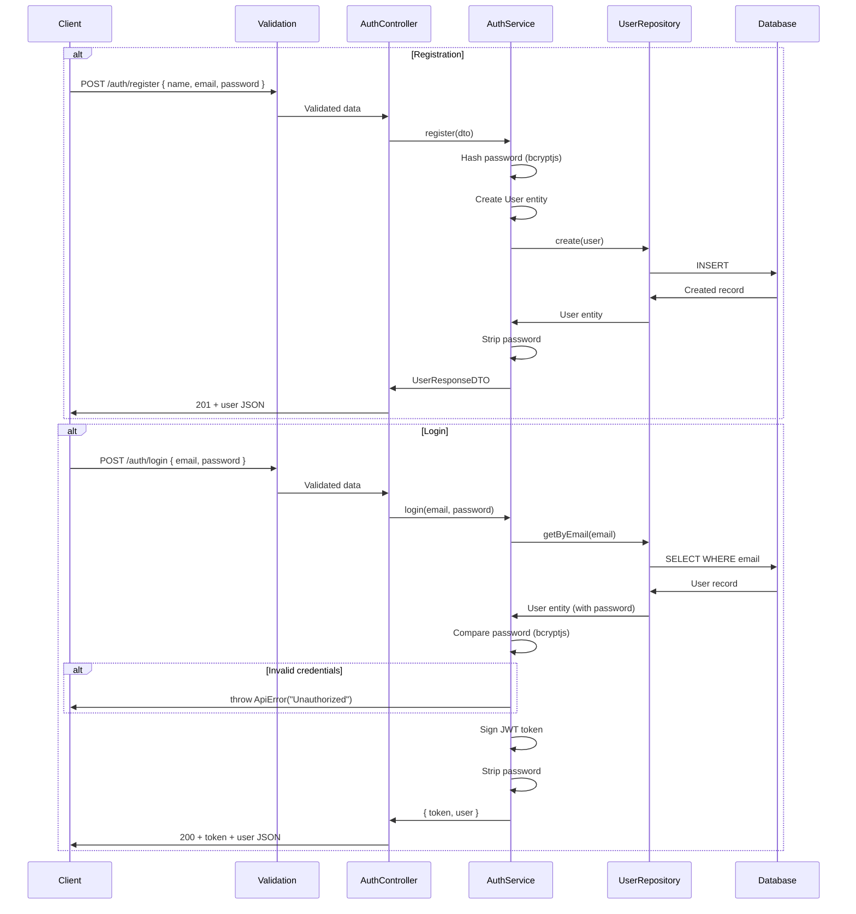

# Auth Module

## What This Module Does

Handles user registration and login. Public endpoints — no JWT required. On registration, hashes the password and creates a new user. On login, verifies credentials and returns a JWT token for authenticating subsequent requests.

## Files and Responsibilities

| File                                    | Role                                                                            |
| --------------------------------------- | ------------------------------------------------------------------------------- |
| `src/app/routes/authRoutes.ts`          | Route definitions with OpenAPI docs (`POST /auth/register`, `POST /auth/login`) |
| `src/app/controllers/AuthController.ts` | Thin HTTP handler, delegates to AuthService                                     |
| `src/app/services/AuthService.ts`       | Password hashing, credential verification, JWT token generation                 |
| `src/app/dtos/UserDTO.ts`               | `CreateUserDTO`, `UserResponseDTO` (shared with Users module)                   |
| `src/app/validation/schemas.ts`         | `registerSchema`, `loginSchema`                                                 |
| `src/app/middlewares/authMiddleware.ts` | JWT verification middleware (used by other modules, registered globally)        |

## Public API

### `POST /auth/register`

Register a new user.

**Request body:**

```json
{
  "name": "John Doe",
  "email": "john@example.com",
  "password": "password123"
}
```

**Response (201):**

```json
{
  "id": "019576a0-d7b6-...",
  "name": "John Doe",
  "email": "john@example.com",
  "createdAt": "2026-03-29T...",
  "updatedAt": "2026-03-29T..."
}
```

Note: Password is never returned.

### `POST /auth/login`

Authenticate and receive a JWT token.

**Request body:**

```json
{
  "email": "john@example.com",
  "password": "password123"
}
```

**Response (200):**

```json
{
  "token": "eyJhbGciOiJIUzI1NiIs...",
  "user": {
    "id": "019576a0-...",
    "name": "John Doe",
    "email": "john@example.com"
  }
}
```

## Internal Flow



## Dependencies

**Imports:**

- `bcryptjs` — Password hashing and comparison
- `jsonwebtoken` — JWT token signing
- `shared/constants` — `ENVIRONMENT` (JWT_SECRET, JWT_EXPIRATION, BCRYPT_SALT_ROUNDS)
- `shared/errors` — `ApiError`
- `domain/entities/User` — User entity
- `domain/repositories/user/IUserRepository` — Repository interface

**Imported by:**

- Auth routes are registered in `src/app.ts` as public routes (before `authMiddleware`)
- `authMiddleware` is used globally for all protected routes

## Environment Variables

| Variable             | Used for                                    |
| -------------------- | ------------------------------------------- |
| `JWT_SECRET`         | Signing and verifying JWT tokens            |
| `JWT_EXPIRATION`     | Token lifetime (default: `24h`)             |
| `BCRYPT_SALT_ROUNDS` | Password hashing complexity (default: `12`) |

## Error States

| Error               | Status | Condition                                                            |
| ------------------- | ------ | -------------------------------------------------------------------- |
| `ValidationError`   | 400    | Invalid email format, password too short, missing fields             |
| `UnauthorizedError` | 401    | Invalid email or password on login                                   |
| `ConflictError`     | 409    | Email already exists (handled by error middleware via DB constraint) |

## How to Extend

- To add OAuth/social login: create new methods in `AuthService`, new routes in `authRoutes.ts`
- To add password reset: create new service methods, new route endpoints
- To add refresh tokens: modify `login()` to return a refresh token, add a `POST /auth/refresh` endpoint
- Always keep auth routes **before** `authMiddleware` in `src/app.ts`
