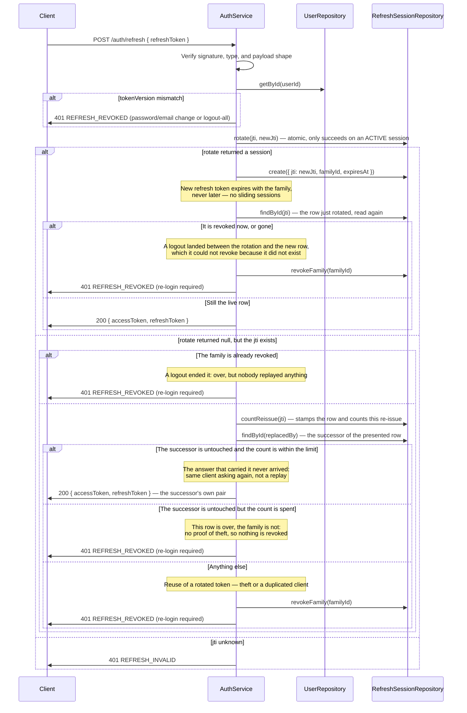

# Auth Module

## What This Module Does

Handles creating an account (which exists only once the code emailed to its address is typed: the owner's decision 16 of 2026-09-28), login and the restore of a deleted account, the full refresh-token session lifecycle, choosing a new password by email (Forgot your password?), and confirming the email of an account from before email existed, with its deadline. Creating an account, login, the password reset and the email's links are public; session management, the code of the confirmation and its Resend require an access token.

Every successful sign-up, login or reset issues a **token pair**:

- **Access token** — short-lived (`JWT_EXPIRATION`, default 15m), carries `{ userId, email, timezone, sid }`, and `confirmBy` for an unconfirmed account with a deadline, sent as `Authorization: Bearer <token>`. `sid` is the refresh family the token was issued for; refreshing keeps it, so it identifies the device across rotations. `confirmBy` (milliseconds) is the end of the deadline: past it, [the gate](#the-deadline-of-the-accounts-from-before-email) asks for the confirmation first.
- **Refresh token** — long-lived (`REFRESH_TOKEN_EXPIRATION`, default 30d), signed with `REFRESH_SECRET` (falling back to `JWT_SECRET`), carries a `jti` that identifies one row in the sessions collection.

Refresh tokens are **truly rotated**: every `POST /auth/refresh` invalidates the presented token and issues a new pair. Replaying an already-rotated token is treated as theft and revokes the entire device session family — with one exception, the **untouched successor** below, which is what tells a replay apart from an answer that never arrived.

## Files and Responsibilities

| File                                                                         | Role                                                                          |
| ---------------------------------------------------------------------------- | ----------------------------------------------------------------------------- |
| `src/app/routes/authRoutes.ts`                                               | Route definitions with OpenAPI docs and the per-route rate limiters           |
| `src/app/controllers/AuthController.ts`                                      | Thin HTTP handler, delegates to AuthService                                   |
| `src/app/services/AuthService.ts`                                            | Hashing, credential verification, token signing, rotation, session revocation |
| `src/app/dtos/UserDTO.ts`                                                    | `CreateUserDTO`, `UserResponseDTO` (shared with Users module)                 |
| `src/app/validation/schemas.ts`                                              | `registerSchema`, `loginSchema`, `refreshSchema`                              |
| `src/app/middlewares/authMiddleware.ts`                                      | Access-token verification; populates `req.user` (`AuthPayload`)               |
| `src/app/services/deviceToken.ts`                                            | Signing and reading the device token that login and register answer           |
| `src/app/middlewares/loginAttempt.ts`                                        | The email an attempt is for, and the device recognized for it                 |
| `src/app/middlewares/authRateLimitMiddleware.ts`                             | The persisted counter behind every auth rate limit                            |
| `src/app/middlewares/clientIp.ts`                                            | The client address the limiters count against                                 |
| `src/domain/repositories/refreshSession/IRefreshSessionRepository.ts`        | Session store contract (`RefreshSession`, `SessionSummary`)                   |
| `src/infrastructure/repositories/refreshSession/RefreshSessionRepository.ts` | Mongoose implementation (atomic `rotate`, family revocation)                  |
| `src/infrastructure/models/RefreshSessionModel.ts`                           | Mongoose model for refresh sessions                                           |
| `src/infrastructure/models/RateLimitModel.ts`                                | Persisted rate-limit counters                                                 |
| `src/app/services/PasswordResetService.ts`                                   | Forgot your password? and the reset: the same answer for every address       |
| `src/app/services/authCodes.ts`                                              | The 6-digit code, the link's token and how each is hashed                    |
| `src/domain/repositories/authCode/IAuthCodeRepository.ts`                    | Store of emailed codes, one row per address and purpose                      |
| `src/infrastructure/repositories/authCode/AuthCodeRepository.ts`             | Mongoose implementation (atomic tries and single use)                        |
| `src/infrastructure/models/AuthCodeModel.ts`                                 | Mongoose model for `authcodes`, with its TTL                                  |
| `src/app/middlewares/captchaMiddleware.ts`                                   | `requireCaptcha(action)`: the Turnstile check                                 |
| `src/app/services/SignUpService.ts`                                          | Creating an account: the sign-up that waits, its code and link, Resend         |
| `src/domain/repositories/signUp/ISignUpRepository.ts`                        | Store of the sign-ups that wait (`signups`, one per address, 24 hours)         |
| `src/infrastructure/repositories/signUp/SignUpRepository.ts`                 | Mongoose implementation (one creation per sign-up, one session per code)       |
| `src/app/services/EmailVerificationService.ts`                               | Confirming the email: the code, the links (a sign-up's, a deadline's), Resend, the sheet's state |
| `src/app/services/AccountRestoreService.ts`                                  | "Restore account" of `account-deleted` ([users.md](users.md#restoring-a-deleted-account)) |
| `src/app/middlewares/confirmationGate.ts`                                    | `403 EMAIL_CONFIRMATION_REQUIRED` past an account's deadline                   |
| `src/app/services/EmailChangeService.ts`                                     | The change of email: asking, Resend, cancelling, the move by code or link, and its undo |
| `src/app/services/securityNotice.ts`                                         | Sending a security notice: only to a confirmed address, never failing what sent it |
| `src/app/services/resetCode.ts`                                              | The reset code, for Forgot your password?, the undo and the restore link      |
| `src/domain/captcha/CaptchaVerifier.ts`                                      | The captcha port                                                              |
| `src/infrastructure/captcha/TurnstileVerifier.ts`                            | Cloudflare Turnstile's `siteverify`                                           |

## Public API

## Creating an account

The owner's decision 16 of 2026-09-28: **an account exists only once its address is confirmed**. Create account writes nothing but a sign-up that waits; the code of the email `sign-up`, typed in the browser that holds the sign-up, creates the account and signs it in, and the email's link creates it without signing anybody in. **Every address answers the same**, so nothing here tells who has an account (T-185 closed for good): not the answer, not its limits, not its time, not a failed send.

### `POST /auth/sign-up`

```json
{
  "name": "John Doe",
  "email": "john@example.com",
  "password": "password123",
  "timezone": "America/Bogota",
  "currency": "COP",
  "locale": "en",
  "captcha": "<Turnstile token>",
  "deviceToken": "<optional>"
}
```

The fields are the ones of the profile: `password` 8–128 characters; `email` normalized (trimmed + lowercased); `timezone` (default `America/Bogota`), `currency` (default `COP`, locked once the account has accounts) and `locale` (`en` default, or `es`) optional. `captcha` is required, a Turnstile token for the action `register` ([The captcha](#the-captcha)): without it `400 VALIDATION`, refused `400 CAPTCHA_INVALID`, unchecked `503 CAPTCHA_UNAVAILABLE`, and nothing is written. `deviceToken` lets the email brakes count this device instead of its IP.

**`202 { signUpToken, expiresAt, resendAfterSeconds }`**, for every address:

1. **The brakes**, counted before anything is looked up (`EmailService.holdBrakes` with the template `sign-up`: one a minute and five a day per address, ten an hour per recognized device, else five per IP). Its `429` is the same for every address.
2. **The sign-up is written** (`signups`): the address and its hash, the name, the password's bcrypt hash and the profile, for 24 hours (TTL), under the SHA-256 of `signUpToken` — 32 random bytes only this answer carries, which the web client's server keeps for this browser in an httpOnly cookie. **A new sign-up of the address replaces the one before**, whichever browser holds it (unique index on the address's hash). Both branches hash and write.
3. **The email.** An address with **no account** is sent `sign-up` — a 6-digit code and a link (`{APP_URL}/{locale}/verify#token=…`) for 24 hours, in the language chosen —, and its code row is written (`authcodes`, purpose `sign-up`, its `userId` the sign-up's id) once the email was accepted or may have gone. An address that **has an account** — live, deleted and still kept, or kept by another account's undo link ([users.md](users.md#how-an-address-is-kept)) — is sent `account-exists` instead, in that account's language and in the words of its state (with the days of a deleted account, or the day a kept address is free), and gets no code: its sign-up can never be confirmed. A deleted account past its 30 days does not count as having the address.
4. **A floor on the time**, as Forgot your password? holds: the answer waits until the providers' ceiling plus 500 ms have passed since the brakes. **A send that fails is never shown** — only the branch with no account could fail differently — and is logged (`SIGN_UP_EMAIL_NOT_SENT` when it throws).

### `POST /auth/sign-up/confirm`

`{ "signUpToken", "code" }` → **`201`** with a session like a login's, `{ accessToken, refreshToken, deviceToken, user }`. The account is created with its address confirmed, its default categories seeded, and this device's token, so no `new-sign-in` is sent: `sign-up` was its welcome. The code alone never signs anyone in: only with the token of the browser where the password was typed.

- **Every bad code gets one answer**, `400 SIGN_UP_CODE_INVALID`: mistyped, expired, replaced, used up by five tries (counted like every code), already used to sign in, for a sign-up that is over or replaced, or for an address that has an account. With two answers, "expired" would exist only for the addresses without one.
- **Confirming twice changes nothing.** If the email's link created the account first, the code still signs in, once, while the account's password is still the one typed here. The creation is claimed on the sign-up (`claimCreation`), so a code and a link at the same moment create one account.
- `409 EMAIL_TAKEN` when the address became another account's between the sign-up and the code — only whoever holds the code can see it. A deleted account past its 30 days that still has the address gives it up first ([users.md](users.md#the-nightly-pass)).

### `POST /auth/sign-up/resend`

`{ "signUpToken", "captcha", "deviceToken"? }` → `202 { resendAfterSeconds }`: Resend code of the code step. The same as the sign-up, branch, brakes, floor and silence included: `sign-up` with a new code (which replaces the old one once accepted), or `account-exists` if the address has an account by now. `409 SIGN_UP_EXPIRED` when the sign-up is over (24 hours, or replaced): start again from Create account.

### `POST /auth/register` (until T-239)

The way accounts were created before the confirmation came first, kept so the web client in production keeps working until T-239 is published (the back goes out first); a task removes it then. It creates the account unconfirmed and signs in (`201`, like a login), and sends `verify-email`; an address with any account, deleted and still kept included, is `409 EMAIL_TAKEN`. A deleted account no longer comes back from here: that is Sign in's job. It spends the login's per-email budget as before (see Rate Limiting). Its accounts are accounts from before email for [the deadline](#the-deadline-of-the-accounts-from-before-email).

Note: the password is never returned.

### `POST /auth/login`

Authenticate and receive a token pair, `{ accessToken, refreshToken, deviceToken, user }`; `lastLoginAt` is stamped.

**Request body:**

```json
{
  "email": "john@example.com",
  "password": "password123"
}
```

Failed logins pay the same bcrypt cost whether the email exists or not, so timing cannot be used to enumerate users.

**The right password of a deleted account** still kept answers `409 ACCOUNT_DELETED` with `deletedAccount: { deletedOn, keptUntil }` (days, `YYYY-MM-DD`, in its time zone) and opens nothing: the web client asks "Restore your account?" ([below](#post-authloginrestore)). A wrong password reads `401` as for any address, so only whoever holds the account learns it was deleted. An account deleted before T-238 gets its 30 days at that moment ([users.md](users.md#restoring-a-deleted-account)). An account past its deadline signs in as ever, with `user.emailConfirmationRequired: true`.

**A sign-in from a device the account does not know sends `new-sign-in`** (T-211) to the account's email,
once the session is open, with the moment and the device read from the user agent. A device is known when
the `deviceToken` of the body is one this email gave (`AuthService.knownDevice`): a valid signature, the
email as its subject, not expired, and issued no earlier than the account's `devicesResetAt` (to the
millisecond: device tokens carry `issuedAtMs`; one from before T-211 has only `iat`, to the second).

- **What forgets the devices** (sets `devicesResetAt`): an undo, a restore link and **Log out everywhere**
  (the owner's approval E of 2026-09-28). Those are what an owner does when somebody else may be in: after
  them a thief's device, which still holds its one-year token, is unknown again, and signing in with the
  password it knows is told. Log out everywhere answers this device a fresh `deviceToken`, issued after the
  forget, so its own next sign-in is known once the client keeps it (the web client does not yet: until it
  does, that sign-in sends one notice).
- **What does not**: a password change in Settings, and a reset (until T-238 a reset forgot them too).
  Unlike the limiters' `recognizedDevice`, `knownDevice` does not look at `tokenVersion`; the web client
  signs in again right after both with the device token it had, and a notice about itself would teach the
  owner to ignore the real one. A thief would need the new password.
- **A move to another email** changes the token's subject: only the device that confirmed it has a token of
  the new email, and every other device of the owner sends one notice on its next sign-in.
- An account whose email is not confirmed gets no notice (the address may be a stranger's), and nothing
  blocks the sign-in: a notice that cannot go stays in `emaildeliveries`.

### `POST /auth/login/restore`

"Restore account" of "Restore your account?": `{ email, password, deviceToken? }`, the same credentials as the sign-in that answered `ACCOUNT_DELETED`, under the login's limits, so the step holds no secret of its own. The account comes back (`deletedAt` and `keptUntil` cleared) with everything it had except the shared groups it left and the invitations that ended, the answer is a session like a login's, and `account-restored` goes to its email when it is confirmed (no `new-sign-in`: that email says it). An account no longer deleted just signs in; a wrong password, or one no longer kept, is `401`.

### `POST /auth/refresh`

Exchange a refresh token for a **new** access + refresh pair. Public (no access token needed); the body is `{ "refreshToken": "..." }`. The response carries no `user`.

Always store the new refresh token: the old one stops rotating the moment it is used, and all it can still do is repeat the answer that never arrived (below). Rotation never extends the family past its original absolute expiry.

#### A lost answer is not a replay

Rotation is written before the answer is sent, so a client that never receives it keeps a token the server has already
rotated, and its next attempt looks exactly like a replay: same `jti`, already spent. It happens for real — the tab
reloads mid-request when a deployment changes the build id, or a phone drops the connection — and paying for it with the
whole 30-day family means a password prompt for a lost packet.

What tells the two apart is the **successor**: nobody can have used the token that never arrived. So when the presented
row is already rotated, the request is answered with the successor's own pair — no new row, no new rotation — as long as
all of this holds:

- the presented row is rotated and its family is alive (a revoked family is answered below, and is not a replay),
- the successor still exists, is not revoked, and has not itself been rotated,
- the family has not expired, and this row has been presented at most **10** times since it was rotated.

**There is no time limit, and that is deliberate.** Until 2026-09-13 the re-issue also required the rotation to be less
than 60 seconds old. That clock added nothing the untouched successor did not already prove, and it killed real
sessions: the client that loses the answer is usually the client that has just died, and it comes back when its user
does, not within the minute. The two families killed on 2026-09-11 and 2026-09-12 presented their token **3 h 41 min**
and **2 h 52 min** after the rotation, and in both the successor had never been touched.

**What replaces the clock is a counter, because without one the rotated row becomes a permanent alias.** While the
successor stays untouched, the old token answers again as often as it is presented — which is what the legitimate
client needs, since the deploy that loses one answer loses the next one too, and a browser with six tabs asks six
times at once. `countReissue` stamps `reissuedAt` and increments `reissueCount` on the rotated row in **one atomic
update**, which is also how the row is read: counting afterwards would let two simultaneous requests see the same
number and the budget would mean nothing. It counts **presentations, not successes** — an attempt that turns out to be
a replay is counted too, and then revokes the family anyway.

Past the tenth, the row is **retired, not treated as theft**: `401 REFRESH_REVOKED`, its own warning
(`Refresh re-issue limit reached; rotated token retired`), and **the family is left alone**. The successor being
untouched is still proof that nobody replayed anything; all the counter knows is that this client is not keeping the
answer. Revoking there would kill the live device for the same blind reason the clock did. The stamp is also what
`GET /auth/sessions` reports as `lastUsedAt`, so a family that lives on re-issues is not shown to its owner as idle.

Anything else is still a replay and still revokes the family. A stolen token buys nothing once the legitimate client
rotates again, which is the case replay detection exists for: while the successor is untouched the thief gets exactly
the pair that client already holds, so any use by either of them brings the collision closer. The case that has no
collision is a client that never comes back — it died, or its user logged in again and opened another family — and there
the counter, not the clock, is what bounds a leaked token.

Each re-issue logs `Refresh answer was lost; successor re-issued` at **warn** with the user, the family and the count:
`warn` because `LOG_LEVEL` may be `warn` in production and this path no longer has a clock around it, and the count
because one lost answer and forty are not the same event.

The three reads — `rotate`, then the presented row, then its successor — are not one transaction. Two requests carrying
the same rotated token are harmless: both are answered with the same pair and neither writes a row. What the gap allows
is a successor rotated by the live client in between, which re-issues a pair whose `jti` is already spent; the theft
detection then fires one attempt later instead of at once.

#### A revoked family is over, not stolen

A logout, a `DELETE /auth/sessions/:id` or an earlier replay leaves every row of the family with `revokedAt`. A client
that presents one of those rows is answered `401 REFRESH_REVOKED` without revoking anything again and **without the
theft warning**: it is a client that had not noticed, not a token being replayed. Only a rotated row in a live family
whose successor is spent, missing or revoked writes `Refresh token reuse detected; family revoked`.

### `POST /auth/logout`

Per-device logout. Authenticated by the refresh token in the body (no access token needed); revokes that token's whole rotation family. Idempotent for an already-revoked session of an otherwise valid token.

A family whose absolute expiry has passed is closed by the rotation that finds it: the row is already
spent by then, and leaving it alive would make the next presentation read as theft instead of as the
`REFRESH_INVALID` it is.

A rotation in flight does not survive it (H-62). `rotate` and the `create` of the new row are two operations, so a logout that lands between them revokes a family whose newest row does not exist yet and would leave that device signed in. The refresh re-reads the row it rotated after writing the new one: if the logout got there first, it revokes the family again — this time with the new row in it — and answers `401 REFRESH_REVOKED`.

### `POST /auth/logout-all`

Global logout for the authenticated user. Bumps the user's `tokenVersion`, so every outstanding refresh token stops working, and marks the session rows revoked. Requires an access token. It also sets `devicesResetAt`: every device token issued before is unknown to `new-sign-in` ([`POST /auth/login`](#post-authlogin)), and the answer, `{ message, deviceToken }`, carries a fresh one for this device to keep.

### `GET /auth/sessions`

List the user's active device sessions — one entry per rotation family. Responds `{ "data": [...] }` where each `SessionSummary` is:

| Field        | Meaning                                                                                  |
| ------------ | ---------------------------------------------------------------------------------------- |
| `id`         | The family id (use it to revoke the session)                                             |
| `createdAt`  | When that device logged in (the family root)                                             |
| `lastUsedAt` | Last refresh, re-issue or attempt, or the login when it never refreshed                  |
| `expiresAt`  | Absolute expiry of the family                                                            |
| `userAgent`  | User-Agent captured at login, when sent                                                  |
| `current`    | `true` for the family the requesting access token belongs to (its `sid`); always present |

Access tokens issued before `sid` existed mark no row as current until they are renewed (at most one `JWT_EXPIRATION`). Revoking the current session through `DELETE /auth/sessions/:id` is allowed: it is the same as `POST /auth/logout` for that device.

### `DELETE /auth/sessions/:id`

Revoke one device session by its family id. Idempotent for an own, already-revoked session; `404` when the family is not the user's.

### `POST /auth/password/forgot`

Asks for a code to choose a new password. Body: `{ "email", "captcha", "deviceToken"? }`. `captcha` is a
Cloudflare Turnstile token issued for the action `forgot-password` (see [The captcha](#the-captcha)).

Always `202 { "resendAfterSeconds": 60 }`, whatever happens after the brakes (see
[Forgot your password?](#forgot-your-password-one-answer-for-every-address)). A live account and one
deleted in its last 30 days are emailed (the owner's decision 20); an address with no account is not. The
email is `password-reset` in the account's own language, with a 6-digit code and a link to
`{APP_URL}/{locale}/reset#token=…`, both good for 30 minutes; a deleted account's says when it was deleted,
that the new password restores it, and the day it is erased otherwise.

### `POST /auth/password/reset`

Chooses the new password. Body: `{ "email", "code", "newPassword" }`, or `{ "token", "newPassword" }` with
the link's token alone, which names the account. A body with both, or with neither, is `400 VALIDATION`.

On success, in one atomic write to the user: the password, `tokenVersion + 1` (every refresh token and
device token issued before stops working, as a password change does), `emailVerifiedAt`, since the
code or the link proved the inbox, and, for a deleted account still kept, `deletedAt` and `keptUntil`
cleared: **the reset restores it**. The sessions are marked revoked as in logout-all, and the answer is a
session like a login's, `{ accessToken, refreshToken, deviceToken, user, restored }`: `restored` says
whether the account had been deleted, for the toast "Account restored". Using the code or the link
spends every code of that request.

The same write **cancels an email change that waits** (`emailChange: null`, and its code and link are
discarded): it was asked for with a password that no longer works, and whoever took the account back must
not see it moved by a link afterwards. It does not forget the devices (the owner's approval E): the app
signs in again right after it. Then `password-changed` goes to the address, which the reset just confirmed
(T-211) — or `account-restored`, in its reset words, when the reset restored the account. The code of
`password-reset-after-undo` ([below](#post-authemailundo)) is redeemed here too: it lives in the same row
of the address.

## Confirming the email

Every account created by `POST /auth/sign-up` is confirmed from its first moment. What this section
confirms is an **account from before email existed** (and one made by `POST /auth/register` until T-239):
it has `emailVerifiedAt: null`, invitations wait for it (the owner's decision 3), and it has 14 days from
the email that announces it to confirm ([below](#the-deadline-of-the-accounts-from-before-email), decision
17, which replaced decision 4's "no deadline"). Decision 11's "It wasn't me", which deleted an account
that took an address without confirming it, went with T-238 (decision 18): no link deletes anything.

What confirms an address: its **code** (with the account's session), its **link** (without one), a
**password reset**, whose code proved the same inbox, or **the move to a new email**, whose code or link
proved the new one ([below](#post-authemailconfirm-change)). Before T-232, `PUT /users/{id}` moved the
email at once and took the confirmation away; the accounts it moved stay unconfirmed until their address
is confirmed like any other ([users.md](users.md#put-usersid)).

### `POST /auth/email/verify`

`{ "code" }` with the access token of the account the code went to, or `{ "token" }` from the link
(`{APP_URL}/{locale}/verify#token=…`) with no session: the token names the account. Anything else is
`400 VALIDATION`. `200 { "message", "result" }` on success.

**One page, three links.** `/verify` is the link of `sign-up`, of `verify-email` and of the deadline
emails, and the page cannot ask what a token is without spending it, so the answer says: `result:
"account-ready"` when the link of `sign-up` created its account (no session: Sign in follows; see
[Creating an account](#post-authsign-upconfirm)), `"email-confirmed"` for the others. A deadline's token
is told apart by its shape (the account's id and 32 random bytes, 64 characters, like an undo link's);
the others by their row in `authcodes`, purpose `sign-up` or `verify`.

- **A code works 24 hours and takes five tries**, counted with the reset's atomic `$inc` guarded by
  `attempts < 5`. Here the answers can differ, because the account is the caller's own:
  `EMAIL_CODE_INVALID` for a code that is not the one sent, `EMAIL_CODE_EXPIRED` when no code still works
  (it expired, it was tried five times, or none was sent).
- **Confirming is not spent.** Unlike the reset's, the code is only compared, never consumed: confirming
  twice changes nothing, so an account already confirmed answers `200` to its code and to its link (the
  spec's "Email confirmed", not a dead link, for whoever typed the code and then taps the link).
- **A link for an address the account no longer has** is `LINK_INVALID`, like one expired or replaced by
  a newer code — the latter even once the account is confirmed: only the newest email's link knows its
  account, for its 24 hours. A code for the old address does not work either: the codes are kept per
  address hash, and only the row this account asked for counts (another account's earlier row at the
  same address is ignored, in the code and in `emailVerification`).
- **Confirming touches the invitations waiting for the address** (`touchUnansweredFor`): they get a new
  `updatedAt`, so a copy whose cursor is past them still receives them on its next pull
  ([invitations.md](invitations.md#an-address-has-to-be-confirmed)). The reset does the same when it
  confirms an address.

### `POST /auth/email/resend`

Send code and Resend code of the sheet. With the access token, `{ "captcha", "deviceToken"? }`:
`captcha` for the action `verify-email`, `deviceToken` so the limits count this device instead of its IP
(recognized against the session's email). `202 { "resendAfterSeconds" }` once the email was accepted.

- **Unlike Forgot your password?, a failed send is said** (`EMAIL_SEND_FAILED`): the address is the
  person's own, so it tells nobody anything. `503` when no provider took it, or one timed out and it may
  not have gone; `422` when the address does not accept our emails (it bounced or complained before, or
  the provider refused it). In both, a code that was live before still works.
- `429 RATE_LIMITED` with `Retry-After`: the email brakes of `verify-email` — one a minute and five a day
  per address, five a day per account, and the device's or the IP's ([email.md](email.md#brakes)).
- `409 EMAIL_ALREADY_VERIFIED` when there is nothing to confirm.

Every send (at `POST /auth/register` and Resend) is the same: a new code and link
replace the live ones only once the email was accepted (`sent`); with `failed / unconfirmed` the newest
live code is kept next to the new one, as in the reset. `verify-email` has no box (the owner's approval F):
it is only sent when somebody signed in to the account asks for it.

### The deadline of the accounts from before email

The owner's decision 17 of 2026-09-28: every account from before email existed has **14 days to confirm
its address, counted from the email that announces it**, and a reminder four days before. Its data is
never touched: past the deadline only the door closes.

- **It starts with `EMAIL_CONFIRMATION_DEADLINES=true`**, which the owner turns on once the web client
  that shows the deadline (T-239) is published ([environment-vars.md](../guides/environment-vars.md));
  production refuses to start with it on and no `EMAIL_PROVIDERS`. Off, no account gets a deadline.
- **The nightly pass sends it** ([users.md](users.md#the-nightly-pass)): to each unconfirmed live account
  with none yet, `confirm-deadline` with a link to `/verify` of its own; once that email was accepted (or
  may have gone), `confirmDeadline` is written: `{ day, endsAt, remindedAt, links }`, the day 14 days from
  the send where the account lives, whole, `endsAt` its end. An email that does not go starts nothing, and
  the account is tried again the next night. Four days or fewer before `day`, `confirm-deadline-reminder`
  goes once, with the days left and its own link. Both spend at most half of the day's verification and
  security share of the cap (`EMAIL_DAILY_CAP`), and the pass spreads the rest over the next nights: a cap
  reached or no provider stops its sending until then; an address that refuses mail is skipped.
- **Each link confirms the address until the deadline** (`POST /auth/email/verify { token }`), once, and
  only for the address it went to. After the deadline, or once the account moved, `LINK_INVALID`;
  Send code (`verify-email`) works as ever.
- **`confirmBy`** (the day) and **`emailConfirmationRequired`** are in every profile answer
  ([users.md](users.md#get-usersid)).
- **Past `endsAt`, the gate** (`confirmationGate`, after `authMiddleware`) answers `403
  EMAIL_CONFIRMATION_REQUIRED` to everything but `GET /users/:id`, the change of email
  (`POST /users/:id/email-change` and its `/resend`, `DELETE /users/:id/email-change`) and the `/auth`
  routes (confirming, Resend, logout, sessions). The access token carries `confirmBy`, so only a token past
  it costs a read, to let through an account confirmed since it was signed. **`POST /sync` answers the
  `403` whole**, not per operation: the queue of a device that recorded offline waits, and goes through
  once the email is confirmed.
- **Whoever controls the inbox wins**: an address mistyped years ago belongs, from the inbox's side, to
  whoever holds it — Forgot your password? reaches them and the reset confirms the address.

### `POST /auth/email/confirm-change`

Moves the account to the email that waits ([users.md](users.md#changing-the-email)). `{ "code" }` with the
access token of the account that asked, or `{ "token", "refreshToken"? }` from the link of
`email-change-confirm` (`{APP_URL}/{locale}/confirm-email#token=…`) with no session: the token names the
account. `200 { user, accessToken?, refreshToken?, deviceToken? }`.

- **Every other device is signed out**: the move bumps `tokenVersion` in the same write, so every refresh
  and device token issued before stops working, and every session row is revoked.
- **The code keeps this device signed in**: the answer carries a new session (tokens and a device token),
  like a reset. **The link keeps a session only when the browser had one of the account**: the web
  client's server sends the refresh token it holds, and if it is a live session of that account
  (`AuthService.isLiveSessionOf`: signature, account, current `tokenVersion`, the tip of its chain that
  nothing revoked, so a token already rotated away does not count, read before the move) the answer carries a new one; otherwise none, and that browser stays as it was (the
  spec's "if not it stays signed out").
- **A code takes five tries and works 24 hours**, counted like the verification's, on a row of this account
  and this address: another account asking for the same address has a row of its own. Unlike
  the verification, **the move is spent**: the code and the link work once, and after the move the link
  answers `LINK_INVALID`, which the page reads as "This link no longer works".
- Answers: `EMAIL_CODE_INVALID`, `EMAIL_CODE_EXPIRED` (tried five times, or replaced by a Resend),
  `EMAIL_CHANGE_NOT_PENDING` (`409`, a code when nothing waits: confirmed, cancelled, or 24 hours past),
  `LINK_INVALID` (a link used, expired, replaced by a newer change or a Resend, or cancelled) and
  `EMAIL_TAKEN` (`409`: the address became another account's since it was asked for; the change is
  dropped and the account keeps its email).
- Confirming touches the invitations waiting for the new address, as the verification does.

### `POST /auth/email/restore`

`{ "token" }` from "Restore account" of `account-deleted` (`{APP_URL}/{locale}/restore#token=…`), no session.
`200 { "email", "codeSent" }`, like the undo: the account is back, signed out everywhere, with no working
password, every device forgotten, and `password-reset-after-undo` in its restore words takes a code and a
link to its address. It works for 7 days and once, **even if the account was restored meanwhile**. A link
used, past its 7 days, of an account erased, or not one at all is `LINK_INVALID`. What it writes:
[users.md](users.md#restoring-a-deleted-account).

### `POST /auth/email/undo`

`{ "token" }` from "Undo the change" of `email-change-requested`, which went to the old address
(`{APP_URL}/{locale}/undo#token=…`), no session. `200 { "email", "codeSent" }`. What it does, how the old
address is kept for it and why every other undo link of the account stops with it:
[users.md](users.md#undo-the-change-from-the-old-address). In short, the account is back at that address,
signed out everywhere, with no working password, and `password-reset-after-undo` takes a code and a link to
it for `POST /auth/password/reset`. `email` is that address, so the page opens the code screen without
asking for a new code, which would cancel this one; `codeSent` is `false` when the code could not go
(Forgot your password? for that address is the way in then). It also brings back an account deleted after
the link was sent and still kept. A link used, past its 7 days, stopped by an earlier undo link of the account, or not one
at all is `LINK_INVALID`. No captcha: the token is 32 random
bytes that only that inbox received, and the route has its own limit per IP.

## Forgot your password? One answer for every address

Anybody can type any address, so nothing the endpoint answers may tell an address with an account from
one without, a live account from a deleted one, or a send that worked from one that failed (the front's
`design/spec/screens/access.md`); a deleted account gets its own words, which only its inbox reads. What
makes that hold:

- **The brakes are counted for every address.** `EmailService.holdBrakes` counts the `password-reset`
  template's per-address brakes (one a minute, five a day) and the requester's (10 an hour per recognized
  device, else 5 per IP) before anything is looked up, account or not, and the send that follows passes
  `brakesHeld` so they are not counted twice. A `429` is therefore the same for everyone. Only the money
  caps are left to the send, and they are global, so reaching one tells nothing about an address: the
  request still answers `202` and the `EMAIL_CAP_REACHED` alarm fires ([email.md](email.md#brakes)).
- **Every address leaves the same row.** Each request upserts the address's `authcodes` row (by hash),
  with `userId: null` when there is no account, and starts its tries again: a reset afterwards makes
  the same round trips for any address. The send of an address with an account costs more round trips
  than no send at all; the floor below is what hides them.
- **Nothing after the brakes is shown.** A failed send, a store that fails, an account that is missing:
  all end in the same `202`, and are logged (`PASSWORD_RESET_NOT_SENT`, and the email module's own lines).
  Only an address with an account can fail there, so showing it would name the account.
- **A floor on the time.** The answer waits until `email.providerCeilingMs` plus 500 ms have passed since
  the brakes: the providers' ceiling (1.5 s each) plus the MongoDB round trips of a send (the suppression
  read, the caps, the delivery row, the code). With one provider that is 2 s. A second provider raises it
  on its own.
- **A new code replaces the old one only once its email was accepted** (`sent`). When a provider timed out
  without an answer (`failed / unconfirmed`) the email may still arrive, so the newest live code is kept next
  to the new one and either works until one is used. Any other failure leaves the old code as it was.

### The codes: `authcodes`

| Field       | Meaning                                                                                     |
| ----------- | ------------------------------------------------------------------------------------------- |
| `purpose`   | `reset`, `verify`, `email-change` (the new address of a change of email) or `sign-up`       |
| `toHash`    | SHA-256 of the normalized address; unique with `purpose`. Never the address. For `email-change`, of the account and the address |
| `userId`    | The account the request found, `null` when there was none; for `sign-up`, the sign-up's id  |
| `codes`     | At most two live codes, each `{ codeHash, tokenHash, expiresAt }`                           |
| `attempts`  | Tries of a code since the last one was issued                                               |
| `issuedAt`  | When the newest code went: the sheet's `lastSentAt` and Resend's countdown                  |
| `expiresAt` | TTL: the row goes when its newest code does                                                  |

- **The code is keyed, the token is not.** `codeHash` is HMAC-SHA256 with `JWT_SECRET` over the address's
  hash and the six digits: without a secret, a copy of the database would give every code back in a
  million guesses. The token is 32 random bytes, so its plain SHA-256 (`tokenHash`, indexed) is enough.
- **Five tries per code**, counted in one atomic `$inc` guarded by `attempts < 5` before the code is even
  compared, so parallel guesses cannot go past it. An address with no account counts its tries the same
  way. Every Send code starts the count again, account or not, so a code gets its five tries and an
  address at most 25 a day. The link is not counted: its token cannot be guessed.
- **Single use** is one `findOneAndUpdate` that empties `codes` only if the code presented is still in
  them and live, so of two resets with the same code exactly one gets through.
- **One answer for a bad code**, `RESET_CODE_INVALID`: mistyped, expired, replaced, spent in five tries,
  or for an address with no account. With two, "expired" would exist only for the addresses with an
  account. A code for an address the account no longer has (its email changed since) is refused too.
  The link has its own, `LINK_INVALID`, like every link of an email.
- **The new password is hashed first**, before the code is looked at, so a right and a wrong code pay
  the same bcrypt time.

### What the reset leaves for later

- **A second factor.** The day two-step verification exists (T-217), the reset will need two different
  proofs among the emailed code, the TOTP and a recovery code (two recovery codes are not two). The check
  goes between redeeming the code and writing the password, in `PasswordResetService.reset`, and the body
  gains its optional `totp` and `recoveryCode` then, with `SECOND_FACTOR_REQUIRED`: today there is no
  factor, so the contract promises neither a field nor a code nothing reads.
- **Factors of an account that never confirmed its email.** When passkeys, TOTP and recovery codes exist,
  a reset of an account whose `emailVerifiedAt` was null (one from before email) also removes them:
  whoever registered somebody else's address may have left one there. Today none exist.

## The captcha

`requireCaptcha(action, verifier)` runs after `validate()`, on the routes that send an email: `POST
/auth/sign-up`, `/auth/sign-up/resend` and `/auth/register` (action `register`), `POST
/auth/password/forgot` (`forgot-password`), `POST
/auth/email/resend` (`verify-email`), and `POST /users/:id/email-change` and its `/resend`
(`email-change`). Each body requires its `captcha`. It asks Cloudflare Turnstile's `siteverify` (`TurnstileVerifier`, 3 s, no retry) with `TURNSTILE_SECRET`, the token and the
client's whole address (`clientAddress`: `clientIp` collapses IPv6 to its /56, which is right for a limit
and wrong for Cloudflare).

- **It passes** when Cloudflare says so, for the hostname of `APP_URL` and the route's action. With one of
  Cloudflare's test secrets, which answer their own hostname and action, those two are not compared;
  production refuses to start with a test secret.
- **Refused** (`400 CAPTCHA_INVALID`): the token was spent, expired, forged, or issued for another site or
  action. The client asks the widget for a new one; a token works once and lasts 300 s.
- **Unavailable** (`503 CAPTCHA_UNAVAILABLE`, logged as an error with the reason): Cloudflare did not
  answer, answered something else, could not judge the token, or no secret is set. Nothing is created or
  sent: the captcha is what keeps strangers from spending the email budget, so it fails closed.

The check is here and not only in the web client's server, because a call straight to the Function URL
would skip it. In production `EMAIL_PROVIDERS` with no `TURNSTILE_SECRET` stops the API from starting;
without either, every sign-up is `503 CAPTCHA_UNAVAILABLE`, logged as an error each time. That is checked
per request, like a missing `API_SECRET`, on purpose: a process that refused to start would take sign-in
down too, and this only stops what needs the captcha.

## Internal Flow

### Sign-up and Login

```mermaid
sequenceDiagram
    participant C as Client
    participant V as Validation
    participant CAP as Turnstile
    participant SIGN as SignUpService
    participant EMAIL as EmailService
    participant SVC as AuthService
    participant REPO as UserRepository

    alt Sign-up
        C->>V: POST /auth/sign-up { name, email, password, captcha, timezone?, currency?, locale? }
        V->>CAP: siteverify(captcha, action register)
        Note over CAP: refused → 400 CAPTCHA_INVALID, unchecked → 503 CAPTCHA_UNAVAILABLE
        CAP->>SIGN: start(dto, requester)
        SIGN->>EMAIL: holdBrakes(sign-up, email, requester)
        Note over SIGN: limited → 429, the same for every address
        SIGN->>SIGN: Hash the password; write the sign-up (24 h, replaces the address's last)
        SIGN->>REPO: holderOf(email)
        alt The address has an account
            SIGN->>EMAIL: sendCode(account-exists) — no code
        else It has none
            SIGN->>EMAIL: sendCode(sign-up) — code and link, row written once accepted
        end
        Note over SIGN: wait until the providers' ceiling + 500 ms
        SIGN->>C: 202 { signUpToken, expiresAt, resendAfterSeconds }
        C->>SIGN: POST /auth/sign-up/confirm { signUpToken, code }
        SIGN->>SVC: createAccount(…, emailVerifiedAt) — once per sign-up
        SIGN->>SVC: openSession(user) — once per code
        SIGN->>C: 201 + token pair + user JSON
    end

    alt Login
        C->>V: POST /auth/login { email, password }
        V->>SVC: login(email, password, userAgent, deviceToken)
        SVC->>REPO: getReachableByEmail(email) — live, or deleted and still kept
        alt No such user, or a wrong password
            SVC->>SVC: bcrypt.compare (against a dummy hash when there is no user)
            SVC->>C: 401 Invalid email or password
        else Deleted and still kept
            SVC->>C: 409 ACCOUNT_DELETED { deletedAccount: { deletedOn, keptUntil } }
        end
        SVC->>SVC: openSession(user, userAgent); new-sign-in for an unknown device
        SVC->>C: 200 + token pair + user JSON
    end
```

### Refresh Rotation and Reuse Detection


```mermaid
sequenceDiagram
    participant C as Client
    participant SVC as AuthService
    participant REPO as UserRepository
    participant SESS as RefreshSessionRepository

    C->>SVC: POST /auth/refresh { refreshToken }
    SVC->>SVC: Verify signature, type, and payload shape
    SVC->>REPO: getById(userId)
    alt tokenVersion mismatch
        SVC->>C: 401 REFRESH_REVOKED (password/email change or logout-all)
    end
    SVC->>SESS: rotate(jti, newJti) — atomic, only succeeds on an ACTIVE session
    alt rotate returned a session
        SVC->>SESS: create({ jti: newJti, familyId, expiresAt })
        Note over SVC: New refresh token expires with the family,<br/>never later — no sliding sessions
        SVC->>SESS: findById(jti) — the row just rotated, read again
        alt It is revoked now, or gone
            Note over SVC: A logout landed between the rotation and the new row,<br/>which it could not revoke because it did not exist
            SVC->>SESS: revokeFamily(familyId)
            SVC->>C: 401 REFRESH_REVOKED (re-login required)
        else Still the live row
            SVC->>C: 200 { accessToken, refreshToken }
        end
    else rotate returned null, but the jti exists
        alt The family is already revoked
            Note over SVC: A logout ended it: over, but nobody replayed anything
            SVC->>C: 401 REFRESH_REVOKED (re-login required)
        else
            SVC->>SESS: countReissue(jti) — stamps the row and counts this re-issue
            SVC->>SESS: findById(replacedBy) — the successor of the presented row
            alt The successor is untouched and the count is within the limit
                Note over SVC: The answer that carried it never arrived:<br/>same client asking again, not a replay
                SVC->>C: 200 { accessToken, refreshToken } — the successor's own pair
            else The successor is untouched but the count is spent
                Note over SVC: This row is over, the family is not:<br/>no proof of theft, so nothing is revoked
                SVC->>C: 401 REFRESH_REVOKED (re-login required)
            else Anything else
                Note over SVC: Reuse of a rotated token — theft or a duplicated client
                SVC->>SESS: revokeFamily(familyId)
                SVC->>C: 401 REFRESH_REVOKED (re-login required)
            end
        end
    else jti unknown
        SVC->>C: 401 REFRESH_INVALID
    end
```

## Dependencies

**Imports:**

- `bcryptjs` — Password hashing and comparison
- `jsonwebtoken` — Token signing and verification
- `uuid` (v7) — `jti` / family ids
- `shared/constants` — `ENVIRONMENT` (secrets, expirations, salt rounds, rate-limit caps)
- `shared/errors` — `ApiError`
- `domain/entities/User` — User entity
- `domain/repositories/user/IUserRepository` — user data access
- `domain/repositories/refreshSession/IRefreshSessionRepository` — session store
- `app/services/CategoryService` — seeds default categories when an account is created

**Imported by:**

- Auth routes are registered in `src/app.ts` at `/auth`, **before** the global `authMiddleware`
- `authMiddleware` is applied globally to every route registered after it (`/users`, `/accounts`, `/categories`, `/transactions`, `/budgets`, `/stats`, `/sync`…), followed by `confirmationGate`
- Inside `authRoutes.ts`, `/auth/logout-all` and the `/auth/sessions` routes attach `authMiddleware` explicitly

## Environment Variables

| Variable                   | Used for                                                                       |
| -------------------------- | ------------------------------------------------------------------------------ |
| `JWT_SECRET`               | Signing and verifying access tokens                                            |
| `REFRESH_SECRET`           | Signing refresh tokens; falls back to `JWT_SECRET` when unset                  |
| `JWT_EXPIRATION`           | Access-token lifetime (default: `15m`)                                         |
| `REFRESH_TOKEN_EXPIRATION` | Refresh-token / session-family lifetime (default: `30d`)                       |
| `BCRYPT_SALT_ROUNDS`       | Password hashing complexity (default: `12`)                                    |
| `AUTH_RATE_LIMIT_MAX`      | Failed login attempts per recognized device, or per email and client IP, per 15-minute window (default: `10`) |
| `AUTH_EMAIL_RATE_LIMIT_MAX` | Failed login attempts per email per hour from unrecognized devices (default: `50`) |
| `AUTH_IP_RATE_LIMIT_MAX`   | Login, sign-up and register attempts per client IP per 15-minute window (default: `60`) |
| `REFRESH_RATE_LIMIT_MAX`   | Refresh and logout attempts per 15-minute window (default: `60`)               |
| `TURNSTILE_SECRET`         | Cloudflare Turnstile's secret key for the captcha; without it nobody can sign up. Required in production once `EMAIL_PROVIDERS` is set |
| `EMAIL_CONFIRMATION_DEADLINES` | Starts the deadline of the accounts from before email (default `false`); production refuses it without `EMAIL_PROVIDERS` |

## Rate Limiting

`authRateLimit` keeps one fixed window per key:

| Endpoint                        | Key                                                   | Cap and window                            |
| ------------------------------- | ----------------------------------------------------- | ----------------------------------------- |
| `POST /auth/login`, `/login/restore`, `/register` | Client IP                           | `AUTH_IP_RATE_LIMIT_MAX` per 15 min       |
| `POST /auth/login`, `/login/restore`, `/register` | Recognized device (`login-device:<device id>`) | `AUTH_RATE_LIMIT_MAX` per 15 min |
| `POST /auth/login`, `/login/restore`, `/register` | Otherwise email and client IP (`login-email-ip:<email>:<ip>`) | `AUTH_RATE_LIMIT_MAX` per 15 min |
| `POST /auth/login`, `/login/restore`, `/register` | Otherwise email (`login-email:<email>`) | `AUTH_EMAIL_RATE_LIMIT_MAX` per hour |
| `POST /auth/sign-up`, `/sign-up/resend` | Client IP (`register:<ip>`), before the captcha; then the email's own brakes, for every address | `AUTH_IP_RATE_LIMIT_MAX` per 15 min |
| `POST /auth/sign-up/confirm`    | Client IP (`sign-up-confirm:<ip>`); a code also has its five tries | `AUTH_IP_RATE_LIMIT_MAX` per 15 min |
| `POST /auth/refresh`, `/logout` | Client IP                                             | `REFRESH_RATE_LIMIT_MAX` per 15 min       |
| `POST /auth/password/forgot`    | Client IP (`forgot:<ip>`), before the captcha         | `AUTH_IP_RATE_LIMIT_MAX` per 15 min       |
| `POST /auth/password/forgot`    | Then the email's own brakes, for every address        | See [One answer for every address](#forgot-your-password-one-answer-for-every-address) |
| `POST /auth/password/reset`     | Client IP (`reset:<ip>`)                              | `AUTH_IP_RATE_LIMIT_MAX` per 15 min       |
| `POST /auth/email/verify`       | Client IP (`verify-email:<ip>`); a code also has its five tries | `AUTH_IP_RATE_LIMIT_MAX` per 15 min |
| `POST /auth/email/resend`       | Client IP (`resend-verification:<ip>`), before the captcha; then the email's own brakes | `AUTH_IP_RATE_LIMIT_MAX` per 15 min |
| `POST /auth/email/restore`      | Client IP (`restore-link:<ip>`)                       | `AUTH_IP_RATE_LIMIT_MAX` per 15 min       |
| `POST /auth/email/confirm-change` | Client IP (`confirm-email-change:<ip>`); a code also has its five tries | `AUTH_IP_RATE_LIMIT_MAX` per 15 min |
| `POST /users/:id/email-change` and `/resend` | Client IP (`email-change:<ip>`), before the captcha; then the email's own brakes | `AUTH_IP_RATE_LIMIT_MAX` per 15 min |

Only **failed** attempts burn the account budgets (`refundOnSuccess`), so real logins cost nothing. Restore and the old register spend the same ones: restoring tests the password like a login, and a failed register and a failed login spend one budget between them. `POST /auth/sign-up` tests no password, so only its volume brake and the email's brakes apply.

**Nobody can lock another person out of a device they already use** (T-176, owner's decision of 2026-09-24). Until then the only account budget was one counter per email: ten wrong passwords from anyone locked the owner out for the window, and repeating it every fifteen minutes locked them out for good. The fix is a device token, the "device cookie" OWASP recommends against lockout attacks:

- Every login, sign-up, restore, reset and register answers a `deviceToken`: an HS256 JWT signed with `REFRESH_SECRET ?? JWT_SECRET`, audience `device`, a random `jti` (the device id), the user's `tokenVersion`, a `sub` that is the SHA-256 of the normalized email, and a one-year lifetime (`src/app/services/deviceToken.ts`). It proves only that this device once signed in to that email; it opens nothing, so it is not a session and survives logout. The web client keeps it in an httpOnly cookie and sends it back as `deviceToken` on the next login or register. Each success answers a new one, which the client keeps instead; the old one stays valid until it expires or is revoked.
- **Recognizing** a device (`AuthService.recognizedDevice`, run once per request by `AuthController.recognizeDevice` before the limiters) takes a valid signature, the email the attempt is for, and a `tokenVersion` equal to the account's, which costs one indexed read. A password or email change, a reset, an undo, a restore link and **Log out everywhere** bump `tokenVersion`, so they revoke every device token issued before for the limiters; a deleted account recognizes none. `new-sign-in` reads the same token with a looser rule of its own ([`POST /auth/login`](#post-authlogin)).
- An attempt from a recognized device counts only against that device (`AUTH_RATE_LIMIT_MAX` per 15 minutes). Someone else's failures never touch that budget. A stolen token, or one kept by somebody who once knew the password, is worth that budget of guesses, outside the per-email cap, until the owner changes the password or logs out everywhere.
- Every other attempt counts twice: per email and client IP, so an attacker behind one address runs out of guesses without affecting anybody else; and per email across all addresses, so an attack that rotates addresses is capped at `AUTH_EMAIL_RATE_LIMIT_MAX` guesses an hour. Only that last one can still stop the real owner, and only on a device the account does not recognize, while the attack lasts.

A token for another email, a forged one, an expired one or a revoked one counts as no token. The limiters run in a chain, and one that refuses does not give back what the earlier ones counted: an owner who keeps retrying from an unrecognized device while the per-email cap is full also spends their own email-and-IP budget, and may wait up to fifteen minutes more after the attack stops. `PUT` and `DELETE /users/:id` with `currentPassword` spend a counter per user (`current-password:<id>`) with `AUTH_RATE_LIMIT_MAX`: reaching them takes that user's own session, so no stranger can lock them.

The per-IP cap is shared by everyone behind that address — a carrier NAT holds thousands of unrelated users — so it is a volume brake, not a per-person allowance, and it defaults to `60`.

"Client IP" is `clientIp` (`src/app/middlewares/clientIp.ts`), not `req.ip`. Behind the Lambda Function URL `req.ip` is the caller of the API, which for the web client is the frontend's server, one address for every user of the app: keying on it gave all logins a single shared budget. The frontend states the real address in `x-client-ip`, believed only on a request that carried a valid `x-api-secret` (the mark `gatewaySecretMiddleware` leaves), validated with `net.isIP` and normalized with `ipKeyGenerator`. A caller that sends no such header, a direct client among them, is still limited by `req.ip`. See `docs/guides/deployment.md` for the whole chain.

## Error States

| Error / code      | Status | Condition                                                                                                                                                                                                                                  |
| ----------------- | ------ | ------------------------------------------------------------------------------------------------------------------------------------------------------------------------------------------------------------------------------------------ |
| `VALIDATION`      | 400    | Invalid email format, password shorter than 8 chars, invalid timezone/currency/locale, a missing captcha                                                                                                                                   |
| `Unauthorized`    | 401    | Invalid email or password on login (uniform for unknown email and wrong password)                                                                                                                                                          |
| `REFRESH_INVALID` | 401    | Refresh token malformed, expired, or its `jti` is unknown                                                                                                                                                                                  |
| `REFRESH_REVOKED` | 401    | Reuse of a rotated token whose successor is already spent; a rotated token presented past its re-issue limit; a family already ended by a logout or `DELETE /auth/sessions/:id`; or a token that predates a logout-all / credential change |
| `Unauthorized`    | 401    | Missing or malformed `Authorization` header, or an invalid/expired access token                                                                                                                                                            |
| `NotFound`        | 404    | `DELETE /auth/sessions/:id` for a family that is not the user's                                                                                                                                                                            |
| `EMAIL_TAKEN`     | 409    | `POST /auth/register` with the email of any account, a deleted one still kept or one kept for another account's undo link included; or a sign-up whose address another account took before its code |
| `ACCOUNT_DELETED` | 409    | Login with the right password of an account deleted in its last 30 days; `deletedAccount` carries its two days |
| `SIGN_UP_CODE_INVALID` | 400 | A sign-up code that does not work, whatever the reason |
| `SIGN_UP_EXPIRED` | 409    | Resend of a sign-up that is over |
| `EMAIL_CONFIRMATION_REQUIRED` | 403 | An account past its deadline, on anything but the profile, the change of email and `/auth` |
| `RATE_LIMITED`    | 429    | Too many attempts in the window                                                                                                                                                                                                            |
| `RESET_CODE_INVALID` | 400 | A reset code that does not work, whatever the reason (see above)                                                                                                                                                                         |
| `LINK_INVALID`    | 400    | A reset or confirmation link that was used, expired or replaced, one for an address the account no longer has, a deadline link past its deadline, an undo link used, past its 7 days or stopped by an earlier one, or a restore link used or past its 7 days |
| `EMAIL_CODE_INVALID` | 400 | Confirming the email with a code that is not the one sent |
| `EMAIL_CODE_EXPIRED` | 400 | Confirming the email when no code still works: expired, tried five times, or none sent |
| `EMAIL_ALREADY_VERIFIED` | 409 | Resend when the email is already confirmed |
| `EMAIL_SEND_FAILED` | 422 / 503 | Resend whose email did not go: the address refuses our email (422), or no provider took it (503) |
| `EMAIL_CHANGE_NOT_PENDING` | 409 | The code of a change of email when nothing waits |
| `EMAIL_TAKEN`     | 409    | Also: the new email of a change became another account's before it was confirmed |
| `CAPTCHA_INVALID` | 400    | Turnstile refused the captcha token                                                                                                                                                                                                        |
| `CAPTCHA_UNAVAILABLE` | 503 | The captcha could not be checked; nothing was created or sent                                                                                                                                                                          |

> On a `500` during the old register the user may still have been created — clients should try login before retrying register. A sign-up creates nothing until its code: retrying it only replaces the sign-up.

## Token Revocation Model

Two independent mechanisms invalidate refresh tokens:

1. **`tokenVersion`** on the user document. `logout-all`, a password change, a password reset, an email change (on its confirmation), its undo, a delete and a restore link all bump it; every outstanding refresh token then fails with `REFRESH_REVOKED`. Access tokens already issued stay valid until they expire (≤ 15 min).
2. **Session families.** Each login opens a family (`familyId` = the first `jti`); each rotation adds a row pointing at the same family. Revoking a family kills that device only.

Access tokens are stateless and are **not** checked against the session store — that is the deliberate trade-off for the short lifetime.

## How to Extend

- To add OAuth/social login: add methods to `AuthService` that end in `openSession()`, so the session/rotation model stays uniform
- To send a code for another purpose: add its purpose to `AUTH_CODE_PURPOSES` and reuse `authcodes`, the digests of `authCodes.ts` and, where the answer must not tell addresses apart, `holdBrakes`; `EmailVerificationService.send` and `EmailChangeService.send` are the shape of a send whose answer may say it failed
- To put the captcha on another route: add its action to `CaptchaAction` and mount `requireCaptcha(action, verifier)` after `validate()`
- To make access tokens revocable immediately: check the session store in `authMiddleware` — accept the per-request read it costs
- Always keep auth routes **before** the global `authMiddleware` in `src/app.ts`
- Any new claim added to the access token (like `timezone`) is stale for up to `JWT_EXPIRATION`; consumers need a DB fallback, as `StatsController` and `BudgetController` do
