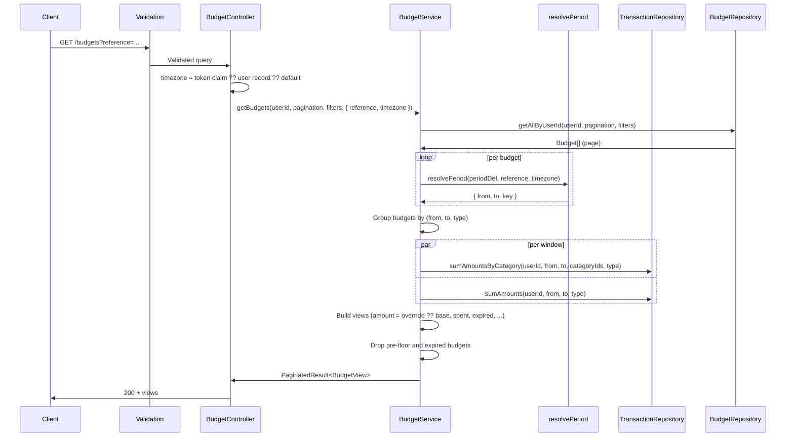
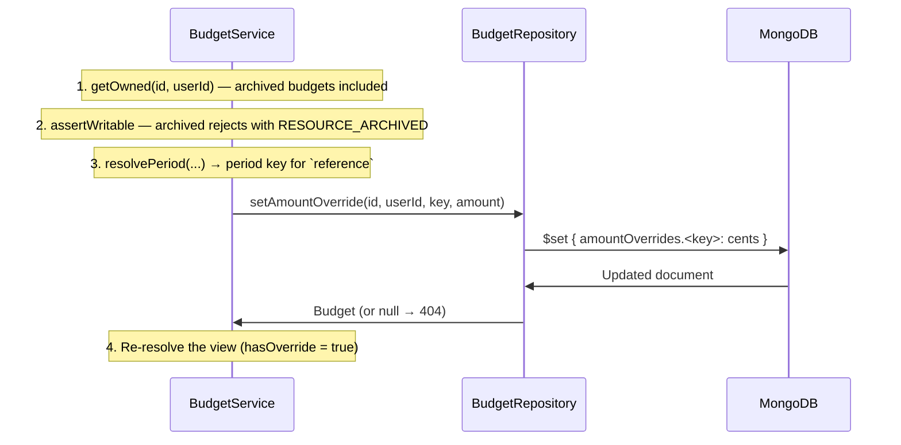

# Budgets Module

## What This Module Does

Manages recurring spending limits (and income goals) per user. A budget carries a **base amount**, a **period type**, and a set of **categories**; the API never stores the amount already spent — every read resolves the period window that a `reference` instant falls into and aggregates the matching transactions live.

Two shapes exist:

- **Per-category budget** — `categoryIds` lists one or more categories; `spent` is the sum of those categories in the window.
- **Global budget** — `categoryIds: []`; `spent` is the window's **total** flow of that type, uncategorized transactions and quick-adds included.

Budgets are archived, never hard-deleted, and can be restored. All budgets are user-scoped.

## Files and Responsibilities

| File                                                     | Role                                                                                   |
| -------------------------------------------------------- | -------------------------------------------------------------------------------------- |
| `src/app/routes/budgetRoutes.ts`                         | Route definitions with OpenAPI docs (CRUD at `/budgets` + amount overrides)             |
| `src/app/controllers/BudgetController.ts`                | Thin HTTP handler; resolves `reference` + the user's timezone into a `ViewContext`       |
| `src/app/services/BudgetService.ts`                      | Business logic: period resolution, spend aggregation, overlap rules, overrides          |
| `src/app/dtos/BudgetDTO.ts`                              | `CreateBudgetDTO`, `UpdateBudgetDTO`, `BudgetView` (the response shape)                  |
| `src/app/validation/schemas.ts`                          | `createBudgetSchema`, `updateBudgetSchema`, `getBudgetsSchema`, `budgetIdParamSchema`, `budgetAmountOverrideSchema` |
| `src/shared/budgetPeriod.ts`                             | `resolvePeriod()` — turns a period type + reference into `{ from, to, key }`             |
| `src/domain/entities/Budget.ts`                          | Budget domain entity (`lifetimeFloor()`, `amountForPeriod()`)                            |
| `src/domain/repositories/budget/IBudgetRepository.ts`    | Repository interface (`BudgetFilters`, `findOverlapping`, override mutators)             |
| `src/infrastructure/repositories/budget/BudgetRepository.ts` | Mongoose implementation (cents ↔ decimal conversion, `$set`/`$unset` on override keys) |
| `src/infrastructure/models/BudgetModel.ts`               | Mongoose model and indexes                                                              |

## Public API

Every route accepts an optional `reference` query parameter (ISO 8601, offsets accepted). It selects **which period instance** the response resolves; it defaults to now. `DELETE /budgets/:id` accepts it for uniformity but ignores it.

### `GET /budgets`

List budgets as **views** for the reference period (paginated, offset + cursor).

| Parameter         | Type    | Description                                                     |
| ----------------- | ------- | --------------------------------------------------------------- |
| `reference`       | string  | Any instant inside the period to resolve (default: now)         |
| `includeArchived` | enum    | `"true"` also returns archived budgets                          |
| `includeExpired`  | enum    | `"true"` also returns expired CUSTOM budgets                    |
| `limit`           | number  | 1–100, default 20                                               |
| `offset`          | number  | Items to skip (offset pagination)                               |
| `cursor`          | string  | Last ID of the previous page (overrides `offset`)               |

Excluded by default: archived budgets, expired CUSTOM budgets, and budgets whose reference period ends at or before their `effectiveFrom` floor.

> The `expired` / lifetime filters run **after** pagination, so a page can hold fewer than `limit` items while `pagination.hasMore` is still `true`. Follow `hasMore` / `nextCursor`, never `data.length`.

### `POST /budgets`

Create a budget.

```json
{
  "name": "Groceries",
  "color": "GREEN",
  "categoryIds": ["019576a0-..."],
  "type": "EXPENSE",
  "amount": 450.0,
  "periodType": "MONTHLY",
  "note": "Weekly shop + market"
}
```

- `categoryIds` — up to 20 UUIDs; **empty array creates a global budget**.
- `type` — `EXPENSE` (default) or `INCOME`.
- `amount` — decimal, positive, at most 2 decimals.
- `periodStartDate` / `periodEndDate` — required with `periodType: "CUSTOM"`, rejected for every other period type.
- `effectiveFrom` — optional backdating of the budget's lifetime floor.
- `currency` is **stamped by the server** from the owner's currency; it is not accepted from the client.

Responds `201` with the view resolved for the reference period.

**Client-minted `id` (optional).** An offline client can mint the UUID itself and send it as `id`; the server never replaces it. Replaying the exact same create returns **200** with the stored budget instead of creating a second one. The same id with a **different payload** — or an id that belongs to **another user** — is rejected with **409 `ID_TAKEN`**; the answer is identical in both cases, and a foreign document is never read. Without `id` the behaviour is unchanged: the server mints one and answers `201`.


### `GET /budgets/:id`

Always responds for owned budgets: archived ones stay readable (with `archivedAt` set) and expired CUSTOM ones come back with `expired: true`.

### `PUT /budgets/:id`

Partial update. At least one field must be present. Archived budgets are not writable (`RESOURCE_ARCHIVED`).

Override side effects:

- Changing `periodType` clears **all** `amountOverrides` (override keys are period-type specific) and, when moving away from `CUSTOM`, nulls the CUSTOM dates.
- Moving a `CUSTOM` window (`periodStartDate` / `periodEndDate`) clears its overrides — their keys encode the window dates.

### `DELETE /budgets/:id`

Archives the budget (soft delete, sets `archivedAt`). Idempotent: archiving an already-archived budget is a no-op success.

### `POST /budgets/:id/restore`

Brings an archived budget back **exactly as it was**: overrides, `effectiveFrom`, note, colour and `categoryIds` return untouched, archived categories still listed in `archivedCategoryIds`. A finished `CUSTOM` one returns with `expired: true`, so it shows among the ended ones rather than in the active list. Accepts `reference` like the rest of the budget routes and answers with the resolved `BudgetView`.

Idempotent — restoring an active budget returns it unchanged.

It takes **no body**. Coming out of the archive has to obey the same overlap rule as creating: if another active budget of the same type and period already covers one of its categories (or both are global; for `CUSTOM`, only one whose date window intersects), the restore is refused with **400 `BUDGET_PERIOD_OVERLAP`**. Changing its categories or period to make room would make it a different budget, so the user creates a new one instead. The un-archive is a single write, so the partial unique index judges the resulting state and a concurrent restore loses with **409 `DUPLICATE`**.

### `PUT /budgets/:id/amount`

Overrides the amount for the period containing `reference`, without touching `baseAmount` — "this month I budget more than usual". Body: `{ "amount": 300 }`.

`amount: 0` is allowed and means "this budget does not apply this period"; it is **not** the same as removing the override. The response comes back with `hasOverride: true`.

### `DELETE /budgets/:id/amount`

Drops the override for the period containing `reference`, so the period falls back to `baseAmount` and the view reports `hasOverride: false`. Removing a non-existent override is a no-op success.

### Response shape (`BudgetView`)

| Field                 | Meaning                                                                     |
| --------------------- | --------------------------------------------------------------------------- |
| `categoryIds`         | Tracked categories; `[]` means global                                       |
| `archivedCategoryIds` | Subset of `categoryIds` the user archived — the budget still tracks them     |
| `currency`            | ISO 4217 code stamped at creation                                           |
| `periodKey`           | Stable key of the resolved period instance (e.g. `"2026-08"`)               |
| `periodFrom` / `periodTo` | The half-open window `[from, to)` the spend was aggregated over          |
| `baseAmount`          | The budget's base amount                                                    |
| `amount`              | Resolved for this period: `override ?? baseAmount`                          |
| `spent`               | Live aggregation of matching transactions inside the window                 |
| `hasOverride`         | `true` when `amount` comes from a per-period override                       |
| `expired`             | CUSTOM only: the fixed window already ended relative to `reference`         |
| `effectiveFrom`       | The lifetime floor (`effectiveFrom ?? createdAt`, capped by a CUSTOM start) |
| `archivedAt`          | Non-null once archived                                                      |

## Period Types

Windows are half-open `[from, to)` and computed in the **user's IANA timezone**, so a month starts at their local midnight, not UTC's.

| Type        | Window                                                         | Period key example  | Expires |
| ----------- | -------------------------------------------------------------- | ------------------- | ------- |
| `WEEKLY`    | ISO week containing `reference`                                | `2026-W35`          | No      |
| `BIWEEKLY`  | 2-week window on a global grid anchored to the week of 2024-01-01 | `2026-BW35`      | No      |
| `MONTHLY`   | Calendar month                                                 | `2026-08`           | No      |
| `QUARTERLY` | Calendar quarter                                               | `2026-Q3`           | No      |
| `YEARLY`    | Calendar year                                                  | `2026`              | No      |
| `CUSTOM`    | The explicit `periodStartDate` → `periodEndDate` window        | `1767225600000_1769904000000` (epoch millis) | Yes |

Recurring types roll forward forever: there is always a "current" instance. `CUSTOM` is a one-shot window — once `reference` reaches `periodEndDate` the budget is `expired` and drops out of the default listing until `includeExpired=true`.

> Period keys are used as Mongo `$set` paths for `amountOverrides`, so they must never contain dots. CUSTOM keys use epoch millis for exactly this reason, and an unknown period type fails loudly instead of falling back to an ISO string.

## Lifetime Floor (`effectiveFrom`)

A budget does not exist before its floor. `Budget.lifetimeFloor()` returns `effectiveFrom ?? createdAt`, except that a `CUSTOM` budget whose `periodStartDate` precedes that floor uses the window start instead — an explicitly backdated CUSTOM window must still list.

`GET /budgets` drops any budget whose resolved `periodTo` is at or before its floor, so browsing months before the budget existed shows nothing rather than a phantom limit.

## How `spent` Is Computed

`spent` is never stored. `BudgetService.toViews()` resolves every budget's window, groups budgets that share the same `(from, to, type)` window, and issues **one aggregation per window**:

- Windows containing per-category budgets → `sumAmountsByCategory()` over the union of their category ids, then each budget sums its own slice.
- Windows containing a global budget → `sumAmounts()`, the window's total for that flow type regardless of category.

Both aggregations skip soft-deleted transactions (`deletedAt: null`) and match only the budget's `type` (`EXPENSE` or `INCOME`), so `ADJUSTMENT` and `TRANSFER` never move a budget.

## Internal Flow



### Amount Override



## Dependencies

**Imports:**

- `domain/entities/Budget` — Budget entity
- `domain/repositories/budget/IBudgetRepository` — Budget data access
- `domain/repositories/transaction/ITransactionRepository` — live spend aggregation
- `domain/repositories/category/ICategoryRepository` — category validation and archived-id lookup
- `domain/repositories/user/IUserRepository` — reads the owner's currency at creation
- `shared/budgetPeriod` — `resolvePeriod()`
- `shared/currency`, `shared/money`, `shared/errors`, `shared/pagination`
- `luxon` (via `shared/budgetPeriod`) — timezone-aware period arithmetic

**Imported by:**

- Budget routes registered in `src/app.ts` at `/budgets`, after `authMiddleware`

**Cross-module dependency:** `BudgetService` reads three other modules' repositories (transactions, categories, users). It never writes to them.

## Environment Variables

None specific to this module.

## Error States

| Error / code                | Status | Condition                                                                      |
| --------------------------- | ------ | ------------------------------------------------------------------------------ |
| `ValidationError`           | 400    | Invalid body or query (bad color, >20 categories, amount with >2 decimals, …)   |
| `BadRequest`                | 400    | `CUSTOM` without both dates, or `startDate >= endDate`                          |
| `BadRequest`                | 400    | `periodStartDate` / `periodEndDate` sent for a non-CUSTOM budget                |
| `BUDGET_PERIOD_OVERLAP`     | 400    | A budget for this type + period type already covers one of the categories (`CUSTOM`: only when the date windows intersect) |
| `CATEGORY_ARCHIVED`         | 400    | Assigning an archived category (keeping one the budget already had is allowed)  |
| `CATEGORY_TYPE_MISMATCH`    | 400    | Category type differs from the budget type                                      |
| `RESOURCE_ARCHIVED`         | 400    | Writing to (or overriding the amount of) an archived budget                     |
| `Unauthorized`              | 401    | Missing, invalid or expired access token                                        |
| `NotFound`                  | 404    | Budget missing **or owned by another user** (uniform, so ids can't be probed)   |
| `NotFound`                  | 404    | A referenced category is missing or not owned                                   |
| `DUPLICATE`                 | 409    | A concurrent create lost the race to the unique partial index (`CUSTOM`: identical window) |
| `ID_TAKEN`                  | 409    | The client-minted `id` is already in use (different payload, or another user's) |

## Overlap Rule

`findOverlapping()` rejects a second **active** budget with the same `userId`, `type`, and `periodType` that shares any category id. A global budget (`categoryIds: []`) only conflicts with another global one — by design it coexists with per-category budgets, since it measures a different thing.

`CUSTOM` is the exception: two custom budgets over the same category coexist as long as their half-open windows `[periodStartDate, periodEndDate)` do not intersect ("Vacation July" and "Vacation December" are two budgets, not a duplicate). Windows that merely touch (one ends the instant the other starts) do not intersect. Create, update (against the **moved** window) and restore all apply the same check.

The rule is enforced twice: in the service (readable `BUDGET_PERIOD_OVERLAP`) and by a unique partial index `{ userId, type, periodType, categoryIds, periodStartDate, periodEndDate }` limited to `archivedAt: null`, which catches concurrent creates as a `409 DUPLICATE`. Recurring budgets store `null` dates, so for them the key collapses to the period type as before. For `CUSTOM` the index only catches an **identical** window (the double-submit case); two concurrent creates with different but intersecting windows are not caught by it — an interval-intersection constraint cannot be expressed as a unique index, and the service check is the only guard there. Archiving a budget frees the slot.

> The index key changed in W-28. In development, indexes are created on connect but never dropped, so a database that already had the old `{ userId, type, periodType, categoryIds }` index keeps refusing a second `CUSTOM` per category with `409 DUPLICATE` until `npm run db:sync-indexes` drops it. The deploy step runs that sync, so production picks it up on its own.

## Money Representation

The API speaks **decimals** (max 2 decimal places, capped at `MAX_AMOUNT`); MongoDB stores **integer cents**. `BudgetRepository` converts on both edges — `amount` and every value inside the `amountOverrides` map.

## How to Extend

- To add a new period type: add it to `BUDGET_PERIOD_TYPES` in `src/shared/constants.ts`, handle it in `resolvePeriod()`, and **add a key format in `periodKey()`** — the default branch throws on purpose, because a key containing a dot would corrupt `amountOverrides`
- To add rollover (unspent amount carried to the next period): compute it in `toViews()` from the previous period's window; do not persist a running balance
- To surface budget progress in stats: reuse `sumAmountsByCategory()` rather than adding a second aggregation path
- Restore mirrors the account/category pattern, with the overlap rule applied on the way out and the unique index catching a concurrent restore
