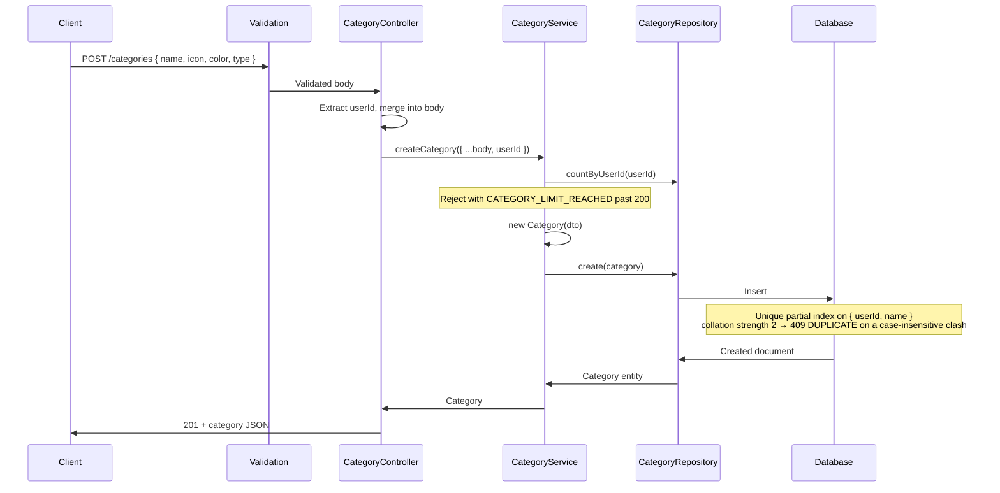
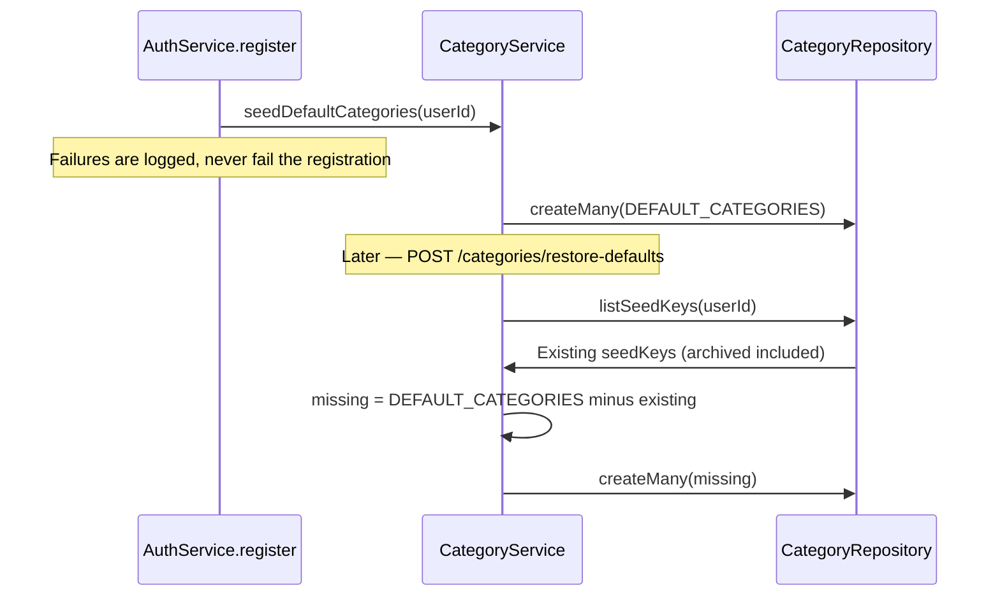

# Categories Module

## What This Module Does

Manages transaction categories. Categories are user-scoped — each user has their own set. Categories are referenced by transactions (to classify spending/income) and by budgets (to scope a limit). Each category has a `name`, and optionally an `icon` (a Lucide key from the curated `CATEGORY_ICONS` set in `src/shared/icons.ts`), a `color`, and a `type` (`INCOME` / `EXPENSE` / `TRANSFER`).

Two behaviours set this module apart from plain CRUD:

- **Seeded defaults** — registering a user seeds 10 default categories. Each carries a stable `seedKey`, which makes `POST /categories/restore-defaults` idempotent across renames and archives.
- **Archiving** — `DELETE` is a soft delete (`archivedAt`), reversible through `POST /categories/:id/restore`. Transactions keep pointing at archived categories, so history is never rewritten.

## Files and Responsibilities

| File                                                            | Role                                                                            |
| --------------------------------------------------------------- | ------------------------------------------------------------------------------- |
| `src/app/routes/categoryRoutes.ts`                              | Route definitions with OpenAPI docs (CRUD at `/categories` + restore endpoints)  |
| `src/app/controllers/CategoryController.ts`                     | Thin HTTP handler, delegates to CategoryService                                  |
| `src/app/services/CategoryService.ts`                           | Business logic: ownership checks, archive/restore, seeding, type-lock, per-user cap |
| `src/app/dtos/CategoryDTO.ts`                                   | `CreateCategoryDTO`, `UpdateCategoryDTO`                                         |
| `src/app/validation/schemas.ts`                                 | `createCategorySchema`, `updateCategorySchema`, `getCategoriesSchema`            |
| `src/shared/defaultCategories.ts`                               | `DEFAULT_CATEGORIES` — the 10 seeded defaults with their `seedKey`s              |
| `src/shared/icons.ts`                                           | `CATEGORY_ICONS` — curated Lucide keys a category may use (mirrors the UI design) |
| `src/domain/entities/Category.ts`                               | Category domain entity                                                           |
| `src/domain/repositories/category/ICategoryRepository.ts`       | Repository interface                                                             |
| `src/infrastructure/repositories/category/CategoryRepository.ts` | Mongoose implementation                                                          |
| `src/infrastructure/models/CategoryModel.ts`                    | Mongoose model and indexes (case-insensitive unique name)                        |

## Public API

### `GET /categories`

Get all categories for the authenticated user (paginated, offset + cursor).

| Parameter         | Type   | Description                                                    |
| ----------------- | ------ | -------------------------------------------------------------- |
| `limit`           | number | 1–100, default 20                                              |
| `offset`          | number | Items to skip (offset pagination)                              |
| `cursor`          | string | Last ID of the previous page (overrides `offset`)              |
| `ids`             | string | Comma-separated list of category UUIDs (1–100)                 |
| `type`            | enum   | Filter by `INCOME`, `EXPENSE`, or `TRANSFER`                   |
| `includeArchived` | enum   | `"true"` also returns archived categories (hidden by default)  |

### `POST /categories`

Create a new category. Requires: `name` (1–255 chars). Optional: `icon` (one of `CATEGORY_ICONS`; anything else is `400 VALIDATION`), `color`, `type`. The former free-text `emoji` field was removed in favour of `icon` (2026-09); an `emoji` key in the body is dropped by validation.

Names are unique per user, **case-insensitively** — "Comida" and "comida" collide; accents stay distinct. A user is capped at 200 categories (`CATEGORY_LIMIT_REACHED`).

**Client-minted `id` (optional).** An offline client can mint the UUID itself and send it as `id`; the server never replaces it. Replaying the exact same create returns **200** with the stored category instead of creating a second one. The same id with a **different payload** — or an id that belongs to **another user** — is rejected with **409 `ID_TAKEN`**; the answer is identical in both cases, and a foreign document is never read. Without `id` the behaviour is unchanged: the server mints one and answers `201`.

### `POST /categories/restore-defaults`

Recreate the missing default categories. Idempotent by `seedKey`: archived seed categories count as present (the user removed them on purpose) and renamed ones keep their `seedKey`, so neither is duplicated. Responds `200` with `{ "data": [...] }` — an empty array when nothing was missing.

### `GET /categories/:id`

Get a single category by ID. Archived categories stay readable here (`archivedAt` tells them apart); only the listing hides them.

### `PUT /categories/:id`

Update a category. Partial updates supported (`name`, `icon` — `null` clears it —, `color`, `type`). At least one field must be present. Archived categories are not writable (`RESOURCE_ARCHIVED`).

**`type` is immutable once transactions reference the category** (`CATEGORY_TYPE_LOCKED`): the type of a category with history is part of that history, and changing it would silently reclassify stats. Create a new category instead.

### `DELETE /categories/:id`

Archive the category (soft delete, sets `archivedAt`). Allowed even with linked transactions — they keep pointing at it. Idempotent: archiving an already-archived category is a no-op success.

An archived category can no longer be assigned to a new transaction or budget (`CATEGORY_ARCHIVED`), but a transaction or budget that already had it may keep it.

### `POST /categories/:id/restore`

Un-archive a category. Idempotent: restoring an already-active category returns it unchanged. Fails with `409 DUPLICATE` when another active category took its name meanwhile.

## Internal Flow

### Seeding and Re-seeding

## Dependencies

**Imports:** `shared/errors`, `shared/pagination`, `shared/defaultCategories`, `domain/entities/Category`, `domain/repositories/category/ICategoryRepository`, `domain/repositories/transaction/ITransactionRepository` (to count linked transactions before a type change), DTOs

**Imported by:**

- Category routes registered in `src/app.ts` at `/categories`, after `authMiddleware`
- `AuthService` calls `seedDefaultCategories()` on registration
- `TransactionService` and `BudgetService` validate `categoryId` references through `ICategoryRepository`

## Environment Variables

None specific to this module.

## Error States

| Error / code              | Status | Condition                                                       |
| ------------------------- | ------ | --------------------------------------------------------------- |
| `ValidationError`         | 400    | Invalid input (missing name, name too long, unknown type/color)  |
| `BadRequest`              | 400    | ID mismatch between URL param and body                           |
| `CATEGORY_LIMIT_REACHED`  | 400    | The user already has 200 categories                              |
| `RESOURCE_ARCHIVED`       | 400    | Updating an archived category (restore it first)                 |
| `CATEGORY_TYPE_LOCKED`    | 400    | Changing `type` on a category that already has transactions      |
| `Unauthorized`            | 401    | Missing, invalid or expired access token                         |
| `NotFound`                | 404    | Category missing **or owned by another user**                    |
| `DUPLICATE`               | 409    | An active category already uses this name (case-insensitively)   |
| `ID_TAKEN`                | 409    | The client-minted `id` is already in use (different payload, or another user's) |
| `STALE_UPDATE`            | 409    | `If-Match` no longer matches the stored version (`current` carries the server's copy) |

> Foreign categories return **404, not 403** — the response is uniform for "missing" and "not yours" so category ids cannot be probed.

## Optimistic concurrency (`If-Match`)

Every write below accepts an optional `If-Match` header carrying the `updatedAt`
this client last read, verbatim as the API prints it
(`2026-09-03T18:00:00.000Z`; an ISO 8601 datetime with an offset is also
accepted, a bare date is not — that is `400 VALIDATION`).

`PUT /categories/:id` · `DELETE /categories/:id` · `POST /categories/:id/restore`

The write only lands if the server still holds that version. Otherwise the answer
is **409 `STALE_UPDATE`**, and its body carries `current`: the category as the server
has it now, in the same shape a `GET` would return — so a client can show
"Server / This device" without a second request.

Two rules worth knowing:

- **The condition travels inside the write's own filter**, not only in a check
  before it. Two clients holding the same version cannot both win.
- **`STALE_UPDATE` outranks `RESOURCE_ARCHIVED` and the other write guards.** A
  caller writing against an old version cannot know about a state it has not
  read yet; re-reading tells it everything at once.

Without the header nothing changes: the write is unconditional, exactly as before.

## Default Categories

`DEFAULT_CATEGORIES` in `src/shared/defaultCategories.ts` holds 10 entries — 3 `INCOME` (Salary, Business, Other Income), 5 `EXPENSE` (Housing, Food, Transportation, Bills & Services, Lifestyle) and 2 `TRANSFER` (Transfer, Credit Card Payment) — each with an icon, a color, and a stable `seedKey` such as `"salary"` or `"bills-services"`.

The `seedKey` is the category's identity for re-seeding: it survives renames, so `restore-defaults` never duplicates a default the user simply renamed, and archived seeds count as present because their removal was deliberate.

## How to Extend

- To add a new default category: append an entry to `DEFAULT_CATEGORIES` with a fresh `seedKey`. Existing users pick it up on their next `POST /categories/restore-defaults` — never reuse or rename an existing `seedKey`
- To add subcategories: add a `parentCategoryId` field, update entity/model, add validation — and decide how stats should roll children up before touching the aggregation
- Archiving a category does not cascade to transactions or budgets by design; both keep their reference and surface it (budgets expose `archivedCategoryIds`)

### Restoring under a different name

`POST /categorys/:id/restore` accepts an optional `{ name }`. Archiving frees a
name, so by the time you restore, another category may hold it — and then restore
answers **409 `DUPLICATE`** while `PUT` refuses the archived row with
**400 `RESOURCE_ARCHIVED`**. Without a way to rename on the way out, the only
escape was to go and rename the *other* category first.

The rename happens in the same write that clears `archivedAt`, so the unique
index judges the final state and nobody can take the name in between.
