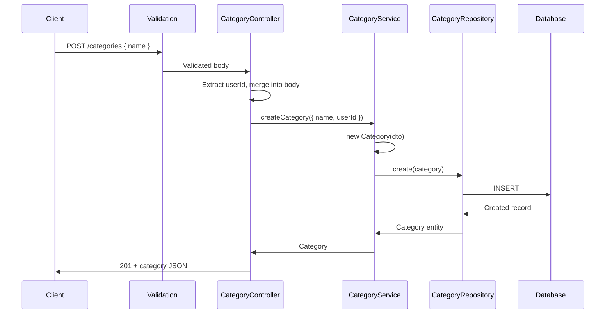

# Categories Module

## What This Module Does

Manages transaction categories. Categories are user-scoped — each user has their own set of categories. Categories are referenced by transactions to classify spending/income. Simple CRUD with ownership enforcement.

## Files and Responsibilities

| File                                                          | Role                                                             |
| ------------------------------------------------------------- | ---------------------------------------------------------------- |
| `src/app/routes/categoryRoutes.ts`                            | Route definitions with OpenAPI docs (full CRUD at `/categories`) |
| `src/app/controllers/CategoryController.ts`                   | Thin HTTP handler, delegates to CategoryService                  |
| `src/app/services/CategoryService.ts`                         | Business logic: ownership checks, CRUD operations                |
| `src/app/dtos/CategoryDTO.ts`                                 | `CreateCategoryDTO`, `UpdateCategoryDTO`                         |
| `src/app/validation/schemas.ts`                               | `createCategorySchema`, `updateCategorySchema`                   |
| `src/domain/entities/Category.ts`                             | Category domain entity                                           |
| `src/domain/repositories/category/ICategoryRepository.ts`     | Repository interface                                             |
| `src/domain/repositories/category/CategorySeqRepository.ts`   | Sequelize implementation                                         |
| `src/domain/repositories/category/CategoryMongoRepository.ts` | Mongoose implementation                                          |
| `src/domain/models/sequelize/CategoryModel.ts`                | Sequelize model                                                  |
| `src/domain/models/mongoose/CategoryMongoModel.ts`            | Mongoose model                                                   |

## Public API

### `GET /categories`

Get all categories for the authenticated user (paginated).

### `POST /categories`

Create a new category. Requires: `name`.

### `GET /categories/:id`

Get a single category by ID. Ownership enforced.

### `PUT /categories/:id`

Update a category. Supports: `name`.

### `DELETE /categories/:id`

Delete a category. Ownership enforced.

## Internal Flow

## Dependencies

**Imports:** `shared/errors`, `shared/pagination`, `domain/entities/Category`, `domain/repositories/category/ICategoryRepository`, DTOs

**Imported by:**

- Category routes registered in `src/app.ts`
- Transactions reference `categoryId` (optional foreign key)

## Environment Variables

None specific to this module.

## Error States

| Error             | Status | Condition                                   |
| ----------------- | ------ | ------------------------------------------- |
| `NotFoundError`   | 404    | Category ID does not exist                  |
| `ForbiddenError`  | 403    | Category belongs to another user            |
| `BadRequestError` | 400    | ID mismatch between URL param and body      |
| `ValidationError` | 400    | Invalid input (missing name, name too long) |

## How to Extend

- To add category icons or colors: add fields to entity, model, DTO, and validation schema
- To add subcategories: add a `parentCategoryId` field, update entity/model, add validation
- Deleting a category does not cascade-delete transactions — consider adding a check in `CategoryService.deleteCategory()` if this behavior is needed
