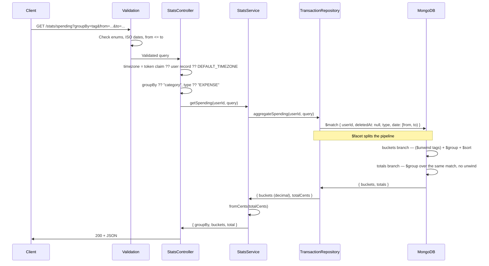

# Stats Module

## What This Module Does

Read-only aggregation over the user's transactions. A single endpoint, `GET /stats/spending`, buckets transactions by **category**, **day**, or **tag** and returns per-bucket totals plus a grand total.

The module owns no data of its own: it is a thin service over one MongoDB aggregation pipeline in `TransactionRepository.aggregateSpending()`. Buckets are computed in the **user's timezone**, so a "day" is their local day, not UTC's.

## Files and Responsibilities

| File                                                              | Role                                                                     |
| ----------------------------------------------------------------- | ------------------------------------------------------------------------ |
| `src/app/routes/statsRoutes.ts`                                   | Route definition with OpenAPI docs (`GET /stats/spending`)                |
| `src/app/controllers/StatsController.ts`                          | Resolves the user's timezone and applies the query defaults               |
| `src/app/services/StatsService.ts`                                | Delegates to the repository and converts the grand total from cents       |
| `src/app/validation/schemas.ts`                                   | `spendingStatsSchema`                                                     |
| `src/domain/repositories/transaction/ITransactionRepository.ts`   | `SpendingQuery`, `SpendingBucket`, `SpendingResult` contracts             |
| `src/infrastructure/repositories/transaction/TransactionRepository.ts` | `aggregateSpending()` — the `$match` / `$facet` pipeline             |

## Public API

### `GET /stats/spending`

Aggregate spending for the authenticated user.

| Parameter | Type   | Required | Description                                                                 |
| --------- | ------ | -------- | --------------------------------------------------------------------------- |
| `groupBy` | enum   | No       | `category` (default), `day`, or `tag`                                       |
| `type`    | enum   | No       | `INCOME`, `EXPENSE` (default), `TRANSFER`, or `ADJUSTMENT`                  |
| `from`    | string | No       | Start of the range, **inclusive** (ISO 8601, offsets accepted)              |
| `to`      | string | No       | End of the range, **exclusive** — the range is half-open `[from, to)`       |

`from` must be before or equal to `to`, otherwise `400 VALIDATION`. Both bounds are optional; omitting them aggregates the user's whole history.

**Response (200):**

```json
{
  "groupBy": "category",
  "buckets": [
    { "key": "019576a0-...", "total": 320.5, "count": 12, "avg": 26.71 },
    { "key": "uncategorized", "total": 45.0, "count": 3, "avg": 15.0 }
  ],
  "total": 365.5
}
```

| Field    | Meaning                                                                       |
| -------- | ----------------------------------------------------------------------------- |
| `key`    | Category ID, `YYYY-MM-DD` day, or tag — depending on `groupBy`                 |
| `total`  | Sum of the bucket's amounts, as a decimal                                      |
| `count`  | Number of transactions in the bucket                                           |
| `avg`    | `total / count`, rounded to the cent                                           |
| `total` (top level) | Grand total, computed **without** the tag unwind (never double-counted) |

## Grouping Semantics

| `groupBy`  | Bucket key                                          | Ordering                                        | Fallback bucket  |
| ---------- | --------------------------------------------------- | ----------------------------------------------- | ---------------- |
| `category` | `categoryId`                                        | `total` descending                              | `uncategorized`  |
| `day`      | `YYYY-MM-DD` in the user's timezone                 | Date ascending                                  | —                |
| `tag`      | One bucket per tag (the transaction is unwound)     | `total` descending                              | `untagged`       |

- **`day`** is a time series: it comes back ascending and **skips days with no transactions**. The client fills the gaps — the API does not emit zero rows.
- **`tag`** unwinds the `tags` array, so a multi-tag transaction contributes its full amount to **every** one of its tag buckets. The buckets can therefore add up to more than `total`; the top-level `total` is the real, non-double-counted sum, computed in a separate `$facet` branch that never sees the unwind.
- Transactions with no category land in `uncategorized`; transactions with no tags land in `untagged`.

## Filtering Rules

Applied in the pipeline's `$match`:

- **Ownership** — `userId` always scopes the aggregation.
- **Soft deletes** — `deletedAt: null`; deleted transactions never appear.
- **`ADJUSTMENT` exclusion** — adjustments are balance reconciliations, not real cash flow. Because `type` defaults to `EXPENSE`, they are invisible by default; and when no type resolves, the match falls back to `{ $ne: "ADJUSTMENT" }`. They only show up when asked for explicitly with `type=ADJUSTMENT`.
- **Date range** — half-open `[from, to)` (`$gte` / `$lt`), consistent with budget windows. Bounds are compared against the transaction's `date`, not `createdAt`, so backdated transactions land in the period they belong to.

## Timezone Handling

The controller resolves the timezone in this order:

1. The `timezone` claim inside the access token (no DB round trip).
2. The user record's `timezone` — covers tokens minted before the claim existed.
3. `DEFAULT_TIMEZONE` (`America/Bogota`).

Only `groupBy=day` uses it, via `$dateToString`'s `timezone` option, so day boundaries are the user's local midnight. Note the token carries up to ~15 minutes of staleness: changing the timezone takes full effect on the next access token.

## Internal Flow



The `$facet` is what keeps `total` honest: both branches read the same `$match` output, but only the bucket branch applies the tag `$unwind`.

## Dependencies

**Imports:**

- `domain/repositories/transaction/ITransactionRepository` — the only data source
- `shared/money` — `fromCents()`
- `shared/timezone` — `DEFAULT_TIMEZONE`
- `app/factories/RepositoryFactory` — repository wiring in the controller

**Imported by:**

- Stats routes registered in `src/app.ts` at `/stats`, after `authMiddleware`

This module has **no** repository, entity, model, or DTO of its own — it deliberately reuses the transactions module's aggregation contract.

## Environment Variables

None specific to this module.

## Error States

| Error             | Status | Condition                                                            |
| ----------------- | ------ | -------------------------------------------------------------------- |
| `ValidationError` | 400    | Invalid `groupBy` / `type` enum value                                |
| `ValidationError` | 400    | `from` or `to` is not a valid ISO 8601 date                          |
| `ValidationError` | 400    | `from` is later than `to`                                            |
| `Unauthorized`    | 401    | Missing, invalid or expired access token                             |

The endpoint never 404s: an empty result set is a `200` with `buckets: []` and `total: 0`.

## Money Representation

The pipeline sums the stored **integer cents**. `avg` is rounded to the nearest cent before conversion, and the grand total is converted in `StatsService`, so every number in the response is a decimal — consistent with the rest of the API.

## How to Extend

- To add a grouping dimension (e.g. `account`, `month`): extend `SpendingGroupBy`, the `groupBy` enum in `spendingStatsSchema`, and the `groupId` expression in `aggregateSpending()`. Decide up front whether the new dimension can double-count — if it can, keep the `$facet` totals branch free of it
- To compare periods: issue two calls rather than adding a second range to the pipeline; the response is small and cacheable client-side
- To include `ADJUSTMENT` in a combined view: it must stay opt-in — never fold it into the default `EXPENSE` aggregation, or reconciliations would read as spending
- Any new filter belongs in the `$match` stage, before the `$facet`, so both branches see it
