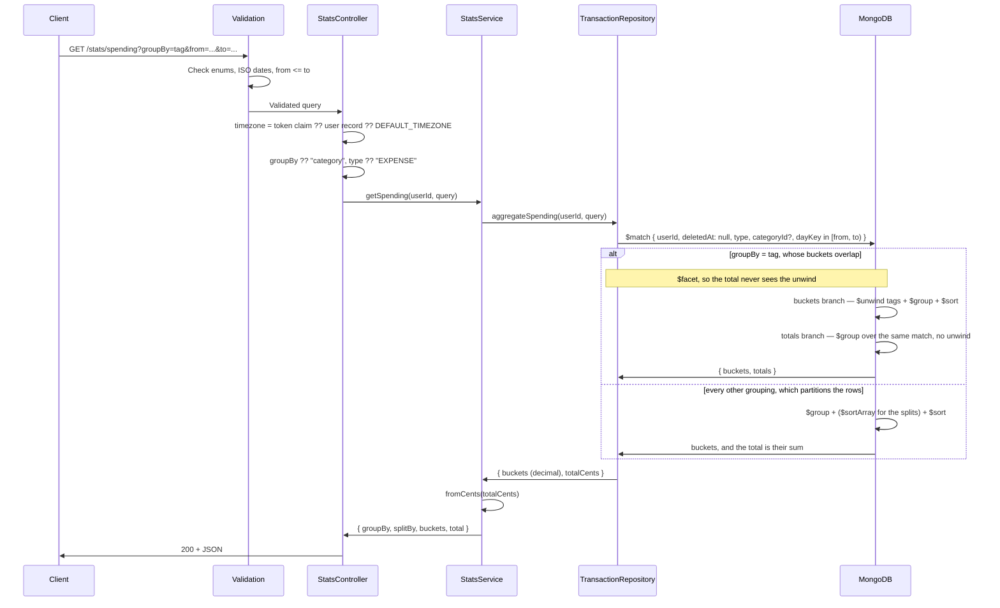

# Stats Module

## What This Module Does

Read-only aggregation over the user's transactions. A single endpoint, `GET /stats/spending`, buckets transactions by **category**, **day**, **month**, **account** or **tag** and returns per-bucket totals plus a grand total. It can narrow to a set of categories (`categoryIds`) and add a second dimension inside each bucket (`splitBy`), so the screens that need "per category AND month" are one request instead of twelve.

The module owns no data of its own: it is a thin service over one MongoDB aggregation pipeline in `TransactionRepository.aggregateSpending()`. Buckets are computed in the **user's timezone**, so a "day" is their local day, not UTC's.

## Files and Responsibilities

| File                                                              | Role                                                                     |
| ----------------------------------------------------------------- | ------------------------------------------------------------------------ |
| `src/app/routes/statsRoutes.ts`                                   | Route definition with OpenAPI docs (`GET /stats/spending`)                |
| `src/app/controllers/StatsController.ts`                          | Resolves the user's timezone and applies the query defaults               |
| `src/app/services/StatsService.ts`                                | Delegates to the repository and converts the grand total from cents       |
| `src/app/validation/schemas.ts`                                   | `spendingStatsSchema`                                                     |
| `src/domain/repositories/transaction/ITransactionRepository.ts`   | `SpendingQuery`, `SpendingBucket`, `SpendingResult` contracts             |
| `src/infrastructure/repositories/transaction/TransactionRepository.ts` | `aggregateSpending()` — the `$match` / `$facet` pipeline             |

## Public API

### `GET /stats/spending`

Aggregate spending for the authenticated user.

| Parameter | Type   | Required | Description                                                                 |
| --------- | ------ | -------- | --------------------------------------------------------------------------- |
| `groupBy` | enum   | No       | `category` (default), `day`, `month`, `account`, or `tag`                   |
| `splitBy` | enum   | No       | `category`. Adds `splits` inside each bucket. Only with `month` or `account`, and only with `from` and `to` |
| `categoryIds` | string | No   | Comma-separated category ids, at most 20: aggregates only those             |
| `type`    | enum   | No       | `INCOME`, `EXPENSE` (default), `TRANSFER`, or `ADJUSTMENT`                  |
| `from`    | string | No       | Start of the range, **inclusive** (ISO 8601, offsets accepted)              |
| `to`      | string | No       | End of the range, **exclusive** — the range is half-open `[from, to)`       |

`from` must be before or equal to `to`, otherwise `400 VALIDATION`. Both bounds are optional; omitting them aggregates the user's whole history.

`splitBy=category` is refused with `groupBy=category` (it would repeat the grouping), with `groupBy=tag` (the unwind already duplicates each row, so the splits would multiply it), with `groupBy=day` (the only grouping whose bucket count grows with the window), and with no `from`/`to`. The cap of 20 on `categoryIds` is the same one a budget puts on its own categories — these filters exist to serve one.

**Response (200):**

```json
{
  "groupBy": "category",
  "splitBy": null,
  "buckets": [
    { "key": "019576a0-...", "total": 320.5, "count": 12, "avg": 26.71 },
    { "key": "uncategorized", "total": 45.0, "count": 3, "avg": 15.0 }
  ],
  "total": 365.5
}
```

With `groupBy=month&splitBy=category`, each bucket also carries its composition:

```json
{
  "groupBy": "month",
  "splitBy": "category",
  "buckets": [
    {
      "key": "2026-08",
      "total": 365.5,
      "count": 15,
      "avg": 24.37,
      "splits": [
        { "key": "019576a0-...", "total": 320.5, "count": 12, "avg": 26.71 },
        { "key": "uncategorized", "total": 45.0, "count": 3, "avg": 15.0 }
      ]
    }
  ],
  "total": 365.5
}
```

| Field    | Meaning                                                                       |
| -------- | ----------------------------------------------------------------------------- |
| `key`    | Category id, `YYYY-MM-DD` day, `YYYY-MM` month, account id, or tag — depending on `groupBy` |
| `splits` | Only when `splitBy` was asked for: the same shape, one per category. Splits never overlap, so they add up to the bucket's own `total` |
| `splitBy` (top level) | The second dimension asked for, or `null`                        |
| `total`  | Sum of the bucket's amounts, as a decimal                                      |
| `count`  | Number of transactions in the bucket                                           |
| `avg`    | `total / count`, rounded to the cent                                           |
| `total` (top level) | Grand total, computed **without** the tag unwind (never double-counted) |

## Grouping Semantics

| `groupBy`  | Bucket key                                          | Ordering                                        | Fallback bucket  |
| ---------- | --------------------------------------------------- | ----------------------------------------------- | ---------------- |
| `category` | `categoryId`                                        | `total` descending, key ascending on a tie      | `uncategorized`  |
| `day`      | The transaction's frozen `dayKey`                   | Key ascending                                   | —                |
| `month`    | The first 7 characters of that same `dayKey`        | Key ascending                                   | —                |
| `account`  | `fromAccountId`, or `toAccountId` for `INCOME`      | `total` descending, key ascending on a tie      | `unassigned`     |
| `tag`      | One bucket per tag (the transaction is unwound)     | `total` descending, key ascending on a tie      | `untagged`       |

- **`day` and `month`** are time series: they come back ascending and **skip the days or months with no transactions**. The client fills the gaps — the API does not emit zero rows.
- **`month`** is cut from the frozen accounting day, not recomputed from the instant, so a month and its own days can never disagree about which window a row belongs to.
- **`account`** is the account the money left. Two exceptions have no `fromAccountId` and are keyed by the one they reached: `INCOME`, and an `ADJUSTMENT` that increases a balance. Every type the API accepts carries at least one account, so `unassigned` only ever holds a row written before that was enforced. A transfer between the user's own accounts is not spending and never reaches this grouping under the default `type=EXPENSE`.
- **`splitBy=category`** groups by the pair and then rolls up, so every row lands in exactly one split of exactly one bucket: unlike tags, the splits add up to the bucket. Splits are ranked the same way a category grouping is, by `$sortArray` inside each bucket. It takes only `month` and `account`, and only with `from` and `to`: those two are bounded — a window holds a few dozen months, and a user has a handful of accounts — while a day grouping would grow a split per category per day of the window (house rule 24).
- **`tag`** unwinds the `tags` array, so a multi-tag transaction contributes its full amount to **every** one of its tag buckets. The buckets can therefore add up to more than `total`; the top-level `total` is the real, non-double-counted sum, computed in a separate `$facet` branch that never sees the unwind.
- Transactions with no category land in `uncategorized`; transactions with no tags land in `untagged`.

## Filtering Rules

Applied in the pipeline's `$match`:

- **Ownership** — `userId` always scopes the aggregation.
- **Soft deletes** — `deletedAt: null`; deleted transactions never appear.
- **`categoryIds`** — one more key of the same `$match`: `categoryId: { $in: [...] }`. It drops every row with no category, quick-adds included: a budget that names its categories is not asking about the ones that have none.
- **`ADJUSTMENT` exclusion** — adjustments are balance reconciliations, not real cash flow. Because `type` defaults to `EXPENSE`, they are invisible by default; and when no type resolves, the match falls back to `{ $ne: "ADJUSTMENT" }`. They only show up when asked for explicitly with `type=ADJUSTMENT`.
- **Date range** — the run of **local days** that the half-open `[from, to)` covers in the account's timezone, compared against each transaction's frozen `dayKey` (see `transactions.md`), not against `createdAt`, so backdated transactions land in the period they belong to. A window that does not start and end at local midnight is widened to whole days. Rows written before `dayKey` existed are still answered by their instant, so nothing disappears before `npx tsx scripts/backfill-day-key.ts` runs.

## Timezone Handling

The controller resolves the timezone in this order:

1. The `timezone` claim inside the access token (no DB round trip).
2. The user record's `timezone` — covers tokens minted before the claim existed.
3. `DEFAULT_TIMEZONE` (`America/Bogota`).

It resolves the **days of the window**, and it is the fallback bucket key for a row whose `dayKey` is still null (through `$dateToString`). A stamped row does not use it at all: its day was frozen when it was written, so a change of timezone no longer moves past spending between buckets or months. Note the token carries up to ~15 minutes of staleness: changing the timezone takes full effect on the next access token, and until then the window is still cut with the old zone.

## Internal Flow



The `$facet` is what keeps `total` honest **for tags**: both branches read the same `$match` output, but only the bucket branch applies the `$unwind`. Every other grouping puts each row in exactly one bucket, so its total is the sum of the buckets and a second pass over the match would be work for nothing — measured over 60 000 rows of one user, a year by month costs 25 ms with the second branch and 13 ms without it (house rule 23).

## Dependencies

**Imports:**

- `domain/repositories/transaction/ITransactionRepository` — the only data source
- `shared/money` — `fromCents()`
- `shared/timezone` — `DEFAULT_TIMEZONE`
- `app/factories/RepositoryFactory` — repository wiring in the controller

**Imported by:**

- Stats routes registered in `src/app.ts` at `/stats`, after `authMiddleware`

This module has **no** repository, entity, model, or DTO of its own — it deliberately reuses the transactions module's aggregation contract.

## Environment Variables

None specific to this module.

## Error States

| Error             | Status | Condition                                                            |
| ----------------- | ------ | -------------------------------------------------------------------- |
| `ValidationError` | 400    | Invalid `groupBy` / `type` enum value                                |
| `ValidationError` | 400    | `from` or `to` is not a valid ISO 8601 date                          |
| `ValidationError` | 400    | `from` is later than `to`                                            |
| `ValidationError` | 400    | `categoryIds` is empty, holds something that is not a uuid, or names more than 20 |
| `ValidationError` | 400    | `splitBy=category` over any grouping but `month` and `account`, or with no `from`/`to` |
| `Unauthorized`    | 401    | Missing, invalid or expired access token                             |

The endpoint never 404s: an empty result set is a `200` with `buckets: []` and `total: 0`.

## Money Representation

The pipeline sums the stored **integer cents**. `avg` is rounded to the nearest cent before conversion, and the grand total is converted in `StatsService`, so every number in the response is a decimal — consistent with the rest of the API.

## How to Extend

- To add a grouping dimension: add it to `SPENDING_GROUP_BY` in `shared/constants.ts`. The schema (`spendingStatsSchema`) and the `StatsResponse` view (`swagger.ts`, through `enumOf`) read the enum from there. Two places cannot: the `enum:` inside the hand-written `@openapi` block of `statsRoutes.ts`, because it is a comment, and `bucketKeys()` in `scripts/offline-fixtures/derive.ts`, because that script is deliberately a second implementation and imports nothing from `src/`. Neither can drift quietly: `swaggerContract.test.ts` holds both the response view and the published query parameter to the enum, and `spendingKey()` here and `bucketKeys()` there are exhaustive switches, so a dimension added to the constant and nowhere else does not compile. Decide up front whether the new dimension can double-count: if it can, it needs the `$facet` totals branch that `tag` uses, and `splitBy` has to be refused over it. Decide too whether its bucket count grows with the window, as `day` does: if it does, it cannot take a `splitBy`
- To add a split dimension: extend `SpendingSplitBy` and the inner `$group` key. The rule to preserve is that splits partition a bucket; anything that can put one row in two splits breaks "the splits add up to the bucket"
- To compare periods: issue two calls rather than adding a second range to the pipeline; the response is small and cacheable client-side
- To include `ADJUSTMENT` in a combined view: it must stay opt-in — never fold it into the default `EXPENSE` aggregation, or reconciliations would read as spending
- Any new filter belongs in the `$match` stage, which is before everything — including the `$facet` that only `tag` still uses, so both of its branches see it

## Why This Endpoint Stays

The web client derives its own spending buckets from the offline mirror, so its screens no longer call this endpoint on every render. It is still the reference that derivation is checked against — the parity fixtures come from here — and the answer for any grouping or range the mirror cannot hold. See `sync.md`, "What the offline client still needs outside this module".

