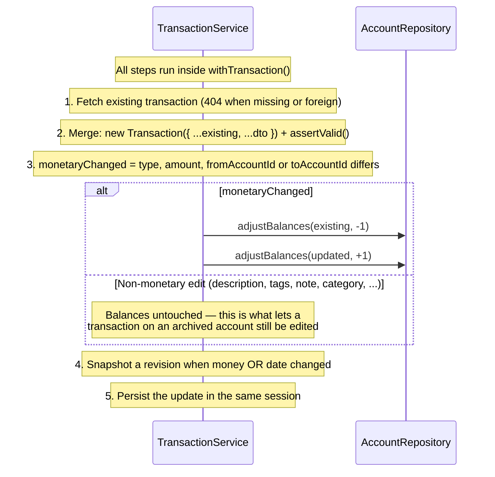

# Transactions Module

## What This Module Does

The most complex module in the system. Records financial transactions and automatically adjusts account balances. Supports four transaction types:

- **INCOME**: Money flowing into `toAccountId` (balance increases)
- **EXPENSE**: Money flowing out of `fromAccountId` (balance decreases)
- **TRANSFER**: Money moving from `fromAccountId` to `toAccountId` (one decreases, other increases)
- **ADJUSTMENT**: Balance reconciliation on exactly one account. Carries no category and is **excluded from spending stats and budgets** — it is not real cash flow.
- **SETTLEMENT**: Money between you and a person you split expenses with, on exactly one account. The same shape as an adjustment — no category, out of stats and budgets — and **recorded by a settle-up and nowhere else**: `POST /transactions` and the quick-add refuse it, and the movement cannot be edited or deleted on its own ([settlements.md](settlements.md)).

Create, update, and delete all run inside a **MongoDB transaction**, so the ledger and the account balances can never drift apart. On update, the original balance adjustments are reversed before applying new ones. Deletes are **soft** (`deletedAt`). All transactions are user-scoped.

Three fields are server-derived and never accepted from the client:

- **`source`** — `MANUAL` (normal create), `QUICK` (via `/transactions/quick`), or `IMPORT` (reserved for the future bank/CSV import).
- **`currency`** — stamped from the involved account when balances are applied.
- **`dayKey`** — the local accounting day (`YYYY-MM-DD`), see below.

## The accounting day (`dayKey`)

`date` is an **instant**. The day it belongs to is not: it depends on a timezone, and the account's
one can change. So every transaction also carries **`dayKey`**, the local day of `date` in the
account's timezone at the moment it was written, and that value is **frozen**:

- It is stamped on create and on quick-add (`TransactionService`, from the zone the controller
  resolved) and **re-stamped only when `date` changes**. An edit that touches anything else leaves it
  alone, even if the account has since moved to another zone.
- A calendar window — a month, a budget period, the day buckets of the chart — is a **run of calendar
  days**, so it filters on `dayKey`. Two consequences: a past month's total can no longer change when
  the account's timezone does, and a window that does not start and end at local midnight is widened
  to whole days.
- Rows written before the field existed have `dayKey: null`. Every day window keeps a second branch
  that answers them by their instant, exactly as before, so nothing disappears. **That branch is the
  design, not a migration waiting to happen:** the owner decided on 2026-09-10 not to backfill those
  rows, because the read path derives the same day the backfill would write. What it would add is
  freezing it, which only matters if the account's timezone changes — and then it would have to run
  _before_ the change to be worth anything. `scripts/backfill-day-key.ts` is there for that day; it
  has no npm alias so it does not sit in `npm run` unused.

The reason it is stored rather than derived: with a change of timezone, deriving it moves money
between months and budget periods retroactively. An expense logged at 11pm on Sep 30 in Bogota is
Oct 1 in UTC and Oct 1 in Madrid — reading it in another zone would take it out of September's total
and out of the budget period that already counted it.

## What counts as yours (`countsAsYours`)

**The amount is what left the account. What counts as yours is what left it minus what has come back.** They are the same figure on every movement except an expense split with other people, and the difference is the whole point of the shared feature: you paid $120,000 for dinner, half of it is Ana's, and until she pays you the whole $120,000 is still money you spent.

- It is **stored, not derived on read**. The alternative is every aggregation joining the shared collections to work out a figure it needs per row, and an offline mirror that cannot reproduce them.
- **Stats and the budgets measure it** — `aggregateSpending`, `sumAmountsByCategory` and `sumAmounts` all sum `countsAsYours`. **The listing does not**: a row's amount, a day's total and `summary.totalAmount` stay gross, because a list of movements is what moved through the accounts. The two figures are different on purpose and the transaction's detail is where the difference is explained.
- Rows written before the field existed have no `countsAsYours`, and **their whole amount is theirs** — every aggregation reads `$ifNull: ["$countsAsYours", "$amount"]`. That is the meaning of an absent field, not a migration waiting to happen: the field arrived with splitting, so a row without it was never split.
- A new amount on a movement carries the figure with it (`amount − what came back`), so an edit can never undo a payment.
- **What lowers it is a payment**, and only in the month the expense happened ([settlements.md](settlements.md)).

### The link to a shared expense

A split movement carries `sharedExpenseId` and `sharedGroupId`; the shared expense carries nothing of the user's. **`sharedGroupId` is for the client** — it opens the group without first fetching the expense — and no query here reads it; it cannot go stale because an expense never changes group, and an endpoint that moved one would have to write it. The link lives on this side because **a shared group is seen by everybody in it** and which movement of yours it is nobody else's business — the boundary in the second delivery is that a user's feed never carries another user's private rows, and a `transactionId` on a travelling object would be exactly that. `{ userId, sharedExpenseId }`, partial over the rows that have one, is what answers the other direction.

The two are **one fact seen from two sides**, so nothing may leave them saying different things:

| What happens                                                 | What it does                                                                                                                                                                                          |
| ------------------------------------------------------------ | ----------------------------------------------------------------------------------------------------------------------------------------------------------------------------------------------------- |
| `POST /shared-groups/{id}/expenses` with `transactionId`     | The expense takes the movement's amount, date and description; the movement takes the link and a `SPLIT` entry. One database transaction                                                              |
| The movement's amount, date or description changes           | Written on the expense too, in the same database transaction; a new amount **resolves the split again**                                                                                               |
| The movement's amount changes and the split is `EXACT`       | **400 `SPLIT_INVALID`**: it states amounts, so they stop adding up. Restate the split on the expense first, rather than have the server rescale what somebody typed                                   |
| The movement's type changes                                  | **400 `TRANSACTION_NOT_SPLITTABLE`**: only an expense can be split                                                                                                                                    |
| Editing the expense's amount, date, description or payer     | **400 `SHARED_EXPENSE_LINKED`**: those come from the movement. The expense takes only its split                                                                                                       |
| `DELETE /transactions/{id}`                                  | **The expense goes with it**, soft-deleted in the same database transaction: the group now costs that much less and every share falls, and what anybody had paid imputes over the lines that are left |
| `DELETE …/expenses/{expenseId}`                              | The movement stays, leaves the group, counts as yours in full again and records `UNSPLIT`                                                                                                             |
| People are added to the group with `applyToExistingExpenses` | Every movement whose expense was re-split records `SPLIT_EDITED`, in the same database transaction as the re-split                                                                                    |

`PUT /transactions/{id}` answers the movement plus **`restamped`**, and `DELETE /transactions/{id}` answers its message plus `restamped`: the expense and the other lines and movements the write rewrote along the way, each with the `updatedAt` it had before and the one it has now, so a device can move the guards of the writes it still has queued on them (T-145; `docs/modules/sync.md`, _Rows a write rewrote besides its own_). A movement in no group always answers it empty.

A movement a settle-up recorded carries **`sharedSettlementId`**, and it is locked the other way round: its money is the payment's, so an edit that touches the amount, the date, the type or the accounts is `400 SETTLEMENT_MOVEMENT_LOCKED` and so is deleting it — undo the payment and it goes with it. Its description, its category and its tags are yours to change. The field is published so a client can tell before it tries: the expenses that paying somebody back writes are ordinary expenses in every other way.

**On the kinds that are not spending, `countsAsYours` is just the amount and means nothing.** An `ADJUSTMENT` and a `SETTLEMENT` are excluded by their **type**, not by this figure; anything summing it — the offline projection included — has to exclude them the same way the aggregations here do.

Two of those are deliberately one-sided. **An archived group does not freeze your movements**: editing one still writes its expense, because an archived group is a read-only view of what happened and refusing to fix your own amount over it would block the wrong half. And **a new amount carries what has come back with it** — the figure is re-derived as `amount − what came back`, never reset — so a later edit cannot undo a payment. Only one thing still waits for payments to exist: taking an expense out of a group hands the movement its whole amount back, which is right **because a payment is re-imputed over the expenses that are left** (T-116) rather than belonging to the one that went.

**Adding a movement to a group changes no figure today**, which is what the screen has to say before it saves: the money left the account, so the expense keeps counting in full until somebody pays. No endpoint is needed for that warning — the client already holds the movement, its category and its month.

### Its history (`sharedHistory`)

One entry per thing that could have moved the figure, oldest first: `{ at, reason, countsAsYours }`, where `countsAsYours` is what it left behind. The reasons are `SPLIT`, `SPLIT_EDITED` (the expense's own split saved or cleared, or the group re-split by adding people), `AMOUNT_CHANGED`, `UNSPLIT`, **`PAYMENT`** (money came back and this is what it left), **`REIMPUTED`** (a payment moved onto other lines because these ones changed) and **`WRITE_OFF`** / **`WRITE_OFF_UNDONE`** (you gave up on what somebody owed, or took that back — neither moves the figure, and the entry is there to say so). A new date is not one of them: it moves which month the figure counts in, not the figure, and `revisions[]` already holds it. **An event that moved nothing repeats the figure and says so** — splitting an expense and writing one off never move it, and only a payment does, in the month the expense happened. Without this list, a figure that falls two weeks later in a month already closed is inexplicable, which is why the owner asked for it rather than it being an extra.

Unlike `revisions[]` it is **public**: it is the answer to a question the user asks. It is also uncapped, and deliberately: capping the explanation of a figure loses the oldest events, which are the ones nobody remembers. It grows by one entry per split edit and per payment — tens over a group's life. A group large enough to make that a document-size problem is a group whose payments belong in a collection of their own.

### Added from a group shared with you (`importedFromGroupId`, `importedFromExpenseId`)

`Add to my ledger` ([joined-groups.md](joined-groups.md)) writes **an ordinary expense**: your share of a line somebody else's group keeps, dated that line, in your account and your category. Its whole amount counts as yours, so `countsAsYours` is the amount and there is no history. The two fields say where it came from, and **only that route writes them**: the schemas never accept them, and an edit keeps them. `{ userId, importedFromExpenseId }`, unique and partial over the live rows that have one, is what lets a line into your ledger once. Deleting the movement frees the line.

Such a movement **stays an expense** (`VALIDATION`) and **cannot be split into a group of yours** (`TRANSACTION_NOT_SPLITTABLE`), because it already is your part of one. Nothing the owner of that group does reaches it later.

## Files and Responsibilities

| File                                                                   | Role                                                                                                       |
| ---------------------------------------------------------------------- | ---------------------------------------------------------------------------------------------------------- |
| `src/app/routes/transactionRoutes.ts`                                  | Route definitions with OpenAPI docs (CRUD at `/transactions` + `/quick`, `/tags`)                          |
| `src/app/controllers/TransactionController.ts`                         | Thin HTTP handler; parses filters and the `Idempotency-Key` header                                         |
| `src/app/services/TransactionService.ts`                               | Business logic: balance adjustments, ownership, idempotency, audit revisions                               |
| `src/app/dtos/TransactionDTO.ts`                                       | `CreateTransactionDTO`, `UpdateTransactionDTO`, `QuickAddTransactionDTO`                                   |
| `src/app/validation/schemas.ts`                                        | `createTransactionSchema`, `updateTransactionSchema`, `quickAddTransactionSchema`, `getTransactionsSchema` |
| `src/shared/unitOfWork.ts`                                             | `withTransaction()` — the MongoDB session wrapper                                                          |
| `src/shared/requestHash.ts`                                            | `hashPayload()` — detects idempotency-key reuse with a different payload                                   |
| `src/domain/entities/Transaction.ts`                                   | Transaction domain entity and `assertValid()`                                                              |
| `src/domain/repositories/transaction/ITransactionRepository.ts`        | Repository interface (filters, aggregation, `TransactionRevision`)                                         |
| `src/domain/repositories/idempotency/IIdempotencyRepository.ts`        | Idempotency-key store contract                                                                             |
| `src/infrastructure/repositories/transaction/TransactionRepository.ts` | Mongoose implementation (keyset pagination, aggregations, cents conversion)                                |
| `src/infrastructure/repositories/idempotency/IdempotencyRepository.ts` | Idempotency-key store implementation                                                                       |
| `src/infrastructure/models/TransactionModel.ts`                        | Mongoose model and indexes                                                                                 |
| `src/infrastructure/models/IdempotencyKeyModel.ts`                     | Idempotency-key model with a 24h TTL index                                                                 |

## Public API

### `GET /transactions`

Get all transactions for the authenticated user (paginated, offset + cursor support).

Results are sorted by `date` descending unless `sort` says otherwise. For infinite scroll use cursor pagination (`cursor` = the previous page's `pagination.nextCursor`); it stays consistent when transactions are backdated, because the cursor is a keyset over `(sort, _id)` rather than an offset.

Because the cursor is a keyset over the order in force, it belongs to that order: **keep `sort` and `order` on every page of the same scroll**. Changing them mid-scroll is not rejected and cannot be — `nextCursor` is the last row's id and carries no order with it — so the page then continues the new order from that row, which is rarely what the caller meant. The two travel together in the type the listing takes, which is why they are one parameter set and not two. No other list endpoint orders by anything, so none of them reads `sort` — they ignore it the way every endpoint ignores a query parameter it does not declare.

One more thing the cursor cannot see: it names a row and reads that row's field again on the next page. Under `sort=date` that field never moves; under `sort=amount` it is one the user edits. If the cursor row's amount changes between two pages, the page after it starts from the new amount, so a row can be skipped or repeated. It is the same shape of problem as changing `sort` mid-scroll, and it has the same answer: a cursor that carries what it was minted under.

### Completing the review inbox in one request

`PATCH /transactions/batch` saves the detail of up to 100 transactions at once.
It accepts only detail fields — `categoryId`, `description`, `pendingDetails` —
so nothing in a batch can move a balance, which is what makes the per-item
semantics safe to offer.

**Items are independent.** Each one is validated and saved on its own, in its
own database transaction, so a failure leaves only that item unsaved. The
response is `200 { updated, failed }`: the transactions that were saved, and the
rest with the `code` of why (`NOT_FOUND`, `CATEGORY_ARCHIVED`,
`CATEGORY_TYPE_MISMATCH`, `RESOURCE_ARCHIVED`...). **The status is 200 even when
items failed** — read `failed`, not the status. A client can then clear the
cards that saved and leave the others showing their error.

Each item goes through the same `updateTransaction` a single edit uses, so the
batch cannot drift from what an update means. Items run in sequence, so a
hundred cards do not open a hundred concurrent transactions. A real fault — a
database outage — is not reported as a failed item; it surfaces as a 500, since
a partial success that never happened would be worse than an error.

`Idempotency-Key` is accepted and validated (400 `IDEMPOTENCY_KEY_INVALID` when
malformed) but nothing is stored against it: the request sets fields to given
values, so retrying it lands on the same state. It is idempotent by
construction rather than by bookkeeping.

`?includeSummary=true` adds `summary.totalAmount`: the sum of `amount` over the
whole filtered set, on the same terms as the count. It costs one extra
aggregation, so it is opt-in rather than charged to every listing. It is a plain
sum, so filter by `type` when the set could mix income and expenses — the review
inbox (`?pendingDetails=true`) cannot, since quick-adds are always expenses. The
screens that read "3 to review · $47,900" get both numbers from a single
`limit=1` request.

`pagination.total` counts **every transaction matching the filters**, independent of the
page or cursor position — the count and the page are issued with the same filter, minus
the cursor's keyset condition. A client can therefore preview a result count without
fetching the rows: `GET /transactions?<filters>&limit=1` and read `pagination.total`.

**Query parameters:**

| Parameter        | Type   | Required | Description                                                                                                                         |
| ---------------- | ------ | -------- | ----------------------------------------------------------------------------------------------------------------------------------- |
| `limit`          | number | No       | Maximum items to return (1–100, default 20)                                                                                         |
| `offset`         | number | No       | Number of items to skip (offset-based pagination)                                                                                   |
| `cursor`         | string | No       | Cursor ID for cursor-based pagination (overrides offset)                                                                            |
| `ids`            | string | No       | Comma-separated list of UUIDs (1–100)                                                                                               |
| `accountId`      | string | No       | Filter by account ID (matches `fromAccountId` or `toAccountId`)                                                                     |
| `categoryId`     | string | No       | Filter by category ID                                                                                                               |
| `categoryIds`    | string | No       | Comma-separated category ids (at most 20), for a budget covering several. Rejected with `categoryId`, or with `uncategorized=true`. |
| `uncategorized`  | enum   | No       | `"true"` returns only transactions without a category. Rejected with `categoryId` or `categoryIds`.                                 |
| `sort`           | enum   | No       | `date` (default) or `amount`                                                                                                        |
| `order`          | enum   | No       | `desc` (default) or `asc`. Ties are broken by id, in the same direction                                                             |
| `pendingDetails` | enum   | No       | Filter by the `pendingDetails` flag (`"true"` = quick-adds awaiting detailing)                                                      |
| `source`         | enum   | No       | `MANUAL`, `QUICK` or `IMPORT` — only transactions created through that channel                                                      |
| `from`           | string | No       | Start of the date range, inclusive (half-open `[from, to)`)                                                                         |
| `to`             | string | No       | End of the date range, exclusive                                                                                                    |
| `tag`            | string | No       | Only transactions carrying this tag (tags are stored trimmed and lowercased)                                                        |
| `type`           | string | No       | `INCOME`, `EXPENSE`, `TRANSFER`, or `ADJUSTMENT`                                                                                    |

"The five biggest movements of the period" is `?sort=amount&from=&to=&limit=5`: one request. Reading every page of a period and sorting them in the client is what house rule 24 forbids, and what this parameter exists to avoid.

Filters can be combined. An unknown or foreign `cursor` is rejected with `400 INVALID_CURSOR` rather than silently serving page 1 — that silent fallback used to make infinite scroll duplicate items; every list endpoint answers the same way. `hasMore` is read from one row past the page, so a last page that is exactly `limit` long says `hasMore: false`.

Soft-deleted transactions are excluded from every listing and read.

### `POST /transactions`

Create a new transaction. Adjusts affected account balances atomically.

**Request body:**

```json
{
  "type": "EXPENSE",
  "amount": 50.0,
  "date": "2026-03-29T12:00:00.000Z",
  "fromAccountId": "019576a0-...",
  "categoryId": "019576a0-...",
  "description": "Groceries",
  "tags": ["food", "weekly"],
  "note": "Weekly shopping"
}
```

**Optional header:** `Idempotency-Key` — see [Idempotency](#idempotency).

**Client-minted `id` (optional).** An offline client can mint the UUID itself and send it as `id`; the server never replaces it. An id the user already owns replays with **200** and the stored transaction **whatever the payload says now** — the row may have been edited from another device between a lost response and the retry, and a 409 there would make the client mint a second id and duplicate it. An id that belongs to **another user** is rejected with **409 `ID_TAKEN`**, worded so the caller cannot tell it exists; the foreign document is never read. Without `id` the behaviour is unchanged: the server mints one and answers `201`.

**Validation rules** (Zod `superRefine`, then re-checked by `Transaction.assertValid()` on the merged entity):

- `EXPENSE` requires `fromAccountId`; `toAccountId` is not allowed
- `INCOME` requires `toAccountId`; `fromAccountId` is not allowed
- `TRANSFER` requires both `fromAccountId` and `toAccountId` (must be different)
- `ADJUSTMENT` requires **exactly one** of `fromAccountId` (decrease) or `toAccountId` (increase), and no `categoryId`
- `amount` must be positive, respect the currency's decimals, and stay within `MAX_AMOUNT` (10 000 000 000 000 — the point where integer cents stop being exactly representable in JavaScript; a _balance_ accumulates, so it stays exact up to about nine times a maximum amount)
- `date` must be valid ISO 8601 and **not more than 24 hours in the future** (`FUTURE_DATE`)
- `tags` — up to 30 entries of ≤50 chars, normalized server-side: trimmed, lowercased, and deduplicated
- `categoryId` must exist, belong to the user, not be archived, and its `type` must match the transaction's

### `POST /transactions/quick`

Low-friction capture: only `amount` is required. Defaults `type` to `EXPENSE`, `date` to now, and the missing side account to the user's **default account** (`NO_DEFAULT_ACCOUNT` when none is set and no account id was given).

The created transaction is flagged `pendingDetails: true` and `source: QUICK`, so the client can list it later with `?pendingDetails=true`. `ADJUSTMENT` is not allowed here. Accepts the same `Idempotency-Key` header, and the same optional client-minted `id` — a quick-add replay is judged only on the fields the client actually sent, because the unsent `date` and account resolve to _now_ and to whichever account is default at that moment.

### `GET /transactions/tags`

Distinct tags of the user's active transactions — the autocomplete source. Responds `{ "data": ["food", "weekly", ...] }`, sorted, trimmed and lowercased.

### `GET /transactions/:id`

Get a single transaction by ID. Ownership enforced.

### `PUT /transactions/:id`

Partial update; the merged result must still be a valid transaction of its type. Balance changes are reversed and re-applied **only when the money movement changes** — see [Balance Adjustment Logic](#balance-adjustment-logic). A movement in a shared group carries its expense with it, and its type can no longer change.

### `DELETE /transactions/:id`

Soft-deletes the transaction (sets `deletedAt`) and reverses its balance adjustments on the affected accounts. A movement in a shared group **takes its expense with it**, in the same database transaction ([What counts as yours](#what-counts-as-yours-countsasyours)).

## Internal Flow

### Create Transaction

```mermaid
sequenceDiagram
    participant C as Client
    participant VAL as Validation (Zod superRefine)
    participant CTRL as TransactionController
    participant SVC as TransactionService
    participant TX_REPO as TransactionRepository
    participant ACCT_REPO as AccountRepository
    participant DB as Database

    C->>VAL: POST /transactions { type, amount, fromAccountId, ... }
    VAL->>VAL: Validate type-specific account requirements, normalize tags
    VAL->>CTRL: Validated body
    CTRL->>CTRL: Extract userId; read + validate Idempotency-Key header
    CTRL->>SVC: createTransaction(dto, idempotency?)

    alt Idempotency-Key present and already recorded
        SVC->>SVC: Compare stored requestHash
        SVC->>C: 201 + the originally created transaction (no duplicate)
    end

    SVC->>SVC: new Transaction(dto) + assertValid()
    SVC->>SVC: assertCategoryUsable(transaction)

    rect rgb(240, 240, 240)
        Note over SVC,DB: withTransaction() — one MongoDB session
        SVC->>SVC: adjustBalances(transaction, direction=+1)

        alt EXPENSE
            SVC->>ACCT_REPO: getById(fromAccountId)
            SVC->>ACCT_REPO: incrementBalance(fromAccountId, -amount)
        end

        alt INCOME
            SVC->>ACCT_REPO: getById(toAccountId)
            SVC->>ACCT_REPO: incrementBalance(toAccountId, +amount)
        end

        alt TRANSFER / ADJUSTMENT
            SVC->>ACCT_REPO: incrementBalance(fromAccountId, -amount)
            SVC->>ACCT_REPO: incrementBalance(toAccountId, +amount)
        end

        SVC->>TX_REPO: create(transaction, session)
        TX_REPO->>DB: Insert (amount as integer cents)
        SVC->>DB: Record the idempotency key (when present)
    end

    TX_REPO->>SVC: Transaction entity
    SVC->>CTRL: Transaction
    CTRL->>C: 201 + transaction JSON
```

For `ADJUSTMENT` only one side is set, so only that account moves.

### Update Transaction (Conditional Reversal + Re-apply)



## Dependencies

**Imports:**

- `domain/entities/Transaction` — Transaction entity
- `domain/repositories/transaction/ITransactionRepository` — Transaction data access
- `domain/repositories/account/IAccountRepository` — Account data access (for balance adjustments)
- `domain/repositories/category/ICategoryRepository` — category validation on create/update
- `domain/repositories/idempotency/IIdempotencyRepository` — `Idempotency-Key` bookkeeping
- `shared/unitOfWork` — `withTransaction()`
- `shared/errors` — `ApiError`
- `shared/pagination` — Pagination types

**Imported by:**

- Transaction routes registered in `src/app.ts` at `/transactions`, after `authMiddleware`
- `StatsService` calls `aggregateSpending()` on `ITransactionRepository`
- `BudgetService` calls `sumAmountsByCategory()` and `sumAmounts()` for live budget spend
- `CategoryService` calls `countByCategory()` to enforce the category type lock

**Cross-module dependency:** `TransactionService` writes through `IAccountRepository` (balances) and reads through `ICategoryRepository`. It is the only service that **mutates** another module's data.

## Environment Variables

None specific to this module.

## Error States

| Error / code                   | Status | Condition                                                                                       |
| ------------------------------ | ------ | ----------------------------------------------------------------------------------------------- |
| `VALIDATION`                   | 400    | Missing required account for the type, same account on a TRANSFER, amount with >2 decimals      |
| `FUTURE_DATE`                  | 400    | `date` more than 24 hours in the future                                                         |
| `CURRENCY_MISMATCH`            | 400    | Transfer between accounts with different currencies                                             |
| `CATEGORY_ARCHIVED`            | 400    | Assigning an archived category (keeping the one it already had is allowed)                      |
| `CATEGORY_TYPE_MISMATCH`       | 400    | Category type differs from the transaction type                                                 |
| `NO_DEFAULT_ACCOUNT`           | 400    | Quick-add with no account id and no default account set                                         |
| `INVALID_CURSOR`               | 400    | Unknown or foreign pagination cursor                                                            |
| `VALIDATION`                   | 400    | `sort` or `order` outside its enum, or `categoryIds` combined with `categoryId`/`uncategorized` |
| `IDEMPOTENCY_KEY_INVALID`      | 400    | Malformed `Idempotency-Key` header                                                              |
| `BadRequest`                   | 400    | Transaction ID mismatch (body vs URL param)                                                     |
| `Unauthorized`                 | 401    | Missing, invalid or expired access token                                                        |
| `NotFound`                     | 404    | Transaction, category, or account missing **or owned by another user**                          |
| `IDEMPOTENCY_ORIGINAL_DELETED` | 409    | The transaction created with this key was deleted; retry with a new key                         |
| `ID_TAKEN`                     | 409    | The client-minted `id` belongs to another user (the user's own id always replays with 200)      |
| `STALE_UPDATE`                 | 409    | `If-Match` no longer matches the stored version (`current` carries the server's copy)           |
| `IDEMPOTENCY_PAYLOAD_MISMATCH` | 422    | The `Idempotency-Key` was already used with a different payload                                 |
| `InternalServerError`          | 500    | An account vanished mid-adjustment (aborts the MongoDB transaction)                             |

> Missing and foreign resources both return **404, never 403** — the response is uniform so ids cannot be probed.

## Optimistic concurrency (`If-Match`)

Every write below accepts an optional `If-Match` header carrying the `updatedAt`
this client last read, verbatim as the API prints it
(`2026-09-03T18:00:00.000Z`; an ISO 8601 datetime with an offset is also
accepted, a bare date is not — that is `400 VALIDATION`).

`PUT /transactions/:id` · `DELETE /transactions/:id`

`PATCH /transactions/batch` is **not** guarded: one header cannot address N
documents. Each item is a state assignment and is idempotent by construction.

The write only lands if the server still holds that version. Otherwise the answer
is **409 `STALE_UPDATE`**, and its body carries `current`: the transaction as the server
has it now, in the same shape a `GET` would return — so a client can show
"Server / This device" without a second request.

Two rules worth knowing:

- **The condition travels inside the write's own filter**, not only in a check
  before it. Two clients holding the same version cannot both win.
- **`STALE_UPDATE` outranks `RESOURCE_ARCHIVED` and the other write guards.** A
  caller writing against an old version cannot know about a state it has not
  read yet; re-reading tells it everything at once.

**A deleted transaction answers `404`, not `409`.** Transactions are the only
guarded entity that disappears from reads once soft-deleted, and the API shape
has no `deletedAt`, so a `current` would look like a live transaction. An offline
client should read `404` on a guarded write as "another device deleted this" —
and, for a `DELETE`, as the state it wanted anyway. Accounts, categories and
budgets stay readable when archived, so those answer `409` with
`current.archivedAt` set.

Without the header nothing changes: the write is unconditional, exactly as before.

## Transaction Types

| Type         | Required Fields                   | Balance Effect                                                         |
| ------------ | --------------------------------- | ---------------------------------------------------------------------- |
| `INCOME`     | `toAccountId` (only)              | `toAccount.balance += amount`                                          |
| `EXPENSE`    | `fromAccountId` (only)            | `fromAccount.balance -= amount`                                        |
| `TRANSFER`   | `fromAccountId`, `toAccountId`    | `fromAccount.balance -= amount`, `toAccount.balance += amount`         |
| `ADJUSTMENT` | Exactly one side, no `categoryId` | The set side moves; `fromAccountId` decreases, `toAccountId` increases |

## What a movement may do to the account it touches (T-93)

Nothing used to relate the **type of movement** to the **type of account**: the contract took
every combination, and one of them made three figures lie. The owner's rule, 2026-09-17: "si
hacer un income sobre una tarjeta es incorrecto entonces no se debe de permitir. ese es el caso
especifico pero ahi que revisar que otros casos asi no deberian de presentarse".

The review below is the whole grid — four movement types against the nine account types, on the
side each one touches. Only two combinations are refused, and both are refused because they make
the product say something untrue, not because they look unusual.

| Movement                 | Side   | Account                                               | Verdict                                                                                                                                                                                                                                                                                                                                                                                                                                                                                        |
| ------------------------ | ------ | ----------------------------------------------------- | ---------------------------------------------------------------------------------------------------------------------------------------------------------------------------------------------------------------------------------------------------------------------------------------------------------------------------------------------------------------------------------------------------------------------------------------------------------------------------------------------- |
| `INCOME`                 | `to`   | CARD, LOAN                                            | **Refused — `INCOME_ON_CARD_OR_LOAN`.** Money arriving at a card or a loan is a payment, not income. Counted as income it inflates Home's _Income this month_ (`fetchSpending({type: "INCOME"})`), _Estimated savings_ (income minus spending) and every income budget — three figures about money nobody earned. It is a `TRANSFER` from the account it came from, or an `ADJUSTMENT` when it came from outside the app                                                                       |
| `INCOME`                 | `to`   | OVERDRAFT                                             | **Allowed**, and it is the one debt type where it is (owner's decision, 2026-09-18, asked as part of this task). An overdraft here is the account that holds the money and sometimes dips below zero — T-101 settled that its **positive balance is its ordinary state** — so a salary landing there is income, and refusing it would take that salary out of _Income this month_: one lie traded for another. A credit line modelled as an overdraft can still record a payment as a transfer |
| `TRANSFER`, `ADJUSTMENT` | `to`   | LOAN                                                  | **Refused when it would leave the balance above zero — `LOAN_OVERPAID`.** A loan cannot be paid more than it owes; "money of your own on top" means nothing on one, and the reading of a loan that is past zero has no honest shape. A CARD and an OVERDRAFT are the opposite case and take it: overpaying a card is real, and a positive overdraft is its ordinary state                                                                                                                      |
| `INCOME`                 | `to`   | CASH, ACCOUNT, DEBIT_CARD, SAVINGS, INVESTMENT, OTHER | Allowed. This is what income is                                                                                                                                                                                                                                                                                                                                                                                                                                                                |
| `EXPENSE`                | `from` | CARD, OVERDRAFT                                       | Allowed, and it is what they are for: the debt grows                                                                                                                                                                                                                                                                                                                                                                                                                                           |
| `EXPENSE`                | `from` | LOAN                                                  | **Allowed.** Unusual — you do not buy with a loan — but nothing lies: the money was spent, the debt grows past what was borrowed, and the progress bar already reads that state as nothing paid. Refusing it would be a matter of taste, not of truth                                                                                                                                                                                                                                          |
| `TRANSFER`               | `from` | CARD, OVERDRAFT, LOAN                                 | Allowed. Out of a card it is a cash advance; out of a loan it is borrowing more. Both are real, and neither makes a figure lie                                                                                                                                                                                                                                                                                                                                                                 |
| `TRANSFER`               | `to`   | CARD, OVERDRAFT                                       | Allowed. This is paying a debt, the movement the whole Pay sheet exists for                                                                                                                                                                                                                                                                                                                                                                                                                    |
| `ADJUSTMENT`             | either | Any                                                   | Allowed (except the LOAN cap above). Reconciliation is the tool that repairs a balance; closing it would leave a wrong balance unfixable                                                                                                                                                                                                                                                                                                                                                       |
| Any                      | either | An archived account                                   | Already refused, and before this task: `getById` filters `archivedAt`, so a new movement on an archived account answers **404**. A reversal still reaches it, which is what lets an old movement be deleted                                                                                                                                                                                                                                                                                    |

Two consequences worth stating, because both were asked:

- **A CARD may still be the default account.** A quick expense on a credit card is the most
  ordinary purchase there is. What changes is the quick **income**: with a debt account as the
  default it is refused with `INCOME_ON_CARD_OR_LOAN` instead of inflating the month.
- **Money paid from outside the app** — the _Somewhere else_ row of the Pay sheet — only makes
  sense towards a debt account, and it already writes a one-sided `ADJUSTMENT` for exactly this
  reason. Into an account that holds money, money from outside **is** income.

### Where each rule lives

`shared/transactionRules.ts` holds the static half — the pair (movement, account type, side) —
as a pure function, so the grid above is one function and not a condition scattered over the
service. The LOAN cap is not static: it depends on the balance the movement would leave, so it
is a **conditional `$inc`** (`AccountRepository.incrementBalanceCapped`) that the database
decides inside the same transaction. Reading the balance to compare it in the service would
break house rule 1 and lose to any concurrent payment.

The static half is also **published**, not only enforced (T-103): `INCOME_REFUSED_ON` is the enum of
the `IncomeRefusedAccountType` schema in the OpenAPI document, so a client derives the types it must
not offer instead of keeping its own copy of the list. `swaggerContract.test.ts` holds the schema to
the constant, and holds every endpoint description that names `INCOME_ON_CARD_OR_LOAN` to pointing at
that schema rather than spelling the types out again. What this buys, exactly: changing
`INCOME_REFUSED_ON` changes the contract, so the next time the frontend regenerates its types
(`npm run check:contract`, inside its `check:all`) its own gate fails until its list agrees. Nothing
on this side fires — the grid above and the sentence the server sends the user are prose, and prose
still has to be changed by hand.

Both are checked only on **forward** adjustments (`direction = +1`), so a reversal is never refused
and nothing already stored is rewritten by this task. What that means for a row that already has a
refused shape, exactly:

- **Deleting it always works**, and so does editing anything that does not move money — a note, a
  date, a category — because the service only reverses and re-applies when the money changed.
- **An `INCOME` on a card**: changing its amount is refused unless the same request also changes the
  type or the account, which is the edit that makes it legal. That is deliberate — the row cannot be
  kept in a shape the product refuses — but it means "fix the amount" alone is not a path.
- **A `LOAN` already above zero** (data from before this rule, or an account created that way):
  editing a movement that enters it is impossible, because the reversal leaves it positive and any
  forward amount then trips `LOAN_OVERPAID`. Deleting it, or moving it to another account, is the way
  out. `AccountService` refuses to create or leave a loan above zero, so no new account can land
  there.

## Balance Adjustment Logic

The `adjustBalances()` private method in `TransactionService` modifies account balances whenever a transaction is created, updated, or deleted. It always runs inside a MongoDB session opened by `withTransaction()`.

### Direction Parameter

The method accepts a `direction` parameter of `1` or `-1`:

| Operation              | Direction      | Effect                                                                                                |
| ---------------------- | -------------- | ----------------------------------------------------------------------------------------------------- |
| **Create** transaction | `+1`           | Apply balance changes (e.g., expense decreases balance)                                               |
| **Delete** transaction | `-1`           | Reverse balance changes (restore previous balance)                                                    |
| **Update** transaction | `-1` then `+1` | Reverse old transaction's adjustments, then apply new ones — **only when the money movement changed** |

The applied delta is `amount × sign × direction`, written with an atomic `$inc` via `AccountRepository.incrementBalance()`, where `sign` is `-1` for the source account (`fromAccountId`) and `+1` for the destination account (`toAccountId`).

### Account Validation

On **forward adjustments** (`direction = +1`, i.e., create/update-apply):

- If the account is not found → `NotFound` (404), "Source account not found" / "Destination account not found"
- If the account belongs to another user → **also 404**, with the same message. Foreign ids must not be distinguishable from missing ones
- If the transaction already carries a currency that differs from the account's → `400 CURRENCY_MISMATCH`. Otherwise the account's currency is stamped onto the transaction

On **reversal adjustments** (`direction = -1`, i.e., delete/update-reverse):

- Existence, ownership, and currency are **not** re-checked — a reversal must work even if the account was archived meanwhile

In both directions, if the `$inc` itself matches no document the service throws `InternalServerError`, which **aborts the MongoDB transaction**. Silently skipping the increment would desync the stored balance from the ledger.

### Failure Modes

| Scenario                                    | Direction | Behavior                                           |
| ------------------------------------------- | --------- | -------------------------------------------------- |
| Source account not found                    | `+1`      | `NotFound` (404)                                   |
| Destination account not found               | `+1`      | `NotFound` (404)                                   |
| Either account belongs to another user      | `+1`      | `NotFound` (404) — uniform with "missing"          |
| Currency of the account differs             | `+1`      | `400 CURRENCY_MISMATCH`                            |
| Income landing on a card or a loan          | `+1`      | `400 INCOME_ON_CARD_OR_LOAN`                       |
| Movement that would leave a LOAN above zero | `+1`      | `400 LOAN_OVERPAID`, transaction aborted           |
| Archived account during reversal            | `-1`      | Proceeds normally (no ownership/currency re-check) |
| Increment matched no account                | any       | `InternalServerError` (500), transaction aborted   |

> Balance adjustments **are** wrapped in a MongoDB transaction (`shared/unitOfWork.ts`), which requires a replica set. The commit is bounded to `maxCommitTimeMS: 10_000` — the driver's default retry loop can run ~120s, longer than the Lambda timeout, so the request fails cleanly instead of hanging. Because `withTransaction` may retry on transient conflicts, the wrapped work must stay idempotent.

## Idempotency

`POST /transactions` and `POST /transactions/quick` accept an optional `Idempotency-Key` header — 1–200 characters of `[A-Za-z0-9_-]`, typically a UUID generated per create action. A malformed key is rejected with `400 IDEMPOTENCY_KEY_INVALID` (the key becomes part of a stored `_id`).

A create that carries a client-minted `id` does not need the header: the id is already the retry key, and it costs no write in `IdempotencyKeyModel`. Both work together if sent.

| Situation                              | Result                                                          |
| -------------------------------------- | --------------------------------------------------------------- |
| Key unseen                             | Transaction created; key recorded in the same session           |
| Same key, same payload                 | `201` with the **originally created** transaction, no duplicate |
| Same key, different payload            | `422 IDEMPOTENCY_PAYLOAD_MISMATCH`                              |
| Same key, but the original was deleted | `409 IDEMPOTENCY_ORIGINAL_DELETED` — retry with a new key       |

Payload equality is decided by `hashPayload()` over the request body. Records are stored under `${userId}:${scope}:${key}` and expire via a **24-hour TTL index**, so keys are only safe for retries, not for long-term deduplication. A duplicate-key error from a concurrent request with the same key replays the original instead of failing.

## Audit Revisions

Monetary edits keep a pre-update snapshot in the document's `revisions[]` array: `{ at, amount, type, fromAccountId, toAccountId, date }`. A revision is written when the money movement changed **or** when only the `date` moved — moving money between periods reshapes budgets and stats even though balances stay put.

`revisions[]` is an **internal audit trail**: it answers "why doesn't this balance?" and is not exposed through the API. It is not `sharedHistory`, which is public and answers a different question: why what counts as yours is not the amount.

## Money Representation

The API speaks **decimals** (capped at `MAX_AMOUNT`); MongoDB stores **integer cents**. How many decimals an amount may carry depends on the currency: two for most, **zero** for the
currencies with no minor unit, which reject `¥1000.50` with **400 `AMOUNT_PRECISION`**. That list is
`ZERO_DECIMAL_CURRENCIES` in `shared/currency.ts`, it is judged on the amount a request **carries** —
never on one already stored, so a row written before a currency joined the list stays editable in
everything but its amount (T-67) — it is **published in the contract** as `ZeroDecimalCurrency` so a client derives it instead of keeping its own copy, and since T-67 it
holds **34** codes rather than the 17 of ISO exponent 0: the seventeen a current CLDR also prints
without decimals — **COP** among them, the default currency — were answered `2` here while the app
already refused to type a decimal in them, so an amount with cents could enter through any of the four
write paths and the screen would show it rounded. The three-decimal ISO currencies (KWD, BHD, JOD) are capped at two — integer-cent storage cannot hold a third decimal, and rejecting it beats rounding it away silently. `TransactionRepository` converts at the persistence boundary, and integer storage is what keeps the `$inc` balance updates exact.

## How to Extend

- To add recurring transactions: add a `recurrence` field to entity/model and a scheduler service. Do **not** relax the `FUTURE_DATE` rule to fake them — scheduled transactions are meant to be their own feature
- To add bank/CSV import: `source: "IMPORT"` is already reserved in `TRANSACTION_SOURCES`; keep `source` server-derived
- To add transaction attachments: add a separate entity keyed by transaction id rather than growing the document
- **Important:** any new code that creates or modifies transactions must run inside `withTransaction()` and maintain the balance adjustment contract
- New filters belong in `TransactionFilters` plus the repository's `$match`; check the compound indexes in `TransactionModel.ts` before adding one that would collection-scan

### Indexes behind the filters

The listing rarely suffers from a missing index — it stops as soon as it has a
page — but `pagination.total` cannot stop early, so an unindexed filter makes the
count visit every live transaction of the user. Measured over 50k transactions:

| Filter                | Count without an index  | With one                                |
| --------------------- | ----------------------- | --------------------------------------- |
| `source`              | 50 000 documents, 45 ms | 0 documents, 1 ms                       |
| `pendingDetails=true` | 50 000 documents, 58 ms | 0 documents, 0 ms                       |
| `type`                | 50 000 documents, 46 ms | no better — it matches nearly every row |

Hence `{userId, deletedAt, source, date}` and a **partial** index over the pending
rows only (about 2 % of the primary index's size, since the inbox is a handful of
documents). ~~`type` deliberately has none: an index cannot spare a visit to rows
it does not exclude.~~ **Reversed by T-24**, and for a reason the sentence above
does not cover: `{userId, deletedAt, type, dayKey}` is not there to make `type`
exclude rows, it is there so that the **day window behind it** can be walked in
the index instead of after a fetch. The stats aggregation always matches
`userId + deletedAt + type` and then a range on `dayKey`; measured over 60 000
rows of one user, a year grouped by month goes from 49 ms to 13 ms. The rule for a
_filter_ stands; an index whose last key is the range a grouping walks is a
different question. Apply the same test before indexing a new filter — how much
does it exclude, and does anything count on it?

#### Ordering by amount has its own keyset

Every index above ends in `date: -1`, so until T-25 there was none that could both
bound and order a page by `amount`: the whole matching set was read and sorted in
memory. `{userId, deletedAt, amount, _id}` is that keyset. Measured over 60 000
rows of one user:

| Query                            | Without it                      | With it                             |
| -------------------------------- | ------------------------------- | ----------------------------------- |
| Whole history, five biggest      | 73 ms, SORT over every live row | 0.7 ms, 6 keys, no SORT stage       |
| One month + `type`, five biggest | 3.3 ms                          | 1.1 ms, **and not from this index** |

The second row is the honest one: with a narrow window the planner prefers the
`dayKey` union above and a bounded in-memory SORT, and never touches the amount
index — the improvement there came from `{userId, deletedAt, type, dayKey}`, not
from this one. Forcing the amount index on that shape is worse (4 720 keys against
672). So it earns its place for the unbounded order and not for the windowed one,
and a windowed page ordered by amount pays the same in-memory SORT a windowed page
ordered by date already pays.

#### The day window costs the month, not the history

`{userId, deletedAt, dayKey}` serves the calendar windows. Measured over 20 000
transactions of one user (two years, ~744 a month), asking for a month two years
back, first page of 20 sorted by date:

| Query                                    | Keys examined | Docs | Time  |
| ---------------------------------------- | ------------- | ---- | ----- |
| Instant range (before `dayKey`)          | 20            | 20   | 1 ms  |
| `dayKey` range                           | 744           | 744  | 6 ms  |
| `dayKey` range **or** the legacy instant | 744           | 744  | 14 ms |

The instant range was cheaper because one index gave both the bounds and the sort,
so it stopped at the twentieth row. A `dayKey` range cannot: the sort is still by
`date`, so the window's rows are read and sorted in memory. The cost is bounded by
the **size of the window**, not by how old it is — and it buys a month that no
longer changes. The aggregations (a budget's `spent`, the day buckets) examine the
same 744 keys as before, so they pay nothing.

The `$or` that keeps answering rows with `dayKey: null` roughly doubles the page's
time. It stays: those 8 ms are the price of not migrating rows whose day the read
path can derive anyway. Dropping the branch means backfilling first.
