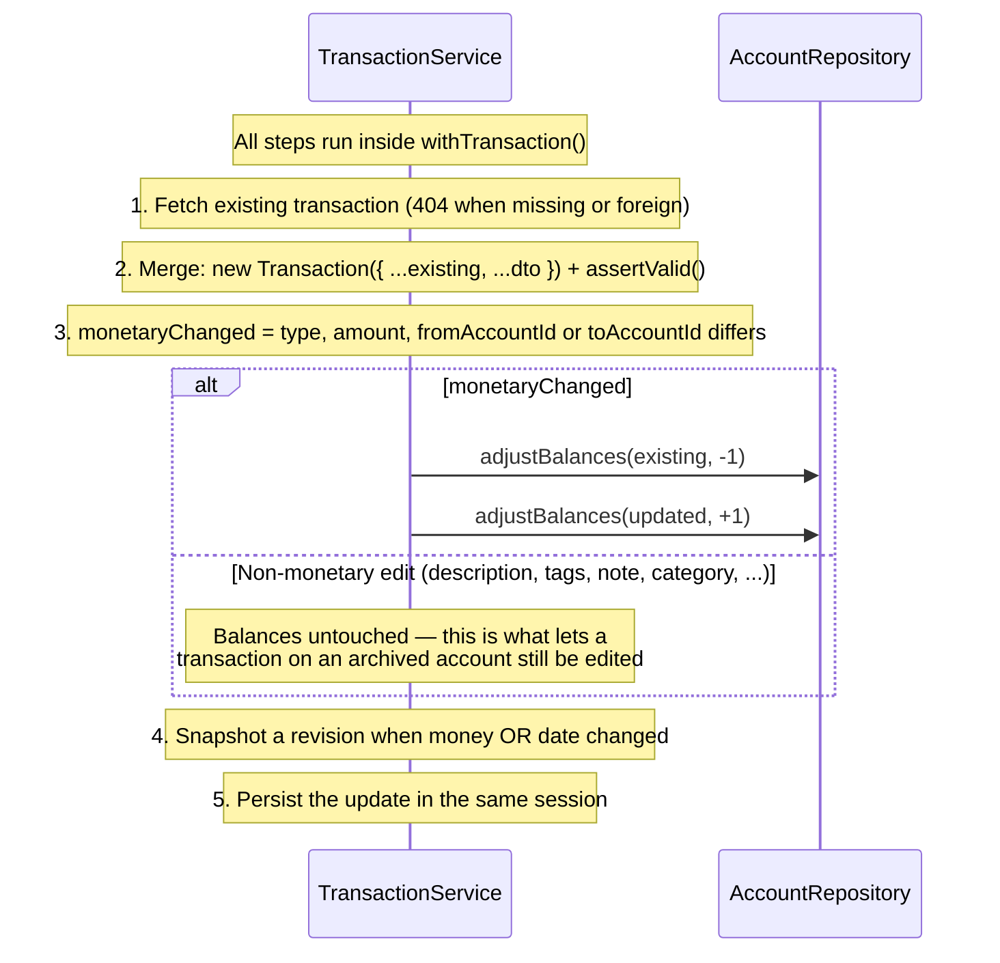

# Transactions Module

## What This Module Does

The most complex module in the system. Records financial transactions and automatically adjusts account balances. Supports four transaction types:

- **INCOME**: Money flowing into `toAccountId` (balance increases)
- **EXPENSE**: Money flowing out of `fromAccountId` (balance decreases)
- **TRANSFER**: Money moving from `fromAccountId` to `toAccountId` (one decreases, other increases)
- **ADJUSTMENT**: Balance reconciliation on exactly one account. Carries no category and is **excluded from spending stats and budgets** — it is not real cash flow.

Create, update, and delete all run inside a **MongoDB transaction**, so the ledger and the account balances can never drift apart. On update, the original balance adjustments are reversed before applying new ones. Deletes are **soft** (`deletedAt`). All transactions are user-scoped.

Two fields are server-derived and never accepted from the client:

- **`source`** — `MANUAL` (normal create), `QUICK` (via `/transactions/quick`), or `IMPORT` (reserved for the future bank/CSV import).
- **`currency`** — stamped from the involved account when balances are applied.

## Files and Responsibilities

| File                                                                   | Role                                                                          |
| ---------------------------------------------------------------------- | ----------------------------------------------------------------------------- |
| `src/app/routes/transactionRoutes.ts`                                  | Route definitions with OpenAPI docs (CRUD at `/transactions` + `/quick`, `/tags`) |
| `src/app/controllers/TransactionController.ts`                         | Thin HTTP handler; parses filters and the `Idempotency-Key` header             |
| `src/app/services/TransactionService.ts`                               | Business logic: balance adjustments, ownership, idempotency, audit revisions   |
| `src/app/dtos/TransactionDTO.ts`                                       | `CreateTransactionDTO`, `UpdateTransactionDTO`, `QuickAddTransactionDTO`       |
| `src/app/validation/schemas.ts`                                        | `createTransactionSchema`, `updateTransactionSchema`, `quickAddTransactionSchema`, `getTransactionsSchema` |
| `src/shared/unitOfWork.ts`                                             | `withTransaction()` — the MongoDB session wrapper                              |
| `src/shared/requestHash.ts`                                            | `hashPayload()` — detects idempotency-key reuse with a different payload       |
| `src/domain/entities/Transaction.ts`                                   | Transaction domain entity and `assertValid()`                                  |
| `src/domain/repositories/transaction/ITransactionRepository.ts`         | Repository interface (filters, aggregation, `TransactionRevision`)             |
| `src/domain/repositories/idempotency/IIdempotencyRepository.ts`         | Idempotency-key store contract                                                 |
| `src/infrastructure/repositories/transaction/TransactionRepository.ts`  | Mongoose implementation (keyset pagination, aggregations, cents conversion)    |
| `src/infrastructure/repositories/idempotency/IdempotencyRepository.ts`  | Idempotency-key store implementation                                           |
| `src/infrastructure/models/TransactionModel.ts`                        | Mongoose model and indexes                                                     |
| `src/infrastructure/models/IdempotencyKeyModel.ts`                     | Idempotency-key model with a 24h TTL index                                     |

## Public API

### `GET /transactions`

Get all transactions for the authenticated user (paginated, offset + cursor support).

Results are sorted by `date` descending. For infinite scroll use cursor pagination (`cursor` = the previous page's `pagination.nextCursor`); it stays consistent when transactions are backdated, because the cursor is a keyset over `(date, _id)` rather than an offset.

### Completing the review inbox in one request

`PATCH /transactions/batch` saves the detail of up to 100 transactions at once.
It accepts only detail fields — `categoryId`, `description`, `pendingDetails` —
so nothing in a batch can move a balance, which is what makes the per-item
semantics safe to offer.

**Items are independent.** Each one is validated and saved on its own, in its
own database transaction, so a failure leaves only that item unsaved. The
response is `200 { updated, failed }`: the transactions that were saved, and the
rest with the `code` of why (`NOT_FOUND`, `CATEGORY_ARCHIVED`,
`CATEGORY_TYPE_MISMATCH`, `RESOURCE_ARCHIVED`...). **The status is 200 even when
items failed** — read `failed`, not the status. A client can then clear the
cards that saved and leave the others showing their error.

Each item goes through the same `updateTransaction` a single edit uses, so the
batch cannot drift from what an update means. Items run in sequence, so a
hundred cards do not open a hundred concurrent transactions. A real fault — a
database outage — is not reported as a failed item; it surfaces as a 500, since
a partial success that never happened would be worse than an error.

`Idempotency-Key` is accepted and validated (400 `IDEMPOTENCY_KEY_INVALID` when
malformed) but nothing is stored against it: the request sets fields to given
values, so retrying it lands on the same state. It is idempotent by
construction rather than by bookkeeping.

`?includeSummary=true` adds `summary.totalAmount`: the sum of `amount` over the
whole filtered set, on the same terms as the count. It costs one extra
aggregation, so it is opt-in rather than charged to every listing. It is a plain
sum, so filter by `type` when the set could mix income and expenses — the review
inbox (`?pendingDetails=true`) cannot, since quick-adds are always expenses. The
screens that read "3 to review · $47,900" get both numbers from a single
`limit=1` request.

`pagination.total` counts **every transaction matching the filters**, independent of the
page or cursor position — the count and the page are issued with the same filter, minus
the cursor's keyset condition. A client can therefore preview a result count without
fetching the rows: `GET /transactions?<filters>&limit=1` and read `pagination.total`.

**Query parameters:**

| Parameter        | Type   | Required | Description                                                                   |
| ---------------- | ------ | -------- | ----------------------------------------------------------------------------- |
| `limit`          | number | No       | Maximum items to return (1–100, default 20)                                   |
| `offset`         | number | No       | Number of items to skip (offset-based pagination)                             |
| `cursor`         | string | No       | Cursor ID for cursor-based pagination (overrides offset)                      |
| `ids`            | string | No       | Comma-separated list of UUIDs (1–100)                                         |
| `accountId`      | string | No       | Filter by account ID (matches `fromAccountId` or `toAccountId`)               |
| `categoryId`     | string | No       | Filter by category ID                                                          |
| `uncategorized`  | enum   | No       | `"true"` returns only transactions without a category. Rejected with `categoryId`. |
| `pendingDetails` | enum   | No       | Filter by the `pendingDetails` flag (`"true"` = quick-adds awaiting detailing) |
| `source`         | enum   | No       | `MANUAL`, `QUICK` or `IMPORT` — only transactions created through that channel |
| `from`           | string | No       | Start of the date range, inclusive (half-open `[from, to)`)                   |
| `to`             | string | No       | End of the date range, exclusive                                              |
| `tag`            | string | No       | Only transactions carrying this tag (tags are stored trimmed and lowercased)  |
| `type`           | string | No       | `INCOME`, `EXPENSE`, `TRANSFER`, or `ADJUSTMENT`                              |

Filters can be combined. An unknown or foreign `cursor` is rejected with `400 INVALID_CURSOR` rather than silently serving page 1 — that silent fallback used to make infinite scroll duplicate items.

Soft-deleted transactions are excluded from every listing and read.

### `POST /transactions`

Create a new transaction. Adjusts affected account balances atomically.

**Request body:**

```json
{
  "type": "EXPENSE",
  "amount": 50.0,
  "date": "2026-03-29T12:00:00.000Z",
  "fromAccountId": "019576a0-...",
  "categoryId": "019576a0-...",
  "description": "Groceries",
  "tags": ["food", "weekly"],
  "note": "Weekly shopping"
}
```

**Optional header:** `Idempotency-Key` — see [Idempotency](#idempotency).

**Client-minted `id` (optional).** An offline client can mint the UUID itself and send it as `id`; the server never replaces it. Replaying the exact same create returns **200** with the stored transaction instead of creating a second one. The same id with a **different payload** — or an id that belongs to **another user** — is rejected with **409 `ID_TAKEN`**; the answer is identical in both cases, and a foreign document is never read. Without `id` the behaviour is unchanged: the server mints one and answers `201`.


**Validation rules** (Zod `superRefine`, then re-checked by `Transaction.assertValid()` on the merged entity):

- `EXPENSE` requires `fromAccountId`; `toAccountId` is not allowed
- `INCOME` requires `toAccountId`; `fromAccountId` is not allowed
- `TRANSFER` requires both `fromAccountId` and `toAccountId` (must be different)
- `ADJUSTMENT` requires **exactly one** of `fromAccountId` (decrease) or `toAccountId` (increase), and no `categoryId`
- `amount` must be positive, respect the currency's decimals, and stay within `MAX_AMOUNT` (10 000 000 000 000 — the point where integer cents stop being exactly representable in JavaScript; a *balance* accumulates, so it stays exact up to about nine times a maximum amount)
- `date` must be valid ISO 8601 and **not more than 24 hours in the future** (`FUTURE_DATE`)
- `tags` — up to 30 entries of ≤50 chars, normalized server-side: trimmed, lowercased, and deduplicated
- `categoryId` must exist, belong to the user, not be archived, and its `type` must match the transaction's

### `POST /transactions/quick`

Low-friction capture: only `amount` is required. Defaults `type` to `EXPENSE`, `date` to now, and the missing side account to the user's **default account** (`NO_DEFAULT_ACCOUNT` when none is set and no account id was given).

The created transaction is flagged `pendingDetails: true` and `source: QUICK`, so the client can list it later with `?pendingDetails=true`. `ADJUSTMENT` is not allowed here. Accepts the same `Idempotency-Key` header, and the same optional client-minted `id` — a quick-add replay is judged only on the fields the client actually sent, because the unsent `date` and account resolve to *now* and to whichever account is default at that moment.

### `GET /transactions/tags`

Distinct tags of the user's active transactions — the autocomplete source. Responds `{ "data": ["food", "weekly", ...] }`, sorted, trimmed and lowercased.

### `GET /transactions/:id`

Get a single transaction by ID. Ownership enforced.

### `PUT /transactions/:id`

Partial update; the merged result must still be a valid transaction of its type. Balance changes are reversed and re-applied **only when the money movement changes** — see [Balance Adjustment Logic](#balance-adjustment-logic).

### `DELETE /transactions/:id`

Soft-deletes the transaction (sets `deletedAt`) and reverses its balance adjustments on the affected accounts.

## Internal Flow

### Create Transaction

```mermaid
sequenceDiagram
    participant C as Client
    participant VAL as Validation (Zod superRefine)
    participant CTRL as TransactionController
    participant SVC as TransactionService
    participant TX_REPO as TransactionRepository
    participant ACCT_REPO as AccountRepository
    participant DB as Database

    C->>VAL: POST /transactions { type, amount, fromAccountId, ... }
    VAL->>VAL: Validate type-specific account requirements, normalize tags
    VAL->>CTRL: Validated body
    CTRL->>CTRL: Extract userId; read + validate Idempotency-Key header
    CTRL->>SVC: createTransaction(dto, idempotency?)

    alt Idempotency-Key present and already recorded
        SVC->>SVC: Compare stored requestHash
        SVC->>C: 201 + the originally created transaction (no duplicate)
    end

    SVC->>SVC: new Transaction(dto) + assertValid()
    SVC->>SVC: assertCategoryUsable(transaction)

    rect rgb(240, 240, 240)
        Note over SVC,DB: withTransaction() — one MongoDB session
        SVC->>SVC: adjustBalances(transaction, direction=+1)

        alt EXPENSE
            SVC->>ACCT_REPO: getById(fromAccountId)
            SVC->>ACCT_REPO: incrementBalance(fromAccountId, -amount)
        end

        alt INCOME
            SVC->>ACCT_REPO: getById(toAccountId)
            SVC->>ACCT_REPO: incrementBalance(toAccountId, +amount)
        end

        alt TRANSFER / ADJUSTMENT
            SVC->>ACCT_REPO: incrementBalance(fromAccountId, -amount)
            SVC->>ACCT_REPO: incrementBalance(toAccountId, +amount)
        end

        SVC->>TX_REPO: create(transaction, session)
        TX_REPO->>DB: Insert (amount as integer cents)
        SVC->>DB: Record the idempotency key (when present)
    end

    TX_REPO->>SVC: Transaction entity
    SVC->>CTRL: Transaction
    CTRL->>C: 201 + transaction JSON
```

For `ADJUSTMENT` only one side is set, so only that account moves.

### Update Transaction (Conditional Reversal + Re-apply)



## Dependencies

**Imports:**

- `domain/entities/Transaction` — Transaction entity
- `domain/repositories/transaction/ITransactionRepository` — Transaction data access
- `domain/repositories/account/IAccountRepository` — Account data access (for balance adjustments)
- `domain/repositories/category/ICategoryRepository` — category validation on create/update
- `domain/repositories/idempotency/IIdempotencyRepository` — `Idempotency-Key` bookkeeping
- `shared/unitOfWork` — `withTransaction()`
- `shared/errors` — `ApiError`
- `shared/pagination` — Pagination types

**Imported by:**

- Transaction routes registered in `src/app.ts` at `/transactions`, after `authMiddleware`
- `StatsService` calls `aggregateSpending()` on `ITransactionRepository`
- `BudgetService` calls `sumAmountsByCategory()` and `sumAmounts()` for live budget spend
- `CategoryService` calls `countByCategory()` to enforce the category type lock

**Cross-module dependency:** `TransactionService` writes through `IAccountRepository` (balances) and reads through `ICategoryRepository`. It is the only service that **mutates** another module's data.

## Environment Variables

None specific to this module.

## Error States

| Error / code                       | Status | Condition                                                          |
| ---------------------------------- | ------ | ------------------------------------------------------------------ |
| `VALIDATION`                       | 400    | Missing required account for the type, same account on a TRANSFER, amount with >2 decimals |
| `FUTURE_DATE`                      | 400    | `date` more than 24 hours in the future                             |
| `CURRENCY_MISMATCH`                | 400    | Transfer between accounts with different currencies                 |
| `CATEGORY_ARCHIVED`                | 400    | Assigning an archived category (keeping the one it already had is allowed) |
| `CATEGORY_TYPE_MISMATCH`           | 400    | Category type differs from the transaction type                     |
| `NO_DEFAULT_ACCOUNT`               | 400    | Quick-add with no account id and no default account set             |
| `INVALID_CURSOR`                   | 400    | Unknown or foreign pagination cursor                                |
| `IDEMPOTENCY_KEY_INVALID`          | 400    | Malformed `Idempotency-Key` header                                  |
| `BadRequest`                       | 400    | Transaction ID mismatch (body vs URL param)                         |
| `Unauthorized`                     | 401    | Missing, invalid or expired access token                            |
| `NotFound`                         | 404    | Transaction, category, or account missing **or owned by another user** |
| `IDEMPOTENCY_ORIGINAL_DELETED`     | 409    | The transaction created with this key was deleted; retry with a new key |
| `ID_TAKEN`                         | 409    | The client-minted `id` is already in use (different payload, or another user's) |
| `STALE_UPDATE`                     | 409    | `If-Match` no longer matches the stored version (`current` carries the server's copy) |
| `IDEMPOTENCY_PAYLOAD_MISMATCH`     | 422    | The `Idempotency-Key` was already used with a different payload     |
| `InternalServerError`              | 500    | An account vanished mid-adjustment (aborts the MongoDB transaction) |

> Missing and foreign resources both return **404, never 403** — the response is uniform so ids cannot be probed.

## Optimistic concurrency (`If-Match`)

Every write below accepts an optional `If-Match` header carrying the `updatedAt`
this client last read, verbatim as the API prints it
(`2026-09-03T18:00:00.000Z`; an ISO 8601 datetime with an offset is also
accepted, a bare date is not — that is `400 VALIDATION`).

`PUT /transactions/:id` · `DELETE /transactions/:id`

`PATCH /transactions/batch` is **not** guarded: one header cannot address N
documents. Each item is a state assignment and is idempotent by construction.

The write only lands if the server still holds that version. Otherwise the answer
is **409 `STALE_UPDATE`**, and its body carries `current`: the transaction as the server
has it now, in the same shape a `GET` would return — so a client can show
"Server / This device" without a second request.

Two rules worth knowing:

- **The condition travels inside the write's own filter**, not only in a check
  before it. Two clients holding the same version cannot both win.
- **`STALE_UPDATE` outranks `RESOURCE_ARCHIVED` and the other write guards.** A
  caller writing against an old version cannot know about a state it has not
  read yet; re-reading tells it everything at once.

**A deleted transaction answers `404`, not `409`.** Transactions are the only
guarded entity that disappears from reads once soft-deleted, and the API shape
has no `deletedAt`, so a `current` would look like a live transaction. An offline
client should read `404` on a guarded write as "another device deleted this" —
and, for a `DELETE`, as the state it wanted anyway. Accounts, categories and
budgets stay readable when archived, so those answer `409` with
`current.archivedAt` set.

Without the header nothing changes: the write is unconditional, exactly as before.

## Transaction Types

| Type         | Required Fields                     | Balance Effect                                                 |
| ------------ | ----------------------------------- | -------------------------------------------------------------- |
| `INCOME`     | `toAccountId` (only)                | `toAccount.balance += amount`                                  |
| `EXPENSE`    | `fromAccountId` (only)              | `fromAccount.balance -= amount`                                |
| `TRANSFER`   | `fromAccountId`, `toAccountId`      | `fromAccount.balance -= amount`, `toAccount.balance += amount` |
| `ADJUSTMENT` | Exactly one side, no `categoryId`   | The set side moves; `fromAccountId` decreases, `toAccountId` increases |

## Balance Adjustment Logic

The `adjustBalances()` private method in `TransactionService` modifies account balances whenever a transaction is created, updated, or deleted. It always runs inside a MongoDB session opened by `withTransaction()`.

### Direction Parameter

The method accepts a `direction` parameter of `1` or `-1`:

| Operation              | Direction      | Effect                                                     |
| ---------------------- | -------------- | ---------------------------------------------------------- |
| **Create** transaction | `+1`           | Apply balance changes (e.g., expense decreases balance)    |
| **Delete** transaction | `-1`           | Reverse balance changes (restore previous balance)         |
| **Update** transaction | `-1` then `+1` | Reverse old transaction's adjustments, then apply new ones — **only when the money movement changed** |

The applied delta is `amount × sign × direction`, written with an atomic `$inc` via `AccountRepository.incrementBalance()`, where `sign` is `-1` for the source account (`fromAccountId`) and `+1` for the destination account (`toAccountId`).

### Account Validation

On **forward adjustments** (`direction = +1`, i.e., create/update-apply):

- If the account is not found → `NotFound` (404), "Source account not found" / "Destination account not found"
- If the account belongs to another user → **also 404**, with the same message. Foreign ids must not be distinguishable from missing ones
- If the transaction already carries a currency that differs from the account's → `400 CURRENCY_MISMATCH`. Otherwise the account's currency is stamped onto the transaction

On **reversal adjustments** (`direction = -1`, i.e., delete/update-reverse):

- Existence, ownership, and currency are **not** re-checked — a reversal must work even if the account was archived meanwhile

In both directions, if the `$inc` itself matches no document the service throws `InternalServerError`, which **aborts the MongoDB transaction**. Silently skipping the increment would desync the stored balance from the ledger.

### Failure Modes

| Scenario                                    | Direction | Behavior                                            |
| ------------------------------------------- | --------- | --------------------------------------------------- |
| Source account not found                    | `+1`      | `NotFound` (404)                                    |
| Destination account not found               | `+1`      | `NotFound` (404)                                    |
| Either account belongs to another user      | `+1`      | `NotFound` (404) — uniform with "missing"           |
| Currency of the account differs             | `+1`      | `400 CURRENCY_MISMATCH`                             |
| Archived account during reversal            | `-1`      | Proceeds normally (no ownership/currency re-check)  |
| Increment matched no account                | any       | `InternalServerError` (500), transaction aborted    |

> Balance adjustments **are** wrapped in a MongoDB transaction (`shared/unitOfWork.ts`), which requires a replica set. The commit is bounded to `maxCommitTimeMS: 10_000` — the driver's default retry loop can run ~120s, longer than the Lambda timeout, so the request fails cleanly instead of hanging. Because `withTransaction` may retry on transient conflicts, the wrapped work must stay idempotent.

## Idempotency

`POST /transactions` and `POST /transactions/quick` accept an optional `Idempotency-Key` header — 1–200 characters of `[A-Za-z0-9_-]`, typically a UUID generated per create action. A malformed key is rejected with `400 IDEMPOTENCY_KEY_INVALID` (the key becomes part of a stored `_id`).

A create that carries a client-minted `id` does not need the header: the id is already the retry key, and it costs no write in `IdempotencyKeyModel`. Both work together if sent.

| Situation                                        | Result                                                    |
| ------------------------------------------------ | --------------------------------------------------------- |
| Key unseen                                       | Transaction created; key recorded in the same session      |
| Same key, same payload                           | `201` with the **originally created** transaction, no duplicate |
| Same key, different payload                      | `422 IDEMPOTENCY_PAYLOAD_MISMATCH`                         |
| Same key, but the original was deleted           | `409 IDEMPOTENCY_ORIGINAL_DELETED` — retry with a new key  |

Payload equality is decided by `hashPayload()` over the request body. Records are stored under `${userId}:${scope}:${key}` and expire via a **24-hour TTL index**, so keys are only safe for retries, not for long-term deduplication. A duplicate-key error from a concurrent request with the same key replays the original instead of failing.

## Audit Revisions

Monetary edits keep a pre-update snapshot in the document's `revisions[]` array: `{ at, amount, type, fromAccountId, toAccountId, date }`. A revision is written when the money movement changed **or** when only the `date` moved — moving money between periods reshapes budgets and stats even though balances stay put.

`revisions[]` is an **internal audit trail**: it answers "why doesn't this balance?" and is not exposed through the API.

## Money Representation

The API speaks **decimals** (capped at `MAX_AMOUNT`); MongoDB stores **integer cents**. How many decimals an amount may carry depends on the currency: two for most, **zero** for currencies with no minor unit (JPY, CLP, KRW, VND...), which reject `¥1000.50` with **400 `AMOUNT_PRECISION`**. The three-decimal ISO currencies (KWD, BHD, JOD) are capped at two — integer-cent storage cannot hold a third decimal, and rejecting it beats rounding it away silently. `TransactionRepository` converts at the persistence boundary, and integer storage is what keeps the `$inc` balance updates exact.

## How to Extend

- To add recurring transactions: add a `recurrence` field to entity/model and a scheduler service. Do **not** relax the `FUTURE_DATE` rule to fake them — scheduled transactions are meant to be their own feature
- To add bank/CSV import: `source: "IMPORT"` is already reserved in `TRANSACTION_SOURCES`; keep `source` server-derived
- To add transaction attachments: add a separate entity keyed by transaction id rather than growing the document
- **Important:** any new code that creates or modifies transactions must run inside `withTransaction()` and maintain the balance adjustment contract
- New filters belong in `TransactionFilters` plus the repository's `$match`; check the compound indexes in `TransactionModel.ts` before adding one that would collection-scan

### Indexes behind the filters

The listing rarely suffers from a missing index — it stops as soon as it has a
page — but `pagination.total` cannot stop early, so an unindexed filter makes the
count visit every live transaction of the user. Measured over 50k transactions:

| Filter | Count without an index | With one |
| --- | --- | --- |
| `source` | 50 000 documents, 45 ms | 0 documents, 1 ms |
| `pendingDetails=true` | 50 000 documents, 58 ms | 0 documents, 0 ms |
| `type` | 50 000 documents, 46 ms | no better — it matches nearly every row |

Hence `{userId, deletedAt, source, date}` and a **partial** index over the pending
rows only (about 2 % of the primary index's size, since the inbox is a handful of
documents). `type` deliberately has none: an index cannot spare a visit to rows it
does not exclude. Apply the same test before indexing a new filter — how much does
it exclude, and does anything count on it?
