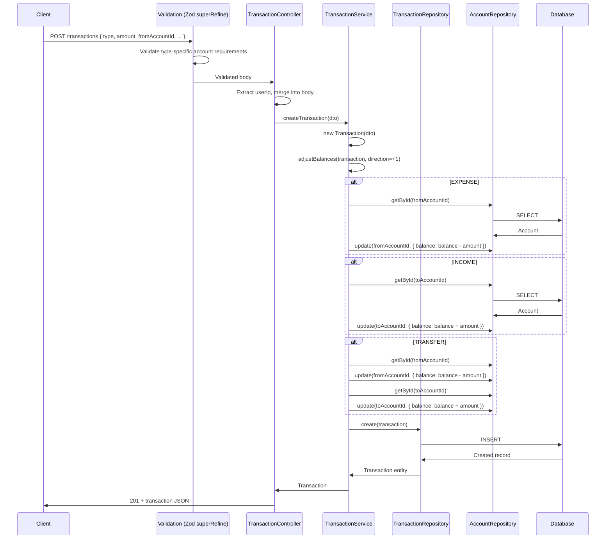
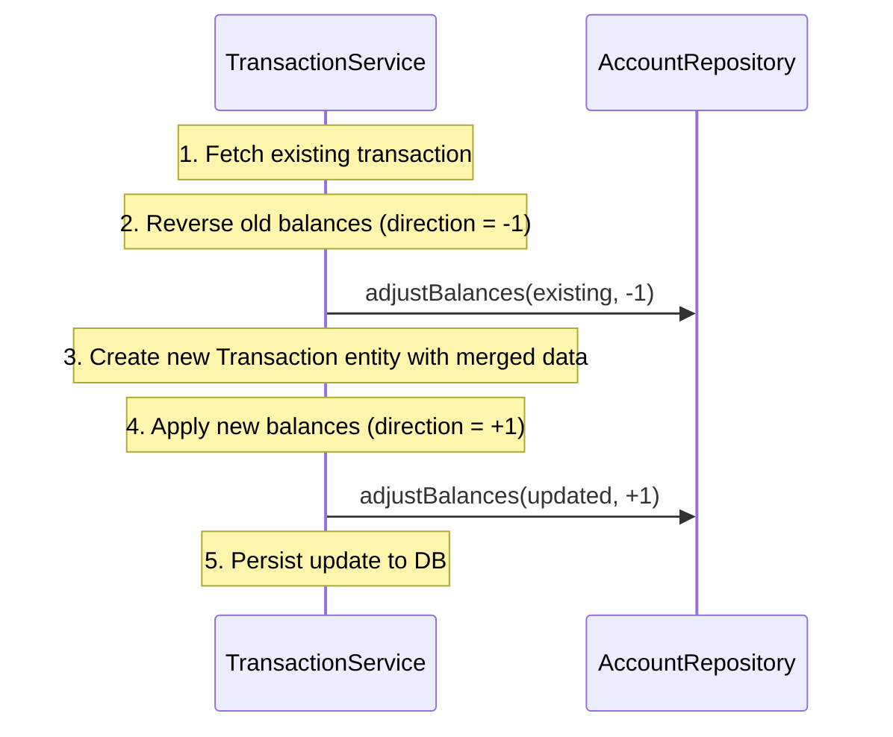

# Transactions Module

## What This Module Does

The most complex module in the system. Records financial transactions (income, expenses, transfers) and automatically adjusts account balances. Supports three transaction types:

- **INCOME**: Money flowing into `toAccountId` (balance increases)
- **EXPENSE**: Money flowing out of `fromAccountId` (balance decreases)
- **TRANSFER**: Money moving from `fromAccountId` to `toAccountId` (one decreases, other increases)

On update or delete, the original balance adjustments are reversed before applying new ones. All transactions are user-scoped.

## Files and Responsibilities

| File                                                                | Role                                                                      |
| ------------------------------------------------------------------- | ------------------------------------------------------------------------- |
| `src/app/routes/transactionRoutes.ts`                               | Route definitions with OpenAPI docs (full CRUD at `/transactions`)        |
| `src/app/controllers/TransactionController.ts`                      | Thin HTTP handler, delegates to TransactionService                        |
| `src/app/services/TransactionService.ts`                            | Business logic: balance adjustments, ownership checks, CRUD               |
| `src/app/dtos/TransactionDTO.ts`                                    | `CreateTransactionDTO`, `UpdateTransactionDTO`                            |
| `src/app/validation/schemas.ts`                                     | `createTransactionSchema`, `updateTransactionSchema` (with `superRefine`) |
| `src/domain/entities/Transaction.ts`                                | Transaction domain entity                                                 |
| `src/domain/repositories/transaction/ITransactionRepository.ts`     | Repository interface                                                      |
| `src/domain/repositories/transaction/TransactionSeqRepository.ts`   | Sequelize implementation                                                  |
| `src/domain/repositories/transaction/TransactionMongoRepository.ts` | Mongoose implementation                                                   |
| `src/domain/models/sequelize/TransactionModel.ts`                   | Sequelize model                                                           |
| `src/domain/models/mongoose/TransactionMongoModel.ts`               | Mongoose model                                                            |

## Public API

### `GET /transactions`

Get all transactions for the authenticated user (paginated, offset + cursor support).

**Query parameters:**

| Parameter   | Type   | Required | Description                                                     |
| ----------- | ------ | -------- | --------------------------------------------------------------- |
| `limit`     | number | No       | Maximum items to return (1–100, default 20)                     |
| `offset`    | number | No       | Number of items to skip (offset-based pagination)               |
| `cursor`    | string | No       | Cursor ID for cursor-based pagination (overrides offset)        |
| `accountId` | string | No       | Filter by account ID (matches `fromAccountId` or `toAccountId`) |
| `type`      | string | No       | Filter by transaction type (`INCOME`, `EXPENSE`, or `TRANSFER`) |

Filters can be combined. Both `accountId` and `type` are validated (UUID format and enum value respectively).

### `POST /transactions`

Create a new transaction. Adjusts affected account balances.

**Request body:**

```json
{
  "type": "EXPENSE",
  "amount": 50.0,
  "date": "2026-03-29T12:00:00.000Z",
  "fromAccountId": "019576a0-...",
  "categoryId": "019576a0-...",
  "description": "Groceries",
  "tags": "food,weekly",
  "note": "Weekly shopping"
}
```

**Validation rules (via Zod `superRefine`):**

- `EXPENSE` requires `fromAccountId`
- `INCOME` requires `toAccountId`
- `TRANSFER` requires both `fromAccountId` and `toAccountId` (must be different)
- `amount` must be positive
- `date` must be valid ISO 8601

### `GET /transactions/:id`

Get a single transaction by ID. Ownership enforced.

### `PUT /transactions/:id`

Update a transaction. Reverses old balance adjustments, applies new ones.

### `DELETE /transactions/:id`

Delete a transaction. Reverses balance adjustments on affected accounts.

## Internal Flow

### Create Transaction



### Update Transaction (Balance Reversal + Re-apply)



## Dependencies

**Imports:**

- `domain/entities/Transaction` — Transaction entity
- `domain/repositories/transaction/ITransactionRepository` — Transaction data access
- `domain/repositories/account/IAccountRepository` — Account data access (for balance adjustments)
- `shared/errors` — `ApiError`
- `shared/pagination` — Pagination types

**Imported by:**

- Transaction routes in `src/app.ts`

**Cross-module dependency:** TransactionService depends on `IAccountRepository` to adjust account balances. This is the only service that depends on another module's repository.

## Environment Variables

None specific to this module.

## Error States

| Error             | Status | Condition                                        |
| ----------------- | ------ | ------------------------------------------------ |
| `NotFoundError`   | 404    | Transaction not found                            |
| `NotFoundError`   | 404    | Source account not found (on create/update)      |
| `NotFoundError`   | 404    | Destination account not found (on create/update) |
| `ForbiddenError`  | 403    | Transaction belongs to another user              |
| `ForbiddenError`  | 403    | Source account does not belong to the user       |
| `ForbiddenError`  | 403    | Destination account does not belong to the user  |
| `BadRequestError` | 400    | Transaction ID mismatch (body vs URL param)      |
| `ValidationError` | 400    | Missing required account for transaction type    |
| `ValidationError` | 400    | Same fromAccountId and toAccountId on TRANSFER   |

## Transaction Types

| Type       | Required Fields                | Balance Effect                                                 |
| ---------- | ------------------------------ | -------------------------------------------------------------- |
| `INCOME`   | `toAccountId`                  | `toAccount.balance += amount`                                  |
| `EXPENSE`  | `fromAccountId`                | `fromAccount.balance -= amount`                                |
| `TRANSFER` | `fromAccountId`, `toAccountId` | `fromAccount.balance -= amount`, `toAccount.balance += amount` |

## Balance Adjustment Logic

The `adjustBalances()` private method in `TransactionService` is responsible for modifying account balances whenever a transaction is created, updated, or deleted.

### Direction Parameter

The method accepts a `direction` parameter of `1` or `-1`:

| Operation              | Direction      | Effect                                                     |
| ---------------------- | -------------- | ---------------------------------------------------------- |
| **Create** transaction | `+1`           | Apply balance changes (e.g., expense decreases balance)    |
| **Delete** transaction | `-1`           | Reverse balance changes (restore previous balance)         |
| **Update** transaction | `-1` then `+1` | Reverse old transaction's adjustments, then apply new ones |

The balance formula is: `newBalance = currentBalance + (amount × sign × direction)`

Where `sign` is `-1` for the source account (`fromAccountId`) and `+1` for the destination account (`toAccountId`).

### Account Validation

On **forward adjustments** (`direction = +1`, i.e., create/update-apply):

- If the account is not found → throws `NotFoundError` (404) with "Source account not found" or "Destination account not found"
- If the account does not belong to the user → throws `ForbiddenError` (403) with "Source/Destination account does not belong to the user"

On **reversal adjustments** (`direction = -1`, i.e., delete/update-reverse):

- If the account is not found → **silently skips** (the account may have been deleted since the transaction was created)
- Ownership is **not** re-checked during reversal

### Failure Modes

| Scenario                                    | Direction | Behavior                                  |
| ------------------------------------------- | --------- | ----------------------------------------- |
| Source account not found                    | `+1`      | Throws `NotFoundError` (404)              |
| Destination account not found               | `+1`      | Throws `NotFoundError` (404)              |
| Source account belongs to another user      | `+1`      | Throws `ForbiddenError` (403)             |
| Destination account belongs to another user | `+1`      | Throws `ForbiddenError` (403)             |
| Account not found during reversal           | `-1`      | Silently skipped (no error)               |
| Database error during balance update        | any       | Propagates as `InternalServerError` (500) |

> **Important:** Balance adjustments are **not wrapped in a database transaction**. If the application crashes between adjusting the source and destination accounts in a TRANSFER, balances may become inconsistent. This is a known limitation for a personal finance app and is acceptable at the current scale.

## How to Extend

- To add recurring transactions: add `recurrence` field to entity/model, create a scheduler service
- To add budget tracking: uncomment the TODO in `createTransaction()` and implement `updateBudgetBalance()`
- To add transaction attachments: add a separate `TransactionAttachment` entity with a foreign key
- **Important:** Any new code that creates/modifies transactions must maintain the balance adjustment contract — always adjust account balances accordingly
