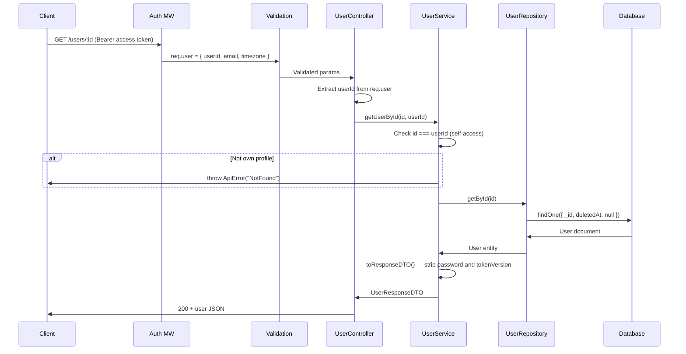
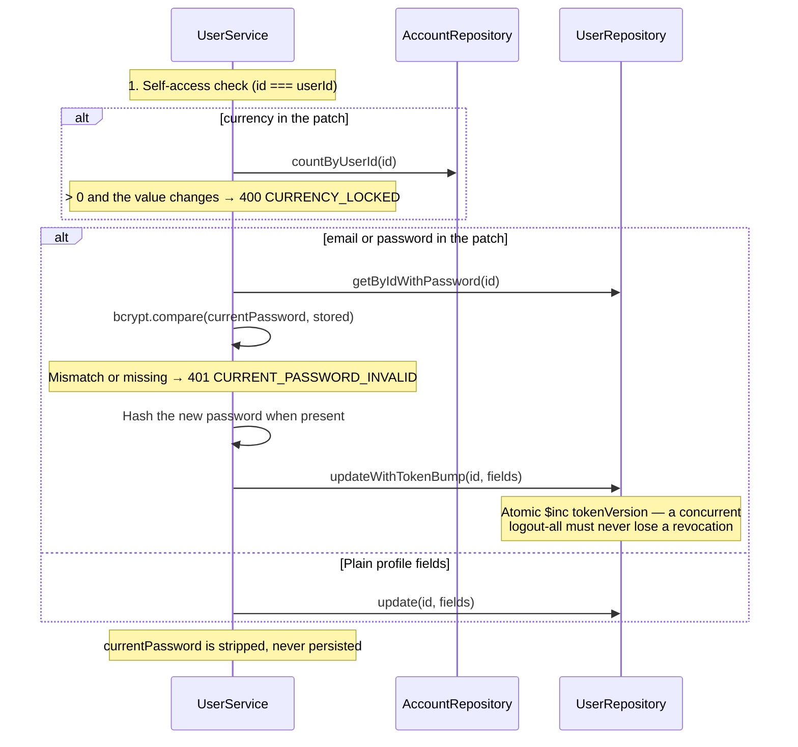

# Users Module

## What This Module Does

Manages user profiles after registration. Provides read, update, and delete for the authenticated user's **own** profile — there is no way to reach another user's data, and no endpoint that lists users.

Beyond name/email/password, the profile carries two settings that shape the rest of the API:

- **`timezone`** — IANA zone; drives day boundaries in stats and period windows in budgets. Also embedded as a claim in the access token.
- **`currency`** — ISO 4217 alpha code; the user's single money currency, stamped onto accounts, transactions, and budgets. **Locked once the user has accounts.**

## Files and Responsibilities

| File                                                    | Role                                                                                    |
| ------------------------------------------------------- | --------------------------------------------------------------------------------------- |
| `src/app/routes/userRoutes.ts`                          | Route definitions (`GET /users/:id`, `PUT /users/:id`, `DELETE /users/:id`)              |
| `src/app/controllers/UserController.ts`                 | Thin HTTP handler, delegates to UserService                                              |
| `src/app/services/UserService.ts`                       | Self-access enforcement, re-authentication on credential changes, currency lock, password stripping |
| `src/app/dtos/UserDTO.ts`                               | `CreateUserDTO`, `UpdateUserDTO`, `UserResponseDTO`                                      |
| `src/app/validation/schemas.ts`                         | `updateUserSchema`, `idParamSchema`                                                      |
| `src/domain/entities/User.ts`                           | User domain entity (`tokenVersion`, `timezone`, `currency`, `lastLoginAt`)               |
| `src/domain/repositories/user/IUserRepository.ts`       | Repository interface (adds `getByEmail`, `recordLogin`, `updateWithTokenBump`, `reactivate`, …) |
| `src/infrastructure/repositories/user/UserRepository.ts` | Mongoose implementation (soft delete, atomic token-version bumps)                        |
| `src/infrastructure/models/UserModel.ts`                | Mongoose model (unique lowercase `email`)                                                |

## Public API

### Endpoint Authorization Matrix

| Endpoint            | Auth Required          | Self-Access Enforced | Notes                                                                     |
| ------------------- | ---------------------- | -------------------- | ------------------------------------------------------------------------- |
| `GET /users/:id`    | Yes (access token)     | Yes                  | `id` must match the authenticated user's ID, otherwise **404**.           |
| `PUT /users/:id`    | Yes (access token)     | Yes                  | Partial updates. Credential changes need `currentPassword`.               |
| `DELETE /users/:id` | Yes (access token)     | Yes                  | Soft delete; responds `200` with a message.                               |

> There is **no `GET /users`** endpoint — listing users was removed. Self-access failures return `404 User not found`, not `403`, so a user id cannot be confirmed by probing.

### `GET /users/:id`

Get the authenticated user's profile. Returns `UserResponseDTO`: `id`, `name`, `email`, `timezone`, `currency`, `lastLoginAt`, `createdAt`, `updatedAt`. The password is never returned.

### `PUT /users/:id`

Update the profile. Partial updates over `name`, `email`, `password`, `timezone`, `currency`; at least one field must be present.

**Changing `email` or `password` requires `currentPassword`** in the same request. This is re-authentication: a hijacked access token (valid for up to 15 minutes) must not be able to take over the account by swapping the credentials. On success, the user's `tokenVersion` is bumped atomically, so **every refresh token is revoked** and other devices must log in again.

`currency` can only change while the user has **no accounts** (`CURRENCY_LOCKED`). No accounts implies no transactions — every transaction type requires one — so a single account count settles it.

Changing the email to one belonging to another account (soft-deleted included) conflicts with `409 DUPLICATE`; reactivation only happens on register.

### `DELETE /users/:id`

**Soft delete.** Sets `deletedAt` and bumps `tokenVersion`; the account and its financial history are kept, and registering again with the same email reactivates it. Responds `200` with a message. There are no hard deletes.

## Internal Flow

### Credential Change (PUT with email or password)

## Dependencies

**Imports:** `bcryptjs`, `shared/constants`, `shared/errors`, `domain/entities/User`, `domain/repositories/user/IUserRepository`, `domain/repositories/account/IAccountRepository` (to decide whether the currency is still changeable), DTOs

**Imported by:**

- User routes registered in `src/app.ts` at `/users`, after `authMiddleware`
- `AuthService` uses `IUserRepository` for register/login/refresh and token-version bumps
- `AccountService` and `BudgetService` read the owner's `currency` when stamping new records
- `StatsController` and `BudgetController` fall back to the stored `timezone` when the token carries no claim

## Environment Variables

| Variable             | Used for                      |
| -------------------- | ----------------------------- |
| `BCRYPT_SALT_ROUNDS` | Re-hashing password on update |

## Error States

| Error / code                | Status | Condition                                                            |
| --------------------------- | ------ | -------------------------------------------------------------------- |
| `VALIDATION`                | 400    | Invalid input, or `currentPassword` missing while changing email/password |
| `BadRequest`                | 400    | User ID in body doesn't match URL param                               |
| `CURRENCY_LOCKED`           | 400    | Changing `currency` while the user already has accounts               |
| `Unauthorized`              | 401    | Missing, invalid or expired access token                              |
| `CURRENT_PASSWORD_INVALID`  | 401    | `currentPassword` is wrong                                            |
| `NotFound`                  | 404    | User does not exist, **or the id is not the authenticated user's**    |
| `DUPLICATE`                 | 409    | Email already used by another account (unique index)                  |

## Soft Delete and Reactivation

`UserRepository.delete()` sets `deletedAt` and increments `tokenVersion` — it never removes the document. Every read path filters on `deletedAt: null`, so a deleted user disappears from the API while their accounts, transactions, categories, and budgets stay intact.

`AuthService.register()` looks up soft-deleted accounts by email first: registering with that email calls `reactivate()`, which clears `deletedAt`, applies the new name/password (and timezone, if sent), bumps `tokenVersion` again, and returns `user.reactivated: true`. The original `currency` is preserved, because the restored history is denominated in it.

## How to Extend

- To add user roles/permissions: add a `role` field to the User entity and DTO, and add authorization logic in the service — there is currently no admin surface at all
- To add profile picture: add a field to entity/model, handle the upload in a new middleware
- Password changes must keep going through `updateWithTokenBump()`: re-hashing without bumping `tokenVersion` would leave stolen refresh tokens alive
- Never widen `UserResponseDTO` with `password` or `tokenVersion`; both are internal
