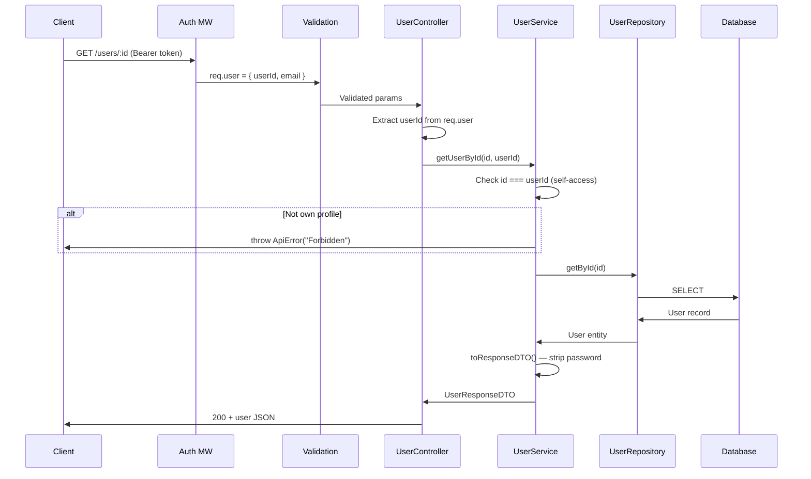

# Users Module

## What This Module Does

Manages user profiles after registration. Provides CRUD operations for the authenticated user's own profile. Users can view, update (including password changes), and delete their own account. All endpoints enforce self-access — a user cannot access or modify another user's data.

## Files and Responsibilities

| File                                                  | Role                                                                                       |
| ----------------------------------------------------- | ------------------------------------------------------------------------------------------ |
| `src/app/routes/userRoutes.ts`                        | Route definitions (`GET /users`, `GET /users/:id`, `PUT /users/:id`, `DELETE /users/:id`)  |
| `src/app/controllers/UserController.ts`               | Thin HTTP handler, delegates to UserService                                                |
| `src/app/services/UserService.ts`                     | Business logic: self-access enforcement, password re-hashing on update, password stripping |
| `src/app/dtos/UserDTO.ts`                             | `CreateUserDTO`, `UpdateUserDTO`, `UserResponseDTO`                                        |
| `src/app/validation/schemas.ts`                       | `updateUserSchema`                                                                         |
| `src/domain/entities/User.ts`                         | User domain entity                                                                         |
| `src/domain/repositories/user/IUserRepository.ts`     | Repository interface (extends IRepository, adds `getByEmail`)                              |
| `src/domain/repositories/user/UserSeqRepository.ts`   | Sequelize implementation                                                                   |
| `src/domain/repositories/user/UserMongoRepository.ts` | Mongoose implementation                                                                    |
| `src/domain/models/sequelize/UserModel.ts`            | Sequelize model                                                                            |
| `src/domain/models/mongoose/UserMongoModel.ts`        | Mongoose model                                                                             |

## Public API

### Endpoint Authorization Matrix

| Endpoint            | Auth Required | Self-Access Enforced | Notes                                                                                                  |
| ------------------- | ------------- | -------------------- | ------------------------------------------------------------------------------------------------------ |
| `GET /users`        | Yes (JWT)     | **No**               | Returns **all** users (paginated). No ownership filter — any authenticated user can list every user.   |
| `GET /users/:id`    | Yes (JWT)     | Yes                  | `id` must match the authenticated user's ID, otherwise 403 Forbidden.                                  |
| `PUT /users/:id`    | Yes (JWT)     | Yes                  | `id` must match the authenticated user's ID. Supports partial updates.                                 |
| `DELETE /users/:id` | Yes (JWT)     | Yes                  | `id` must match the authenticated user's ID. Deletes the user if they exist (idempotent, returns 204). |

> **Security note:** `GET /users` does not enforce self-access. It returns all registered users (with passwords stripped). This is by design for now but should be restricted or removed if the API is exposed publicly. Consider adding role-based access control (RBAC) or removing this endpoint entirely in production.

### `GET /users`

Get all users (paginated). Returns `UserResponseDTO` (no passwords). **Does not enforce ownership** — all authenticated users see all user profiles.

### `GET /users/:id`

Get a single user by ID. Enforces self-access: `id` must match the authenticated user's ID.

### `PUT /users/:id`

Update user profile. Supports partial updates (name, email, password). If password is provided, it is re-hashed before storage.

### `DELETE /users/:id`

Delete user account. Enforces self-access.

## Internal Flow

## Dependencies

**Imports:** `bcryptjs`, `shared/constants`, `shared/errors`, `domain/entities/User`, `domain/repositories/user/IUserRepository`, DTOs

**Imported by:** User routes registered in `src/app.ts` after `authMiddleware`

## Environment Variables

| Variable             | Used for                      |
| -------------------- | ----------------------------- |
| `BCRYPT_SALT_ROUNDS` | Re-hashing password on update |

## Error States

| Error             | Status | Condition                                          |
| ----------------- | ------ | -------------------------------------------------- |
| `ForbiddenError`  | 403    | Attempting to access/modify another user's profile |
| `NotFoundError`   | 404    | User ID does not exist                             |
| `BadRequestError` | 400    | User ID in body doesn't match URL param            |
| `ConflictError`   | 409    | Email already taken (DB constraint)                |
| `ValidationError` | 400    | Invalid input data                                 |

## How to Extend

- To add user roles/permissions: add a `role` field to User entity, update DTO, add authorization logic in service
- To add profile picture: add field to entity/model, handle file upload in a new middleware
- Password changes should always be re-hashed via `bcryptjs.hash()` in the service layer
