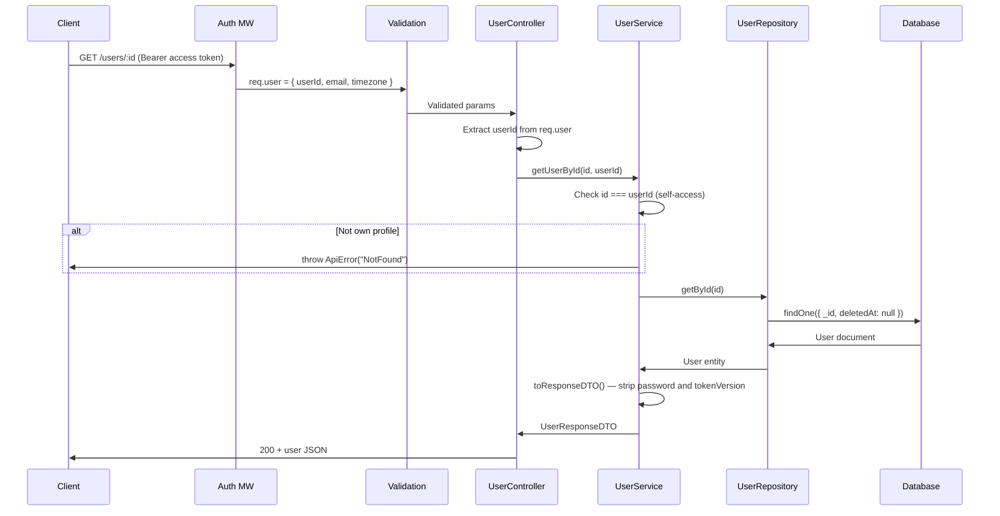
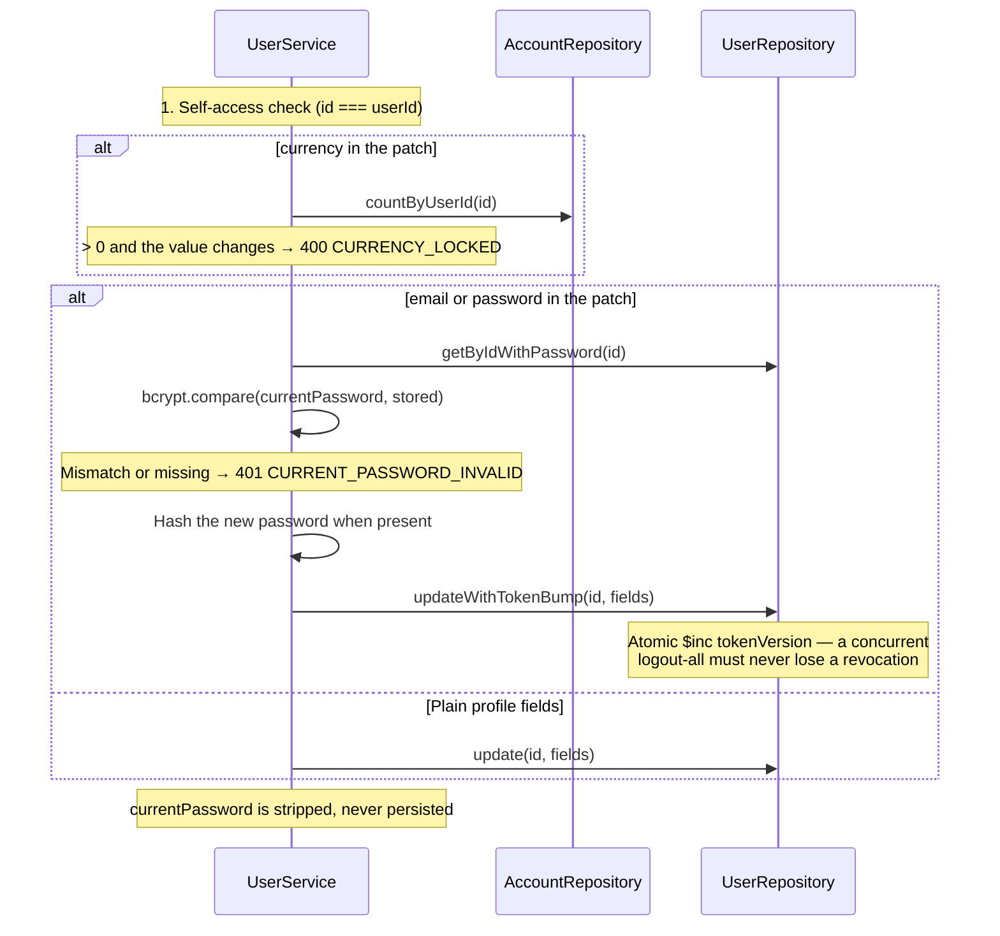

# Users Module

## What This Module Does

Manages user profiles after registration. Provides read, update, and delete for the authenticated user's **own** profile — there is no way to reach another user's data, and no endpoint that lists users.

Beyond name/email/password, the profile carries three settings that shape the rest of the API:

- **`timezone`** — IANA zone; drives day boundaries in stats and period windows in budgets. Also embedded as a claim in the access token.
- **`currency`** — ISO 4217 alpha code; the user's single money currency, stamped onto accounts, transactions, and budgets. **Locked once the user has accounts.**
- **`locale`** — UI language, `en` (default) or `es`. Purely a preference the front reads to pick copy and `Intl` formatting; it follows the user across devices.

## Files and Responsibilities

| File                                                     | Role                                                                                                |
| -------------------------------------------------------- | --------------------------------------------------------------------------------------------------- |
| `src/app/routes/userRoutes.ts`                           | Route definitions (`GET /users/:id`, `PUT /users/:id`, `DELETE /users/:id`)                         |
| `src/app/controllers/UserController.ts`                  | Thin HTTP handler, delegates to UserService                                                         |
| `src/app/services/UserService.ts`                        | Self-access enforcement, re-authentication on credential changes, currency lock, password stripping |
| `src/app/dtos/UserDTO.ts`                                | `CreateUserDTO`, `UpdateUserDTO`, `UserResponseDTO`                                                 |
| `src/app/validation/schemas.ts`                          | `updateUserSchema`, `deleteUserSchema`, `idParamSchema`                                             |
| `src/domain/entities/User.ts`                            | User domain entity (`tokenVersion`, `timezone`, `currency`, `locale`, `lastLoginAt`)                |
| `src/domain/repositories/user/IUserRepository.ts`        | Repository interface (adds `getByEmail`, `recordLogin`, `updateWithTokenBump`, `reactivate`, …)     |
| `src/infrastructure/repositories/user/UserRepository.ts` | Mongoose implementation (soft delete, atomic token-version bumps)                                   |
| `src/infrastructure/models/UserModel.ts`                 | Mongoose model (unique lowercase `email`)                                                           |
| `src/app/services/KeepOrStartFreshService.ts`            | The answer to "Keep what's in this account?": keep, or start fresh                                  |
| `src/domain/repositories/userData/IUserDataEraser.ts`    | What Start fresh erases (the port)                                                                  |
| `src/infrastructure/repositories/userData/UserDataEraser.ts` | The erasure itself, collection by collection                                                    |

## Public API

### Endpoint Authorization Matrix

| Endpoint            | Auth Required      | Self-Access Enforced | Notes                                                                |
| ------------------- | ------------------ | -------------------- | -------------------------------------------------------------------- |
| `GET /users/:id`    | Yes (access token) | Yes                  | `id` must match the authenticated user's ID, otherwise **404**.      |
| `PUT /users/:id`    | Yes (access token) | Yes                  | Partial updates. Credential changes need `currentPassword`.          |
| `DELETE /users/:id` | Yes (access token) | Yes                  | Soft delete; needs `currentPassword`; responds `200` with a message. |
| `POST /users/:id/keep-or-start-fresh` | Yes (access token) | Yes | Only while `keepOrStartFresh` is open.                          |

> There is **no `GET /users`** endpoint — listing users was removed. Self-access failures return `404 User not found`, not `403`, so a user id cannot be confirmed by probing.

### `GET /users/:id`

Get the authenticated user's profile. Returns `UserResponseDTO`: `id`, `name`, `email`, `timezone`, `currency`, `locale`, `lastLoginAt`, `keepOrStartFresh`, `createdAt`, `updatedAt`. The password is never returned, and neither are `emailVerifiedAt` and `dataResetAt`, which are internal until the email verification (T-209) exposes its own view.

`keepOrStartFresh` is `null`, or `{ createdAt, accounts, transactions }` while "Keep what's in this account?" is open (below).

### `PUT /users/:id`

Update the profile. Partial updates over `name`, `email`, `password`, `timezone`, `currency`, `locale`; at least one field must be present.

**Changing `email` or `password` requires `currentPassword`** in the same request. A new `email` also drops the account's confirmation (`emailVerifiedAt` back to `null`): a confirmation proves the old address, and keeping it would let somebody confirm their own address and then move the account to someone else's, whose reset would then never ask "Keep what's in this account?". This is re-authentication: a hijacked access token (valid for up to 15 minutes) must not be able to take over the account by swapping the credentials. On success, the user's `tokenVersion` is bumped atomically, so **every refresh token is revoked** and other devices must log in again.

`currency` can only change while the user has **no accounts** (`CURRENCY_LOCKED`). No accounts implies no transactions — every transaction type requires one — so a single account count settles it.

Changing the email to one belonging to another account (soft-deleted included) conflicts with `409 DUPLICATE`; reactivation only happens on register.

### `DELETE /users/:id`

**Requires `currentPassword`** in the body (`{ "currentPassword": "…" }`), for the same reason as a credential change: a hijacked 15-minute access token must not be able to delete the account, and a deleted account is one step from being taken over by whoever registers its email. A wrong one answers `401 CURRENT_PASSWORD_INVALID` and nothing is touched.

**Password guesses are limited per user.** Every `PUT` or `DELETE /users/:id` that carries `currentPassword` spends a `current-password:<userId>` counter with the login's per-device cap (`AUTH_RATE_LIMIT_MAX` per 15 minutes, refunded on success): a stolen token gets the same budget of guesses as the login, not the API's general one. Past it, `429 RATE_LIMITED`.

**Soft delete.** Sets `deletedAt` and bumps `tokenVersion`; the account and its financial history are kept, and registering again with the same email **and the password it had** reactivates it. Responds `200` with a message. The only hard deletes in the API are the owner's two named exceptions: Start fresh (below) and, with T-209, the "Not me" of the verification email.

### Keep what's in this account?

Somebody can register with an address that is not theirs and never confirm it. Whoever holds the inbox
takes the account back with Forgot your password? ([auth.md](auth.md#post-authpasswordreset)), and then may
not want what the other person put in it (the owner's decision 12 of 2026-09-26). So a reset of an account
whose email **was never confirmed** and that holds accounts or transactions opens a question, in the same
atomic write as the new password:

```json
"keepOrStartFresh": { "createdAt": "2025-06-01T…", "accounts": 2, "transactions": 31 }
```

- **When the account was created and what it held then**: never a name or anything somebody typed. An
  account with neither accounts nor transactions has nothing to keep and is not asked. A confirmed
  account is never asked. Every account that existed before `emailVerifiedAt` counts as never confirmed
  (decision 4), and until the email verification (T-209) exists, a reset is the only thing that confirms
  one. Changing the email takes the confirmation away (above).
- **It stays open until it is answered**, in every profile answer (login, `GET /users/:id`, the sync
  feed), so a client that closes lands on it again. A second reset before the answer keeps the first
  question and its facts.

`POST /users/:id/keep-or-start-fresh` answers it, and answers the profile. **Only a session opened by
the reset or after it may answer**: the access token's `iat` must not be older than the question
(`401` otherwise). An access token of whoever created the account lives up to 15 minutes after the
reset; without this, their app could show them the question and let them press Keep before the owner
of the inbox ever saw it.

- **`{ "choice": "keep" }`** closes it. Nothing else changes.
- **`{ "choice": "start-fresh", "name", "locale", "currency", "timezone" }`** empties the account and
  gives it the profile of the body, as a new account would have: nothing from before stays, not even the
  name. The email and the password just chosen stay.

With no question open: `409 KEEP_OR_START_FRESH_CLOSED` (never asked, already answered, or `keep` after
Start fresh was chosen).

#### What Start fresh does

It is **not one transaction**: an account with years of movements does not fit one. Every step is
idempotent instead, one request runs them at a time, and the question stays open until the last one
lands, so a request that fails half-way is sent again and finishes the job:

1. **The choice is written first, as a claim** (`keepOrStartFresh.startFresh`, with the new profile and
   `claimedUntil`, five minutes on). From then on `keep` is refused, so two tabs cannot answer both
   ways. A second start-fresh while the claim holds is `409 START_FRESH_IN_PROGRESS`, so a double tap
   cannot erase what the first one's account already got afterwards. A request that fails frees its
   claim on the way out; one that dies frees it when the five minutes pass. Either way the retry
   resumes.
2. **Shared, as deleting an account does:** every invitation it sent that is waiting or joined is
   `WITHDRAWN`, so the guests' copies drop those groups; every group it joined reads `LEFT` to its
   owner, who keeps the person and the money as they stood ([invitations.md](invitations.md)).
3. **The erasure, for good** (`UserDataEraser`): transactions, settlements, shared expenses, the shared
   ledger rows (`sharedcounterparties`) and budgets; then shared groups, contacts, accounts and
   categories; then the first ones again, since a write that landed before its account, category or
   group went would point at nothing (a write after that finds no parent and is refused).
   - The invitations it sent are **kept, and handed to `retired:<userId>`**, any still live becoming
     `WITHDRAWN` in the same write: the guests' copies learn from them that the groups ended, and this
     account's own feed no longer carries the addresses and names somebody else typed.
   - The invitations it answered stay with their owners, who read `LEFT` or `DECLINED`, and their
     `inviteeId` becomes `retired:<userId>` too, so the account no longer finds them. The ones still
     waiting for its address are the address's, and stay.
   - Kept on purpose: sync operations and idempotency keys (they expire on their own, and without them a
     retried write from an old device would be applied again), refresh sessions, rate counters and the
     email records.
4. **The default categories are seeded again**, by `seedKey`, so a retry adds none twice.
5. **The profile and the close, in one write:** name, locale, currency (free again: there are no accounts)
   and time zone from the choice, `keepOrStartFresh: null`, and `dataResetAt`, the instant of the reset.

**Every copy synced before is out of date**, and the feed cannot say so row by row: an erased row leaves
no tombstone. So a cursor carries the `dataResetAt` it was issued under, and `GET /sync/changes` with one
from before answers `409 RESYNC_REQUIRED`: the client drops its copy and asks for a snapshot
([sync.md](sync.md)).

**Why hard delete here.** The screen promises "Everything in this account is deleted for good", and the
owner chose it over hiding the rows (2026-09-26): archived accounts and categories would come back in
Archived, and what somebody else put in the account would stay in it. It is the first of the two named
exceptions to "nothing is deleted" (`CLAUDE.md` §2).

An access token of the person who created the account lives up to 15 minutes after the reset, like any
access token after a revocation ([auth.md](auth.md#token-revocation-model)). It cannot answer the
question, and what it writes before Start fresh finishes is erased with the rest; what it writes after,
within those minutes, stays. It could also call `POST /auth/logout-all` and sign the owner out once,
which a new sign-in with the new password undoes.

## Internal Flow


```mermaid
sequenceDiagram
    participant C as Client
    participant AUTH as Auth MW
    participant VAL as Validation
    participant CTRL as UserController
    participant SVC as UserService
    participant REPO as UserRepository
    participant DB as Database

    C->>AUTH: GET /users/:id (Bearer access token)
    AUTH->>VAL: req.user = { userId, email, timezone }
    VAL->>CTRL: Validated params
    CTRL->>CTRL: Extract userId from req.user
    CTRL->>SVC: getUserById(id, userId)
    SVC->>SVC: Check id === userId (self-access)
    alt Not own profile
        SVC->>C: throw ApiError("NotFound")
    end
    SVC->>REPO: getById(id)
    REPO->>DB: findOne({ _id, deletedAt: null })
    DB->>REPO: User document
    REPO->>SVC: User entity
    SVC->>SVC: toResponseDTO() — strip password and tokenVersion
    SVC->>CTRL: UserResponseDTO
    CTRL->>C: 200 + user JSON
```

### Credential Change (PUT with email or password)


```mermaid
sequenceDiagram
    participant SVC as UserService
    participant ACCT as AccountRepository
    participant REPO as UserRepository

    Note over SVC: 1. Self-access check (id === userId)
    alt currency in the patch
        SVC->>ACCT: countByUserId(id)
        Note over SVC: > 0 and the value changes → 400 CURRENCY_LOCKED
    end
    alt email or password in the patch
        SVC->>REPO: getByIdWithPassword(id)
        SVC->>SVC: bcrypt.compare(currentPassword, stored)
        Note over SVC: Mismatch or missing → 401 CURRENT_PASSWORD_INVALID
        SVC->>SVC: Hash the new password when present
        SVC->>REPO: updateWithTokenBump(id, fields)
        Note over REPO: Atomic $inc tokenVersion — a concurrent<br/>logout-all must never lose a revocation
    else Plain profile fields
        SVC->>REPO: update(id, fields)
    end
    Note over SVC: currentPassword is stripped, never persisted
```

## Dependencies

**Imports:** `bcryptjs`, `shared/constants`, `shared/errors`, `domain/entities/User`, `domain/repositories/user/IUserRepository`, `domain/repositories/account/IAccountRepository` (to decide whether the currency is still changeable), DTOs

**Imported by:**

- User routes registered in `src/app.ts` at `/users`, after `authMiddleware`
- `AuthService` uses `IUserRepository` for register/login/refresh and token-version bumps
- `AccountService` and `BudgetService` read the owner's `currency` when stamping new records
- `StatsController` and `BudgetController` fall back to the stored `timezone` when the token carries no claim

## Environment Variables

| Variable             | Used for                      |
| -------------------- | ----------------------------- |
| `BCRYPT_SALT_ROUNDS` | Re-hashing password on update |

## Error States

| Error / code               | Status | Condition                                                                             |
| -------------------------- | ------ | ------------------------------------------------------------------------------------- |
| `VALIDATION`               | 400    | Invalid input, or `currentPassword` missing while changing email/password or deleting |
| `BadRequest`               | 400    | User ID in body doesn't match URL param                                               |
| `CURRENCY_LOCKED`          | 400    | Changing `currency` while the user already has accounts                               |
| `Unauthorized`             | 401    | Missing, invalid or expired access token                                              |
| `CURRENT_PASSWORD_INVALID` | 401    | `currentPassword` is wrong (credential change or delete)                              |
| `NotFound`                 | 404    | User does not exist, **or the id is not the authenticated user's**                    |
| `DUPLICATE`                | 409    | Email already used by another account (unique index)                                  |
| `KEEP_OR_START_FRESH_CLOSED` | 409  | Answering "Keep what's in this account?" when it is not open                          |

## Soft Delete and Reactivation

`UserRepository.delete()` sets `deletedAt` and increments `tokenVersion` — it never removes the document (Start fresh, above, removes what an account holds, never the account). Every read path filters on `deletedAt: null`, so a deleted user disappears from the API while their accounts, transactions, categories, and budgets stay intact.

`AuthService.register()` looks up soft-deleted accounts by email first. Only when the password sent matches the one the account had (the owner's decision of 2026-09-23, T-153) does it call `reactivate()`, which clears `deletedAt`, applies the new name (and timezone and locale, if sent), bumps `tokenVersion` again, and returns `user.reactivated: true`; any other password answers `409 EMAIL_TAKEN`, exactly like a live account, so a recycled email or someone who deleted the account through a stolen session never gets the history. The original `currency` is preserved, because the restored history is denominated in it.

## How to Extend

- To add user roles/permissions: add a `role` field to the User entity and DTO, and add authorization logic in the service — there is currently no admin surface at all
- To add profile picture: add a field to entity/model, handle the upload in a new middleware
- Password changes must keep going through `updateWithTokenBump()`: re-hashing without bumping `tokenVersion` would leave stolen refresh tokens alive
- Never widen `UserResponseDTO` with `password` or `tokenVersion`; both are internal
