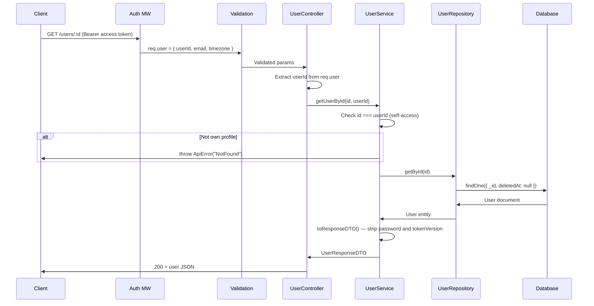
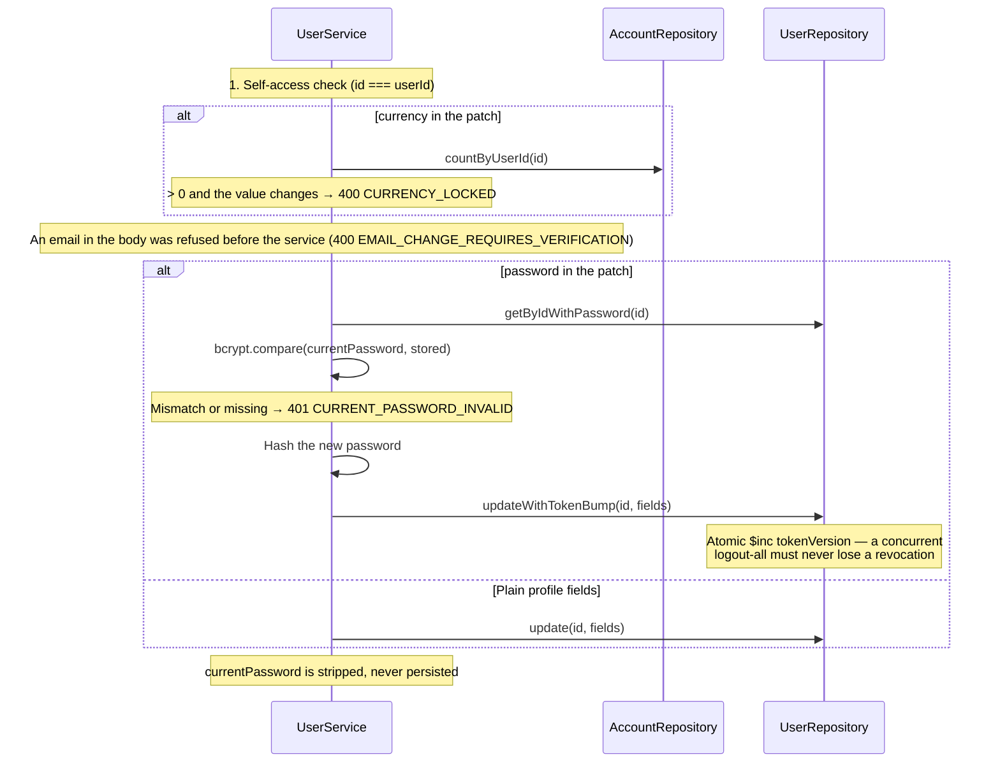

# Users Module

## What This Module Does

Manages user profiles after registration. Provides read, update, and delete for the authenticated user's **own** profile — there is no way to reach another user's data, and no endpoint that lists users.

Beyond name/email/password, the profile carries three settings that shape the rest of the API, and the theme:

- **`timezone`** — IANA zone; drives day boundaries in stats and period windows in budgets. Also embedded as a claim in the access token.
- **`currency`** — ISO 4217 alpha code; the user's single money currency, stamped onto accounts, transactions, and budgets. **Locked once the user has accounts.**
- **`locale`** — UI language, `en` (default) or `es`. Purely a preference the front reads to pick copy and `Intl` formatting; it follows the user across devices.
- **`theme`** — `{ palette, mode }`: the palette (`brisa`, `tinta`) and the mode (`light`, `dark`, `system`) the owner picked in Appearance, so it follows them to every device (T-212, the owner's decision 9 of 2026-09-26). The two lists are copied from the web client's (`src/shared/theme.ts`): a palette added there is added here too. **`null` until one is ever picked**, never a default: every device already keeps its own theme, and a default here would overwrite each one the first time the client applied the profile. The client uploads its own when it reads `null`. The API never reads it.

## Files and Responsibilities

| File                                                         | Role                                                                                                |
| ------------------------------------------------------------ | --------------------------------------------------------------------------------------------------- |
| `src/app/routes/userRoutes.ts`                               | Route definitions (`GET /users/:id`, `PUT /users/:id`, `DELETE /users/:id`)                         |
| `src/app/controllers/UserController.ts`                      | Thin HTTP handler, delegates to UserService                                                         |
| `src/app/services/UserService.ts`                            | Self-access enforcement, re-authentication on credential changes, currency lock, password stripping |
| `src/app/dtos/UserDTO.ts`                                    | `CreateUserDTO`, `UpdateUserDTO`, `UserResponseDTO`                                                 |
| `src/app/validation/schemas.ts`                              | `updateUserSchema`, `deleteUserSchema`, `idParamSchema`                                             |
| `src/domain/entities/User.ts`                                | User domain entity (`tokenVersion`, `timezone`, `currency`, `locale`, `theme`, `lastLoginAt`)       |
| `src/domain/repositories/user/IUserRepository.ts`            | Repository interface (adds `getByEmail`, `recordLogin`, `updateWithTokenBump`, `markDeleted`, …)    |
| `src/infrastructure/repositories/user/UserRepository.ts`     | Mongoose implementation (soft delete, atomic token-version bumps)                                   |
| `src/infrastructure/models/UserModel.ts`                     | Mongoose model (unique lowercase `email`)                                                           |
| `src/app/services/deletedAccount.ts`                         | The days of a deleted account: `keptUntil`, and the two days its answers carry                      |
| `src/app/services/AccountRestoreService.ts`                  | "Restore account" of `account-deleted` ([below](#restoring-a-deleted-account))                      |
| `src/app/services/NightlyPassService.ts`                     | The nightly pass: the erasure at 30 days, and the deadline emails ([below](#the-nightly-pass))      |
| `src/domain/repositories/userData/IUserDataEraser.ts`        | What the erasure at 30 days erases (the port)                                                       |
| `src/infrastructure/repositories/userData/UserDataEraser.ts` | The erasure itself, collection by collection                                                        |
| `src/app/services/EmailVerificationService.ts`               | The confirmation of the email ([auth.md](auth.md#confirming-the-email))                             |
| `src/app/services/EmailChangeService.ts`                     | The change of email that waits for the new address ([below](#changing-the-email))                   |

## Public API

### Endpoint Authorization Matrix

| Endpoint                              | Auth Required      | Self-Access Enforced | Notes                                                                       |
| ------------------------------------- | ------------------ | -------------------- | --------------------------------------------------------------------------- |
| `GET /users/:id`                      | Yes (access token) | Yes                  | `id` must match the authenticated user's ID, otherwise **404**.             |
| `PUT /users/:id`                      | Yes (access token) | Yes                  | Partial updates. A password change needs `currentPassword`.                 |
| `DELETE /users/:id`                   | Yes (access token) | Yes                  | Kept 30 days, then erased; needs `currentPassword`; answers `keptUntil`.    |
| `POST /users/:id/email-change`        | Yes (access token) | Yes                  | A new email that waits for its code; needs `currentPassword` and a captcha. |
| `POST /users/:id/email-change/resend` | Yes (access token) | Yes                  | Mails the waiting address again; needs a captcha.                           |
| `DELETE /users/:id/email-change`      | Yes (access token) | Yes                  | Cancels what waits; `200` even when nothing did.                            |

> There is **no `GET /users`** endpoint — listing users was removed. Self-access failures return `404 User not found`, not `403`, so a user id cannot be confirmed by probing.

### `GET /users/:id`

Get the authenticated user's profile. Returns `UserResponseDTO`: `id`, `name`, `email`, `emailVerified`, `confirmBy`, `emailConfirmationRequired`, `timezone`, `currency`, `locale`, `theme`, `lastLoginAt`, `createdAt`, `updatedAt`, and, on this route only, `emailVerification` and `emailChange` ([below](#changing-the-email)). The password is never returned, and neither are `emailVerifiedAt`, `confirmDeadline`, `deletedAt`, `keptUntil` and `dataResetAt`, which stay internal.

`confirmBy` is the last day of an unconfirmed account from before email existed (`YYYY-MM-DD`, whole, in its time zone; `null` otherwise), and `emailConfirmationRequired` whether that day is over: then every route but this one, the change of email and the auth routes answers `403 EMAIL_CONFIRMATION_REQUIRED` ([auth.md](auth.md#the-deadline-of-the-accounts-from-before-email)). This route stays open past the deadline, so the app learns why.

`emailVerified` is in every profile answer (a sign-up's code, login, the reset, the sync feed): whether the address is confirmed ([auth.md](auth.md#confirming-the-email)). `emailVerification` is what the sheet that confirms it needs, and costs one indexed read of `authcodes`, so only this route carries it — `null` once the email is confirmed, otherwise:

| Field               | Meaning                                                                                                                                |
| ------------------- | -------------------------------------------------------------------------------------------------------------------------------------- |
| `codeLive`          | A code sent in the last 24 hours with tries left: the sheet shows the code field. Otherwise it shows Send code                         |
| `lastSentAt`        | When the last code went, `null` when none ever did (every account from before email, a failed send)                                    |
| `resendAvailableAt` | When Resend can go again, while that is ahead (`EMAIL_ADDRESS_INTERVAL_SECONDS` after the last). The daily limits answer their own 429 |

### `PUT /users/:id`

Update the profile. Partial updates over `name`, `password`, `timezone`, `currency`, `locale`, `theme`; at least one field must be present. **`theme` goes whole** (`{ palette, mode }`, both required: `400 VALIDATION` otherwise) and replaces the one saved; the last write wins. Like every profile change it bumps `updatedAt`, so the sync feed carries it to the other devices.

**The email does not change here.** A body that carries `email` — any value, the account's own address and `null` included — is refused whole with `400 EMAIL_CHANGE_REQUIRES_VERIFICATION` (`details` on the field `email`), once the session is checked and before the password limiter or the validation run: nothing else is checked, spent or written. The email changes only through [Changing the email](#changing-the-email), once the new address confirms it. Until T-232 this `PUT` moved the account at once and confirmed afterwards (the web client's way before T-222); it is refused rather than dropped as an undeclared field, because a client still sending it would otherwise read a `200` and believe the account had moved.

**Changing `password` requires `currentPassword`** in the same request. This is re-authentication: a hijacked access token (valid for up to 15 minutes) must not be able to take over the account by swapping the credentials. On success, the user's `tokenVersion` is bumped atomically, so **every refresh token is revoked** and other devices must log in again; every session row is marked revoked too, so Active sessions stops listing the devices it signed out (before T-221 they stayed listed until they expired). It also cancels a change of email that waits, with its code and link: it was asked for with the password that just stopped working, and an owner who changes the password on reading `email-change-requested` must not see the account move by that link afterwards. Then `password-changed` goes to the account's email when it is confirmed (T-211, [email.md](email.md#security-notices)).

`currency` can only change while the user has **no accounts** (`CURRENCY_LOCKED`). No accounts implies no transactions — every transaction type requires one — so a single account count settles it.

**Accounts the old `PUT` moved are still around**, with the new address unconfirmed (`emailVerifiedAt: null`): like every account from before email, they get a deadline to confirm it ([auth.md](auth.md#the-deadline-of-the-accounts-from-before-email)).

### Changing the email

The account moves to a new address only once that address proves it is reached: the owner's line of 2026-09-26 ("Email and access"), with the screens of the web client's `settings.md` (`#profile-and-security-pending-email`) and `access.md` (`/confirm-email`), and the email `email-change-confirm` of `emails.md`.

1. **`POST /users/:id/email-change`** `{ email, currentPassword, captcha, deviceToken? }` — Save changes with a new email. `currentPassword` re-authenticates (with the per-user limiter of `PUT`), `captcha` is Turnstile's for the action `email-change`, and `deviceToken` lets the email brakes count this device instead of its IP. Nothing moves: the account keeps `email`, and `email-change-confirm` goes to the new address with a 6-digit code and a link (`{APP_URL}/{locale}/confirm-email#token=…`), both for 24 hours. `202 { resendAfterSeconds, emailChange }`.
   - **The change is saved only once its email was accepted, or may have gone** (`sent`, or `failed / unconfirmed`: a provider timed out; the `202` is the same, and the code live before is kept next to the new one): a send that fails leaves the account as it was, with any earlier change still waiting. Unlike Forgot your password?, a failure is said (`EMAIL_SEND_FAILED`, `503` or `422`): the address is the one the person typed.
   - **Refused before anything is sent:** the account's own address (`400 VALIDATION`, on the field `email`) and a wrong password (`401 CURRENT_PASSWORD_INVALID`).
   - **An address another account holds answers the same as any other** (T-237: before, its `409 EMAIL_TAKEN` told anyone with an account and a minute whether an address had one). When another account has it — live, deleted and still kept, or kept by an undo link ([below](#how-an-address-is-kept)) — `email-change-taken` goes there instead of `email-change-confirm`, and everything else is the same: the change waits, `email-change-requested` goes to the old address, a code row is written with a code nobody receives (so a typed code answers `EMAIL_CODE_INVALID` as for any address, not `EMAIL_CODE_EXPIRED`), and Resend does the same again. The change simply never confirms, and goes after its 24 hours. A deleted account past its 30 days does not hold the address.
   - **Asking again replaces what waits**: once the new one is saved, the first address's codes are discarded (they would fail anyway, being checked against the address that waits now). Cancel discards them too.
2. **`POST /users/:id/email-change/resend`** `{ captcha, deviceToken? }` — a new code and link to the address that waits, replacing the old ones once accepted; the change then waits 24 hours from this send. `409 EMAIL_CHANGE_NOT_PENDING` when nothing waits.
3. **`DELETE /users/:id/email-change`** — Cancel change. `200` also when nothing waited.
4. **`POST /auth/email/confirm-change`** — the code (with the session) or the link (without one) moves the account ([auth.md](auth.md#post-authemailconfirm-change)).

**What is kept.** `emailChange: { email, sentAt, expiresAt }` on the user document, `null` when nothing waits; it is never in the sync feed and bumps no `updatedAt`. `GET /users/:id` shows it as `emailChange: { email, expiresAt, resendAvailableAt }`, or `null` once its 24 hours passed (a change past `expiresAt` is read as none; the field is simply overwritten by the next one). The codes live in `authcodes` with the purpose `email-change`, but **keyed by the account and the address** (`emailChangeKey`: SHA-256 of the account id and the address's hash), not by the address alone like the others: many accounts can ask for the same new address, and each keeps its own code, tries and link, so one account asking can neither cancel another's code nor turn another's link into its own move ([auth.md](auth.md#the-codes-authcodes)). The email brakes still count the address itself.

**The move is one write** (`UserRepository.applyEmailChange`), guarded by the address that waits and its `expiresAt`: `email`, `emailVerifiedAt` (the new address is proven), `emailChange: null` and `tokenVersion + 1`. **The unique index on `email` decides a race**: if another account took the address meanwhile, the write fails on it, the change is dropped and the answer is `409 EMAIL_TAKEN`, with the account untouched — only whoever holds the code or the link sees it. A deleted account past its 30 days that still has the address gives it up first ([below](#the-nightly-pass)). Then every session row is revoked, the invitations waiting for the new address are touched so they reach the feed (`touchUnansweredFor`), and, when this device keeps its session, a new one is opened.

**The old address hears of it, or nothing is saved** (T-211). When the account's address is confirmed at the moment of asking, once `email-change-confirm` went, an **undo link** for that address is written (`undoLinks: [{ email, tokenHash, expiresAt }]`, 7 days; the same write puts the address in `heldEmails`, below), and `email-change-requested` goes to it with the new address and "Undo the change" (`{APP_URL}/{locale}/undo#token=…`). Only then is the change saved. An address that was never confirmed hears nothing and gets no link: it is usually a typo being corrected, and it may be a stranger's, who must not be handed the new address.

- **A notice that cannot go stops the change** (the owner's decision of 2026-09-28, an exception to "a notice never blocks what triggered it"): a brake or a cap (`429` with its `Retry-After`) or no provider (`503 EMAIL_SEND_FAILED`) takes the link back out and saves nothing, and a change that waited before stays as it was. Otherwise filling the security share of the daily cap, by signing up many accounts, would let a thief move an account with nobody told and no undo. The code already mailed to the new address does nothing without a change that waits.
- **An old address that refuses all email** (suppressed, or refused by the provider: `rejected`) does not stop it: nobody can be told there, and the account must be able to leave a dead address. Its link is taken out.
- A notice that may still arrive (`unconfirmed`) keeps its link.
- Resend does not mail the old address again; asking for another address does, with a link of its own, and every link works until it is used, an earlier one is used, or its 7 days end.

**While a link works, its address stays the account's**, even after the move and even if the account is deleted: nobody can sign up with it or move another account to it, so the undo never finds it taken ([below](#how-an-address-is-kept)). The account itself may ask for it back (`holderOf` does not count its own links). A reset of the account, and a password change, also cancel a change that waits ([auth.md](auth.md#post-authpasswordreset)).

### Undo the change, from the old address

`POST /auth/email/undo` `{ "token" }`, no session ([auth.md](auth.md#post-authemailundo)). The token is the account's id followed by 32 random bytes, in base64url (64 characters): the id finds the account with no index to scan, and only the SHA-256 of the whole token is kept, in the link. While the link works (7 days), **one write** (`UserRepository.undoEmailChange`, guarded by that link still being there and alive):

- puts `email` back to the link's address, confirmed (`emailVerifiedAt`: the tap proves the inbox);
- cancels any change that waits (`emailChange: null`; its code and link are discarded after the write);
- **stops the password**: it becomes the bcrypt hash of 32 random bytes, which nobody knows, because whoever made the change knows the old one;
- bumps `tokenVersion` (every refresh and device token), and sets `devicesResetAt`, so every device that signed in before is unknown to `new-sign-in`;
- **drops this link and every one issued after it**, and with them the addresses they kept; the links issued before it survive, with their addresses. A thief who moves the account to their own address and then on again receives the second link at that address: used first, it keeps the account there, but the owner's link, older, still works and, used after, drops the thief's. Used first, the owner's link drops every later one. So the first link an account's owner received always wins;
- **brings back an account deleted after the link was sent and still kept** (`deletedAt` and `keptUntil` cleared; the owner's decision 13 of 2026-09-28): a thief who moves the account and deletes it must not leave the owner with nothing. What the deletion ended (invitations, groups left) stays ended, as with any restore.

Then every session row is revoked, the invitations waiting for the address are touched when the account moved back to it, and `password-reset-after-undo` takes a code and a link to that address in the `reset` row of `authcodes`, so `POST /auth/password/reset` redeems it as any reset code (30 minutes, 5 tries). That email has no per-address daily brake and no IP or device brake: the single-use link is its brake. `codeSent: false` when it did not go; the undo stands, and Forgot your password? for that address sends another. No `password-changed` or `new-sign-in` follows the undo: its own email says what happened.

### How an address is kept

The unique index on `email` guards one address per account. An undo link needs a second address to be guarded the same way, atomically, against a new account or a move by another account landing in the same millisecond, and one field's unique index cannot see another field. So every account written since T-211 holds **`heldEmails`**: its email and every address an undo link of it keeps, under a **unique multikey index** (partial, on accounts that have the field). Whoever takes an address writes it into its own `heldEmails` in the same write (a register, a move), so the index refuses it while another account keeps it, and a move keeps the old address in the same write that leaves it. An account from before T-211 has no `heldEmails` until it moves, and needs none: its email is guarded by the `email` index, and no address could be kept before T-211.

- **An address stays in `heldEmails` after its links lapse**, until somebody needs it: an account created or moved and refused by `heldEmails` lets go of the addresses whose links all lapsed (`releaseLapsedHolds`) and tries once more. `holderOf` reads only live links, so neither Create account nor the change of email counts a lapsed one.
- **Delete account** keeps the undo links and `heldEmails`: the undo brings the account back. The erasure at 30 days lets every one of them go.
- **A kept address answers like a taken one**, and neither like a free one only to whoever holds it: Create account sends `account-exists` in its held words, with the day the address is free ([auth.md](auth.md#creating-an-account)), and a change of email waits and sends `email-change-taken`. Neither the screen nor its time tells them apart, and must not.

### `DELETE /users/:id`

**Requires `currentPassword`** in the body (`{ "currentPassword": "…" }`), for the same reason as a credential change: a hijacked 15-minute access token must not be able to delete the account, and a deleted account is one step from being taken over by whoever registers its email. A wrong one answers `401 CURRENT_PASSWORD_INVALID` and nothing is touched.

**Password guesses are limited per user.** Every `PUT` or `DELETE /users/:id` that carries `currentPassword` spends a `current-password:<userId>` counter with the login's per-device cap (`AUTH_RATE_LIMIT_MAX` per 15 minutes, refunded on success): a stolen token gets the same budget of guesses as the login, not the API's general one. Past it, `429 RATE_LIMITED`.

**Kept 30 days, then erased for good** (the owner's decisions 19 and 20 of 2026-09-28). One write (`markDeleted`) sets `deletedAt`, `keptUntil` — the end of the 30th day after today where the account lives, so "kept until October 28" lasts all of that day there —, a restore link (below), `emailChange: null` and `tokenVersion + 1`. Then every session row is revoked, what it shared and joined ends (its invitations are withdrawn and it leaves every group, as before), and `account-deleted` goes to its email when it is confirmed, with that day and "Restore account". The answer is `200 { message, keptUntil }`, the day as `YYYY-MM-DD`. Its undo links keep working, and so do the addresses they keep: an undo within their 7 days brings the account back at the old address ([above](#undo-the-change-from-the-old-address)). Every read filters `deletedAt`, so a deleted account disappears from the API while everything it holds stays.

This is the only way an account is deleted: no link in any email deletes anything (decision 18).

### Restoring a deleted account

Every way back tells the inbox (decision 20). What the deletion ended — invitations, the shared groups it left — stays ended.

1. **Signing in with its password.** `POST /auth/login` with the right password of a deleted account still kept answers `409 ACCOUNT_DELETED` with `deletedAccount: { deletedOn, keptUntil }` and opens nothing; "Restore account" sends the same credentials to `POST /auth/login/restore`, which clears `deletedAt` and `keptUntil`, signs in like a login and sends `account-restored` ([auth.md](auth.md#post-authloginrestore)). A wrong password reads the same as for any address.
2. **Forgot your password?** reaches a deleted account still kept, in its own words, and the reset brings it back: `restored: true`, and `account-restored` instead of `password-changed` ([auth.md](auth.md#post-authpasswordreset)).
3. **"Restore account" in `account-deleted`** (`{APP_URL}/{locale}/restore#token=…`, `POST /auth/email/restore`), for whoever did not delete it. The token is built like an undo link's (the account's id and 32 random bytes; only its SHA-256 is kept, in `restoreLinks: [{ tokenHash, expiresAt }]`, 7 days). It works once and **even if the account was restored meanwhile**, by whoever deleted it and knows the password: **one write** (`restoreFromLink`) clears `deletedAt` and `keptUntil`, makes the password the hash of 32 random bytes, bumps `tokenVersion`, sets `devicesResetAt`, cancels a change of email that waits and spends the link. Then every session row is revoked and `password-reset-after-undo`, in its restore words, takes a code and a link to the address, which `POST /auth/password/reset` redeems; the answer is `{ email, codeSent }`, as the undo's.

**An account deleted before T-238** has no `keptUntil`: its 30 days start the first time anything reaches it — the nightly pass, a sign-in, Forgot your password? or Create account with its address — (the owner's decision of 2026-10-03) and nothing is mailed about it: the email it got said it was kept with no date, and many of those addresses were never confirmed.

### The nightly pass

`NightlyPassService`, inside the daily keepalive invocation of the Lambda (`src/lambda.ts`, after the ping, with a budget of 10 seconds under the Lambda's 15; option A of the owner's AWS plan of 2026-09-28). In order:

1. **Dates** the accounts deleted before T-238 (above).
2. **Erases the accounts past `keptUntil`**, one at a time: a claim (`claimErasure`) sets `erasingAt`, gives the address up (`email` becomes `<id>@erasing.invalid`, `heldEmails` goes, with every undo and restore link) and bumps `tokenVersion`; then `UserDataEraser.eraseAccount` removes everything it holds (below); then the user document goes. Each step is idempotent, and an account whose erasure was claimed is finished by the next pass. One that fails is logged `ACCOUNT_ERASE_FAILED` and left for the next night; a pass that runs out of time with accounts left logs `ACCOUNT_ERASE_BACKLOG`. Both reach the alarm of `infra/email.yaml` ("the server needs attention").
3. **Sends the deadline emails** of the accounts from before email, when `EMAIL_CONFIRMATION_DEADLINES` is on ([auth.md](auth.md#the-deadline-of-the-accounts-from-before-email)).

**The address is free the moment the 30 days end**, whenever the pass runs: creating an account or moving one to an address that a deleted account past `keptUntil` still has claims that account's erasure first (`releaseLapsedDeletion`), in the same request; the pass then finishes erasing what it held. Nothing is sent when an account is erased: `account-deleted` already gave the day.

**What the erasure removes** (`UserDataEraser.eraseAccount`): transactions, settlements, shared expenses, its shared counterparties, budgets, the shared groups it created, contacts, accounts and categories (dependents twice, before and after their parents, so a write that landed late points at nothing); its sync operations and session rows. The invitations it sent stay for their guests, who learn the end from them, under `userId: retired:<id>` (live ones `WITHDRAWN`); the ones it answered stay with their owners under `inviteeId: retired:<id>`. Codes, rate counters, delivery records and idempotency keys lapse by their own TTL. **It is the one hard delete of an account** (`CLAUDE.md` §2), the owner's decision 19.

## Internal Flow

```mermaid
sequenceDiagram
    participant C as Client
    participant AUTH as Auth MW
    participant VAL as Validation
    participant CTRL as UserController
    participant SVC as UserService
    participant REPO as UserRepository
    participant DB as Database

    C->>AUTH: GET /users/:id (Bearer access token)
    AUTH->>VAL: req.user = { userId, email, timezone }
    VAL->>CTRL: Validated params
    CTRL->>CTRL: Extract userId from req.user
    CTRL->>SVC: getUserById(id, userId)
    SVC->>SVC: Check id === userId (self-access)
    alt Not own profile
        SVC->>C: throw ApiError("NotFound")
    end
    SVC->>REPO: getById(id)
    REPO->>DB: findOne({ _id, deletedAt: null })
    DB->>REPO: User document
    REPO->>SVC: User entity
    SVC->>SVC: toResponseDTO() — strip password and tokenVersion
    SVC->>CTRL: UserResponseDTO
    CTRL->>C: 200 + user JSON
```

### Credential Change (PUT with a password)

```mermaid
sequenceDiagram
    participant SVC as UserService
    participant ACCT as AccountRepository
    participant REPO as UserRepository

    Note over SVC: 1. Self-access check (id === userId)
    alt currency in the patch
        SVC->>ACCT: countByUserId(id)
        Note over SVC: > 0 and the value changes → 400 CURRENCY_LOCKED
    end
    Note over SVC: An email in the body was refused before the service (400 EMAIL_CHANGE_REQUIRES_VERIFICATION)
    alt password in the patch
        SVC->>REPO: getByIdWithPassword(id)
        SVC->>SVC: bcrypt.compare(currentPassword, stored)
        Note over SVC: Mismatch or missing → 401 CURRENT_PASSWORD_INVALID
        SVC->>SVC: Hash the new password
        SVC->>REPO: updateWithTokenBump(id, fields)
        Note over REPO: Atomic $inc tokenVersion — a concurrent<br/>logout-all must never lose a revocation
    else Plain profile fields
        SVC->>REPO: update(id, fields)
    end
    Note over SVC: currentPassword is stripped, never persisted
```

## Dependencies

**Imports:** `bcryptjs`, `shared/constants`, `shared/errors`, `domain/entities/User`, `domain/repositories/user/IUserRepository`, `domain/repositories/account/IAccountRepository` (to decide whether the currency is still changeable), DTOs

**Imported by:**

- User routes registered in `src/app.ts` at `/users`, after `authMiddleware`
- `AuthService` uses `IUserRepository` for creating accounts, login, refresh and token-version bumps
- `AccountService` and `BudgetService` read the owner's `currency` when stamping new records
- `StatsController` and `BudgetController` fall back to the stored `timezone` when the token carries no claim

## Environment Variables

| Variable             | Used for                      |
| -------------------- | ----------------------------- |
| `BCRYPT_SALT_ROUNDS` | Re-hashing password on update |

## Error States

| Error / code                         | Status  | Condition                                                                               |
| ------------------------------------ | ------- | --------------------------------------------------------------------------------------- |
| `VALIDATION`                         | 400     | Invalid input, or `currentPassword` missing while changing the password or deleting     |
| `EMAIL_CHANGE_REQUIRES_VERIFICATION` | 400     | `email` in the body of `PUT /users/:id`: the email changes through `email-change`       |
| `BadRequest`                         | 400     | User ID in body doesn't match URL param                                                 |
| `CURRENCY_LOCKED`                    | 400     | Changing `currency` while the user already has accounts                                 |
| `Unauthorized`                       | 401     | Missing, invalid or expired access token                                                |
| `CURRENT_PASSWORD_INVALID`           | 401     | `currentPassword` is wrong (credential change or delete)                                |
| `NotFound`                           | 404     | User does not exist, **or the id is not the authenticated user's**                      |
| `EMAIL_TAKEN`                        | 409     | Confirming a change whose new address another account took meanwhile                    |
| `EMAIL_CHANGE_NOT_PENDING`           | 409     | Resend, or the code of a change, when nothing waits (confirmed, cancelled, 24 h past)   |
| `EMAIL_SEND_FAILED`                  | 422/503 | The email to the new address did not go: nothing was saved, or the old code still works |

## Soft Delete, Restore and Erasure

`UserRepository.markDeleted()` sets `deletedAt` and `keptUntil` and increments `tokenVersion` — it never removes the document. Every normal read filters on `deletedAt: null`, so a deleted user disappears from the API while their accounts, transactions, categories and budgets stay intact for the 30 days; `getReachableByEmail` (Sign in, Forgot your password?) and `getForUndo` (the undo and restore links) are the reads that still find it. The original `currency` comes back with the account, because its history is denominated in it. Only the nightly pass, or a new account taking the address once the 30 days are over, removes an account ([above](#the-nightly-pass)).

`dataResetAt` is what Start fresh, removed in T-238, stamped on the accounts it erased: the sync feed still answers `RESYNC_REQUIRED` to a cursor from before it ([sync.md](sync.md)), for the devices of those accounts that have not pulled since.

## How to Extend

- To add user roles/permissions: add a `role` field to the User entity and DTO, and add authorization logic in the service — there is currently no admin surface at all
- To add profile picture: add a field to entity/model, handle the upload in a new middleware
- Password changes must keep going through `updateWithTokenBump()`: re-hashing without bumping `tokenVersion` would leave stolen refresh tokens alive
- Never widen `UserResponseDTO` with `password` or `tokenVersion`; both are internal
